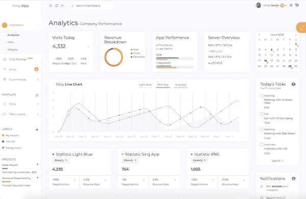
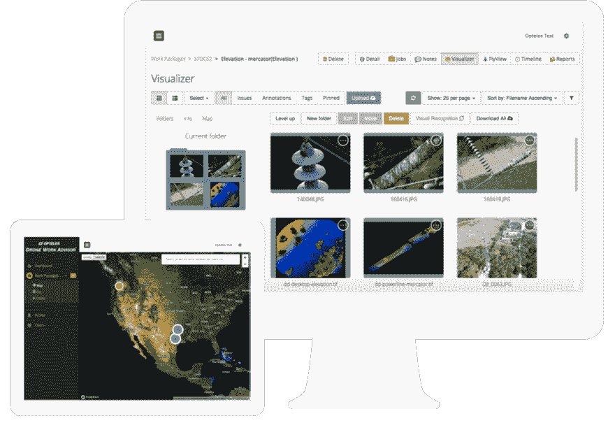
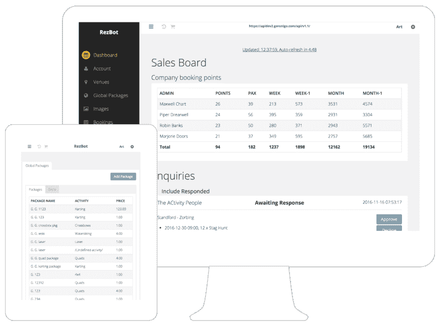

# 解释了管理模板的优势

> 原文：<https://dev.to/flatlogic/benefits-of-admin-templates-explained-2a90>

当您的 web 开发项目需要一个定制的、设计良好的管理面板或仪表板界面时，您可能仍然对要使用的技术犹豫不决。你应该从头开始开发它，还是坚持使用选择的 CMS，还是去寻找一个模板？当然，你应该去找一个模板！因为当你的目标是管理面板的广泛定制和集成时，它几乎总是最快和最具成本效益的解决方案。但是不要仅仅相信我们有偏见的话，继续读下去，自己去看看吧。
[T3】](https://res.cloudinary.com/practicaldev/image/fetch/s--B3jmCZl4--/c_limit%2Cf_auto%2Cfl_progressive%2Cq_auto%2Cw_880/https://flatlogic.com/blog/wp-content/uploads/2018/06/Snip20180601_28-600x391.png)

## 什么是管理模板，为什么需要管理模板？

管理模板已经成为一种让开发者更容易构建应用后端 UI 的方式。想象一下，有一组现成的页面和元素(比如小部件、图表和图标),您几乎可以立即投入使用，而不会陷入从头开始的开发中。模板就是这样。最节省时间。

随着时间的节省，成本也会降低。数学是这样的。根据美国开发人员的平均工资，从头开始构建一个管理仪表板大约需要 500-1000 个工时，或者 25000-50000 美元。或者，你可以花 1000 美元购买一个授权模板。多酷啊。

但是模板不仅仅是节省时间和成本。无论听起来多么违反直觉，当涉及到管理面板时，模板(想想高级模板)不会像现成的产品那样被打上“一刀切”的标签。因此，如果你问为什么不简单地使用 CMS，这里有答案。虽然 Shopify 或 WordPress 等平台是为了解决电子商务和内容管理等狭窄的任务，但管理模板是为了通过深度定制和集成来满足更广泛和更具体的业务需求。

比方说，您正在构建一个管理面板，以便在独一无二的智能工厂环境中可视化和管理从机器网络收集的数据。您希望它能满足用户对设计和功能的独特期望。除非市场上现成的解决方案能够满足开发人员的需求，否则定制模板可能是最佳选择。对于任何需要后端 UI 的开发项目来说，这是一个很好的经验法则。

## 管理模板定制和集成:你能走多远？

简而言之，你可以根据需要定制你的模板，除非它对你的项目不再具有成本效益。最长的答案是，让我们看看一些基于 Flatlogic 中管理模板的实际应用的例子。

### AI 驱动的无人机数据管理解决方案

该工具以我们定制的 Sing 应用程序模板为核心，使太阳能电池板操作员能够自动收集和分析无人机照片。它依靠一个训练有素的神经网络来识别设备缺陷，并通过一个组织有序的实时仪表板将它们报告给人员。

在这里你可以找到案例研究。

### 预订管理系统

Rezbot 是建立在 Sing App 管理模板之上的预订管理系统，帮助活动中心及其活动组织客户实现销售自动化。通过一个直观的界面，他们可以管理活动、可用性、预订、支付和客户反馈，同时最大限度地利用他们收集的所有数据。

在这里你可以找到案例研究。
 
重点是，你可以将一个管理模板与几乎任何行业解决方案相集成:人力资源管理、客户关系管理、企业资源规划，应有尽有。您还可以深入到部门级别，根据特定角色(如外科医生或护士)的需求定制管理体验，例如在医疗保健环境中。

但是，请记住，定制和集成可能会令人望而生畏，因为您必须了解陌生人的代码。因此，您可能希望选择一个能够为您做到这一点的模板供应商(并非所有供应商都能做到)。创作者通常知道他们产品的所有功能和限制，能够比任何人更快地完成这项任务，并且技术上出错的风险更小。此外，这些人可以提供有价值的售前咨询和发布后维护，包括定期更新和新功能推出。

## 关键要点

现在，让我们回顾一下“什么是管理模板”这个问题:

*   管理模板可以节省大量时间，让开发人员不必从头开始编写大量代码。
*   与大多数现成的电子商务和内容管理系统不同，高级模板是高度可定制的，旨在满足非常有限的需求。
*   您可以将模板与几乎任何其他系统集成，这使其成为具有特定行业需求的公司的首选解决方案。
*   值得拜访一家厂商，它将帮助您选择符合您需求的模板，并推动其与您的生态系统的集成。

最初发布于[https://flat logic . com/blog/benefits-of-admin-templates-explained/](https://flatlogic.com/blog/benefits-of-admin-templates-explained/)