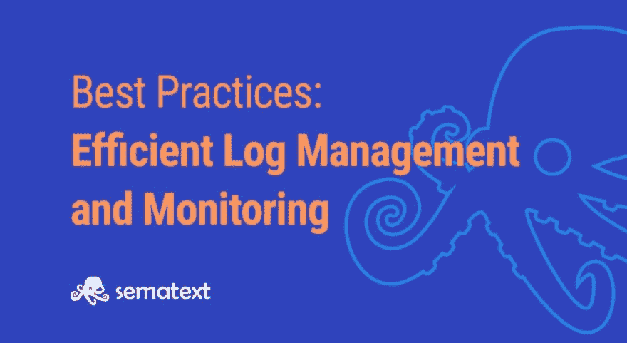

# 高效日志管理和监控的最佳实践

> 原文：<https://dev.to/sematext/best-practices-for-efficient-log-management-and-monitoring-577d>

在管理云原生应用时，对任何给定时间发生的事情拥有端到端的可见性至关重要。由于云原生应用程序的分布式和动态特性，这一点尤其如此，这些应用程序通常使用容器和无服务器功能等短暂技术进行部署。

由于云原生系统中存在如此多的变化和复杂性，因此有必要进行可靠的监控和日志记录，以控制和管理不可避免的混乱。本文讨论了我们认为在记录和监控云原生应用**时应遵循的一些**最佳实践和标准。

## 1。使用托管日志记录解决方案与构建您自己的基础架构

首先，日志应该反映您的应用程序。在云原生应用程序的世界中，日志解决方案应该建立在与高可用性、分布式处理和智能故障转移相同的原则上，从而为应用程序本身奠定基础。这就是现代云原生应用与传统单一应用的区别。

实现这种方法的工具包括 Elasticsearch、Fluentd、Kibana(合在一起，通常称为 EFK 堆栈)等。它们旨在处理大规模数据分析并实时提供结果。它们简化了复杂的数据搜索查询，并支持与其他工具基于开放 API 的集成。然而，尽管原材料是现成的，但将它们整合在一起并确保它们符合你的目的却是一个完全不同的挑战。

与其自己构建这个系统，不如使用由供应商构建和扩展的[托管日志解决方案](https://sematext.com/logsene/)。我们将在[在云中运行弹性堆栈的 5 个理由](https://sematext.com/blog/5-benefits-run-elastic-stack-in-the-cloud/)中详细讨论这一点。有了[现成的集成](https://sematext.com/integrations/)，你需要做的就是连接你的源和目的地，你就可以轻松地分析应用程序日志了。这让您可以花更多的时间[监控和记录您的应用程序](https://sematext.com/metrics-and-logs/)，而不是构建日志记录基础设施。

## 2。了解哪些日志需要监控，哪些不需要监控

知道不要记录什么。仅仅因为你可以记录一些东西并不意味着你应该这样做——记录太多的数据会使你更难找到真正重要的数据。它还增加了日志存储和管理过程的复杂性，因为它让您需要管理更多的日志。

因此，请仔细考虑您实际需要记录的内容。对于法规遵从性或审计目的至关重要的任何类型的生产环境数据都应该记录下来。帮助您解决性能问题、[解决用户体验问题](https://sematext.com/experience/)或监控安全相关事件的数据也应该如此。

另一方面，有些类别的数据您不需要记录，例如来自测试环境的数据，它们不是您的软件交付管道的重要部分。出于合规性或安全性原因，还有一些类型的数据不应该记录。例如，如果用户启用了禁止跟踪设置，您就不应该记录与该用户相关的数据。同样，您应该避免记录高度敏感的数据，如信用卡号，除非您确定您的记录和存储过程满足该数据的安全要求。

## 3。实施日志安全和保留策略

日志包含敏感数据。日志安全策略应该审查敏感数据，如客户的个人数据或 API 的内部访问密钥。在将日志发送给任何第三方之前，请确保对敏感数据进行匿名化或加密。 [GDPR 日志管理最佳实践](https://dev.to/seti321/gdpr-top-5-logging-best-practices-3fal-temp-slug-3630712)向您介绍保护敏感数据[和网络服务器日志](https://sematext.com/docs/logagent/how-to-gdpr_web_logs/)中个人数据的良好实践。将日志数据安全传输到日志管理服务器需要在客户端和服务器端为 TLS 或 HTTPS 设置加密的端点。

不同来源的日志可能需要不同的保留时间。有些应用程序只在几天内与故障排除相关。与安全相关的日志或业务事务日志需要更长的保留时间。因此，保留策略应该是灵活的，具体取决于日志源。

## 4。日志存储

规划日志存储容量时应考虑高负载峰值。当系统运行良好时，每天产生的数据量几乎是恒定的，并且主要取决于系统利用率和每天的事务量。在严重系统错误的情况下，我们通常会看到日志量的加速增长。如果日志存储达到存储限制，您将会丢失最新的日志，这些日志对于修复系统错误至关重要。日志存储必须作为循环缓冲区工作，在应用任何存储限制之前，先删除最旧的数据。

设计您的日志存储，使其具有可伸缩性和可靠性——没有什么比系统停机和缺乏故障排除信息更糟糕的了，这反过来会延长停机时间。

日志存储应该有单独的安全策略。每个攻击者都会试图避免或删除他在日志文件中的痕迹。因此，您应该将日志实时传送到中央日志存储。如果攻击者能够访问您的基础设施，将日志发送到异地，例如使用[日志 SaaS](https://sematext.com/logsene/) 将有助于保持证据不被篡改。

## 5。回顾&不断维护你的日志

未维护的日志数据可能会导致更长的故障排除时间、暴露敏感数据的风险或更高的日志存储成本。查看应用程序的日志输出，并根据需要进行调整。审查应涵盖可用性、操作性和安全性方面。

### 创建有意义的日志消息

可读和有用的日志消息是快速排除故障的关键。如果日志只包含一些错误代码或“隐晦”的错误消息，可能很难理解。作为开发人员，您可以通过提供有意义的日志消息来为您的组织节省大量时间。

### 使用结构化日志格式

日志格式应该是结构化的(例如，JSON 或键/值格式)，具有各种字段，如时间戳、严重性、消息和任何其他相关数据字段，如进程 ID、事务 ID 等。如果您没有为所有应用程序使用唯一的日志格式，请将日志运送器中的日志规范化。解析日志并以结构化格式存储日志。

### 使日志级别可配置

一些应用程序日志过于冗长，而其他应用程序日志没有提供足够的活动信息。可调日志级别是配置日志详细程度的关键。日志审查的另一个主题是在记录相关信息和不暴露个人数据或安全相关信息之间取得平衡的挑战。如果是这样，请确保这些消息可以匿名或加密。

### 经常检查审计日志

对安全问题采取行动是至关重要的——因此您应该时刻关注审计日志。设置安全工具，如 auditd 或 OSSEC 代理。这些工具实现实时日志分析，并生成针对潜在安全问题的警报日志。除了这些审计日志之外，您还应该在日志上定义警报，以便在任何可疑活动发生时得到快速通知。要了解更多细节，请查看关于使用 auditd 的快速教程[，此外，您还会发现一些补充框架。](https://dev.to/sematext/monitoring-linux-audit-logs-with-auditd-and-auditbeat-2m2n-temp-slug-9179415)

### 使用清单进行日志审查:

*   日志消息对用户有意义吗？
*   日志消息是否包括故障排除的上下文？
*   日志消息是否结构化并包括
    *   时间戳，
    *   严重性/日志级别
    *   消息
    *   单独字段中的其他故障排除信息
*   第三方日志是否经过解析和结构化(配置日志发送器)？
*   日志级别可以配置吗？
*   日志消息是否包含个人数据或安全相关数据？
*   检查审核日志并调整日志警报规则
*   在日志上设置警报

## 6。不要在竖井中进行日志分析:关联所有数据源

把这些点联系起来。日志记录是整个监控策略的一部分。要实践真正有效的监控，您需要用其他类型的监控来补充您的日志记录，比如基于[事件](https://sematext.com/events/)、[警报](https://sematext.com/alerts/)和[跟踪](http://www.sematext.com/tracing)的监控。这是了解任何时间点发生的事情的全部情况的唯一方法。日志对于为您提供问题的高清晰度细节非常有用，但是只有当您已经看到了森林并准备放大到树上时，它才是有用的。聚合级别的指标和事件可能更有效，尤其是在开始解决问题时。

不要在一个筒仓中查看日志——用其他类型的监控来补充它们，如 [APM](https://sematext.com/application-monitoring/) 、[网络监控](https://sematext.com/network-monitoring/)、[基础设施监控](https://sematext.com/spm/)等等。更多详情，请参见 [APM 与日志管理](https://sematext.com/blog/apm-vs-log-management/)。这也意味着您使用的监控解决方案应该足够全面，能够在一个地方提供所有的监控信息，或者足够灵活，能够轻松地与提供这些信息的其他工具集成。这样，作为用户，您就有了整个堆栈的单一视图。

## 7。将日志记录视为 GitOps 的推动者

对于繁忙的 DevOps 团队来说，很容易将日志记录视为一个很好的东西，或者是一个附加的东西，一旦你发现了自动化的 CI/CD 管道并且发布得更频繁，你就可以接受它。然而，看待日志记录的另一种方式是将其视为 DevOps 和 CI/CD 的促成因素。要在开发管道的每一步实践自动化，您需要了解问题是从哪里引入的，以及这些问题的主要来源是什么——错误的代码、依赖性问题、外部攻击、资源不足或其他。原因可能数不胜数，但是日志记录为您提供了发现和修复这些问题所需的洞察力。

随着持续集成越来越多地成为在管道的最开始启用 GitOps，有必要不要以自动化和速度的名义在质量和安全认证上妥协。

## 8。获得任何类型事件的实时反馈

自动化测试和像 headless testing 这样的新方法使得在开发环境中获得每一个代码变更的实时反馈成为可能，甚至在提交之前。随着测试向左移，人们越来越关注管道的起点，日志对于获得可见性和启用 GitOps 是必不可少的。没有适当的测试和日志记录，您将面临失控的发布和部署地狱。

## 9。使用日志记录识别自动化机会&趋势

日志记录有助于在早期发现问题，并为您的团队节省宝贵的时间和精力。它还帮助您找到自动化的机会。您可以设置自定义警报以在发生故障时触发，甚至可以设置在触发这些警报时启动的自动操作。无论是通过 Slack、自定义脚本还是 Jenkins 自动化插件，您都可以使用日志在 GitOps 流程中驱动自动化。出于所有这些原因，您需要将日志记录视为 GitOps 的使能因素和驱动因素，而不是附加因素。

## 结论&下一步

总之，日志记录是构建和管理云原生应用的重要部分。为了使日志记录成功，它应该反映应用程序的状态，并且能够随应用程序一起伸缩。绝不应在竖井中进行日志记录。这就是为什么针对云原生应用的监控解决方案应该考虑其他类型的监控和指标。日志记录通常被认为是事后的想法，但是想要完全使用 GitOps 的团队将日志记录视为可观察性的驱动因素和使能因素，因此是不可或缺的。

正在寻找全堆栈监控解决方案？[免费试用 Sematext 云 30 天。](https://apps.sematext.com/ui/registration?utm_source=blog&utm_medium=BestStrategies) Sematext 在日志、指标、真实用户监控和跟踪之间架起了一座桥梁，让您能够从更快的可操作洞察中获益

* *关于作者**

吐温·泰勒|撰稿人

吐温是一个 Fixate IO 贡献者，他的职业生涯始于谷歌，在那里，他参与了 AdWords 团队的技术支持。他的工作包括审查堆栈跟踪，解决影响客户和支持团队的问题，以及处理升级。后来，他建立了品牌社交媒体应用程序和自动化脚本，以帮助初创公司更好地管理他们的营销业务。如今，作为一名技术记者，他帮助 IT 杂志和初创公司改变团队构建和发布应用程序的方式。

斯特凡·提斯| DevOps 福音传道者| Sematext

在电信行业担任产品经理和售前工程师超过 10 年的工作经验。对新的软件技术和可扩展的系统架构充满热情。喜欢 POC 的 NodeJS。

帖子[高效日志管理和监控的最佳实践](https://sematext.com/blog/best-practices-for-efficient-log-management-and-monitoring/)首先出现在[的 Sematext](https://sematext.com) 上。