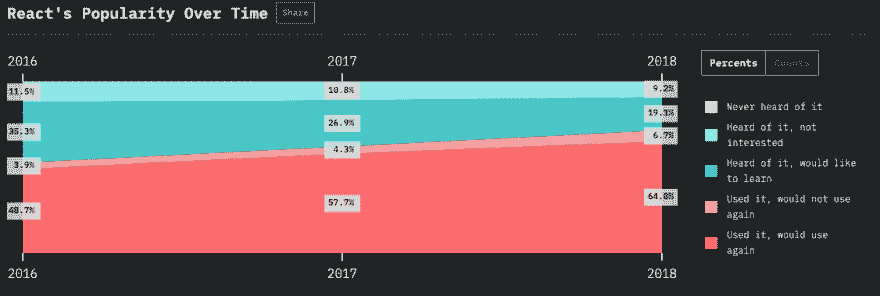
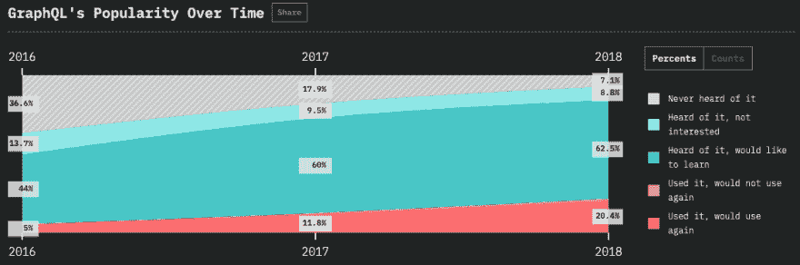
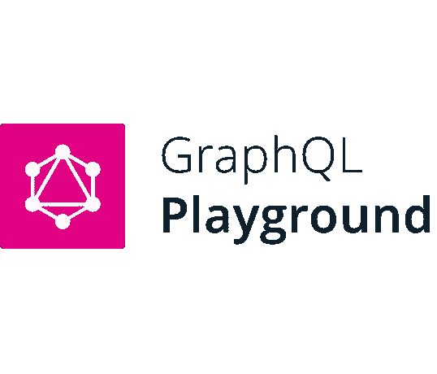
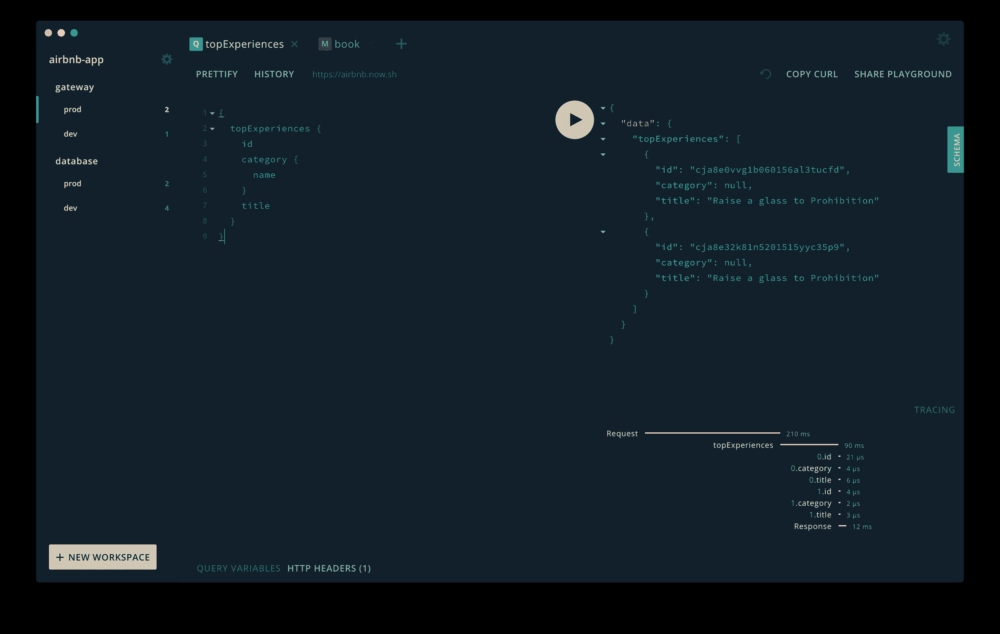
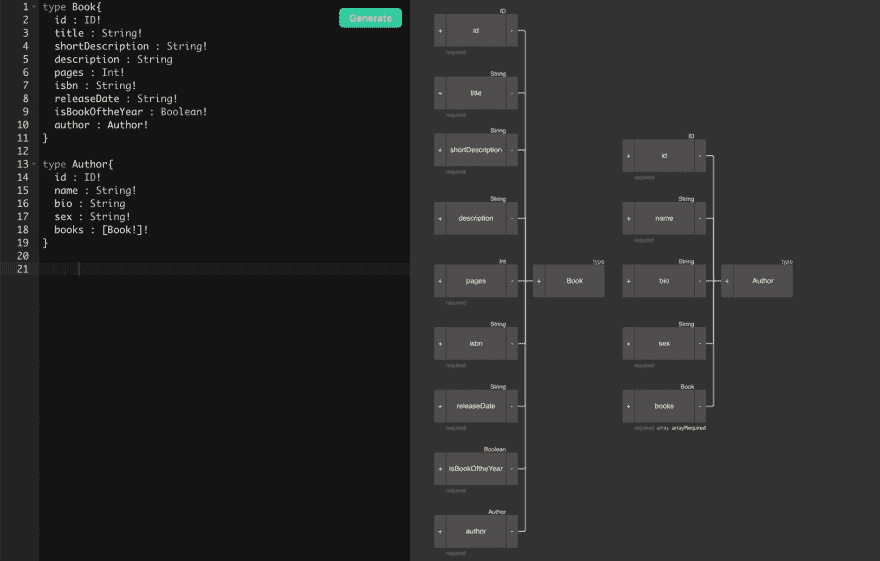
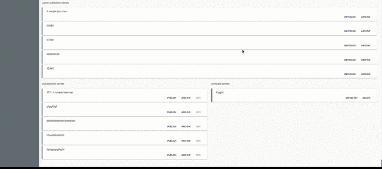
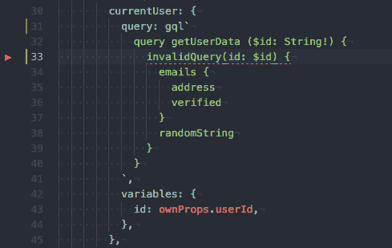

# 学习 React & GraphQL 的最佳资源

> 原文：<https://dev.to/robmatyszewski/best-resources-to-learn-react-graphql-5dkk>

在检查了 Javascript 2018 年调查阶段的结果后，我决定为两项现代和趋势技术创建一个顶级资源列表。这项调查由 2 万名用户完成。React 当然是前端框架中最受欢迎的。

[](https://res.cloudinary.com/practicaldev/image/fetch/s--DdSpucbw--/c_limit%2Cf_auto%2Cfl_progressive%2Cq_auto%2Cw_880/https://thepracticaldev.s3.amazonaws.com/i/f4p5gvwq0ergnjjvv14f.png)

GraphQL 是最想学的技术。

[](https://res.cloudinary.com/practicaldev/image/fetch/s--BT9h_UoA--/c_limit%2Cf_auto%2Cfl_progressive%2Cq_auto%2Cw_880/https://thepracticaldev.s3.amazonaws.com/i/55dds5uclyf4kshhp1d6.png)

# 客户端

*   Apollo 客户端是一个社区驱动的 GraphQL 客户端，支持 React、JavaScript 和本地平台

## 阿波罗图 ql / [阿波罗客户](https://github.com/apollographql/apollo-client)

### 🚀适用于每个 UI 框架和 GraphQL 服务器的全功能、生产就绪的缓存 GraphQL 客户端

<article class="markdown-body entry-content container-lg" itemprop="text">

# [](https://www.apollographql.com/)

## 阿波罗客户端

[](https://badge.fury.io/js/%40apollo%2Fclient)[](https://circleci.com/gh/apollographql/apollo-client)[](https://spectrum.chat/apollo)

Apollo Client 是一个全功能的缓存 GraphQL 客户端，集成了 React、Angular 等等。它允许您轻松地构建通过 GraphQL 获取数据的 UI 组件。

## 证明文件

所有 Apollo 客户端文档，包括 React 集成文章和有用的方法，都可以在:
[https://www.apollographql.com/docs/react/](https://www.apollographql.com/docs/react/)找到

阿波罗客户端 API 参考可以在:
[https://www.apollographql.com/docs/react/api/apollo-client/](https://www.apollographql.com/docs/react/api/apollo-client/)找到

## 保持器

*   [@benjamn](https://github.com/benjamn) (阿波罗)
*   [@hwillson](https://github.com/hwillson) (阿波罗)

</article>

[View on GitHub](https://github.com/apollographql/apollo-client)

## 阿波罗图 ql / [反应-阿波罗](https://github.com/apollographql/react-apollo)

### ♻️反应集成阿波罗客户端

<article class="markdown-body entry-content container-lg" itemprop="text">

# [](https://www.apollographql.com/)

## 阿波罗反应

[](https://badge.fury.io/js/react-apollo)[](https://circleci.com/gh/apollographql/react-apollo)[](https://spectrum.chat/apollo)

* * *

<g-emoji class="g-emoji" alias="warning" fallback-src="https://github.githubassets.cimg/icons/emoji/unicode/26a0.png">⚠️</g-emoji>T2】这个项目已经被弃用 T4】⚠️

请注意，4.0.0 是所有 React Apollo 包的最终版本。React Apollo 功能现在从`@apollo/client` > = 3 开始直接可用。虽然使用`@apollo/react-X`包仍然有效，但我们建议直接使用从`@apollo/client`进口的以下产品:

> *   Old: `@apollo/react-components`-> New: `@apollo/client/react/components`
> *   Old: `@apollo/react-hoc`-> New: `@apollo/client/react/hoc`
> *   Old: `@apollo/react-ssr`-> New: `@apollo/client/react/ssr`
> *   Old: `@apollo/react-testing`-> New: `@apollo/client/testing`
> *   Old: `@apollo/react-hooks`-> New: `@apollo/client`

接下来，所有 Apollo + React 问题/ pull 请求都应该在 [apollo-client](https://github.com/apollographql/apollo-client.git) repo 中打开。更多详情请参考 [Apollo 客户端迁移指南](https://www.apollographql.com/docs/react/migrating/apollo-client-3-migration/)。

* * *

React Apollo 允许您从 GraphQL 服务器获取数据，并使用 React 框架将数据用于构建复杂的反应式 ui。React Apollo 可用于 React 可能使用的任何上下文中。在浏览器中，在 React Native 中，或者在 Node.js 中…

</article>

[View on GitHub](https://github.com/apollographql/react-apollo)

*   [Relay Modern](https://facebook.github.io/relay/) :用于构建数据驱动的 React 应用程序的 JavaScript 框架

##  [脸书](https://github.com/facebook) / [接力](https://github.com/facebook/relay)

### Relay 是一个 JavaScript 框架，用于构建数据驱动的 React 应用程序。

<article class="markdown-body entry-content container-lg" itemprop="text">

# [接力](https://relay.dev) [ ](https://travis-ci.org/facebook/relay) [ ](http://badge.fury.io/js/react-relay)

Relay 是一个 JavaScript 框架，用于构建数据驱动的 React 应用程序。

*   **声明性:**永远不要再使用命令式 API 与您的数据存储进行通信。只需使用 GraphQL 声明您的数据需求，让 Relay 决定如何以及何时获取您的数据。
*   **协同定位:**查询位于依赖它们的视图旁边，因此你可以很容易地对你的应用进行推理。Relay 将查询聚合成高效的网络请求，以便只获取您需要的内容。
*   **突变:** Relay 允许您使用 GraphQL 突变来改变客户机和服务器上的数据，并提供自动数据一致性、乐观更新和错误处理。

[看如何在自己的项目中使用 Relay](https://relay.dev/docs/en/introduction-to-relay)。

## 例子

[relay-examples](https://github.com/relayjs/relay-examples) 存储库包含了 [TodoMVC](http://todomvc.com/) 的实现。要试用它:

```
git clone https://github.com/relayjs/relay-examples.git
cd relay-examples/todo
yarn
yarn build
yarn start 
```

然后，只需将浏览器指向`http://localhost:3000`。

## 捐助

我们积极欢迎拉取请求，学习如何[贡献](https://raw.githubusercontent.com/facebook/relay/master/./.github/CONTRIBUTING.md) …

</article>

[View on GitHub](https://github.com/facebook/relay)

*   [AppSync](https://github.com/awslabs/aws-mobile-appsync-sdk-js) :用于 Offline，Sync，Sigv4 的 JavaScript GraphQL 库。包括对 React Native 的支持

## [aw slabs](https://github.com/awslabs)/[AWS-mobile-app sync-SDK-js](https://github.com/awslabs/aws-mobile-appsync-sdk-js)

### 用于脱机、同步和 Sigv4 的 JavaScript 库文件。包括对 React Native 的支持

<article class="markdown-body entry-content container-lg" itemprop="text">

[](https://camo.githubusercontent.com/244025f464aaa46afecaeb4d1a91fc0b5bf52271/68747470733a2f2f73332e616d617a6f6e6177732e636f6d2f6177732d6d6f62696c652d6875622d696d616765732f61777361707073796e636769746875622e706e67)

## [AWS AppSync](https://aws.amazon.com/appsync/) JavaScript SDK

这个 SDK 可以和 Apollo JavaScript 客户端一起使用。请在此报告中记录关于此客户端 SDK 的问题，并在[官方 AWS AppSync 论坛](https://forums.aws.amazon.com/forum.jspa?forumID=280&start=0)中记录关于 AppSync 服务的问题。

[ ](https://lernajs.io/) [ ](https://camo.githubusercontent.com/97d60c38cb170e43edd4191aae39407bafa9f904/68747470733a2f2f696d672e736869656c64732e696f2f6e706d2f646d2f6177732d61707073796e632e737667)

| 包裹 | 版本 |
| --- | --- |
| aws-appsync | [](https://camo.githubusercontent.com/e4834d7a1caba4e7248a1159d1f8369021996e33/68747470733a2f2f696d672e736869656c64732e696f2f6e706d2f762f6177732d61707073796e632e737667) |
| AWS-应用同步-反应 | [](https://camo.githubusercontent.com/7c89ab5452d4683abf408371b8cfb076175db5e9/68747470733a2f2f696d672e736869656c64732e696f2f6e706d2f762f6177732d61707073796e632d72656163742e737667) |

## 装置

#### npm

```
npm install --save aws-appsync 
```

#### 故事

```
yarn add aws-appsync 
```

### AWS AppSync 兼容性

对于版本<= 2.x.x, the selection set for the subscription will be the mutation selection set. For version > = 3.x.x，订阅选择集将是变异和订阅选择集的交集。更多信息[这里](https://docs.aws.amazon.com/appsync/latest/devguide/real-time-data.html)

#### 反应本机兼容性

在 React Native 中使用这个库时，您需要确保您使用的是基于 React Native 版本的正确版本的库。查看下表，确定使用哪个版本。

| `aws-appsync`版本 | 所需的 React 本机版本 |
| --- | --- |
| `2.x.x` | `>= 0.60` |
| `1.x.x` | `<= 0.59` |

如果…

</article>

[View on GitHub](https://github.com/awslabs/aws-mobile-appsync-sdk-js)

# 教程

*   反应
    *   [一个完整的 React 与 GraphQL 教程](https://www.robinwieruch.de/react-with-graphql-tutorial/)
    *   [用 Apollo 和 GraphQL 完成 React 教程](https://www.robinwieruch.de/react-graphql-apollo-tutorial/)
    *   [React +阿波罗教程](https://www.howtographql.com/react-apollo/0-introduction/)
    *   [React +接力教程](https://www.howtographql.com/react-relay/0-introduction/)

[https://www.youtube.com/embed/XeALXh37WeU](https://www.youtube.com/embed/XeALXh37WeU)
[https://www.youtube.com/embed/gF-peiFjG0o](https://www.youtube.com/embed/gF-peiFjG0o)
[https://www.youtube.com/embed/7giZGFDGnkc](https://www.youtube.com/embed/7giZGFDGnkc)
[https://www.youtube.com/embed/kXH2dbnHYA0](https://www.youtube.com/embed/kXH2dbnHYA0)

*   反应自然
    *   [用 GraphQL、React Native 和 AWS AppSync 编写应用程序:API](https://code.tutsplus.com/tutorials/code-an-app-with-graphql-and-react-native--cms-30511)
    *   [用 GraphQL、React Native 和 AWS AppSync 编写应用程序:应用程序](https://code.tutsplus.com/tutorials/code-an-app-with-graphql-react-native-and-aws-appsync-the-app--cms-30569)
    *   [如何设置 React Native+graph QL+Relay Modern](https://codeburst.io/how-to-setup-a-react-native-graphql-relay-modern-a6a5f6c18353)
    *   [构建健谈的](https://medium.com/react-native-training/building-chatty-a-whatsapp-clone-with-react-native-and-apollo-part-1-setup-68a02f7e11):一个 WhatsApp 的克隆版，带有 React Native 和 Apollo

[https://www.youtube.com/embed/33qP1QMmjv8](https://www.youtube.com/embed/33qP1QMmjv8)
[https://www.youtube.com/embed/nyE6shIRzxM](https://www.youtube.com/embed/nyE6shIRzxM)T4】

# 开发者工具

*   GraphQL 游乐场:基于 GraphQL 构建的强大 GraphQL IDE

##  [【棱镜实验室】](https://github.com/prisma-labs) / [【图 ql 操场】](https://github.com/prisma-labs/graphql-playground)

### 🎮GraphQL IDE 用于更好的开发工作流(GraphQL 订阅、交互式文档和协作)

<article class="markdown-body entry-content container-lg" itemprop="text">

> **安全警告:**`graphql-playground-html`和[直到`graphql-playground-html@1.6.22`的所有四(4)个它的中间件依赖者](https://raw.githubusercontent.com/prisma-labs/graphql-playground/master/#impacted-packages)都受到一个 **XSS 反射攻击漏洞的攻击，只针对其中函数的未整理的用户输入字符串**。这个问题在`graphql-playground-html@^1.6.22`得到了解决。[更多信息](https://raw.githubusercontent.com/prisma-labs/graphql-playground/master/#security-details)

[](https://camo.githubusercontent.com/df575d8569ab049398b4bd6aa85bf3cf3b7d3d49/68747470733a2f2f696d6775722e636f6d2f35667a4d6279562e706e67)

[ ](https://badge.fury.io/js/graphql-playground-react) [ ](https://circleci.com/gh/prisma-labs/graphql-playground)

**该仓库的未来**:详见[公告发布](https://github.com/prisma-labs/graphql-playground/issues/1143)。

* * *

GraphQL IDE 用于更好的开发工作流(GraphQL 订阅、交互式文档和协作)。

[](https://graphqlbin.com/v2/6RQ6TM)

## 装置

```
$ brew cask install graphql-playground
```

## 特征

*   <g-emoji class="g-emoji" alias="sparkles" fallback-src="https://github.githubassets.cimg/icons/emoji/unicode/2728.png">✨</g-emoji> 上下文感知自动完成&错误高亮显示
*   <g-emoji class="g-emoji" alias="books" fallback-src="https://github.githubassets.cimg/icons/emoji/unicode/1f4da.png">📚</g-emoji>交互式多栏文档(键盘支持)
*   <g-emoji class="g-emoji" alias="zap" fallback-src="https://github.githubassets.cimg/icons/emoji/unicode/26a1.png">⚡️</g-emoji> 支持实时 GraphQL 订阅
*   <g-emoji class="g-emoji" alias="gear" fallback-src="https://github.githubassets.cimg/icons/emoji/unicode/2699.png">⚙</g-emoji> GraphQL 配置支持多个项目&端点
*   <g-emoji class="g-emoji" alias="traffic_light" fallback-src="https://github.githubassets.cimg/icons/emoji/unicode/1f6a5.png">🚥</g-emoji>阿波罗追踪支持

## 安全细节

> **注意:只有*对这些包中函数的未组织的用户输入*容易受到最近报道的**XSS 反射攻击。

### 影响

> 受影响的是-`renderPlaygroundPage()`-`koaPlayground()`-`expressPlayground()`-`koaPlayground()`-` lambdaplayground()的所有未初始化的**用户自定义**输入

> 如果你使用了静态值，比如`graphql-playground-electron`…

</article>

[View on GitHub](https://github.com/prisma-labs/graphql-playground)

*   [graphi QL Online](https://graphiql-online.com):graphi QL 的在线版本，具有可配置的端点和头。
*   GraphQL 编辑器:一个可视化的 graphql 编辑器，允许您可视化 graphql 模式，并在模式之外创建假的后端。

[](https://app.graphqleditor.com/demo/blog-sample)

*   阿波罗缓存更新器(Apollo Cache Updater)-在阿波罗的就地更新可能不够充分的情况下，在发生突变后更新阿波罗缓存的助手。

## [【eceroni】](https://github.com/ecerroni)/[阿波罗缓存更新程序](https://github.com/ecerroni/apollo-cache-updater)

### 变异后更新阿波罗缓存的助手

<article class="markdown-body entry-content container-lg" itemprop="text">

# 阿波罗缓存更新程序

[](https://github.com/diegohaz/nod)[](https://npmjs.org/package/apollo-cache-updater)[](https://travis-ci.org/ecerroni/apollo-cache-updater)[](https://codecov.io/gh/ecerroni/apollo-cache-updater/branch/master)[](https://camo.githubusercontent.com/03fc3d4788701b3efb66eb295ad8073716f675e1/68747470733a2f2f696d672e736869656c64732e696f2f6c6962726172696573696f2f646570656e64656e74732f6e706d2f61706f6c6c6f2d63616368652d757064617465722e737667)[](https://camo.githubusercontent.com/9af9be820a5ceccfba879b46f51097f72a0d6afe/68747470733a2f2f696d672e736869656c64732e696f2f62756e646c6570686f6269612f6d696e7a69702f61706f6c6c6f2d63616368652d757064617465722e737667)

[](https://raw.githubusercontent.com/ecerroni/apollo-cache-updater/master/./asseimg/apc_logo.png)

变异后更新阿波罗缓存的零依赖助手

## 状态

正在大力开发中

## 为什么？

我想要一个更新程序，它窃取了 refetch 查询的魔力，同时保留了 apollo 本地缓存的能力，但去掉了每次突变更新通常需要的样板文件。

当需要执行以下操作时，更新本地缓存变得异常复杂:

*   包括多个变量
*   包括多个查询
*   知道在我们的特定突变发生之前，我们的哪个目标查询已经被触发
*   涵盖 apollo 的就地更新可能不够充分的场景**

**添加/删除列表、从一个列表移动到另一个列表、更新过滤列表等。

这个解决方案试图通过 Apollo 的`update`变量来配置变异的结果缓存行为，从而将视图与缓存层分离。

## 演示

[](https://raw.githubusercontent.com/ecerroni/apollo-cache-updater/master/./asseimg/apc_demo.gif)

## 安装

```
$ npm install --save apollo-cache-updater
OR 

$ yarn add apollo-cache-updater 
```

## 使用

示例:添加文章

以下代码块:

*   添加新的…

</article>

[View on GitHub](https://github.com/ecerroni/apollo-cache-updater)

*   [apollo-codegen](https://github.com/apollographql/apollo-codegen) :基于 GraphQL 模式和查询文档生成 API 代码或类型注释

##  [阿波罗飞船](https://github.com/apollographql) / [阿波罗飞船](https://github.com/apollographql/apollo-tooling)

### 用于开发和生产阿波罗工作流程的✏️工具

<article class="markdown-body entry-content container-lg" itemprop="text">

# 阿波罗 CLI

[](https://raw.githubusercontent.com/apollographql/apollo-tooling/master/LICENSE)[](https://www.npmjs.com/package/apollo)[](https://spectrum.chat/apollo?tab=posts)

Apollo CLI 将您的 GraphQL 客户端和服务器与工具结合在一起，用于验证您的模式、林挺您的操作以与您的服务器兼容，以及生成静态类型以提高客户端类型安全性。

*   阿波罗 CLI
*   [用途](https://raw.githubusercontent.com/apollographql/apollo-tooling/master/#usage)
*   [命令](https://raw.githubusercontent.com/apollographql/apollo-tooling/master/#commands)
*   [配置](https://raw.githubusercontent.com/apollographql/apollo-tooling/master/#configuration)
*   [代码生成](https://raw.githubusercontent.com/apollographql/apollo-tooling/master/#code-generation)
*   [投稿](https://raw.githubusercontent.com/apollographql/apollo-tooling/master/#contributing)

# 使用

**免责声明**:以下 API 文档仅适用于 NPM 发布的最新版本，对于之前或未来的版本可能不准确。

```
$ npm install -g apollo
$ apollo COMMAND
running command...
$ apollo (-v|--version|version)
apollo/2.30.2 darwin-x64 node-v12.18.0
$ apollo --help [COMMAND]
USAGE
 $ apollo COMMAND
...
```

# 命令

*   [T2`apollo client:check`](https://raw.githubusercontent.com/apollographql/apollo-tooling/master/#apollo-clientcheck)
*   [T2`apollo client:codegen [OUTPUT]`](https://raw.githubusercontent.com/apollographql/apollo-tooling/master/#apollo-clientcodegen-output)
*   [T2`apollo client:download-schema OUTPUT`](https://raw.githubusercontent.com/apollographql/apollo-tooling/master/#apollo-clientdownload-schema-output)
*   [T2`apollo client:extract OUTPUT`](https://raw.githubusercontent.com/apollographql/apollo-tooling/master/#apollo-clientextract-output)
*   [T2`apollo client:push`](https://raw.githubusercontent.com/apollographql/apollo-tooling/master/#apollo-clientpush)
*   [T2`apollo help [COMMAND]`](https://raw.githubusercontent.com/apollographql/apollo-tooling/master/#apollo-help-command)
*   [T2`apollo plugins`](https://raw.githubusercontent.com/apollographql/apollo-tooling/master/#apollo-plugins)
*   [T2`apollo plugins:install PLUGIN...`](https://raw.githubusercontent.com/apollographql/apollo-tooling/master/#apollo-pluginsinstall-plugin)
*   [T2`apollo plugins:link PLUGIN`](https://raw.githubusercontent.com/apollographql/apollo-tooling/master/#apollo-pluginslink-plugin)
*   [T2`apollo plugins:uninstall PLUGIN...`](https://raw.githubusercontent.com/apollographql/apollo-tooling/master/#apollo-pluginsuninstall-plugin)
*   [T2`apollo plugins:update`](https://raw.githubusercontent.com/apollographql/apollo-tooling/master/#apollo-pluginsupdate)
*   [T2`apollo service:check`](https://raw.githubusercontent.com/apollographql/apollo-tooling/master/#apollo-servicecheck)
*   [T2`apollo service:delete`](https://raw.githubusercontent.com/apollographql/apollo-tooling/master/#apollo-servicedelete)
*   [T2`apollo service:download OUTPUT`](https://raw.githubusercontent.com/apollographql/apollo-tooling/master/#apollo-servicedownload-output)
*   [T2`apollo service:list`](https://raw.githubusercontent.com/apollographql/apollo-tooling/master/#apollo-servicelist)
*   [T2`apollo service:push`](https://raw.githubusercontent.com/apollographql/apollo-tooling/master/#apollo-servicepush)

## `apollo client:check`

对照推送的服务检查客户端项目

```
USAGE
  $
```

…</article>

[View on GitHub](https://github.com/apollographql/apollo-tooling)

*   [graphql 代码生成器](https://github.com/dotansimha/graphql-code-generator):灵活支持定制模板的 graphql 代码生成器

## [dotansimha](https://github.com/dotansimha)/[graph QL-code-generator](https://github.com/dotansimha/graphql-code-generator)

### 基于 GraphQL 模式和 GraphQL 操作(查询/变异/订阅)生成代码的工具，灵活支持定制插件。

<article class="markdown-body entry-content container-lg" itemprop="text">

[](https://graphql-code-generator.com)

[](https://badge.fury.io/js/%40graphql-codegen%2Fcli)[](https://circleci.com/gh/dotansimha/graphql-code-generator/tree/master)[](https://discord.gg/xud7bH9)[](https://github.com/prettier/prettier)[](https://renovateapp.com/)

[graphql-code-generator.com](https://graphql-code-generator.com)

[GraphQL 编码 1.0 在这里！](https://graphql-code-generator.com/docs/migration/from-0-18)

GraphQL 代码生成器是一个从 GraphQL 模式中生成代码的工具。无论您是开发前端还是后端，您都可以利用 GraphQL 代码生成器从您的 GraphQL 模式和 GraphQL 文档(查询/变异/订阅/片段)生成输出。

通过分析模式和文档并对其进行解析，GraphQL Code Generator 可以基于预定义的模板或基于自定义的用户定义的模板输出各种格式的代码。无论您使用哪种语言，GraphQL 代码生成器都能满足您的需求。

GraphQL 代码生成器让你选择你需要的输出，基于*插件*，非常灵活和可定制。您也可以编写您的*插件*来生成符合您需求的定制输出。

您可以在您的浏览器上试用这个工具，并查看一些有用的示例。查看 [GraphQL 代码生成器实例](https://graphql-code-generator.com/#live-demo)。

我们目前支持和…

</article>

[View on GitHub](https://github.com/dotansimha/graphql-code-generator)

*   eslint-plugin-graphql :根据模式检查 graphql 查询字符串

## [apollographql](https://github.com/apollographql)/[eslint-plugin-graph QL](https://github.com/apollographql/eslint-plugin-graphql)

### 🚦对照模式检查 GraphQL 查询字符串。

<article class="markdown-body entry-content container-lg" itemprop="text">

# eslint-plugin-graphql

[](https://badge.fury.io/js/eslint-plugin-graphql)[](https://travis-ci.org/apollographql/eslint-plugin-graphql)[](http://www.apollostack.com/#slack)

一个 ESLint 插件，根据 GraphQL 模式检查 JavaScript 中带标签的查询字符串，或`.graphql`文件中的查询。

```
npm install eslint-plugin-graphql 
```

[](https://github.com/apollostack/eslint-plugin-graphql/raw/master/screenshot.png)

`eslint-plugin-graphql`为四个 GraphQL 客户端提供了开箱即用的内置设置:

1.  [阿波罗客户端](http://docs.apollostack.com/apollo-client/index.html)
2.  [继电器](https://facebook.github.io/relay/)
3.  [海鸥](https://github.com/kadirahq/lokka)
4.  [FraQL](https://github.com/smooth-code/fraql)

如果您想 lint 您的 GraphQL 模式，而不是查询，请查看[cjoudrey/graph QL-schema-linter](https://github.com/cjoudrey/graphql-schema-linter)。

### 导入模式 JSON

您需要将您的[自省查询结果](https://github.com/graphql/graphql-js/blob/master/src/utilities/introspectionQuery.js)或模式作为模式语言格式的字符串导入。如果在 JS 文件中定义 ESLint 配置，就可以做到这一点。

### 检索远程 GraphQL 模式

[graphql-cli](https://github.com/graphcool/graphql-cli) 提供了一个`get-schema`命令(结合一个`.graphqlconfig`文件),使得检索远程模式变得非常简单。

[apollo-codegen](https://github.com/apollographql/apollo-codegen) 还提供了一个[自省模式](https://github.com/apollographql/apollo-codegen#introspect-schema)命令，它也可以获取你的远程模式

### 常见选项

这个插件提供的所有规则都有一些共同的选项。有一些例子可以说明如何…

</article>

[View on GitHub](https://github.com/apollographql/eslint-plugin-graphql)

*   [阿波罗客户端开发工具](https://chrome.google.com/webstore/detail/apollo-client-developer-t/jdkknkkbebbapilgoeccciglkfbmbnfm):阿波罗客户端开发工具的 Chrome 扩展
*   [Relay dev tools](https://chrome.google.com/webstore/detail/relay-devtools/oppikflppfjfdpjimpdadhelffjpciba):Chrome 扩展，在开发者工具界面中创建一个 Relay 标签，用于在 Chrome 中调试应用
*   [Relay Devtools electronic](https://www.npmjs.com/package/relay-devtools):独立的 Relay DevTools App，用于调试 Chrome 外部的继电器
*   [Relay Devtools electronic](https://www.npmjs.com/package/relay-devtools):独立的 Relay DevTools App，用于调试 Chrome 外部的继电器