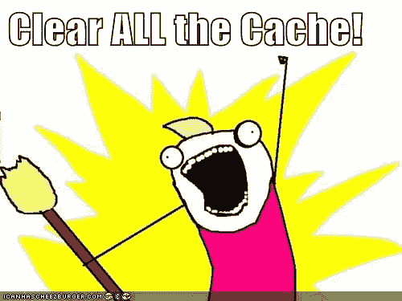

# 有史以来最好的科技 GIFs & Memes！幽默和笑声是最好的良药！

> 原文：<https://dev.to/juliatorrejon/best-tech-gifs--memes-ever-humour-and-laughter--the-best-medicine-4bdp>

跟随莫莉的帖子:

## 文章不再可用

我认为把有史以来最好笑的 GIFS 和迷因放在一起是个好主意，因为幽默感是一种健康的生活方式。😉所以请随意分享你的！

幽默和笑声的好处:

**1。笑声帮助你保持精神健康**
**2。笑声让人们聚在一起，加强关系**
**3。运用幽默有助于克服挑战，提升你的生活**

笑可以帮助你放松和充电，是一剂强有力的解毒剂，因为它可以减轻压力，增加能量，让你保持专注，完成更多的事情。

没有什么比开怀大笑更能让你的身心恢复平衡了。有如此多的治愈和更新的力量，轻松和经常笑的能力是克服问题、增进人际关系和支持身体和情绪健康的巨大资源。

最棒的是，这种无价的药物有趣、免费且易于使用！
[https://www.youtube.com/embed/oCEZC9w5cMc](https://www.youtube.com/embed/oCEZC9w5cMc)

幽默有助于你在艰难的情况下保持积极乐观的态度。即使在最困难的时候，一声笑或者仅仅是一个微笑也能让你感觉更好。

* * *

这种事经常发生在我身上！
[T3】](https://res.cloudinary.com/practicaldev/image/fetch/s--WLhMfEUv--/c_limit%2Cf_auto%2Cfl_progressive%2Cq_auto%2Cw_880/https://i.chzbgr.com/full/6508284928/h274D7F6A/)