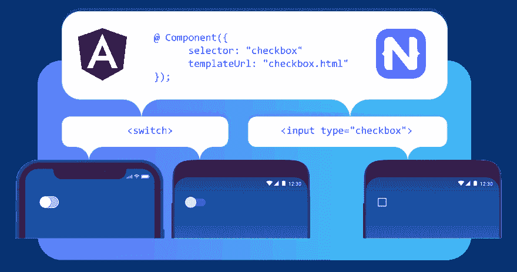

# 使用 Angular 和 NativeScript 构建 web 和移动应用的最佳方式

> 原文：<https://dev.to/appstoryorg/best-way-to-build-web-and-mobile-apps-with-angular-and-nativescript-21gh>

事实是，angular js 开发公司必须存在很长一段时间，只要 angular js 存在。它被用来开发许多不同类别和计划的应用程序——手机或网络。这对开发人员来说是一个很好的体验，但仍然不一致。即使在技术驱动的世界之后，开发人员要掌握一些东西还是有点困难。

更好的是，NativeScript 被集成到 Angularjs 平台中。毫无疑问，个人对这两个平台都产生了巨大的影响。但是把它们结合起来，我们可以得到更好的使用和实现。这将导致代码和技能的重用，以便为移动设备获得[高性能和漂亮的应用程序。这种集成可以在最好和最新的框架上完成。](https://www.appstory.org/top-best-companies/top-android-app-development-companies/)

### **天籁和角状**

毫无疑问，一旦一家公司雇佣了 React Native Developer，他们就可以克服 angular 和 NativeScript 的许多挑战。然而，有必要了解这种集成的主要用途，以构建移动和网络兼容的应用程序。这将有助于在一个不同的应用程序上工作。让我们通过一些主要的应用程序开发方式来了解 NativeScript 和 Angularjs 的惊人集成。

### **1)全球 NPM 属地**

为了开发 NativeScript 应用程序，然后在 Angular 的帮助下维护它，获得全局 NPM 依赖是必不可少的。但是，它必须符合系统并适合开发。如果系统中有 Node.js，那么很容易执行:

npm 安装-g @ angular/[CLI @ 6 . 1 . 0-beta . 0](mailto:cli@6.1.0-beta.0)

npm 安装-g @nativescript/schematics

npm 安装–g native script

这将有助于安装 NativeScript 和 Angular 以及 schematics。schematics 用于维护和创建使用 NativeScript 部署和构建应用程序的项目。最好的 web 开发公司使用这些不同版本或测试模式。除此之外，系统必须按照 iOS 和 Android 进行配置，以便轻松构建应用程序。

### ** 2)使用本地脚本支持和 Angular 开发新项目**

为了处理项目的依赖项，应用程序中必须有 NativeScript。可以在现有的项目上添加内容，但是有了新的项目，它给我们带来了简单性的加分。为了执行它，我们使用:

ng 新角度项目

该命令有助于为 web 应用程序的 angular(非本地移动)提出一个新项目。但是，可以借助以下工具在项目中添加对移动应用程序的支持:

ng add @nativescript/schematics

这将有助于简化整个导航，并有助于项目的创建。NativeScript 项目与 Angular 一起使用，但它可能没有 schematics。因此，[移动应用开发公司](https://www.appstory.org/top-best-companies/top-android-app-development-companies/)致力于一个不同的代码共享项目来实现它。NativeScript 和 Angular 作为替代使用的命令会稍有不同，例如:

ng new–c = @ native script/schematics–name = angular-project–shared

它用于整理现有项目以获取信息。但是，有一个像@nativescript/schematics 这样的存储库可以获取信息。

### **3)代码共享组件**

被忽略的最基本的东西是为不同组件工作增加价值的组件代码。

*   为了共享文件，使用的组件类的定义是 name.component.ts
*   web 规范的样式表与 name.component.css 一起使用
*   特定于 web 的模板与代码 name.component.html 一起使用
*   模板是移动特定的是 name.component.tns.html
*   除此之外，样式表是特定于移动设备的，带有 name.component.tns.css

样式和 templateUrl 用于带有@Component 的装饰器。这是因为。tns 扩展名不用于此类文件。它用于建造过程，给 [**angularjs 开发公司**](https://devtechnosys.com/angular-js-development.php?utm_source=appstoryorg&utm_medium=blogpsot) 一个开发项目的新方法。

### **4)语义变化**

随着整个开发世界的发展，NativeScript 变得非常有名。它有助于改变配置文件，甚至创建一些新的文件。这通常被加到一个原始项目中。然而，有一个保证，初始文件将保持完整，没有任何破坏性的模式做了旧的项目。雇佣 React 本地开发人员的唯一好处是他们必须对角度开发有所了解。除此之外，初始项目中已经使用了 has.tns.html 和. tns.ts 文件。没有必要为一个项目处理两个不同的代码。

你需要记住的事实是，如果使用了一个本地移动应用框架，那么 HTML 就不会成为用户界面的一个选项。这有助于保持 UI 的正确顺序。这使得开发人员可以轻松地使用 TypeScript 来获得本地脚本和 web 版本。然而，没有任何要求这样做，因为，路由和模块是工作了。可以通过路由模块和 NativeScript 路由模块等服务来完成。这给了一个具体的平台，以整体开发模式为最佳的网页开发公司。

### 5)应用程序运行

一旦项目完成、修改并准备投放市场，就该在真实环境中运行了。主要是测试 web 应用程序，以确保没有任何遗漏或没有任何故障。但是，它们在 ng 服务器命令行上工作。

这将有助于轻松地将事情付诸行动。但是，对于移动设备，该命令有所不同。它使用 tns 运行 ios–主要针对 iOS 的捆绑包。对于 android 工作，iOS 与 Android 互换，同时保持其他部分不变。在这种情况下，需要记住的是—一个用于避免任何类型的应用程序崩溃的包。如果这个没有被使用，那么它将简单地关闭一个应用程序。

### **结论**

有了上面的场景，在 NativeScript 和 Angular 的帮助下，在 iOS 和 Android 应用上工作很容易。除此之外，[移动应用程序开发公司](http://www.devopreneurs.com)使用它是因为增强的社区给了它一个加分。但是，必须记住，原生移动应用程序是通过使用不同 UI 组件的 NativeScript 获得的。因此，现在用更简单的平台和更好的集成来完成这项工作。

帖子[用 Angular 和 NativeScript](https://www.appstory.org/blog/best-way-to-build-web-and-mobile-apps-with-angular-and-nativescript/) 构建 web 和移动应用的最佳方式最先出现在 [AppStory](https://www.appstory.org) 上。