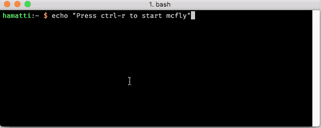

# 最好和小飞侠一起尝试历史搜索

> 原文：<https://dev.to/hamatti/better-bash-history-search-with-mcfly-3kck>

如果有一个 bash 的功能是大多数初学者不知道的，但当他们发现它时会非常兴奋，那就是历史。首先，你学会了通过按上下键来浏览历史，然后你发现`CTRL+R`是让你能够写命令并从历史中找到它们的咒语。

我是那个的超级粉丝。我的 bash 命令历史中可能有 80-90%都是一遍又一遍地重复命令。无论是`npm install`、`npm run start`、`git add .`还是类似的，我都能从我的历史中找到。

但是内置搜索并不总是最佳的。你不能真的看历史:你必须知道你在寻找什么。幸运的是，开发者社区令人惊叹， [Andrew Cantino](https://github.com/cantino) 已经开发了一个工具来丰富你的 bash 历史。

遇见[小飞侠](https://github.com/cantino/mcfly)。天哪！

而不是面对空白的黑色提示，你可以看到你的历史。您可以通过编写命令的一部分来进行搜索，可以使用箭头键进行导航，也可以运行(ENTER)或编辑(TAB)您的命令。

它还具有一个智能系统，可以考虑某些更相关的事情:你在哪个目录中，命令的上下文是什么，命令是否失败，等等。

一开始，mcfly 感觉有点慢，因为它需要一段时间来启动。但是用了一段时间，就不想再回到猜谜游戏了。