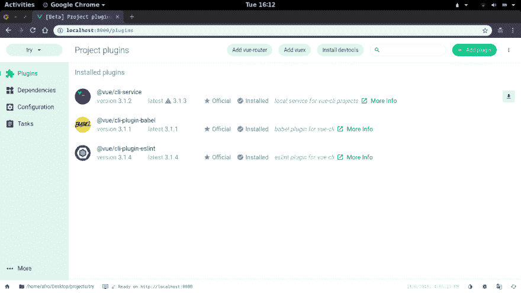
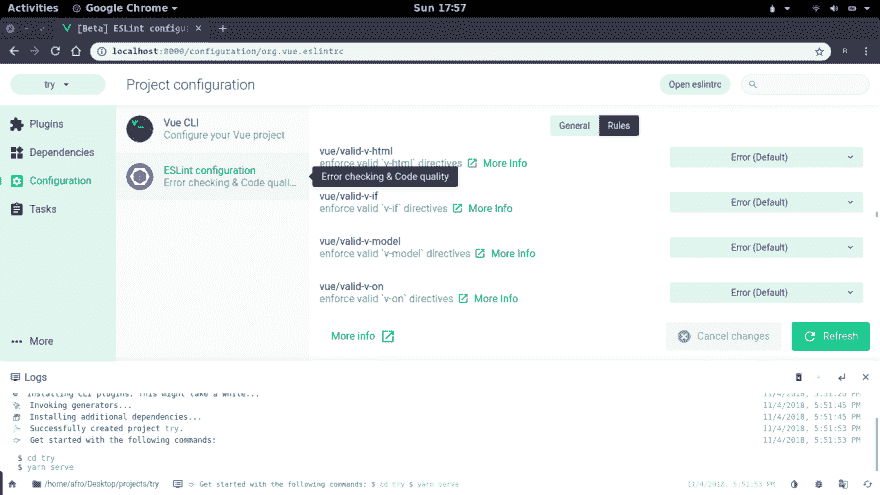

# 使用新的 Vue CLI 实现更好的工具

> 原文：<https://dev.to/progresstelerik/better-tooling-with-the-new-vue-cli-3eh8>

随着 Vue CLI 最新版本的发布，我们将了解该版本的最新功能和改进，这些功能和改进无疑会改进您使用 Vue 的构建方式。

Vue.js 是一个前端 web 开发框架，拥有一个巨大的生态系统，它最近取代 React 成为最受欢迎的 JavaScript 框架。除了简单的集成、详细的文档和灵活性，Vue.js 还附带了一个用于搭建 Vue.js 项目的 [CLI](https://cli.vuejs.org/) 。

CLI 完全打包了所有的工具和库，使得现代前端工具如此繁琐。它附带了用于捆绑、延迟加载、热重装等的 webpack。；ES2017 transpilation 和 polyfill injection 的 Babel 和 ESLint config 来帮助您编写更好的 JavaScript。

在最新发布的 CLI(版本 3)中，有一些显著的改进和令人兴奋的功能，无疑将改善 Vue.js 开发人员的体验。我们将介绍一些您在使用 CLI 时应该注意的新功能。

版本 3 的特点是重写了以前的版本，旨在降低配置现代前端开发环境的复杂性。

新的 CLI 提供了对以下内容的现成支持:

*   预配置的 webpack [具有](https://webpack.js.org/concepts)的特性，如热模块替换、代码分割、树抖动、高效的长期缓存、错误覆盖等。
*   ES2017 transpilation(加上 object rest spread 和 dynamic import 等常见提议)和通过 Babel 7 + [preset-env](https://github.com/babel/babel/tree/master/packages/babel-preset-env) 基于使用的 polyfill 注入。
*   支持 PostCSS(默认启用 autoprefixer)和所有主要的 CSS 预处理程序。
*   带有散列资产链接和预加载/预取资源提示的自动生成的 HTML。
*   通过`.env`文件的模式和级联环境变量。
*   现代模式:并行发布原生 ES2017+捆绑包和传统捆绑包(详情如下)。
*   多页面模式:构建一个有多个 HTML/JS 入口点的 app。
*   构建目标:将 Vue 单文件组件构建到一个库或本地 web 组件中(细节如下)。

## 现代模式

新的 CLI 将提供一个新的标志来构建一个不再支持传统浏览器的应用程序版本。当提供对传统浏览器的支持时，会构建非常大的文件块，这一特性提供了一个非常需要的替代方案，因为通过使用支持 es 模块的最新浏览器，您可以将应用程序的构建大小减少 16%。

在构建您的应用程序时，包括`--modern`标志，CLI 将构建您的应用程序的两个版本，一个针对现代浏览器，另一个针对传统浏览器。

有了应用程序的两个独立版本，您可以在较旧的浏览器上加载旧版本，在较新的浏览器上加载新版本。

要开始使用这个特性，运行下面的命令来构建您的应用程序:

```
 vue-cli-service build --modern 
```

## 图形用户界面

现在这是一个会吸引很多兴趣的特性——一个管理你的 Vue.js 项目、插件、依赖项和项目配置的用户界面。一旦您可以可视化您的更改，更改项目范围的设置就变得轻而易举了。一旦你意识到你可以改变你的构建目录，ESLint 设置等等，那就更令人印象深刻了。使用切换和检查按钮。

有一个`Plugins`页面，你可以在那里管理(更新、添加、删除)你的项目插件。在`Dependencies`选项卡中，您可以搜索和安装项目依赖项，显示每个依赖项的每月下载总量，这在比较库的受欢迎程度时很方便。还包括一个`Tasks`标签，在这里你可以`serve`、`build`、`lint`和`test`你的项目，所有这些都在 GUI 中。

我相信你已经迫不及待地想打开看看了。UI 目前仍处于 alpha 阶段，因此您可能会遇到一些问题。通过运行以下命令开始使用 GUI:

```
 vue ui 
```

[](https://res.cloudinary.com/practicaldev/image/fetch/s--7jo_atX8--/c_limit%2Cf_auto%2Cfl_progressive%2Cq_auto%2Cw_880/https://d2mxuefqeaa7sj.cloudfront.net/s_BCC6341CD352DA3C39A89B2CCCD7E8B8E6499BAC927F704762F31A742C8CB978_1541525390852_Screenshot%2Bfrom%2B2018-11-06%2B16-12-17.png) 

[](https://res.cloudinary.com/practicaldev/image/fetch/s--G4q5CaCh--/c_limit%2Cf_auto%2Cfl_progressive%2Cq_auto%2Cw_880/https://d2mxuefqeaa7sj.cloudfront.net/s_BCC6341CD352DA3C39A89B2CCCD7E8B8E6499BAC927F704762F31A742C8CB978_1541350727158_Screenshot%2Bfrom%2B2018-11-04%2B17-57-19.png)

## 即时成型

开始使用一个框架或库可能会因为涉及到的设置而相当令人沮丧。运行应用程序的过程通常包括安装项目依赖项和插件、传输和编译项目文件——这都需要几分钟时间。这就是为什么新版本的 CLI 具有即时原型功能，可以立即为您的应用程序提供服务，而无需安装项目依赖项。

要开始使用该功能，您需要运行`npm install -g @vue/cli-service-global`来全局安装 CLI 服务。立即为您的应用程序提供服务变得更加容易:在任何`*.vue`文件上运行`vue serve`都会呈现文件的即时视图。这个文件也可以移动到一个更大的项目中，它将继续按预期工作。

首先，运行:

```
 npm install -g @vue/cli-service-global 
```

然后创建一个`*.vue`文件:

```
 //Test.vue
    <template>
      <div>Instant prototyping. Yaay!!!</div>
    </template> 
```

使用命令提供文件:

```
 vue serve Test.vue 
```

## 可配置

尽管 CLI 通过从用户那里抽象出配置来解决大多数项目的配置复杂性问题，但是它们也阻止了对可用设置的进一步配置，并且通常只提供“退出”的解决方案在“退出”之后，进一步的配置就落在了用户的肩上，某些用户陷入了进一步扩展应用程序设置的麻烦之中。

随着此 CLI 版本的推出，用户将能够使用以下工具扩展其当前的 webpack 设置:

*   [webpack-merge](https://github.com/survivejs/webpack-merge) :用于将附加选项合并到当前配置中
*   webpack-chain :这个工具试图通过提供一个可链接的或流畅的 API 来创建和修改 webpack 配置，从而改进配置

您可以将第三方库(如 PostCSS、Babel、TypeScript、ESLint 等)的配置文件包含到项目的根文件夹中。并且它们会考虑这些工具的相应配置文件。

CLI 还附带了 inspect 命令`vue inspect`来查看当前的 webpack 设置。编写插件或安装第三方插件将进一步扩展配置，让您能够更好地控制当前设置。

## 可扩展插件系统

模板是 CLI 版本 2 中的一项流行功能。嗯，对模板的支持已经被放弃了。但是，除了模板，您可以创建足够强大的预设，以便在应用程序的搭建阶段注入依赖项和文件，并在开发期间调整应用程序的 webpack 配置或向 CLI 服务注入额外的命令。

为了给你的项目创建插件和预置，一个新的[插件 API](https://github.com/vuejs/vue-cli/blob/dev/packages/%40vue/cli-service/lib/PluginAPI.js) 已经提供，所以你可以开发插件用于你的项目，也可以与社区共享。这个 API 将使您能够配置项目的设置，让您能够进一步扩展您的配置。

您希望使用 TypeScript 而不是 JavaScript 来构建应用程序吗？一个插件可以扩展您的项目的当前设置，以包括 TypeScript 的配置。您可以包括 Apollo、Jest、Cypress 等的配置。

通过访问[插件开发指南](https://cli.vuejs.org/dev-guide/plugin-dev.html#service-plugin)开始构建插件。您还可以使用 CLI 提供的 GUI 来搜索和安装社区插件，或者访问 [awesome-vue](https://github.com/vuejs/awesome-vue#components--libraries) 库来查看第三方插件列表。

## 建筑作为 Web 构件

新的 CLI 版本包括一个命令，用于生成和包装任何现有的`*.vue`组件，并将它们注册为本地元素。要使用创建的元素，将该元素作为`<the-element></the-element>`包含在任何页面中，并在页面上全局包含 Vue。

要使用`*.vue`组件创建 web 组件，请运行以下命令:

```
 vue-cli-service build --target wc --name the-element src/TheComponent.vue 
```

或者，您可以将多个 Vue 组件构建到一个单独的包中。注册条目文件会将所有组件注册为本地元素，并在实例化元素时异步加载底层组件。

要构建多个 Vue 组件，请使用以下命令。该命令使用一个 glob 模式来匹配文件夹:
中的所有`*.vue`组件

```
 vue-cli-service build --target wc-async 'src/components/*.vue' 
```

## 多页模式

使用最新版本的 CLI，您可以在多页模式下构建应用程序，在这种模式下，您可以为每个页面提供单独的条目文件。当使用多页面模式时，每个“页面”都需要有一个相应的 JavaScript 条目文件。每页的值应该是一个对象，其中键是条目的名称，值可以是:

*   指定`template`、`filename`、`title`、`chunks`和`entry`的对象。`entry`属性是唯一必需的属性，任何其他添加的属性也将直接传递给`html-webpack-plugin`，允许用户定制所述插件。
*   指定其`entry`的字符串。

这里有一个例子，展示了如何构建官方文档中显示的两个页面:

```
 module.exports = {
      pages: {
        index: {
          // entry for the page
          entry: 'src/index/main.js',
          // the source template
          template: 'public/index.html',
          // output as dist/index.html
          filename: 'index.html',
          // when using title option,
          // template title tag needs to be <%= htmlWebpackPlugin.options.title %>
          title: 'Index Page',
          // chunks to include on this page, by default includes
          // extracted common chunks and vendor chunks.
          chunks: ['chunk-vendors', 'chunk-common', 'index']
        },
        // when using the entry-only string format,
        // template is inferred to be `public/subpage.html`
        // and falls back to `public/index.html` if not found.
        // Output filename is inferred to be `subpage.html`.
        subpage: 'src/subpage/main.js'
      }
    } 
```

您可以通过访问[官方文档](https://cli.vuejs.org/config/#pages)了解更多关于如何配置每个页面的信息。

## 建立目标

新的 CLI 版本还包括在构建应用程序时指定构建目标的能力。有了这个特性，您可以为几个用例生成单独的应用程序版本。

1.  **图书馆**

如果你正在开发一个很棒的库，你可以将你的构建目标设置为`library`。当使用`library`构建目标时，CLI 在构建包中不包含 Vue 的情况下构建您的应用程序，而是使用全局`Vue`变量，或者尝试将其作为依赖项加载。

要将您的应用程序构建为一个库，请使用以下命令:

```
 vue-cli-service build --target lib --name myLib [entry] 
```

您需要提供一个条目文件，它可以是一个`.js`或`.vue`文件。省略一个条目文件将默认把`src/App.vue`文件作为条目文件。

构建库之后，它输出四个独立的文件:

*   一个通过捆绑器消费的 CommonJS 捆绑包(不幸的是，webpack 目前还不支持捆绑包的 es 模块输出格式)——`dist/*.common.js`
*   用于直接在浏览器中使用或通过 AMD 加载器使用的 UMD 包— `dist/*.umd.js`
*   缩小版的 UMD 版本— `dist/*.umd.min.js`
*   提取的 CSS 文件(可以通过设置`vue.config.js`中的`css: { extract: false }`强制内联)——`dist/*.css`
*   **App**

这是默认的构建目标，它输出一个`index.html`文件，供应商库被分成单独的块，静态资产被放在`public`目录中。

开始使用新版本的 CLI 相对容易。运行以下命令在您的 PC 上全局安装 CLI:

```
 npm install -g @vue/cli
    # or
    yarn global add @vue/cli 
```

此外，请访问官方文档，了解该版本附带的最新功能的概述。

## 有关 Vue 的更多信息:

想了解如何使用 Vue 创建出色的用户界面吗？查看 Vue 的[剑道 UI，这是我们完整的 UI 组件库，允许您快速构建高质量、响应迅速的应用程序。它包括你需要的所有组件，从网格和图表到时间表和刻度盘。](https://www.telerik.com/kendo-vue-ui/)