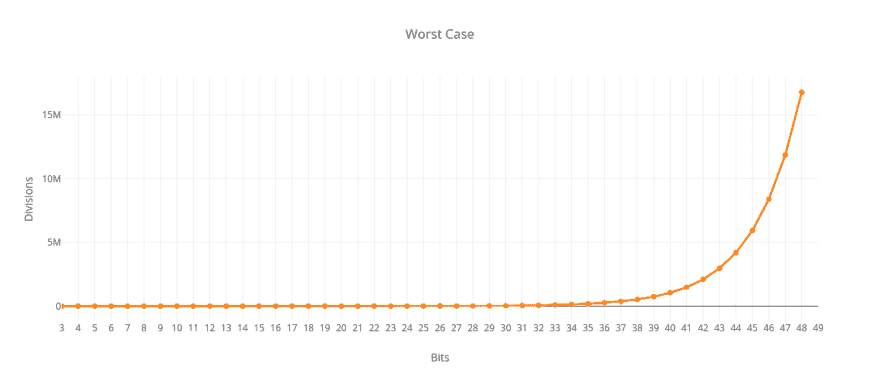
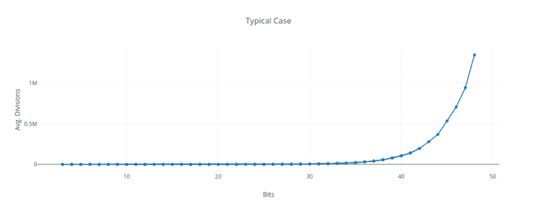
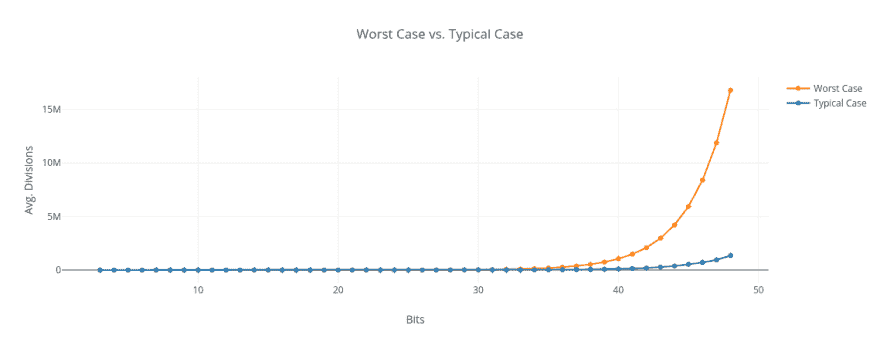
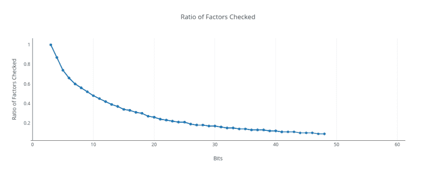
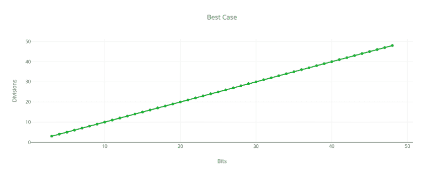

# Big-O:素因子和伪多项式时间

> 原文：<https://dev.to/nestedsoftware/big-o-prime-factors-and-pseudo-polynomial-time-55cp>

大多数程序员至少对 big-O 符号略知一二。这是一种技术，用于在输入变大时，找到算法的运行时间和空间要求的上限。

让我们以排序一个列表作为一个典型的例子:随着要排序的项目数量的增加，不同的算法将有不同的行为。一个非常简单的算法可能会遍历列表，寻找最小的项，并将其放在列表的前面。然后对列表的剩余部分重复相同的过程。在这种情况下，我们首先遍历大小为 N 的列表来找到最小的项目，然后遍历大小为 N-1、N-2 的列表，依此类推。这意味着我们必须执行 N × (N+1) / 2 次比较。因此，就所需的比较次数而言，这样的算法是 O(N <sup>2</sup> ，或*多项式*(更精确地说是二次的)。总的来说，这还不算太坏。但是有更好的算法，可以在 O(N × log N)时间内对项目进行排序。

概括地说，问题的复杂性可以分为三大类:

1.  如果它们在 O(1)、O(log N)、O(sqrt N)、O(N)或 O(N × log N)中，算法通常被认为是相当容易处理的，这是说它们是*可管理的*的一种奇特方式。

2.  多项式复杂度至少为 2 的算法，如 O(N <sup>2</sup> )、O(N <sup>3</sup> 等。随着输入变大，求解成本也变得更高。这种复杂程度并不理想，但对于许多现实世界的问题来说，只要指数很小，通常还是可以的。

3.  O(2 <sup>N</sup> 算法需要*指数*的资源。这意味着我们需要为输入规模的小幅增长增加一倍的资源。指数或更差的算法(比如阶乘)，通常被认为是*难以处理的*。计算需求的跳跃发生得非常快，因此即使有大量的计算能力，也只能解决这类问题的小实例。

> 有时人们说 big-O 是对最坏情况下性能的一种度量。尽管在术语上有一些细微差别。Big-O 确实测量了与输入相比性能的*上限*。然而，对于不同类型的输入，算法可以有不同的 big-O。通常会考虑*最佳情况*、*最坏情况*和*一般情况*。例如，*快速排序*的最坏情况是 O(N <sup>2</sup> )，但通常是 O(N × log N)。

在本文中，我想探讨一些棘手的问题，即 big-O 是相对于输入的*长度来测量的。这意味着对于相同的算法，big-O 实际上可以是不同的，这取决于我们如何表示输入！这可能看起来很混乱，所以让我们看一个具体的例子。*

## 因式分解整数

将整数分解成素数是计算机科学中的一个经典问题。一些广泛使用的加密算法，如 RSA，依赖于它是一个很难解决的问题，因为数字越来越大。*传统的*分解整数的算法在最坏的情况下需要指数时间。

> 但是因式分解不是 NP 完全的。如果几千 qbits 的量子计算机成为现实，Shor 的算法可以用于多项式时间的整数因式分解。然而，似乎有一个普遍的共识，即使是量子计算机也不会使 NP 完全问题变得容易处理。

让我们研究一下获取一个数的质因数的最直观、最简单的算法。假设我们有一个整数，比如 124。怎么才能把它分解成质数呢？我们可以从检查数字是否能被 2 整除开始:

124 / 2 = 62

结果是偶数，我们再除以 2:

62 / 2 = 31

从这里开始，我们可以尝试除以 3、4、5 等...一直到 30，但所有这些约数都会有余数。这意味着 31 也是质数。只能被自身或 1 整除。因此 124 的质因数是 2 × 2 × 31。

## 只检查因数的平方根

我们可以对这个算法做一个重要的优化:我们只需要检查小于或等于 N 的平方根的数字，而不是检查所有可能的因子 N 本身:假设 sqrt N = S。根据定义，S × S = N。假设我们有一个大于 S 但小于 N 的整数 T，T 是 N 的因子。这意味着 N / T = U，其中 U 也是一个因子。因为 T 大于 S，所以 U 必须小于 S(否则 T x U 将大于 N)。因为 U 小于 S，所以在到达 S 之前，我们会把它当作一个因子，N / U 的商是 T，所以在到达 S 之前，我们已经遇到 T 了。

为了找到 N 的所有质因数，这意味着我们需要做的就是尝试从 2 到 N 的平方根的所有可能的因数。下面是这个算法在 Python 中的一个简单实现:

```
def prime_factors(n):
    results = []

    factor = 2
    while factor * factor <= n:
        (n, intermediate_results) = check_factor(n, factor)
        results += intermediate_results
        factor += 1

    if (n > 1):
        results += [n]

    return results

def check_factor(n, factor):
    results = []

    (q, r) = divmod(n, factor)
    while r == 0:
        results.append(factor)
        n = q
        (q, r) = divmod(n, factor)

    return n, results 
```

> 我们可以通过跳过大于 2 的偶数来进一步将该算法的运行时间减半，因为任何偶数因子都将通过检查除以 2 来提取。虽然这在实践中可能很重要，但它不会从根本上改变 big-O 的复杂性。Big-O 往往是一种粗粒度的工具，用于寻找总体增长模式。常数因子和低阶项往往被忽略。

## 最坏的情况

当我们分解一个数 N 时，随着 N 的增加，我们需要做多少次除法？我们的算法的最坏情况是当 N 是质数时:我们的算法将不得不尝试(不成功地)从 2 到 N 的平方根的所有数字。因此我们的算法在最坏情况下是 O (Sqrt N)。假设我们试图分解质数 1000003。我们需要检查从 2 到 1000 的每个数字，所以我们将执行(Sqrt N) - 1 除法。

## 输入长度 vs 幅度

从表面上看，这个算法似乎是次线性的。然而，有一个很容易被忽略的关键问题。对 N 进行编码所需的位数是 log <sub>2</sub> N。这意味着，与位中的输入长度*相比，分频数是*的指数*，即使当我们将分频数与 N 的大小进行比较时，分频数是次线性的。如果我们的算法在 O(N)中，那么它将在 O(2 <sup>b</sup> )中，其中 b 是 N 中的位数。由于 sqrt N 需要 N 中一半的位数，我们的算法结果是 O(2 <sup>b/2</sup> )。*

下图显示了最差情况下分频数与 N 位数的对比:

[](https://res.cloudinary.com/practicaldev/image/fetch/s--YK6Hqiqa--/c_limit%2Cf_auto%2Cfl_progressive%2Cq_auto%2Cw_880/https://thepracticaldev.s3.amazonaws.com/i/twrqt5mgfg5wdsy4dzq6.png)

不使用十进制或二进制表示，我们*可以*使用一元表示对数字进行编码，由此 1 = 1，2 = 11，3 = 111，等等。在这种情况下，我们的算法实际上是 O(sqrt N)。然而，我们会使用比必要的多得多的*指数级*内存来存储我们的数字。在二进制中，1000003 只需要 20 位(11110100001001000011)。在一元中，它需要一百万和三位数！在十进制中，1000003 需要 7 位数，比二进制的 20 位数还要少。然而，两者都与数字的对数成正比，所以这种差异对于 big-O 来说通常不是很重要。例如，要将基数为 2 的对数转换为基数为 10 的对数，我们使用等式 log<sub>10</sub>N = log<sub>2</sub>N/log<sub>2</sub>10≈1/3.32×log<sub>2</sub>N。它们彼此成正比。

随着 N 中位数的增加，我们需要指数级的更多除法来获得一个数的质因数。当然，随着位数的增加，N 的数量也大大增加。这就是为什么这种类型的算法有时被称为*伪多项式*。要看到所需除法的指数数量的效果，我们必须不断增加位数，从而处理真正巨大的数字。我认为，这里需要注意的关键是，数字 N 是实际的输入，而不是，比如说，一个包含 N 个条目的列表。

> 只有当遇到包含“指数大”数的实例时，伪多项式时间算法才会显示“指数行为”，这对于我们感兴趣的应用程序来说可能是罕见的。如果是这样的话，这种类型的算法几乎可以和多项式时间算法一样满足我们的目的。 - [计算机和棘手的问题](https://www.amazon.com/Computers-Intractability-NP-Completeness-Mathematical-Sciences/dp/0716710455/ref=gp_aw_ybh_a_1?_encoding=UTF8&psc=1&refRID=CCGJGTS0QFTA7V455M0M)，迈克尔·R·加雷和大卫·S·约翰逊

## 典型案例

我不知道如何通过分析来确定典型或一般情况下的 big-O，但我尝试做了一些模拟来获得一个粗略的想法。我们可以看到曲线看起来仍然是指数型的。

[](https://res.cloudinary.com/practicaldev/image/fetch/s--ruu8cEg1--/c_limit%2Cf_auto%2Cfl_progressive%2Cq_auto%2Cw_880/https://thepracticaldev.s3.amazonaws.com/i/thgqbvlnjh6jxw4hq638.png)

不过，这显然比最坏的情况好得多。下面是最坏情况与典型情况的粗略估计的对比图。我生成了范围为 2<sup>b-1</sup><= N<2<sup>b</sup>的随机数，b 的位数从 3 到 48。对于每个位长，我因式分解了 10，000 个随机生成的数字。我们可以看到，与素数相比，随机数的除法次数要少得多:

[](https://res.cloudinary.com/practicaldev/image/fetch/s--vj4Kuzg3--/c_limit%2Cf_auto%2Cfl_progressive%2Cq_auto%2Cw_880/https://thepracticaldev.s3.amazonaws.com/i/fjhq4ug6jziyr5z8slh6.png)

我认为原因是，随着我们增加数字中的位数，我们需要检查的候选因素的百分比呈下降趋势。这当然比 sqrt N 少得多。直觉上，这对我来说有一定的意义，因为我们希望给定范围内的随机数的小质因数比大质因数多得多。

这些结果实际上非常接近我们的预期，如果我们使用带有一个预先存在的主要因素列表的试验除法。在那种情况下，我们用 O(2 <sup>b/2</sup> )代替 O(2 <sup>b/2</sup> /b × 2/ln 2)。这表明，当我们随机选择数字时，大多数时候我们实际上只需要检查一系列相对较小的素数。

同样，每当我们找到一个质因数时，我们就通过前一个商的平方根来减少要考虑的因数的范围。在许多情况下，这可以非常迅速地减少部门的数量。

下面是实际检查的因子与 sqrt N 的比率。对于 3 位数，即 100 (4)、101 (5)、110 (6)和 111 (7)，只有一个因子需要检查，即 2。由于我们总是检查这个单一因素，所以比率为 1，即 100%。随着我们得到越来越大的数字，我们必须检查的候选因子的比例急剧下降，并且随着位数趋于无穷大而趋向于零:

[](https://res.cloudinary.com/practicaldev/image/fetch/s--5y5wUKjZ--/c_limit%2Cf_auto%2Cfl_progressive%2Cq_auto%2Cw_880/https://thepracticaldev.s3.amazonaws.com/i/293bn8i6qvq6d1exz4ni.png)

## 最好的情况

在最好的情况下，输入是 2 的幂，所以需要做的就是继续除以 2。就数目 N 而言，这意味着我们只需要做 log <sub>2</sub> N 次除法。我们的算法相对于 N 的幅度为 O(log N ),相对于 N 的位数为 O(b ),虽然最差情况是指数型的，但最好情况是线性的。

[](https://res.cloudinary.com/practicaldev/image/fetch/s--FMhJvIwi--/c_limit%2Cf_auto%2Cfl_progressive%2Cq_auto%2Cw_880/https://thepracticaldev.s3.amazonaws.com/i/i6p1kj42occj67sucuqy.png)

## 除法不常数

我把这篇文章框定在得到一个数的质因数所需的除法个数上，就好像每个除法只需要恒定的工作量。当处理可以用机器指令直接整除的数字时，这是一个合理的假设。例如，如果一台计算机有一条 64 位的*除*指令，我们除哪两个 64 位的数并不重要。

然而，对于非常大的数量，这种情况就不存在了。如果我们使用长除法这样的简单方法将两个(巨大的)数相除，这就变成了 O(b <sup>2</sup> 运算，其中 b 是数中的位数。我相信，使用更先进的技术，这可以得到改善，但它仍然比 O(b × log b)差。然而，由于我们的质因数分解算法是指数型的，这个额外的因数可能太小，不足以显著改变图像。指数项将倾向于支配任何附加的多项式因子。

## 结论

即使有更好的算法来获得非常大的数的质因数，但事实证明，在一般情况下，所有的质因数基本上都是指数的。没有量子计算机，就没有任何已知的有效分解数字的方法。RSA 密码术利用了这个想法:RSA 生成两个非常大的素数(每个都有几千个*位*)，然后将它们相乘。它依赖于难以找到这个巨大产品的两个主要因素。

当人们接触 big-O 时，很容易忽略输入编码方式的细微之处。我希望这篇文章能在这方面有所帮助。

[背包问题](https://en.wikipedia.org/wiki/Knapsack_problem)的动态规划算法是伪多项式时间算法的另一个例子。

## 大-O 简介

如果你以前没有遇到过 big-O 的概念，这里有两篇流行的 [dev.to](https://dev.to) 文章介绍了 big-O 和复杂性的概念:

*   [咖啡时间介绍算法的时间复杂性](https://dev.to/victoria/a-coffee-break-introduction-to-time-complexity-of-algorithms-160m)
*   [Big-O 符号:初学者指南](https://dev.to/metcoder95/big-o-notation-beginners-guide-1h38)

## 参考文献

*   [审判庭](https://en.wikipedia.org/wiki/Trial_division)