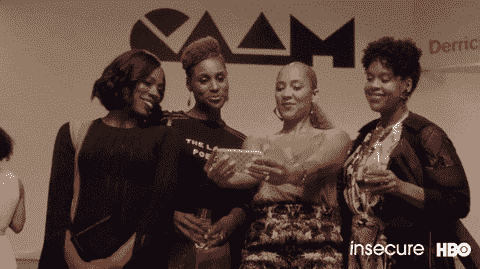
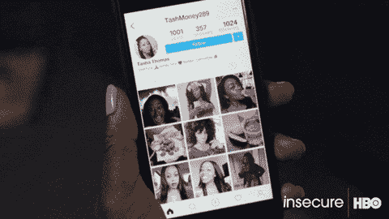

# 黑人女孩|白板:我如何在 4 个月内获得软件工程职位

> 原文：<https://dev.to/donita/black-girl-whiteboard-how-i-landed-my-software-engineering-internship-in-4-months-34o1>

I was debating on writing this article, I wanted to save this story for my first Tech Talk, but I realized this year I needed to concentrate on planting myself as a professional Software Engineer.

*下面是我旅程的背景故事:*

[https://medium.com/@donitam/genesis-882dfd641970](https://medium.com/@donitam/genesis-882dfd641970)

So, how did this black girl get a Software Engineering internship at a Fortune 10 Company:

# 

获得一些经验

在我开始科技之旅的整个过程中，我阅读了大量的，我是说大量的关于如何入门的文章。除了辅助项目，唯一不变的是“教授代码”。我是一个奖学金项目的初学者，所以做奖学金项目之外的项目对我来说是不可行的。所以，我在非营利机构寻找教代码的人，我注册了，教了几堂课。我还是一个初学者，一开始我很糟糕，但我都是在恐惧中完成的。

此外，利用领导角色。除了我在 Udacity 获得的谷歌奖学金之外，加入一个在线社区也是要求的一部分。我们有机会成为那个社区的领导者，我申请并成为了一名 JavaScript 和职业学生领袖。

这些只是让你的简历至少被看第二遍的一些可行的选择。每个招聘人员都对我的所作所为印象深刻。

# 

运气偏爱有准备的人

即使在大学里，我也有这种心态，我想尽我所能，如果它没有在我计划的时间表上发生，那不是因为我懒惰或错过了目标，而是因为它不应该发生。因此，在 Udacity 的“与谷歌一起成长”奖学金接近尾声时，我该做好准备了。

在我的项目中，我已经领先了足够多，可以花整整一周的时间进行职业发展，因为我想做好准备。我不想等到我完成，很多人都这样做了。我心里有某种东西知道机会即将到来，但我不知道机会会从哪里来，但我想做好准备。*“如果你准备好了，你就不必准备好了”*:

那我是怎么准备的呢？

1.  查看环境:我想看看我所在领域的技术环境，尤其是涉及到 JR 角色的时候。我查看了所有主要的求职信息板、城市指定的休闲频道、聚会和求职信息板。这是个好主意，因为你可以战略性地找工作

2.  审查，审查，审查:Youtube 视频，职业服务，谷歌等，让你的 Github，LinkedIn，简历和求职信得到审查。
    为什么？如果你在接下来的两个小时内遇到一个招聘人员，你能在一个小时内把你所有的文件送过去吗？还是你必须等几天才能和招聘人员联系？

# 

神助:

所以，如果你不是一个精神/宗教人士，你可以跳过这一部分。lol。当我申请实习的时候，我又看了一轮关于如何准备面试的文章，但我仍然很迷茫，我觉得我需要一个人，这样我就可以问一些媒体文章中没有的问题。在这个过程中，我这辈子从来没有这么努力地祈祷过。我真的要感谢上帝，感谢那些在我开始采访之前遇到的人。他们真的帮我策划了一条学习路径，让我在白板面试中表现出色。

# 

科技栈

这又回到了最后一点，因为我的祈祷，我觉得技术栈的机会刚刚落在我的腿上。我偶然有机会加入了一个由谷歌工程师 Bria 领导的社区。我的意思是，有很多社区，但我知道我会得到我需要的，因为它是由一个在顶级公司工作的人领导的。

在这个社区里，我可以问任何关于面试过程的问题。我们与谷歌工程师和招聘人员举行了白板研讨会，有机会注册办公时间与你所在行业的人交谈，获得职业和面试指导。当我告诉你它来得正是时候，这是一种保守的说法。

这是完美的，因为每个人都告诉你要阅读破解编码面试书，但听着，那东西真的不适合初学者，让我们现实一点。在这个社区里，我可以问一些有点“傻”的问题，比如“我有记忆泡泡排序吗”我知道傻，但我不知道。

旁注:我知道我用了一个女性 gif，但在这个 slack 频道有很多男性帮助了我，但我认为 GIF 很可爱，所以我用了它 lol。

Do you want to join?

[技术堆栈](https://www.techstackd.com)

# 

研究……研究……研究

我不停地跟踪 GlassDoor，Google 和 Reddit。这些东西不会给你确切的面试问题，但它会给你一个如何塑造面试实践的想法。

行为问题:行为问题将涉及你的项目，你如何在团队中工作，对细节的关注等等。研究一下你每天会做什么，并以此为基础设计练习题。例如，如果你知道你将在一个团队中工作，练习团队面试问题。如果你知道关注细节是工作描述的一部分，练习一些“关注细节”的问题。

数据结构&算法我不知道任何数据结构或算法。一点也不喜欢。我试图在没有学习的情况下完成编码挑战，这是一个巨大的失败。我开始阅读每一篇关于他们的文章，但毫无结果。

那我做了什么？我找到了我的学习方式，并从中学习。

[Visualization Algorithms](https://www.cs.usfca.edu/~galles/visualization/Algorithms.html).

[搜索算法](https://www.oreilly.com/library/view/grokking-algorithms-an/9781617292231/)。

碱基。

编码我几乎每天都在做编码题。有些人不同意这一点，但这对我很有效，因为我做了这么多，我开始看到一个模式，我也看到我的大脑在思考如何解决问题时发生了变化。我计划通过破解编码采访，它比我更先进，所以它更多的是一个补充，比什么都重要。

他们只是在寻找可行的解决方案。我知道人们喜欢如果你做错了没关系，但事实并非如此。其他人可能会站在你后面，提出一个更快的解决方案，并在整个过程中与你交谈，你不想冒这个风险。我看了很多“白板视频”。Tech Stack 有一个白板研讨会，非常有帮助，并且破解了编码采访作者，有很多关于如何在白板上做得很好的视频。当你和一个团队一起努力解决问题时，要深入了解它。

# 

脱颖而出

与组织中的某人联系。不要让他们轻易忘记你或者忘记你的职业道德。说出你的故事。你们可能都有相同的项目，但你们有不同的故事。在面试中找到好的问题来问。也不是典型的问题。

旁注:根据我的经验，我很清楚你可以给社区里的每一个人发电子邮件，但仍然得不到机会，但不管怎样，最好还是给他们留下好印象。你永远不要有“如果”的想法。去做吧。

# 

保持信念

这篇文章不是一步一步地指导你找工作，而只是说当机会来敲门时，如果你准备好了，你就不必准备好。

找工作的过程是艰难、乏味的，有时甚至会让人精神崩溃。一个人可能从 twitter 上找到工作，另一个人可能从 LinkedIn 上找到工作，还有一个人可能从这个网络上找到工作。每个人的故事都不一样。所以如果一个人通过某种方式得到了这份工作，而你没有..没事的！

你只需要一个是！