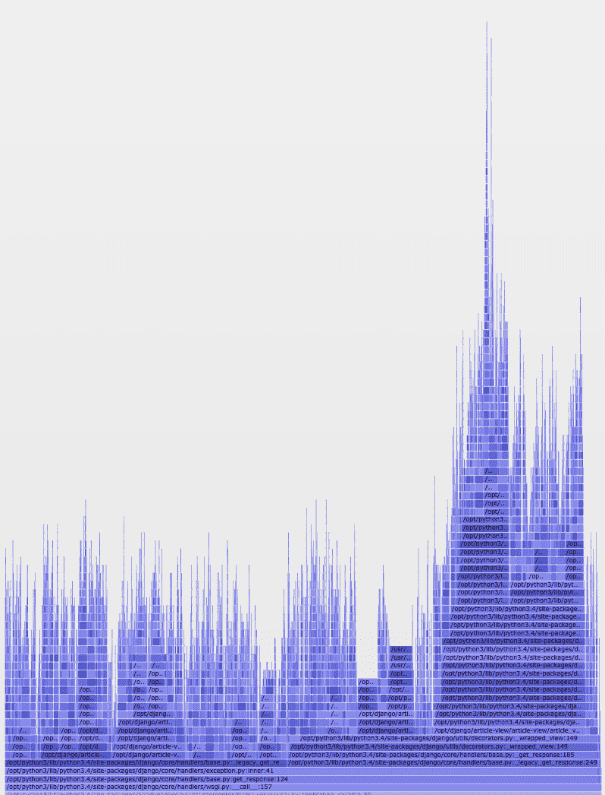
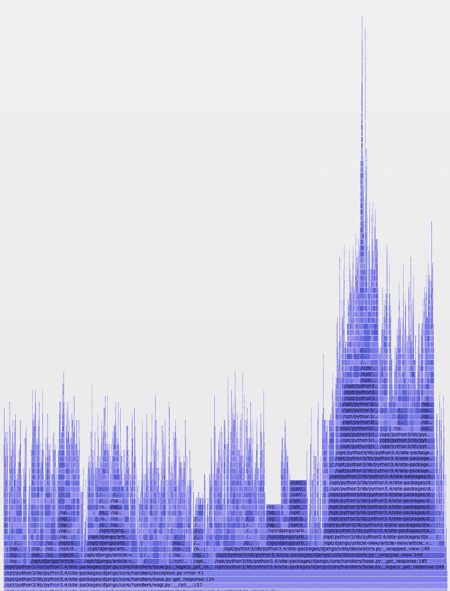
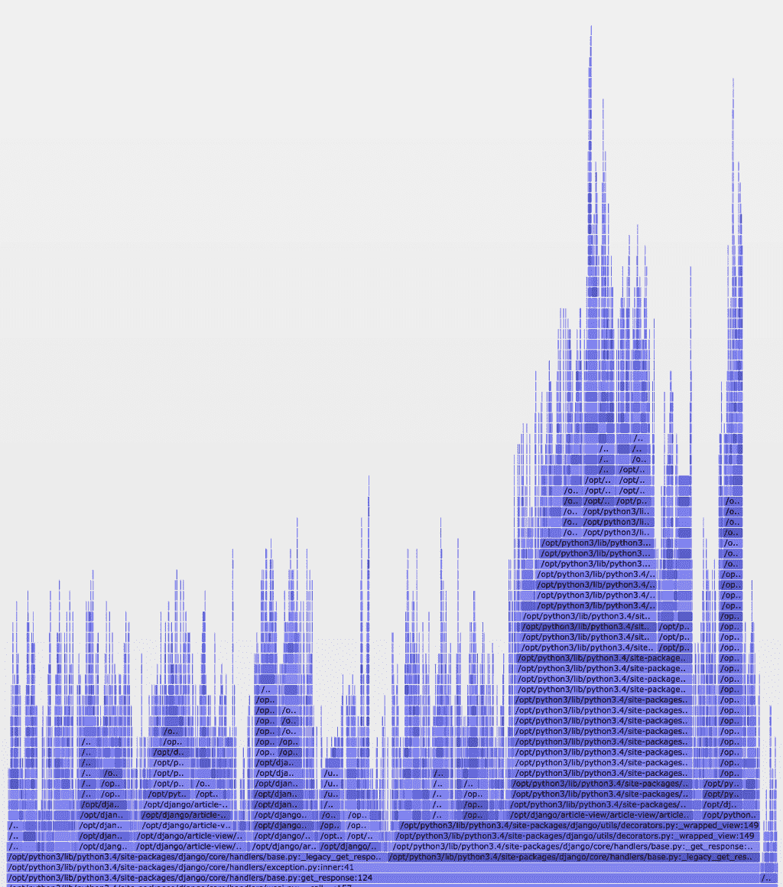
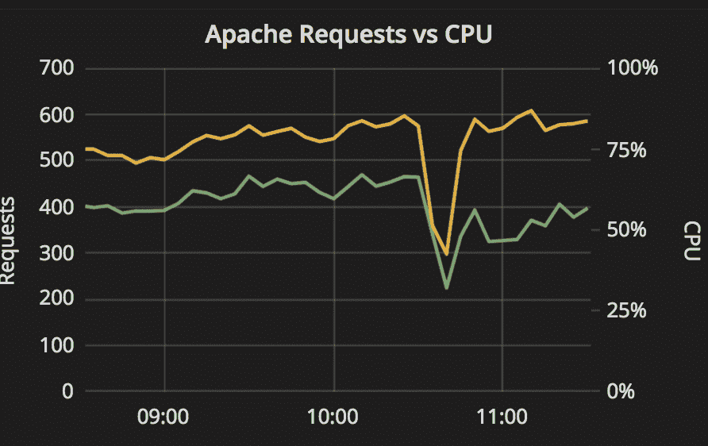
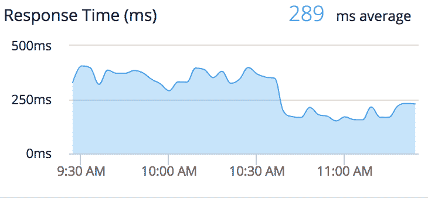

# 速度极快的蟒蛇

> 原文：<https://dev.to/ithaka/blazing-fast-python-2kkl>

#### 使用 Pyflame 剖析 Python 应用程序

这篇文章最初出现在 Build Smarter 上的[。](https://medium.com/build-smarter/blazing-fast-python-40a2b25b0495)

* * *

也许您已经面临了扩展 Python 应用程序以适应稳定增长的用户群的幸运挑战。虽然大多数云主机提供商比以往任何时候都更容易投入更多的硬件来解决问题，但总有一天成本会超过便利性。

当水平扩展开始变得不那么吸引人时，开发人员会转向性能调优来提高应用程序的效率。在 Python 社区中，有许多工具可以在这个领域提供帮助；从内置的`timeit`模块到像`cProfile`这样的剖析工具，有一些快速的方法来测试特定代码行和它的替代代码之间的差异。

尽管分析工具可以帮助您了解应用程序中哪些调用是耗时的重要信息，但是在本地开发过程中，很难像用户在现实生活中那样测试应用程序。弥合这一差距的解决方案是什么？生产中的配置文件！

### 火焰

[Pyflame](https://pyflame.readthedocs.io/en/latest/) 是一款针对 Python 应用的剖析工具，它利用了 Linux 上的 [`ptrace(2)`](http://man7.org/linux/man-pages/man2/ptrace.2.html) 系统调用。`ptrace`允许进程观察(在某些用例中，操纵)另一个进程的内存。Pyflame 最终使用`ptrace`来聚集关于正在运行的 Python 进程堆栈的统计数据，这种格式有助于可视化该进程在哪里花费了大部分时间。由于 Pyflame 作为一个单独的进程运行并检查现有的堆栈数据，因此与作为进程本身的一部分运行的解决方案相比，它的开销很小。这也意味着您可以确保您最终得到的概要分析如实地代表了您的应用程序的行为，并且不会被概要分析工作严重扭曲。

在运行 Pyflame 和一些后期处理之后，您将能够生成如下可视化效果:

[](https://cdn-images-1.medium.com/max/798/1*yMBtTA-vHj0TZDzPxCik7A.png)

<figcaption>y 轴是调用栈；x 轴代表在特定调用中花费的 CPU 时间比例</figcaption>

### 但如何？

由于`ptrace`是特定于 Linux 的，Pyflame 只能针对运行在 Linux 环境中的应用程序。Pyflame 可能也需要[帮忙找到你的蟒蛇](https://github.com/ithaka/pyflame/commit/2ec9e28e6caf671feba29549a18eef04e55bc2ba)；如果不确定使用什么 Python，默认情况下会尝试链接 Python 2.7。考虑到这些注意事项，安装只需要几个步骤，就可以生成一个`pyflame`可执行文件:

```
$ git clone [https://github.com/uber/pyflame](https://github.com/uber/pyflame)
$ cd pyflame/
$ ./autogen.sh
$ ./configure
$ make 
```

构建完成后，可以在`src`目录中找到`pyflame`可执行文件。

现在您已经构建了工具，它应该可以分析您的 Python 应用程序了。为此，首先要获取您感兴趣的应用程序的进程 ID (PID)。例如，如果您正在运行 Django 应用程序，这可能是运行 Django 应用程序的一个 WSGI 工作器的 PID。准备好 PID 后，您将运行`pyflame`,并选择:

1.  对流程进行采样的时间，以秒为单位
2.  对进程堆栈进行采样的频率，以秒为单位
3.  从数据中删除应用程序的空闲时间，以简化结果可视化
4.  输出文件的名称
5.  流程的 PID

这将看起来像

```
$ ./src/pyflame -s 300 -r 0.01 -x -o my-app-20181212.samp -p 9876 
```

Pyflame 将在五分钟内每十毫秒用 PID `9876`对进程进行采样，产生`my-app-20181212.samp`数据文件。试图自己阅读这个文件没有太大意义，但幸运的是，它的格式正好适合[火焰图](https://github.com/brendangregg/FlameGraph)。

### 火焰图

FlameGraph 是一个交互式可视化工具，用于探索 CPU、内存和其他跟踪数据。既然已经获得了跟踪数据，就可以通过几个额外的步骤在 FlameGraph 中运行它:

```
$ git clone [https://github.com/brendangregg/FlameGraph](https://github.com/brendangregg/FlameGraph)
$ cd FlameGraph/
$ cat /path/to/my-app-20181212.samp | ./flamegraph.pl > my-app.svg 
```

在浏览器中打开`my-app.svg`文件，您会看到类似于之前截图的内容。您可以将鼠标悬停在任何段上，以查看它是什么调用以及它代表了多少 CPU 时间。单击一个段可以放大它，这样您只能看到它和它的子段。最有用的是，您可以使用右上角的“search”按钮执行支持正则表达式的搜索。搜索特定模式将突出显示任何匹配:

[](https://cdn-images-1.medium.com/max/798/1*MLzC2ZtG-bH2v4H89GxC0w.png) 

<figcaption>粉色片段匹配搜索查询</figcaption>

通过研究火焰图，您可以更容易地找到应用程序中缓慢而常见的调用，这些调用在研究大量原始文本时并不总是显而易见的。通过识别这些调用，您可以开始理解如何有效地将内容精简到一个更精简的应用程序中。

上面的粉红色部分代表我们的应用程序中特定方法调用的实例；这个调用并不特别昂贵，但是几乎每个请求都会出现多次。我们意识到，虽然我们的代码似乎在缓存这些调用，但 TTL 只设置为一秒。通过将 TTL 更新为 10 秒，我们能够减少该呼叫发生的频率，这在“之后”图中得到证实:

[](https://cdn-images-1.medium.com/max/1024/1*SYk6RmNZiT4QQQMauyQJDQ.png) 

<figcaption>粉色越少，意味着花在匹配呼叫上的整体 CPU 时间越少</figcaption>

### 那又怎样？

我们现在检查的调用消耗的总 CPU 时间更少，但是这如何转化为现实世界呢？我们已经看到每个请求的实际 CPU 负载明显下降，由下面两行之间增加的间隔显示:

[](https://cdn-images-1.medium.com/max/892/1*H8Pz-snDWoKbSEeAjdhO-w.png) 

<figcaption>黄色表示请求/分钟，绿色表示 CPU 负载(10:40 的大幅下降是部署之间的一个假象)</figcaption>

CPU 负载的下降转化为吞吐量的增加和响应时间的显著下降:

[](https://cdn-images-1.medium.com/max/730/1*nb9EKJcJ_yCGmc4qhniB4w.png)

在这一变化之前，我们的应用程序很大程度上受到 CPU 的限制。我们对 Apache 进行了调优，使连接与这种行为一致，这样实例就不会不堪重负。经过这一更改后，有足够的扩展空间来减少两个服务器实例对应用程序的占用。我们现在是连接绑定的，可以考虑将节流打开一点，这可以让我们摆脱另一个或两个实例。在我们所有的应用程序中，尤其是那些需要大量计算资源的应用程序，这种优化每年可以节省数千美元。

Pyflame 不仅有助于识别机会，还有助于确认假设。优化在火焰图中频繁/大声出现的呼叫可以带来切实的好处，最终可以降低成本。我建议将这个工具添加到您的性能测试和监控工具库中。

要查看有关火焰图、Pyflame 和分析工具的更多信息，请查看以下资源:

*   [“火焰图可视化性能”](https://www.youtube.com/watch?v=D53T1Ejig1Q)作者 Brendan Gregg，USENIX ATC’17
*   Ruby 的采样分析器(Julia Evans)
*   [《构建不可能的程序》](https://www.deconstructconf.com/2018/julia-evans-build-impossible-programs)茱莉亚·埃文斯，解构 2018
*   [“火焰图那个！节点和 Python 服务的自助分析工具”](https://www.youtube.com/watch?v=w97I5q0hbkw)露丝·王君馨，加拿大皮肯 2017

* * *