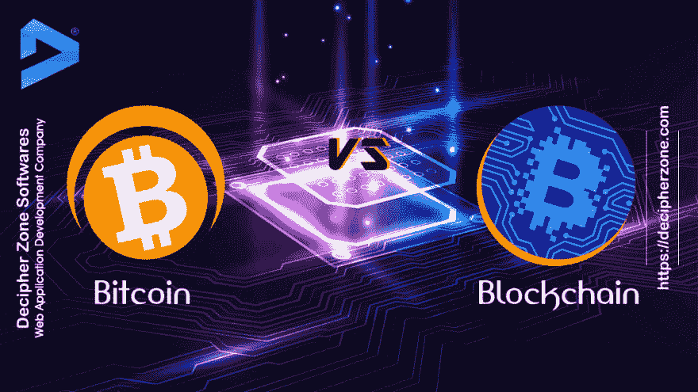

# 区块链 vs 比特币

> 原文：<https://dev.to/decipherzonesoft/blockchain-vs-bitcoin-5h96>

众所周知，区块链在 2009 年因中本聪开发的比特币 ICO 而备受瞩目。我们不知道，甚至没有问过自己的是，为什么开发了一种没有金融支持的替代货币，尽管它在 2016 年变得非常受欢迎，价值高达 20，000 美元。

[https://www . decipherzone . com/blog-detail/block chain-vs-bit coin-An-Investor-s-Perspective](https://www.decipherzone.com/blog-detail/Blockchain-vs-Bitcoin--An-Investor-s-Perspective)

比特币只是一种伪装，用来介绍区块链，并为其发展提供资金支持。区块链是一个系统，其中多个节点通过点对点连接连接在一起，使用单个账本记录交易，然后使用哈希算法和来自前一个节点的公钥加密数据。使用工作证明和共识协议从其他节点验证该加密数据。区块链的发展需要计算能力和互联网，为了做到这一点，区块链的程序员开始奖励代币即比特币，这些代币被给予证明计算能力以验证交易的贡献者，并被称为矿工。这些比特币最初是通过交易所的 ICO 发布的，人们在那里开始交易它们。通过向区块链网络贡献计算能力来赚钱的可能性增加了矿工的数量，这导致产生比特币的难度曲线上升。交易所对比特币的低产量和高需求使其价格在 2016 年飙升至 2 万美元。