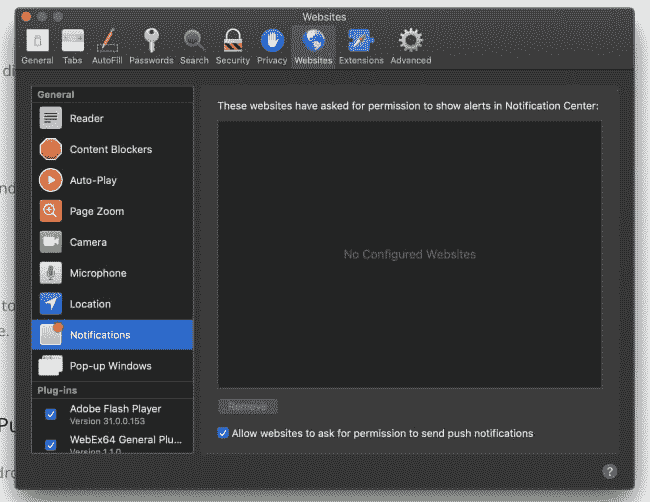

# 阻止网站提示通知

> 原文：<https://dev.to/raymondcamden/blocking-web-sites-from-prompting-for-notifications-2bhc>

总的来说，我喜欢网络平台的新功能。不幸的是，有时发布的新特性会被网站滥用，让你希望该特性从未被考虑过。在这种情况下，我不一定责怪 web 开发人员，因为我认为他们已经知道某个特定的功能被滥用了，而是那些坚持认为他们知道自己在做什么以及“用户真的想要这个”的经理们。

见鬼，我又老又暴躁，所以也许我只是少数。如果你也是，那么这篇文章是给你的。

你有没有注意到，几乎你去的每个该死的网站都会提示你启用通知？

*图片来自[Mozilla.org](https://support.mozilla.org/en-US/kb/push-notifications-firefox)T3】*

这是[推送 API](https://developer.mozilla.org/en-US/docs/Web/API/Push_API) 的一部分，这本身是一个好主意，但显然 90%的互联网决定在你第一次访问他们的网页时，他们会提示你启用通知。

这基本上就像第一次见到某人，然后他们问他们是否可以带一些东西过来，放在你的浴室里过夜。

如果不那么突兀的话，我不会太介意。你可以等到这个人来过几次，或者在页眉/页脚中的某个地方包含 UI，用户可以点击它来启动这个过程。那是永远不会发生的。幸运的是，你可以禁用它。

感谢 Mozilla 组织的[丹·卡拉汉](https://dancallahan.info/)分享以下两个链接。

首先，下面是你如何在 Firefox 中禁用它:[https://support . Mozilla . org/en-US/kb/push-notifications-Firefox # w _ how-do-I-stop-Firefox-questing-me-to-allow-notifications](https://support.mozilla.org/en-US/kb/push-notifications-firefox#w_how-do-i-stop-firefox-asking-me-to-allow-notifications)

虽然您应该跟踪该链接以防它发生变化，但要点是:

*   点击菜单按钮中的`Options`。
*   选择`Privacy & Security`并滚动至权限。
*   点击通知旁边的`Settings`
*   点击`Block new requests to allow notifications`上的复选框

这是*全局*块，Firefox 允许逐站点设置。

顺便说一句，Firefox 也认为这种通知垃圾邮件是一个问题，并正在采取措施减少它:[减少 Firefox 中的通知权限提示垃圾邮件](https://blog.nightly.mozilla.org/2019/04/01/reducing-notification-permission-prompt-spam-in-firefox/)

而在 Chrome 中是这样做的:[https://www . ghacks . net/2016/02/19/disable-show-notifications-prompts-in-Google-Chrome/](https://www.ghacks.net/2016/02/19/disable-show-notifications-prompts-in-google-chrome/)

正如我所说的 Firefox 链接，你应该点击上面的网址，以防它发生变化，但过程是:

*   转到`chrome://settings/content`。
*   点击`Notifications`
*   然后将顶部设置从`Ask before sending`切换到`Blocked`。Chrome 希望你认为`Ask`是值得推荐的。去他妈的。

最后，信不信由你，Safari 也支持网页推送。虽然我找不到要分享的网址，但你可以去`Preferences`，然后`Websites`，点击`Notifications`。他们还允许一个全球性的“别烦我”设置:

就是这样。希望这有帮助！