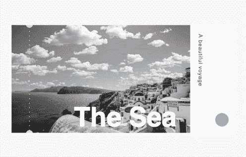
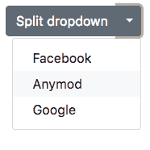
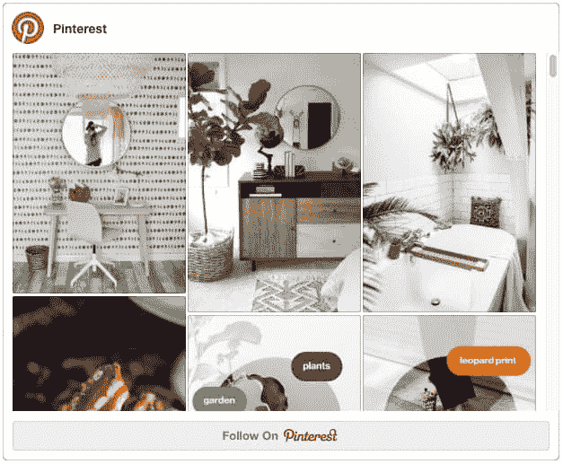

# 散景效果，反应卡，悬停目录和更多|模块星期一 23

> 原文：<https://dev.to/tyrw/bokeh-effect-modal-reaction-card-hover-directory--more--module-monday-23-4kb7>

## 为您的下一个项目提供开源 mods

所有这些模块都是开源的，可以在任何网站、web 应用程序或其他任何地方免费使用。Anymod 还有几百个。

单击一个 mod 来查看它及其源代码。

### 散景效果模式

背景中带有模糊散景点的节日叠加。

[视图对](https://anymod.com/mod/llbmrk?v=40)视图

 [
T4】](https://anymod.com/mod/llbmrk?v=40)

### 反应卡

悬停以高亮显示，然后单击以访问。

[视图对](https://anymod.com/mod/badbbl?v=40)视图

 [
T4】](https://anymod.com/mod/badbbl?v=40)

### 分割下拉列表

带有链接或下拉菜单的经典引导按钮。

[视图对](https://anymod.com/mod/emkko?v=34&h1=35&h2=50)视图

 [
T4】](https://anymod.com/mod/emkko?v=34&h1=35&h2=50)

### 团队目录

浏览并联系您的团队成员。

[视图对](https://anymod.com/mod/orlook?v=20)视图

 [
T4】](https://anymod.com/mod/orlook?v=20)

### Pinterest 档案嵌入

在任意位置添加个人资料和关注按钮。

[视图对](https://anymod.com/mod/badom?v=20)视图

 [
T4】](https://anymod.com/mod/badom?v=20)

* * *

我每周一都会在这里贴上新的 MODS-我希望你会觉得它们有用！

快乐编码✌️