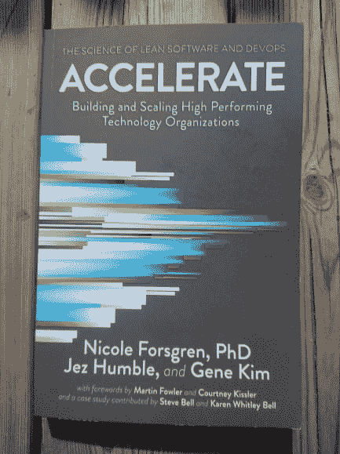

# 书评:加速

> 原文：<https://dev.to/henrikwarne/book-review-accelerate-457>

《加速》(Accelerate)一书详细介绍了四年来关于开发运维如何影响各种结果的研究结果，如软件交付速度和稳定性，以及组织的盈利能力和市场份额。在这个上下文中，DevOps 意味着诸如连续交付、自动化测试、基于主干的开发和系统健康的主动监控。很明显，DevOps 实践为采用它们的组织带来了很多好处。研究结果也符合我自己对 DevOps 的体验。

# 调查结果

本书的第一部分(略多于一半)介绍了研究结果。

### 软件交付性能

软件开发的许多方面很难衡量。我真的很喜欢作者们为了得到客观而有用的度量标准而努力思考测量什么。Accelerate 的一个核心概念是*软件交付性能*。这通过四个标准来衡量:交付时间、部署频率、恢复服务的时间和变更失败率。

*交付周期*定义为从代码提交到代码在生产中成功运行的时间。答案选项包括不到一个小时，不到一天，一直到超过六个月。*部署频率*有类似的答案选项:按需(一天多次)最多不到六个月一次。这两个标准一起构成了*节奏*——软件交付的速度。

*恢复时间*测量停电或干扰时恢复服务的时间。*变更失败率*是系统变更(如部署或配置变更)失败的次数百分比。这最后两个标准定义了*稳定性*。高软件交付性能意味着高节奏和高稳定性。这项研究的一个关键发现是**节奏和稳定性之间没有权衡**。相反，高节奏的组织也具有高稳定性。此外，他们还发现，软件交付绩效高的组织比绩效低的组织有更好的盈利能力、市场份额和生产力。

### 改善驱动因素

作者确定了 24 种推动软件交付性能改进的能力。这些被分成五个类别:持续交付、架构、产品和过程、精益管理和监控，以及文化。我不会在这里讨论所有功能。相反，我会把注意力集中在我觉得最有趣的事情上。

**连续交货。对代码使用版本控制可能是普遍接受的良好实践。然而，所有形式的配置和脚本也应该保存在版本控制中。应该有自动化测试，并且应该在每次提交时运行。作者还发现，为了使自动化测试有效，它们应该由开发人员自己创建。这可能是因为当开发人员拥有自动化测试时，设计将更加可测试，并且他们将投入更多的精力来保持它们的运行。此外，最高性能的组织使用基于主干的开发:分支具有非常短的生命周期(不到一天)，并且从来没有任何代码冻结。**

**建筑。**关键的一点是系统是松散耦合的——这意味着您可以轻松地测试和部署单个组件或服务，而不需要团队以外的人的许可或协调。有趣的是，这些特征可以在所有类型的系统中找到，包括嵌入式系统和现成的软件。这一类别中列出的另一个性能驱动因素是开发团队决定他们应该使用什么工具的能力，而不仅仅是使用预先批准列表中的工具。

精益实践。小批量生产和限制在制品(WIP)非常重要。同样的道理也适用于显示质量和生产力指标的可视化显示，以及主动监控系统健康状况。最后，拥有一个轻量级的变更管理流程来对生产环境进行变更。没有变更批准过程，或者只有变更的同行评审的团队，具有更高的软件交付性能。变更顾问委员会(CAB)的使用与交付绩效呈负相关——它们无助于系统的稳定性(显然也无助于速度)。

**文化。**采用 DevOps 对员工满意度、认同感和敬业度都有积极影响。一个例子是*员工净晋升分数* (eNPS)。它是根据“你会向朋友或同事推荐你的团队作为工作场所吗？”。答案从 1 到 10，回答 9 或 10 的人被认为是促进者。与低绩效团队的员工相比，高绩效团队的员工成为促销员的可能性大约是前者的两倍。另一个例子是，采用 DevOps 可以降低倦怠率。

# 方法论

Accelerate 的第二部分详细介绍了研究是如何进行的，以及这样做的原因。所有意见都来自调查反馈。有些人认为直接从系统中获取数据更好，比如从版本控制系统中，而不是依靠人们回答问题。

然而，他们为使用调查提供了很好的论据。从不同的系统中获取数据非常困难。此外，仅仅通过检查版本控制系统是不可能发现有多少处于版本控制之下的，因为它不知道那里没有文件。有些事情，比如团队文化，不能从系统中衡量——你必须直接询问人们，比如他们是否认为新想法是受欢迎的。

说到写好调查问题，有很多陷阱。在避免引导性问题时，作者给出了好的和不好的问题的例子(“拿破仑很矮吗？”vs“你会如何描述拿破仑的身高？”)，加载的问题(“你在哪里参加认证考试？”没考就不给你答的办法)，一题多问，语言不清。在本书的其他地方，他们也谈到了如何更好地询问关于具体实践的问题，比如“你多久运行一次集成测试？”而不是“你使用持续集成吗？”，因为不同的人可能对配置项有不同的解释。这些类型的问题也避免了答案选项被认为“好”或“坏”的问题。

调查中的所有问题(或者更确切地说是陈述)都使用李克特式量表。你可以在“非常不同意”(1 分)到“非常同意”(7 分)之间作答。这比简单的是/否回答更能体现细微差别，并且数值允许进行统计分析。

本节的最后一章解释了他们如何找到调查受访者(通过推荐抽样)，并论证了为什么这是一种找到受访者的好方法。尽管这本书的第二部分更多的是关于他们如何获得数据的背景，但我发现这非常有趣，尤其是关于写好调查问题的那一章。

在阅读了第二部分和附录之后，我仍然不清楚这项研究的某些方面。例如，他们列出了 6 种常用的数据分析。第二层次(在*描述性*之后)是*探索性*分析。它寻找数据之间的关系。第三个层次是*推理预测*，在本研究中使用。如果我理解正确的话，你制定一个理论，然后你测试数据是否支持它。然而，我不清楚的是，这是否建立了因果关系，还是仅仅显示了相关性。如果你知道这个问题的答案，请在评论中告诉我。

我也不太明白一些数据质量检查是如何工作的。但是他们描述的检查在研究中似乎是很好建立的，所以我相信他们是相关的和正确的，即使我没有得到所有的细微差别。

总之，方法论部分为相信本书第一部分报告的结果提供了一个强有力的、全面的理由。

# 其他

还有一些我上面没有提到的主题，例如 Westrum 组织文化和变革型领导。本书的第三部分举例说明了书中的许多原则在荷兰国际集团的应用。对我来说，它读起来更像营销用语(“收集、参观和分享想法的私密空间”、“质量第一”、“持续指导”等)，它没有为我增加任何价值。还有，描述的组织模式好像是抄袭 Spotify 的模式，有部落，有小队，有分会。

# 结论

在过去的几年里，我一直在使用 Accelerate 中描述的许多 DevOps 实践。我自己的经验是，它们非常有用，尤其是能够一天多次部署到生产环境中。在 Accelerate 中，有研究证实了我直觉上已经知道的东西。然而，即使我已经对 devo PS 有了一个积极的看法，我还是对它的好处扩展到如此多的领域感到惊讶(例如减少疲劳)。如果你想说服某人开始使用 DevOps，给他们一份 Accelerate 来阅读。应该可以了。