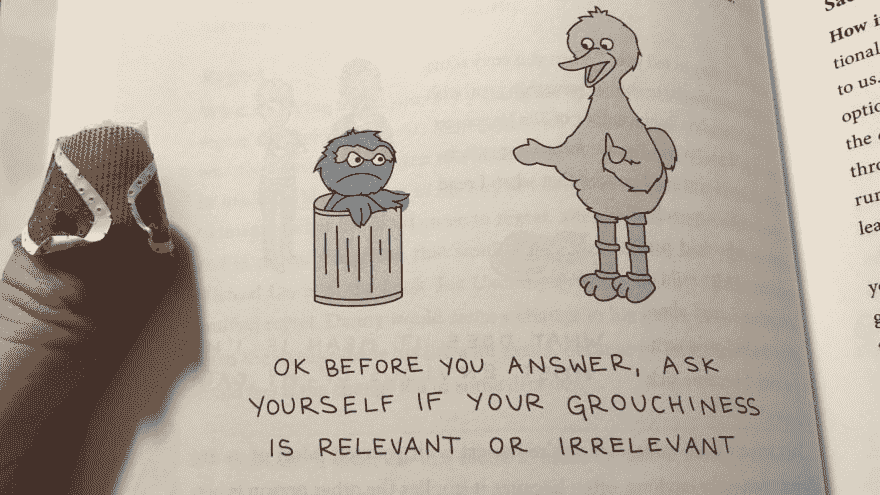
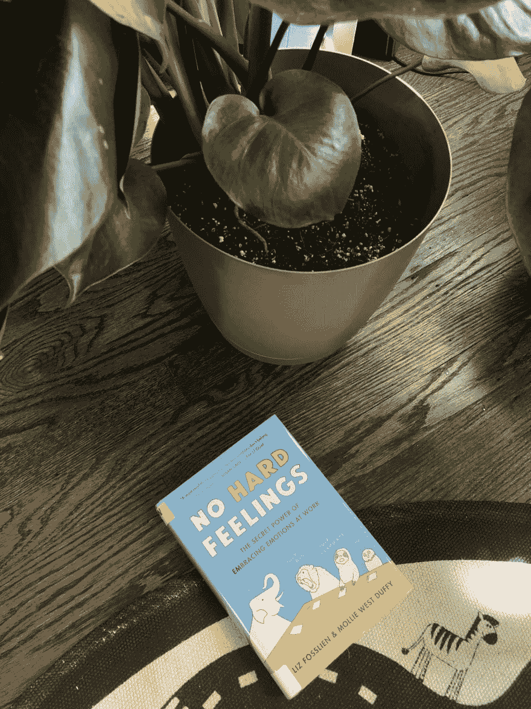

# 书评:没有不愉快的感觉

> 原文：<https://dev.to/desi/book-review-no-hard-feelings-51p6>

我看书。[一个*地段*一个](https://www.goodreads.com/user/show/10822672-desi)。多年来，我一直在我的另一个博客上回顾和发布我每月的书籍收获，但最近我发现自己阅读了越来越多的技术/职业书籍。他们已经在许多方面震撼了我的心灵——无论是通过灯泡时刻，对行业行为的愤怒和愤怒，还是我学习新东西以创造酷东西的兴奋，我认为在 DEV.to 上对这些书评进行分类可能会很好，也适合任何可能正在寻找一些新材料的人！

这个星期我读完了 *[【没有痛苦的感觉:拥抱情绪在工作中的秘密力量】](https://amzn.to/2WvS1A7)* ，作者是[利兹·福斯林和莫丽·韦斯特·达菲](https://www.lizandmollie.com/)。如果你只是在这里寻找一个 TL；博士回顾，在这里:

## 我喜欢这本书

> *没有痛苦的感觉*是一本非常有趣的图文并茂的指南，指导你如何在工作中不表露自己的情绪，甚至为嫉妒和焦虑找到建设性的渠道，揭开数字互动和同事沟通方式的神秘面纱，最终让你在工作中展现最好的自己。

Mollie 和 Liz 是长期的好朋友，都在技术领域工作，但他们的建议可以应用于任何行业。他们列出了七个关键领域，员工可能会觉得他们需要抑制自己的情绪或环境——或者这可能是我在投射，因为这绝对是我在工作中做的事情。

在他们关于健康、动机、决策、团队、沟通、文化和领导力的章节中，他们为员工、经理和高管提供了例子、案例研究、研究和可操作的要点，以使他们的工作场所在心理上安全、包容、更加开放和包容。

自从我从图书馆借出这本书，我就不能像往常一样在特别有共鸣的段落的空白处高亮、圈出和书写。相反，我用手机拍了照片，这样我以后就可以记下来——我想我拍了这本书大约 70%的照片。用超级可爱的例子来说明很有帮助，就像这样:

我是一个在很长一段时间内非常努力地将情绪与工作版本的自己分开的人——在某种程度上，这是因为音乐行业是残酷的，在这十年里，我明白了除非你有一颗铁石心肠，否则人们会看到并利用你盔甲上的任何裂缝。这也意味着我希望我周围的每个人都以同样的方式行事——这并不总是发生。(也不应该！)我对书中的一幅插图感到特别反感，这幅插图描绘了一条河豚试图让他的朋友和同事相信他“很好”——比如，谁偷偷给我拍了这张照片，作者们？？

在过去的几个月里，我一直在努力专注于交流和内心互动(除了开玩笑或评论之外)，所以这对我来说是一个非常及时的阅读。Liz 和 Mollie 总结了每一章的要点，既在这一章的结尾，也在这本书的结尾，所以它们很容易整理和获取。除了所有的研究，他们还汇总了一些评估，帮助你了解你的情绪和你交流情绪的方式。这些既可以在书中找到，也可以在他们的网站上找到。

这本书还包括一个广泛的参考书目，并建议进一步阅读和会谈，我真的很期待挖掘。

我 100%向任何人推荐这本书——这是一本快速阅读的书，有可以立即应用的实用技巧，并有助于关注开发人员和工程师经常被定型为缺乏的一些“软技能”。

### 你看过这本书吗？你对在工作中表露情绪有什么感受？