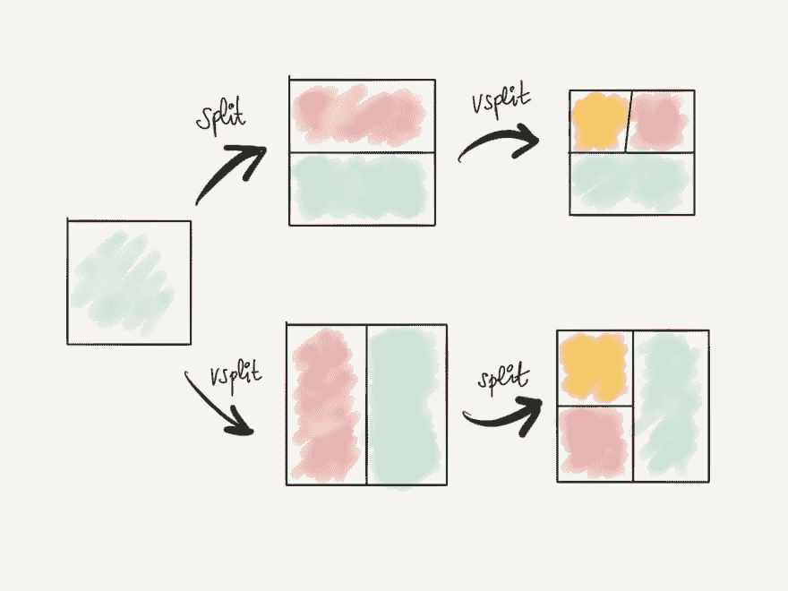
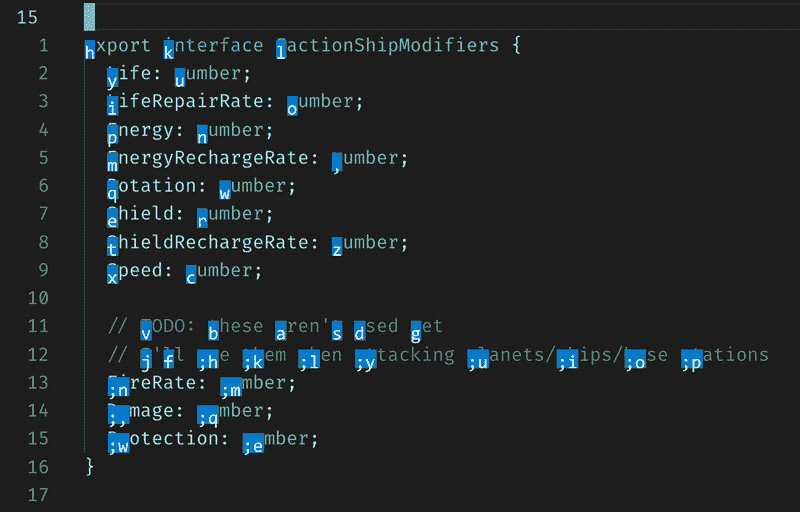
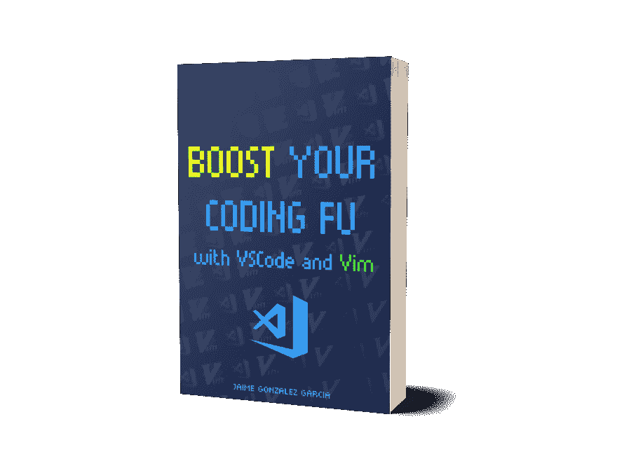

# 使用 Visual Studio 代码和 Vim 增强您的编码能力

> 原文：<https://dev.to/vintharas/boost-your-coding-fu-with-visual-studio-code-and-vimboost-your-coding-fu-with-visual-studio-code-and-vim-502h>

*本文最初发布于[barbarianmeetscoding.com](https://www.barbarianmeetscoding.com/blog/2019/02/08/boost-your-coding-fu-with-vscode-and-vim)。*

**Visual Studio 代码超棒**。它提供了无与伦比的用户体验，对多种语言和开发生态系统提供了强大的支持。它有很好的默认值，非常容易使用和开始。

Vim 太棒了。它的模态特性和文本编辑特性使它在其他编辑器中独一无二。Vim 提供了完全不同的文本编辑能力、速度和准确性。

两者的结合不能比**令人惊讶的超级棒**差太多了(是的，我就是这么做的)。

在接下来的几分钟内，您将从 Vim 编辑器中引入许多非常有用的工具，并将其放入您最喜欢的编辑器中，从而提高您的 Visual Studio 编辑技能:Visual Studio 代码。

以下是我们将要讲述的内容:

*   Vim 是什么？为什么在 VSCode 中使用 Vim？
*   如何在 VSCode 中安装 Vim？
*   Vim 中的基本生存技能
*   通过核心 Vim 运动快速移动
*   使用 Vim 操作符和动作以思维的速度进行编辑
*   维姆的秘密语言
*   插入文本 a la Vim
*   在可视模式下选择文本
*   用 Vim Surround 包围事物
*   使用潜行和 EasyMotion 插件，移动速度更快

> 本文没有假设任何 Vim 知识，所以如果您不熟悉 Vim，也不用担心。我将指导您了解有效使用 VSCode 和 Vim 所需的所有概念和技术。

## Vim 是什么？

[Vi](https://www.vim.org) 是一个古老的文字编辑器，甚至比[世界的第一时代](https://en.wikipedia.org/wiki/Vi)还要古老。它被设计成在被称为终端的装置上工作，这种终端具有非常不寻常但却富有灵感的以模态方式运行的特征。也就是说，它有一种插入文本的模式，另一种编辑文本的模式，另一种选择文本的模式，等等。

Vi 的最新和最著名的化身是[Vim](https://en.wikipedia.org/wiki/Vim_(text_editor))(**V**I**IM**proven，前身为 **V** i **IM** itation)，它既支持文本界面，也支持图形界面，对 [vi](https://en.wikipedia.org/wiki/Vim_(text_editor)#Features_and_improvements_over_vi) 进行了大量改进，并在人类已知的所有平台上得到支持。但是，Vim 的影响并不仅限于 Vim，Vim 的想法非常了不起，它们已经超越了 Vim 编辑器本身，并传播到其他编辑器中。今天，您几乎可以在任何编辑器和 IDE 中找到类似 Vim 的模式。就像在 **Visual Studio 代码**中一样。

## 为什么是 Vim？Visual Studio 代码还不够吗？

**在这个时代，你为什么要关心了解一个古代编辑呢？**这对我的 VSCode 设置真的有这么大的影响吗？

事实是，Vim 提供了一种我所见过的与文本交互的不同方式，这种方式在编辑代码时给你**一种完全不同的控制和流畅水平。在一个有经验的用户手中，用 Vim **编辑文本就像变魔术一样**:**

*   Vim 让你更快。
*   **Vim 让你更精准**
*   **Vim 解锁了文本编辑中完全不同级别的控制**
*   **Vim 使你的大脑和电脑之间的界面变薄**
*   做报告时令人肃然起敬 :D

厉害！但是 Vim 如何实现这一切呢？

Vim 的模态特性使您的键盘能够控制编辑器的各个方面。每种模式都是一张白纸，赋予您的键盘新的功能，以闪电般的速度编辑文本，以思维的速度导航，选择文本并将其移动到您喜欢的内容，等等。

有了 Vim，您不再局限于插入文本，也不再受鼠标点击、导航或选择文本的束缚。不会。使用 Vim 一段时间后，**您将像一个代码外科医生**一样，随时随地以外科手术般的精度进行专业切割，以闪电般的速度和完全由键盘驱动的工作流的准确性浏览您的代码和代码库。

那么，在这个时代，你为什么想要学习 Vim 呢？转述强大的[德鲁·尼尔](https://twitter.com/nelstrom)[实用 Vim](https://amzn.to/2CIzSpb) 的作者，Vim 最晦涩艺术的大师:

> Vim 是为那些想要提高游戏水平的程序员准备的。在专家的手中，**维姆以思维的速度**撕碎文本。

但是:

> ### 为什么是 VSCode 中的 Vim 而不仅仅是 Vim？
> 
> 你可能想知道...好的。如果 Vim 这么好的话...为什么不在 Visual Studio 代码中使用 Vim 而不是 Vim 呢？
> 
> 很棒的问题！事实是，将 Vim 设置为使用类似于现代文本编辑器的特性集并不是一项简单的任务。像代码完成、代码导航、编辑器内错误消息等特性，虽然 Vim 支持，但开箱即用并不完美。
> 
> Visual Studio 代码和 Vim 提供了一个非常好的平衡点，平衡了 Visual Studio 代码的超级丰富的开发用户体验和 Vim 中存在的许多令人惊叹的特性。

## 在 Visual Studio 代码内部安装 Vim

为了在 Visual Studio 代码中引入 Vim 的魅力，您需要安装 [VsCodeVim 插件](https://github.com/VSCodeVim/Vim):

1.  打开 Visual Studio 代码
2.  转到扩展
3.  在搜索框中键入`vim`
4.  第一个名为 **Vim** 的插件是您想要的
5.  点击安装按钮
6.  史诗般的胜利！

[](https://res.cloudinary.com/practicaldev/image/fetch/s--MK7XfKVG--/c_limit%2Cf_auto%2Cfl_progressive%2Cq_auto%2Cw_880/https://www.barbarianmeetscoding.cimg/vscodevim-plugin.jpg)

现在，安装完扩展后，您可能需要重新启动 Visual Studio 代码以使更改生效。 <sup id="fnref1">[1](#fn1)</sup>

重启了吗？从您最新的项目中打开一个代码文件，并查看光标。它看起来像长方形吗？什么事？**欢迎来到 Vim**

## 维姆中的婴儿步伐

如果你现在尝试输入文本，你会惊讶地发现什么也没发生。或者更准确地说，没有你预料到的事情会发生。也就是说，当您键入时，屏幕上没有正在键入的字符。那是因为 Vim 中的核心模式是*正常模式*而不是*插入模式*。

在*正常模式下*你不插入文本，你四处移动并编辑它。这一设计决策源于这样一种认识，即我们花更多的时间阅读、导航和修改代码，而不是首先插入代码。
这些是你在 Vim 生存所需要的最基本的东西:

*   **和`hjkl`一起在**周围移动
*   **用`i`进入插入模式**，你可以像往常一样输入内容
*   **用`<ESC>`或`<CTRL-C>`返回**到正常模式

**`hjkl`是 Vim** 中最核心、最基本的动作。它们允许你在任何方向移动光标一格:

```
 ^
             |
             |

     <-- h j k l -->

           |
           |
           v 
```

在 Vim 中，它们不是最有效的，也不是最高效的移动方式。但是它们确实给了你灵活性和信心，让你在普通模式下用 T2 移动文件。有效地学习相当于学习走路，或者学习骑自行车。

在你熟悉了更多的 Vim 动作后，你就不会那么频繁地使用`hjkl`，但是对于短距离的动作和小的修正，它们会变得非常方便。

> ### 映射您的 Caps Lock 键来控制
> 
> 使用 Vim(以及任何其他编辑器)时，有一件事非常方便，那就是将您的 *Caps Lock* 键重新映射到*控件*。这意味着您可以在舒适的座位上轻松触摸到超级常用的按键，如*控制键*。
> 
> 如果您使用的是 Mac，您可以直接从“偏好设置”、“键盘”中完成此操作。否则，您可能需要在您的开发机器上安装一些软件，但这应该非常简单。谷歌是你的朋友。谷歌一下。

## 随着核心 Vim 动作快速移动

**动作(就像在运动中一样)是你在 Vim** 中如何移动。它们是命令，当被键入时，以高速度和精度移动光标。它们有许多种，每一种都最适合不同类型和长度的运动。我发现它们与 VSCode 的本地转到功能(如转到文件和转到符号)配合使用效果很好。

以下是一些最有用的精简列表:

### 逐字水平移动

**文字运动**让你水平移动更快:

*   使用 **`w`** 从一个单词跳到另一个单词(使用`b`向后跳)
*   使用 **`e`** 跳到一个单词的末尾(使用`ge`向后跳)
*   Vim 中的一个单词只包括字母、数字和数字。如果您想将特殊字符如`.`、`(`、`{`等视为单词(在 Vim 行话中称为单词)的一部分，您可以使用以上键的大写对应字符(`W`、`B`、`E`、`gE`)

一般来说，**单词运动允许更精确的变化，而单词运动允许更快的运动**。

### 移动到特定的字符

**寻找角色动作**让你快速且高精度地水平移动:

*   使用`f{char}`移动( **f** ind)到一行中下一个出现的字符`char`(使用`F`向后移动)。例如，`f"`会将您发送到下一个出现双引号的地方。
*   使用`t{char}`将光标移动到下一个字符`char`出现之前(un* *t* *il)

使用`f{char}`之后，你可以输入`;`到下一个事件，或者输入`,`到上一个事件。**你可以看到`;`和`,`是重复最后一次字符搜索**的命令。

> ### 关于音符、旋律和和弦
> 
> Vim 很特别。如果你使用过其他编辑器，你可能习惯于键入和弦。即同时键入组合键。例如，CTRL-C 用于复制，CTRL-V 用于粘贴。Vim 也使用和弦，但更依赖于琴键的旋律。
> 
> 如果你把琴键看作音符，那么旋律就是一系列一个接一个的音符。在正常模式下，这是使用 vim 最常见的方式。所以，当你读到你需要键入`f{char}`来找到一行中的一个字符时，这意味着首先你键入`f`，然后你键入字符`{char}`。这虽然不熟悉而且有点奇怪，但是非常方便，因为控制编辑器突然感觉就像输入文本一样。这对你的手腕健康也有好处。

### 水平极度移动

要使**极度水平移动**,使用:

*   **`0`** :移动到**行的第一个字符**
*   **`^`** :移动到**一行的第一个非空白字符**
*   **`$`** :移动到**行尾**
*   **`g_`** :移动到行尾的**非空白字符**

### 垂直移动

从`k`和`j`开始，我们转向一种更快的**垂直机动方式**:

*   **`}`** **向下跳转整个段落**
*   **`{`** 同理但**往上**
*   **`CTRL-D`** 让我们把你**往下移半页**
*   **`CTRL-U`** 让我们把你**上移半页**

### 带搜索模式的高精度垂直运动

为了让**垂直移动得更快**当你心中有目标时，你最好的选择是**用`/{pattern}`和`?{pattern}`命令搜索**:

*   使用`/{pattern}`到**在文件内向前搜索**
*   使用`?{pattern}`到**向后搜索**

您会看到，当您键入时，匹配的模式会高亮显示。当你找到你想要的，输入`<Enter>`，你的光标会跳到搜索中的第一个匹配项。如果你愿意，你可以在那里进行一些编辑，然后使用`n`跳到下一场比赛(或者使用`N`跳到上一场比赛)。**你可以把`n`想象成重复搜索**。

Vim 喜欢为您节省时间:在任何时候，您都可以键入`/<Enter>`或`?<Enter>`来运行最后一次搜索(向前或向后)。使用`*`搜索光标下的单词。

### 随着计数移动得更快

计数是可以加在命令前面的数字，以增加该命令的效果。例如，`2w`允许我们将光标向前移动两个单词。使用`{count}motion`将一个动作乘以`{count}`倍。

垂直移动的一个好方法是结合使用计数和`j`和`k`。当您启用相对行号(通过 VSCode 首选项)时，这非常有效，因为上下跳转`{count}`行以到达目标行变得非常自然。

### 语义移动

*   使用`gd`跳转到光标下的定义
*   使用`gf`跳转到导入文件

### 还有一些更俏皮的核心动作

*   `gg`转到文件的顶部
*   `{line}gg`转到特定行
*   `G`转到文件的结尾
*   `%`跳转到匹配`({[]})`

## 用 Vim 操作符像变魔术一样编辑

动作不仅仅是为了移动。它们可以与一系列称为操作符的命令结合使用，在*正常模式*下编辑您的代码。这些组合通常采取这种形式:

```
 an action to perform: delete, change, yank, etc
         /
        /
       /                  ____ a motion that represents a piece
      |                  /     of text to which to appy the action
      |                 /      defined by the operator
  {operator}{count}{motion}
               \
                \
                 \
                  \_ a multiplier to "perform an action
                     {count} times" 
```

其中一个命令是通过`d`键触发的**删除**；

*   `d5j`向下删除 5 行
*   `df'`删除当前行中的所有内容，直到第一次出现`'`字符(包括该字符)
*   会像上面那样做，但不包括字符(直到刚才)
*   `d/hello`删除所有内容，直到第一次出现`hello`
*   `ggdG`删除整个文档

其他有用的运算符有:

*   `c` **c** 焊割。这是最有用的运算符。它删除并让你进入插入模式，这样你就可以打字了
*   `y` **y** 维姆行话中的 ank 或 copy
*   `p` **p** 用 Vim 行话 ut 或 paste
*   `g~`要切换瓶盖

所有这些操作符都有一些有用的速记语法，目的是在常见的用例中节省您的输入并提高您的速度:

*   **将一个操作符加倍，使其对一整行进行操作** : `dd`删除一个整像，`cc`改变一整行等。
*   **将一个运算符大写，使其从光标处操作到行尾** : `D`从光标处删除到行尾，`C`改变到行尾等。

> ### 注意到了动作和命令键是如何很有意义的吗？
> 
> Vim 中的命令和动作通常容易学习，因为它们有意义并且容易猜测。想改变什么？您可能想使用`c`操作符。想一个字一个字的搬？试试`w`。想删点什么？试试`d`运算符等等。

当我们把操作符和一类叫做**文本对象**的特殊运动结合起来时，操作符和运动真的会大放异彩。

### 用文本对象编辑一个缺口

文本对象是结构化的文本片段，或者，如果你愿意，是文档域模型的实体。文档由什么组成？单词、句子、引用文本、段落、块、(HTML)标签等。这些是文本对象。

在命令中指定文本对象的方法是将字母`a`(代表文本对象加空格)或`i`(没有空格的内部对象)与代表文本对象本身的字符结合起来:`w`代表单词，`s`代表句子，`'` `"`代表引号，`p`代表段落，`b`代表被`(`包围的块，`B`代表被`{`包围的块，`t`代表标签。因此，要删除不同的文本，您可以:

*   `daw`到**d**delete**a**T5】word(加上尾随空格)
*   `ciw`到 **c** 汉格 **i** 内尔 **w** 奥德
*   `das`to**d**delete**a**T6】sentence(`dis`删除内部句子)
*   `da"`删除双引号中的内容，包括引号
*   `ci"`要更改双引号内的内容
*   `dap`删除一个段落
*   `dab` `da(`或`da)`删除一个被`(`包围的块
*   `daB` `da{`或`da}`删除一个被`{`包围的块
*   `dat`删除一个 HTML 标签
*   `cit`改变 HTML 标签的内容

将文本对象和操作符结合起来是非常强大的，你会经常用到它们。像`cit`、`ci"`和`cib`这样的东西真是太棒了。

假设我们想把下面这个字符串的内容换成别的:

```
const salute = 'I salute you oh Mighty Warrior' 
```

你输入`ci'Hi!<ESC>`，它就变成:

```
const salute = 'Hi!' 
```

就这样。你不需要去拿鼠标，选择文本，然后写别的东西。你打三个字母然后嘣。

> ### 注意到大多数 Vim 键是怎么放在手指附近的吗？
> 
> 事实上，Vim 具有模式，允许在每个单独的模式中重复使用靠近主行的按键，最大限度地减少对缓慢和扭曲的按键组合的需求，并提高您的速度和手指及手腕的寿命。这太棒了。

### 用点运算符重复最后一次更改

Vim 为您准备了另一个旨在节省更多击键次数的技巧:神奇的`.`命令。`.`命令允许您重复上次所做的更改。想象一下，你运行`dd`删除一行。你可以再次输入`dd`来删除另一行，但是你也可以使用`.`，这只是一个简单的击键。好吧，你保存了一个按键，那又怎么样？嗯，你可以使用`.`命令来重复**任何类型的改变**，而不仅仅是单个命令。例如，你可以把单词“Awesome”改成这样的`cawAwesome<CR>`，然后使用`.`重复所有这些击键的命令。想想可能性吧！

`.`命令与重复搜索命令(`;`、`,`、`n`或`N`)结合使用效果很好。假设您想要删除所有出现的`cucumber`。alternative[^3]就是搜索黄瓜`/cucumber`，然后用`daw`删除它。从那以后你可以用`n`去下一场比赛，用`.`删除！两次击键！？！再次考虑各种可能性！！

## 维姆的密语

你可能已经注意到了所有这些操作符，计数和运动构成了某种(编程)语言。你可以把操作符想象成函数，把计数和运动想象成参数，或者用一个更简单的类比...你可以把操作符想象成动词，把计数想象成形容词，把动作想象成宾语。

**[Vim 的真正魔力是构图](https://medium.com/@mkozlows/why-atom-cant-replace-vim-433852f4b4d1)** 。随着你逐步积累这些操作符和动作的词汇，你会发现你可以随心所欲地将它们结合起来。这样，一旦你从上一段中了解了所有的`c`、`cl`、`caw`、`ciw`、`ct.`，并且了解了`dl`是如何工作的，你不仅能够使用`dl`，你还会知道你可以将它与你已经掌握的所有动作以及`daw`、`diw`、`dt`等结合起来。

这很酷。当使用 Vim 时，你会感觉到你在文本编辑的元宇宙中导航，就像编程或控制编辑和编写文本的机制。如果您熟悉 git 以及使用 git 命令行处理源代码控制的感觉，您可以将 Vim 视为文本编辑的 git。(撇开 Vim 比 git 早了近 30 年这个事实不谈)。使用 Vim，您将看到一段文本，您将不再仅仅看到单词或文本，您将看到无限数量的操作符和动作被应用的可能性。

## 插入文本 a la Vim

迟早你将不得不写一些代码。在 Vim 中，您以**插入模式**编写代码。当使用`c`命令时，你已经看到了一点插入模式，但是让我们再看一下。有两个核心命令可以让你进入插入模式:`i`表示 **i** nsert，`a`表示 **a** ppend。

`i`插入命令将你置于光标之前的插入模式**。而`a` append 命令使你在**光标后进入插入模式**(就好像在光标所在的任何地方追加内容)。从那时起，您就处于插入模式，Vim 的行为与任何其他编辑器非常相似(欢迎回到 VSCode！).**

像许多其他 Vim 命令一样,`i`和`a`有大写的对应物，执行**更强的**版本的插入和追加。`I`让你在当前行的开头进入插入模式，而`A`让你在末尾进入插入模式。

除了`i`和`a`之外，还有另外三个**非常有用的**命令，我喜欢用它们来进入插入模式:

1.  在当前行下方插入新的一行，并进入插入模式(助记符 **o** 在下方插入一行)
2.  在当前行的上方插入新的一行，并使你进入插入模式
3.  `gi`从上次离开插入模式的位置进入插入模式。如果您不小心退出了插入模式，并想回到原来的位置继续输入，这非常有用。

好的，让我们假设现在你处于插入模式，正在打字，你犯了一个错误，比如一个错别字。你会回到正常模式，修正打字错误，然后回到插入模式吗？不要！有几个绑定可以帮助您直接在插入模式中修复错误:

*   `C-h`让您删除最后输入的字符
*   `C-w`让您删除最后键入的单词
*   `C-u`让您删除您输入的最后一行

不过，最终你会想退出插入模式，做其他事情。有三种方法:`<ESC>`、`C-[`和`C-C`。在所有这些中，更容易键入的是`C-C`。

## 在可视模式下选择文本

视觉模式是相当于用鼠标选择文本的 Vim。不过，您将使用 Vim 动作，而不是鼠标。当你需要选择一些文本时，这种模式会非常方便，因为它会在你选择时给你视觉反馈。

有三种方式可以启动视觉模式:

*   `v`为可视模式**逐字符**。当你四处走动的时候，你会一个接一个地选择角色
*   `V`对于视觉模式**逐行**。当你四处走动时，你会一行一行地选择
*   `<C-V>`对于可视模式**逐块**。当你四处走动时，你会选择矩形文本块

视觉模式对于复制和粘贴内容以及操作文本或代码块非常有用。它的工作方式与正常模式相反:

*   在正常模式下，首先定义操作符，然后定义一个表示要应用该操作符的文本的动作
*   在可视模式下，首先选择文本，然后**再**输入操作符

## 拆分、标签以及它们之间的切换

Vim 的一个很好的特性是它对拆分和制表符的支持。在 Vim 中，创建、调整大小、重新排列以及在拆分和标签之间移动非常容易和快速。VSCodeVim 为这个 Vim 特性提供了很好的支持。

### 劈叉

劈叉棒极了。它们允许您将工作区分为垂直和水平分割窗口:

*   使用`:sp {nameoffile}`命令打开水平 **sp** 灯
*   使用`:vsp {nameoffile}`命令打开一个 **v** 垂直**裂口**

你可以用`<C-W>` + `hjkl`在它们之间移动。

[](https://res.cloudinary.com/practicaldev/image/fetch/s--KLV4nsS2--/c_limit%2Cf_auto%2Cfl_progressive%2Cq_auto%2Cw_880/https://www.barbarianmeetscoding.cimg/vim-window-splitting.jpg)

> ### 键入命令
> 
> 注意这些命令前的:?冒号触发命令行模式，并设置您输入命令(也称为 Ex command，当我们深入到命令行模式时，您将在本书的后面找到原因)。
> 
> **要输入一个 ex 命令，你可以直接输入`:`，后跟命令名**(例如:vsp)。当您键入冒号和命令时，该命令将显示在屏幕的左下角。

### 选项卡

*   使用`:tabnew {file}`在新标签中打开文件
*   使用`:tabn`转到 **n** ext 选项卡
*   使用`:tabp`转到 **p** 上一页标签

## 用 Vim 环绕周围的事物

**VsCodeVim** 内置了一堆有用的 Vim 插件。其中之一是 vim-surround，它用一个新操作符扩展了 vim 的秘密语言:surround 操作符或`s`。

使用这个操作符，我们可以像使用 Vim 中的任何其他操作符一样使用它来包围文本:

*   `ds'`删除周围的`'` ( `ds{char}`)
*   `cs'"`将周围的`'`换成`"` ( `cs{old}{new}`)
*   用一个`<li>` **t** ag ( `ys{motion}{char}`)将一个段落括起来

您也可以使用 vim-surround，方法是在可视模式下选择一些文本，然后使用`S{desired character}`

## 使用 vim-sleek 和 vim-EasyMotion，移动速度更快

vim-sleek 和 [vim-EasyMotion](https://github.com/easymotion/vim-easymotion) 是两个 Vim 插件，它们对你在 Vim 中的移动方式收费过高。这两个插件都需要通过您的 VSCodeVim 首选项来启用。

**Vim-slave 是介于字符搜索(在一行内)和模式搜索(在一个文件内)之间的中间地带**:

*   您输入`s{char}{char}`，光标会飞向第一次出现的两个字符序列。从那时起，为下一次事件键入`;`，为上一次事件键入`,`。`S{char}{char}`以类似的方式工作，但方向相反。

vim-surround 用一个操作符扩展了 vim 的秘密语言，Vim-sleek 用一个动作做了同样的事情。因此，您可以将它与其他运算符结合使用:

*   键入`{operator}z{char}{char}`,操作符将应用于潜行运动遍历的文本。

Vim-EasyMotion 是 Vim 插件中比较奇怪的一个。它完全绕过了 Vim 动作，并以一种好奇和令人兴奋的方式重新创造了它们。当你触发一个简单的动作*动作*时，它会用一个显示在覆盖图中的组合键来标记整个文档中的可能目标(在有问题的文本上)。输入密码，你就会被传送到那个地方。

例如，输入`\\w`(`\\`是你触发 EasyMotion 的方式)，EasyMotion 会在你前面标注所有单词的开头。键入`\\f'`，EasyMotion 将标记所有出现的`'`字符。很漂亮，不是吗？

[](https://res.cloudinary.com/practicaldev/image/fetch/s--6ULgJMWm--/c_limit%2Cf_auto%2Cfl_progressive%2Cq_auto%2Cw_880/https://www.barbarianmeetscoding.cimg/vscodevim-easymotion.jpg)

### 一些方便的 Visual Studio 代码只有键映射:

以下是 VSCodeVim 团队仅为 VSCode 设计的一些方便的映射:

*   `gb`在找到的下一个单词上添加另一个光标，该单词与光标下的单词相同。类似于`*`，但它不是跳到下一个事件，而是创建多个光标。
*   `af`是一个可视的 moe 命令，用于选择越来越大的文本块。
*   `gh`相当于将鼠标悬停在光标所在的位置。超级方便，以便启用只有键盘的工作流程，并仍然享受一些功能(错误信息，类型等)，只有通过鼠标可用。

## 我该何去何从？

厉害！我们已经在本文中讨论了很多基础知识，我希望您会发现它作为 Visual Studio 代码中 Vim 的指南是有用的。剩下的就是让你一点一点地练习，直到你对 Vim 越来越熟悉和熟练。不要试图一次应用你在这篇文章中学到的所有东西。只需挑选一些你认为更有用的操作符，慢慢地将它们添加到你的工作流程中。

尽管我们讨论了很多问题，但还有很多事情我们没有谈及:

*   VSCodeVim 中甚至有更多可用的插件。[看看有没有你感兴趣的东西](https://github.com/VSCodeVim/Vim#-emulated-plugins)
*   Vim 的核心特性之一是它惊人的可定制性。VSCodeVim 通过自定义键映射来支持其中的一些功能。也就是说，它允许您定义自定义映射，以使频繁的操作更容易键入。[在这里看看一些很棒的例子](https://github.com/VSCodeVim/Vim#key-remapping)。
*   考虑安装 [Neovim](https://neovim.io/) 并在 VSCode 中启用。它允许一个令人敬畏的命令行模式支持。是的，另一个 Vim 模式是[能够做一些令人惊奇的事情](https://github.com/VSCodeVim/Vim#neovim-integration)。
*   这里是目前在 [VsCodeVim](https://github.com/VSCodeVim/Vim/blob/master/ROADMAP.md) 中可用特性的完整列表。没错。它是巨大的。许多好东西有待探索。

去吧，享受你的新知识，提高你的技能和生产力，如果你想了解更多关于 Vim 的知识，我有更多精彩的东西给你:

*   尝试阅读[探索 Vim](https://www.barbarianmeetscoding.com/blog/categories/exploring-vim) 系列，获取更多关于 Vim 的相关文章
*   或[5 分钟 Vim](https://www.barbarianmeetscoding.com/blog/categories/five-minutes-vim) 系列，用于简短的浓缩文章
*   **或者更好地获得[巫师使用 Vim](https://leanpub.com/wizardsusevim) 我的关于 Vim 所有事情的美丽的书**在那里我一步一步地指导你如何更好地使用 Vim

保重，去踢别人的屁股吧！:D

**2 月 10 日更新:嘿！我刚刚开始了一个新的 vlog 系列来帮助你更快地达到速度。尽情享受吧！**

(我不能在 dev.to 中嵌入播放列表，所以这里是前三个视频，[这里是完整播放列表的链接](https://www.youtube.com/watch?v=SbdI8CV4-KQ&list=PLWkmatwYW3nE0bhFmV3zxtqHGTowomCRY)

[https://www.youtube.com/embed/SbdI8CV4-KQ](https://www.youtube.com/embed/SbdI8CV4-KQ)
[https://www.youtube.com/embed/PlMzxXOnQFw](https://www.youtube.com/embed/PlMzxXOnQFw)
[https://www.youtube.com/embed/SRI29zLtX1U](https://www.youtube.com/embed/SRI29zLtX1U)

> 【2019 年 7 月 12 日更新:[这篇文章成为了关于 VSCode 和 Vim 的完整书籍！！](https://leanpub.com/boostyourcodingfuwithvscodeandvim)。Wihooo！！。你可以在 [leanpub](https://leanpub.com/boostyourcodingfuwithvscodeandvim) 、[亚马逊](https://amzn.to/2XLslvG)或者[上免费阅读](https://www.barbarianmeetscoding.com/boost-your-coding-fu-with-vscode-and-vim)。

[](https://leanpub.com/boostyourcodingfuwithvscodeandvim)

## Windows 或 Linux 中 VSCode 的用户？看这个！

[@mccabiles](https://dev.to/mccabiles) 在一篇很棒的评论中提出了一个事实，当在 Windows 或 Linux 上使用 VSCode 时，你习惯的一些快捷键会停止工作(即`CTRL+C`、`CTRL+V`等)。原因是 Vim 通常有比这些快捷方式更有效的方法来达到同样的结果(例如`y`和`p`命令等)。如果您对这些 Vim 命令感到不舒服，并且仍然希望将`CTRL-C`、`CTRL-V`或其他快捷方式链接到它们的原始行为，请不要担心！您可以按照以下说明在 VSCode 设置中配置哪些快捷方式被 Vim 覆盖:

*   [VSCodeVim 重新映射常用快捷方式以及如何重新启用它们](https://www.barbarianmeetscoding.com/boost-your-coding-fu-with-vscode-and-vim/baby-steps-in-vim/#an-important-note-for-windows-and-linux-users)

* * *

1.  最新版本的 VSCode 带来了对 bat 的插件工作权的支持，但是你永远不会知道。:D [↩](#fnref1)