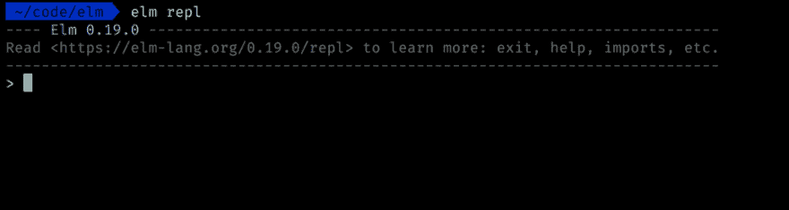
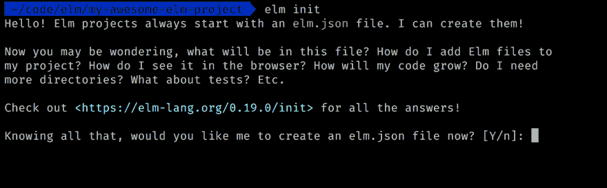
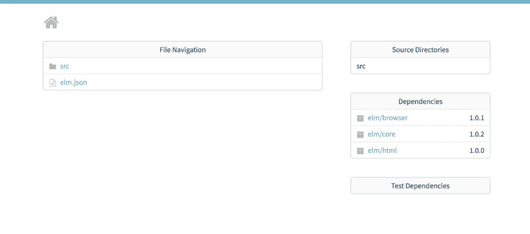

# 引导一个 Elm 项目

> 原文：<https://dev.to/kevgathuku/bootstrapping-an-elm-project-3b84>

Elm 是构建可靠的 web 应用程序的令人愉快的语言。它是一种编译成 JavaScript 的语言，因此被用来构建在 web 浏览器中运行的应用程序。在这篇文章中，我们将探索启动一个 Elm 项目的不同方法，从最简单的开始，到具有更高级特性的设置，比如开发中的热重载。

我们开始吧！

### 先决条件

在我们开始之前，请确保[安装 Elm](https://guide.elm-lang.org/install.html)

要确认您是否安装了 Elm，您可以尝试使用`elm repl`命令运行交互式`repl`。如果您得到如图所示的提示，就可以开始了👍

[](https://res.cloudinary.com/practicaldev/image/fetch/s--NvpoHLD3--/c_limit%2Cf_auto%2Cfl_progressive%2Cq_auto%2Cw_880/https://kevgathuku.files.wordpress.com/2019/05/screen-shot-2019-05-29-at-10.15.12.png%3Fw%3D1024)

### 榆树 CLI

这是官方支持的创建新 Elm 项目的方式。

1.  创建一个新目录，您的项目将存放在其中

    `mkdir my-awesome-elm-project`

2.  导航到新创建的目录

    `cd my-awesome-elm-project`

3.  在这个目录中运行`elm init`,您应该会得到如下所示的提示:

[](https://res.cloudinary.com/practicaldev/image/fetch/s--8PFxjdMo--/c_limit%2Cf_auto%2Cfl_progressive%2Cq_auto%2Cw_880/https://kevgathuku.files.wordpress.com/2019/05/screen-shot-2019-05-29-at-10.29.05.png)

1.  按下`Enter`键，应该会在当前目录下创建一个`elm.json`文件。还将创建一个`src`目录。

*通读[链接资源](https://elm-lang.org/0.19.0/init)是个好主意，它更多地讨论了如何开始新的榆树项目*

1.  让我们从在`src`目录中创建一个新的`Main.elm`文件开始。一旦我们创建了文件，让我们添加一些 Elm 代码，向我们显示经典的“Hello World！”消息一旦我们运行它。

```
module Main exposing (main)

import Browser
import Html exposing (h1, text)

main =
  h1 [] [ text "Hello World!" ] 
```

1.  要运行代码，让我们在我们的目录中运行`elm reactor`，它应该在`http://localhost:8000`启动一个新的本地服务器。`elm reactor`是开始运行 Elm 代码的最简单的方法。

2.  一旦导航到`http://localhost:8000`，您应该会看到如下界面。

[](https://res.cloudinary.com/practicaldev/image/fetch/s--RK7r7R3R--/c_limit%2Cf_auto%2Cfl_progressive%2Cq_auto%2Cw_880/https://kevgathuku.files.wordpress.com/2019/05/screen-shot-2019-05-29-at-10.48.52.png)

点击`src`链接，然后点击`Main.elm`，你会看到我们的“Hello World！”消息。

就是这样！我们已经成功地用`elm init`命令创建了一个项目，并使用`elm reactor`运行它。

#### 优点:

*   易于上手
*   除了`elm`本身没有外部依赖

#### 缺点:

*   一旦我们做出更改，请手动重新加载

### 榆树使

这是对`elm reactor`的扩展，包括将我们的 Elm 代码编译成静态 HTML 的能力。

使用上一节中的同一个项目，我们可以使用以下命令编译该项目:

`elm make src/Main.elm`

一旦我们运行这个命令，就会在当前工作目录中生成一个`index.html`文件，如果您在 web 浏览器中打开它，您应该会看到同样的“Hello World”消息。

我没有太多关于`elm make`的经验，所以我就说到这里。

### 包裹

[package](https://parceljs.org/)是一个“超快的零配置 web 应用捆绑器”,也是我个人最喜欢的快速上手 Elm 应用的工具。它处理将 Elm 代码编译成 JavaScript，并且非常容易上手。

您可以通过几个简单的步骤创建由 Parcel 编译的 Elm 应用程序:

1.  安装包裹

    `yarn global add parcel-bundler`或`npm install -g parcel-bundler`

2.  遵循包裹网站 [Elm 部分](https://parceljs.org/elm.html)中的说明，其中包括:

    *   创建一个包含以下内容的`index.html`文件:

```
 <html>
  <body>
    <main></main>
    <script src="./index.js"></script>
  </body>
</html> 
```

*   创建一个包含以下内容的`index.js`文件:

```
import { Elm } from './Main.elm'

Elm.Main.init({
  node: document.querySelector('main')
}) 
```

*   创建一个包含以下内容的`Main.elm`文件:

```
module Main exposing (main)

import Browser
import Html exposing (h1, text)

main =
  h1 [] [ text "Hello, from Parcel!" ] 
```

1.  要运行应用程序，请运行命令:`parcel index.html`

我非常喜欢这个设置，以至于我创建了自己的基于 Parcel 的 starter 项目。请在 [GitHub](https://github.com/kevgathuku/parcel-elm/) 上随意查看

#### 优点:

*   易于上手
*   不需要手动配置💪
*   开箱即用的热重装
*   轻松入门 [JavaScript 互操作](https://guide.elm-lang.org/interop/)

#### 缺点:

🤷‍♀️

### 值得注意的提及:

*   [create-elm-app](https://github.com/halfzebra/create-elm-app) -基于 [create-react-app](https://github.com/facebook/create-react-app) ，基于 Webpack 创建零配置应用
*   elm-live -一个灵活的 elm 开发服务器。包括实时重新加载。

这并不是一个全面的列表，欢迎在下面的评论区提出任何建议/补充。

我希望这些选项在您开始下一个 Elm 项目时对您有用🚀