# 打破僵局——硬件 CTF

> 原文：<https://dev.to/icyphox/break-the-icehardware-ctf-1nhh>

[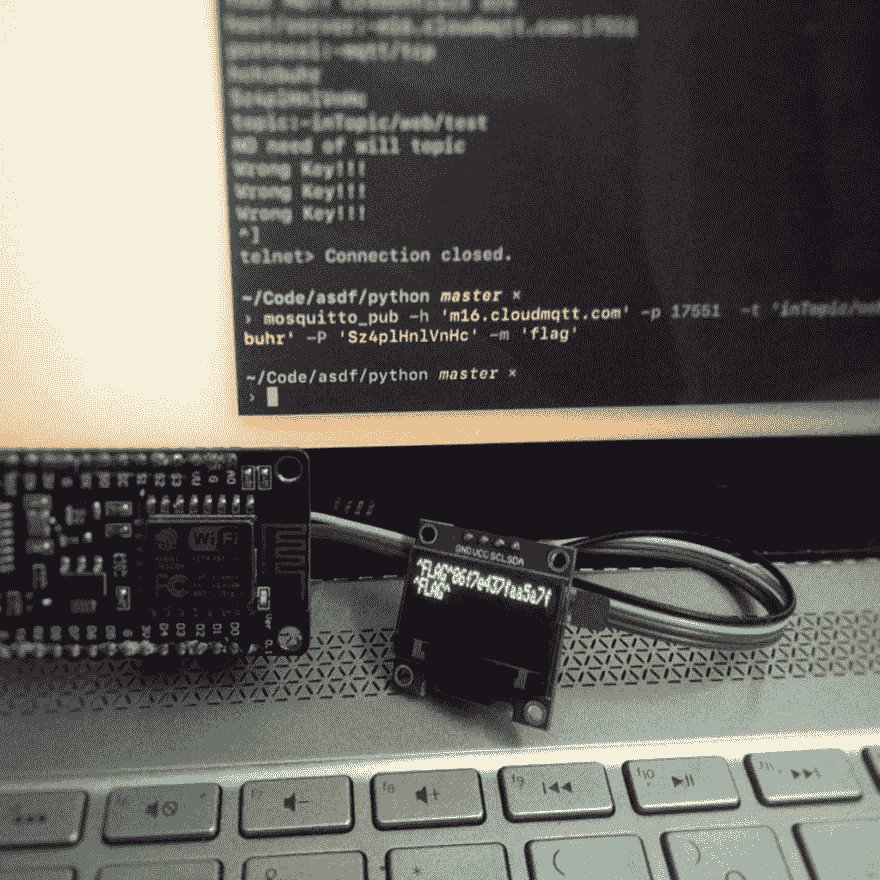](https://res.cloudinary.com/practicaldev/image/fetch/s--FGFd69r5--/c_limit%2Cf_auto%2Cfl_progressive%2Cq_auto%2Cw_880/https://cdn-images-1.medium.com/max/1024/1%2AYO4GLOxZWtbWGCBH1YNfbw.jpeg)

### 打破僵局——五金 CTF

#### 果阿 Nullcon '19 的 SecureLayer7 硬件 CTF

本月早些时候，在 Nullcon Goa，我们有机会尝试由安全层 7 的人设计的硬件 CTF 挑战。我们无法在 2 天的时间内解决这个问题(我们有会谈和聚会要参加)，但 SL7 的人很友好，让我们保留硬件，并在家里解决它。我们做到了，否则就不会有这样的报道:)

### 硬件

你会想，我一直提到的这个神秘的“硬件”是什么？这是一个 ESP8266 板，更好地称为 **NodeMCU** 。这里有一张图片。

[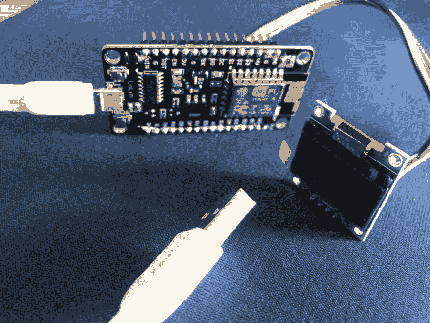](https://res.cloudinary.com/practicaldev/image/fetch/s--WJNSdS4K--/c_limit%2Cf_auto%2Cfl_progressive%2Cq_auto%2Cw_880/https://cdn-images-1.medium.com/max/1024/1%2AcWpvtbXan4LjdJBldelW-g.jpeg)

哦，还有一个漂亮的有机发光二极管展示。因此，眼下最明显的任务就是将显示器连接到电路板上。快速搜索后，我们发现了一个(非常有用的) [Instructables](https://www.instructables.com/id/Interface-LCD-Using-NodeMCU/) 链接，图片如下。

<figure>[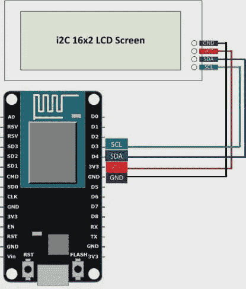](https://res.cloudinary.com/practicaldev/image/fetch/s--xZ1kZ50e--/c_limit%2Cf_auto%2Cfl_progressive%2Cq_auto%2Cw_880/https://cdn-images-1.medium.com/max/415/1%2A1avLAYsHDTGU-JS3e6oVrA.jpeg) 

<figcaption>不一样的显示，但很管用</figcaption>

</figure>

请注意，我们在这看似微不足道的一步上挣扎了很久，但是嘿，我们是计算机系的学生；)

通过 USB 连接设备时，电路板会旋转出一个名为“Device-6”的无线热点。

[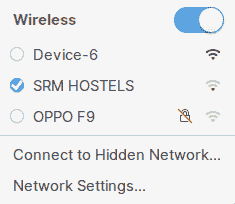](https://res.cloudinary.com/practicaldev/image/fetch/s--TyTSNQIV--/c_limit%2Cf_auto%2Cfl_progressive%2Cq_auto%2Cw_880/https://cdn-images-1.medium.com/max/235/1%2AwJ3ZY2EskoSSfvCjliP_jQ.png)

我们试图连接到这个，但它有密码保护。我们过会儿将回到它。

### 闪存转储分析

在我对该板进行的许多网络搜索中，一个有趣的工具出现了— [esptool](https://github.com/espressif/esptool) 。与 ESP8266 通信的 Python 实用程序。太棒了。

这个工具允许我们在板上进行一系列操作，但我们真正感兴趣的是读取 flash。在查找了它的语法之后，我们到达了:

```
› sudo ./esptool.py -p /dev/ttyUSB0 -b 460800 read\_flash 0 0x400000 flash\_contents.bin
Serial port /dev/ttyUSB0
Connecting....
Detecting chip type... ESP8266
Chip is ESP8266EX
Features: WiFi
MAC: 84:f3:eb:05:83:1e
Uploading stub...
Running stub...
Stub running...
Changing baud rate to 460800
Changed.
4194304 (100 %)
4194304 (100 %)
Read 4194304 bytes at 0x0 in 100.8 seconds (333.0 kbit/s)...
Hard resetting via RTS pin... 
```

这个命令很容易理解，`-p`标志表示我们设备的串口，`-b`表示波特率，`read_flash`从 0 开始读取 flash，直到 0x400000，也就是 4MB。

我们在这里遇到了很多麻烦，因为我们只读取了 2MB 的数据。为什么？因为网上的命令就是这么说的。

无论如何，我们已经将闪存转储到一个文件`flash_contents.bin`中。

然后，我们决定在 flash 二进制文件上运行字符串，并仔细阅读它的数千行内容。太棒了，对吧？实际上是。我们发现了一串有趣的字符串，以及我们猜测的无线热点的密码。剧透:是的。

<figure>[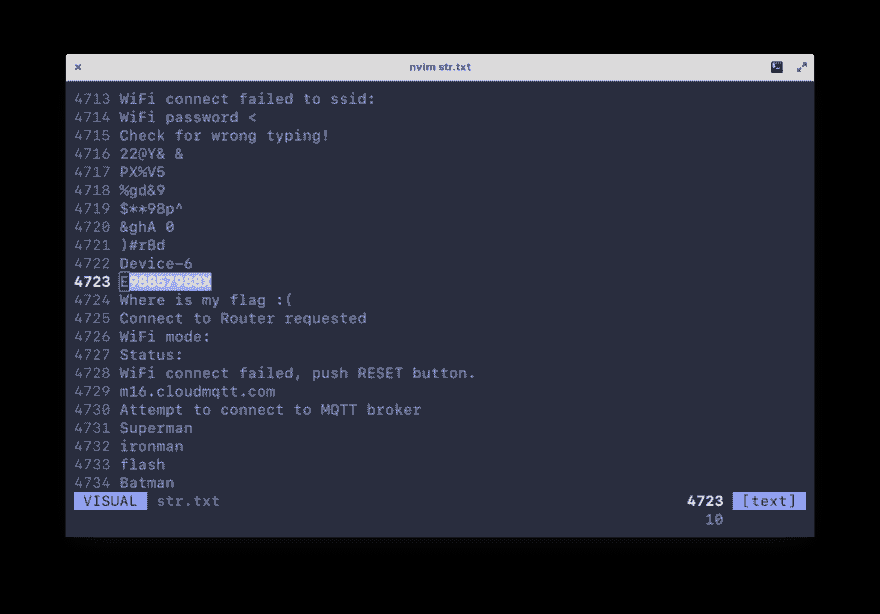](https://res.cloudinary.com/practicaldev/image/fetch/s--1Oea5xsx--/c_limit%2Cf_auto%2Cfl_progressive%2Cq_auto%2Cw_880/https://cdn-images-1.medium.com/max/1024/1%2A5Hc-_XYFw-4_hw3iZpfqkQ.png) 

<figcaption>整个转储是 6000+行。我们真的这么做了吗 D:</figcaption>

</figure>

(实际上)分析二进制文件的实用工具是 binwalk。-e 标志提取它在二进制文件中识别的已知文件类型。

```
› binwalk -e flash_contents.bin

DECIMAL HEXADECIMAL DESCRIPTION
--------------------------------------------------------------------------------
283960 0x45538 Unix path: /root/.arduino15/packages/esp8266/hardware/esp8266/2.5.0/libraries/ESP8266WiFi/src/include/DataSource.h
289387 0x46A6B HTML document footer
291156 0x47154 HTML document header
291296 0x471E0 Unix path: /root/.arduino15/packages/esp8266/hardware/esp8266/2.5.0/cores/esp8266/abi.cpp
3145728 0x300000 Squashfs filesystem, little endian, version 4.0, compression:gzip, size: 139733 bytes, 10 inodes, blocksize: 131072 bytes, created: 2019-02-25 09:14:19 
```

我们在这里看到一个 squashfs 文件系统。在你的当前路径中创建一个目录，包含所有它设法提取的文件和文件夹。`cd`进入我们的 squashfs 文件夹，我们看到:

<figure>[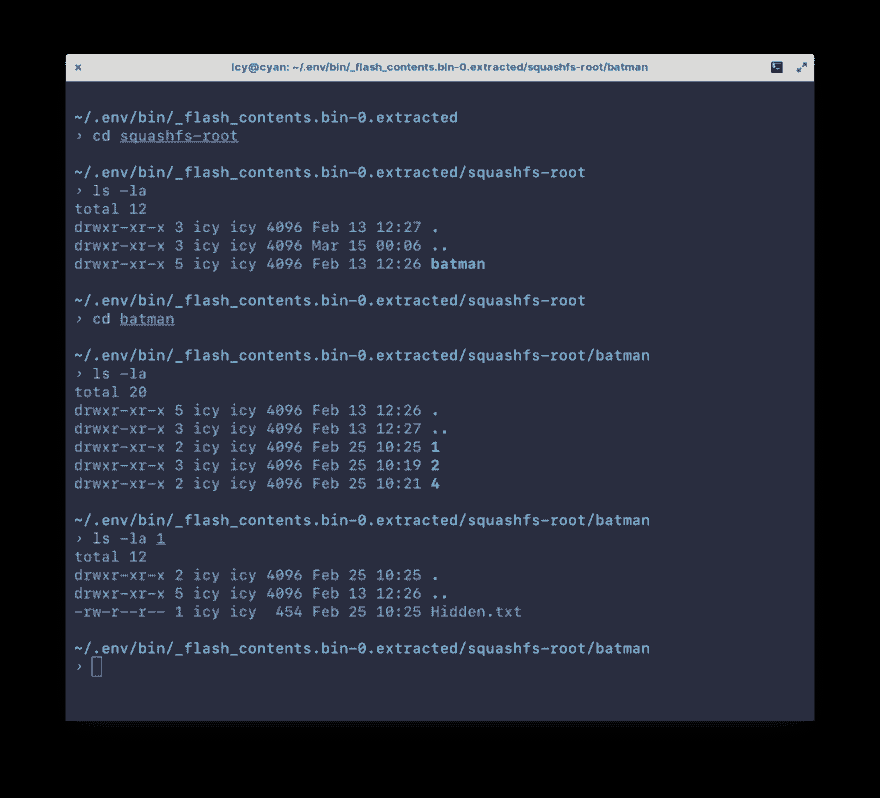](https://res.cloudinary.com/practicaldev/image/fetch/s--h3D8SBZH--/c_limit%2Cf_auto%2Cfl_progressive%2Cq_auto%2Cw_880/https://cdn-images-1.medium.com/max/1024/1%2AVsEzd8PSYMIUwjBLNFFetA.png) 

<figcaption>:O</figcaption>

</figure>

哦是的。`cat` ting 文件，我们看:

```
› cat 1/Hidden.txt

######################################### Hints :) ########################################

---telnet server on esp

--Hunt the key to get MQTT creds
          -- 
--MQTT box

--Publish the correct message to get ^FLAG^

<<<<<<<<<<<<<<<< PUBLISH..... DISPLAY.... SUBMIT.... :) >>>>>>>>>>>>>>>>>>>>>> 
```

查看名为 2 的目录，我们看到另一个 dir 3 包含一个 JPEG 图像和一个告诉我们有关隐写术的文件。

[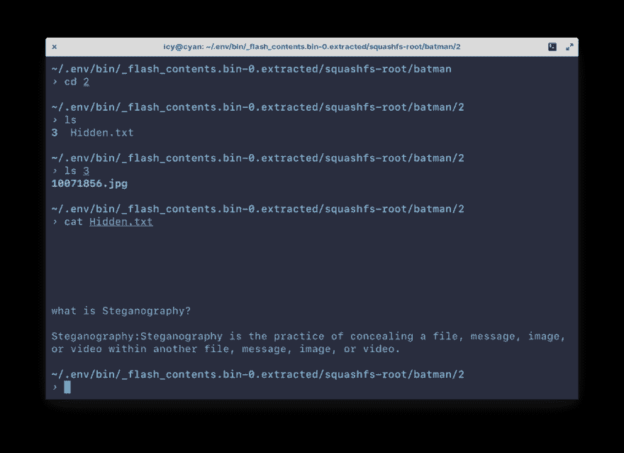](https://res.cloudinary.com/practicaldev/image/fetch/s--by9iD2IS--/c_limit%2Cf_auto%2Cfl_progressive%2Cq_auto%2Cw_880/https://cdn-images-1.medium.com/max/1024/1%2A68k1Y6IoK0XTCPTQRn_0fw.png)

最终目录 4 中除了一个带有字符串标志的文件之外什么也没有。可能会在闪存转储的字符串输出中显示为误报。

### 连接到“设备-6”

我们遇到的第一个文件，包含提示，提到了在板上运行的 telnet 服务器。但是我们如何达到它呢？是的，通过它暴露的无线热点——“设备 6”。我们用之前找到的 PSK 验证了身份。

这样做时，我们会看到一个强制网络门户提示:

[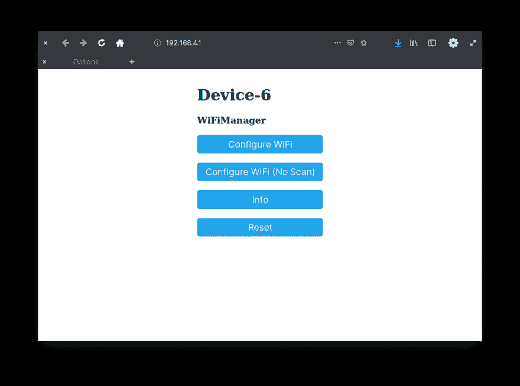](https://res.cloudinary.com/practicaldev/image/fetch/s--yp3d2KV3--/c_limit%2Cf_auto%2Cfl_progressive%2Cq_auto%2Cw_880/https://cdn-images-1.medium.com/max/1024/1%2AXelmAgITUw-9aZc26meUDQ.png)

在这里可以做一些事情，在板上配置 WiFi，查看关于板的一些信息，并重置它。让我们将 ESP 连接到我们自己的 SSID，就像移动热点一样。

[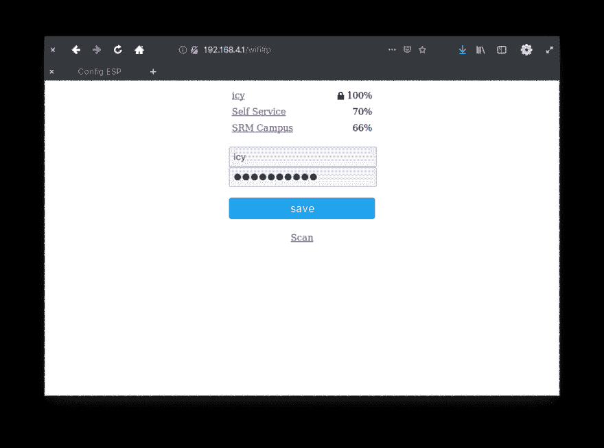](https://res.cloudinary.com/practicaldev/image/fetch/s--Gu6-JSQF--/c_limit%2Cf_auto%2Cfl_progressive%2Cq_auto%2Cw_880/https://cdn-images-1.medium.com/max/1024/1%2AoQcTNKOFGphPbX50K2pmlg.png)

完成后，我们应该会看到“Device-6”SSID 消失，表明该板现在已连接到我们自己的无线热点。我们注意到的另一件事是，板亮了，我们的显示器也亮了！

<figure>[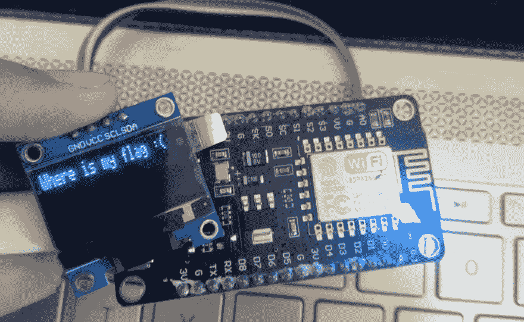](https://res.cloudinary.com/practicaldev/image/fetch/s--AuUWmX90--/c_limit%2Cf_auto%2Cfl_progressive%2Cq_auto%2Cw_880/https://cdn-images-1.medium.com/max/1024/1%2AlzKOxEkzJqo8TNI4WckmOg.png) 

<figcaption>真是太悲哀了。亚历克莎扮演德帕西托。</figcaption>

</figure>

### telnet 服务器

一旦我们的主机和 ESP 在同一个网络上，我们就可以`nmap`我们的子网来找到我们的 ESP 的 IP。

<figure>[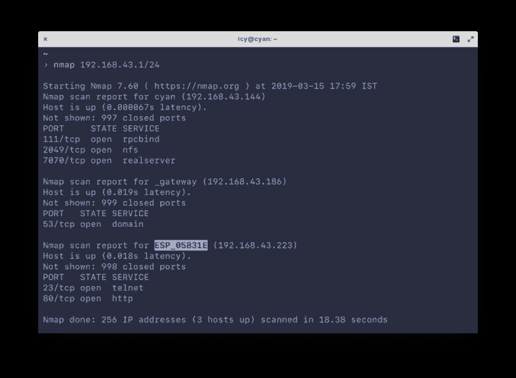](https://res.cloudinary.com/practicaldev/image/fetch/s--WgfQvLdL--/c_limit%2Cf_auto%2Cfl_progressive%2Cq_auto%2Cw_880/https://cdn-images-1.medium.com/max/1024/1%2AlPNqoIFmNfxfabdt4sqYSQ.png) 

<figcaption>nmap 扫描报告</figcaption>

</figure>

我们看到一个 http 服务器正在运行，这显然是强制网络门户，我们的 telnet 服务器在端口 23 上。

```
› telnet 192.168.43.223
Trying 192.168.43.223...
Connected to 192.168.43.223.
Escape character is '^]'.
Press Enter & sumbit your key :)
somekey
Wrong Key!!! 
```

在连接时，我们看到一个要求输入密钥的提示。不，“sumbit”是这样拼写的；)

这把钥匙可能在哪里？到目前为止，这个 CTF 唯一未被探索的部分是我们之前遇到的图像文件。所以…隐写术。

虽然你不会需要它，但我下载了这个破解 stego 的 Docker 镜像— [stego-toolkit](https://hub.docker.com/r/dominicbreuker/stego-toolkit/) 。然后，我们将该图像置于一系列隐写术检测和破解工具之下，但无济于事。

过了好一会儿`steghide`给了我们一些东西:

```
› steghide extract -sf 10071856.jpg            
Enter passphrase: 
```

我们花了很长时间才弄明白，但密码是图像文件本身的名称。呃。输入密码后，我们得到一个 keys.txt 文件。下面是它的样子:

```
So you guessed the password i think...

Nice!!!

Key is somewhere hidden in this strings ...

XH}<
TJJ\*
Y#pU
<g?/N
gr[i}5
>+h1
...snip...
jlW8B
yjbm
M4%'
tx;ZzL
3 k]
wPUf'rc
)Pz#
0AwN\
Lgr:J2
!H9u
4bSVy
(\*-C
nOf2E\

Aaaaaand key is not guessable ....

WARNING:Manual checking for correct key might take you 2 days to complete the challange!! 
```

将近 600 行的胡言乱语。我们猜测其中一个字符串一定是我们 telnet 会话的密钥。我们试图使它自动化，但是 telnet 会话非常不稳定。所以作为疯子，我们手动操作。我们有的是时间。我们开始复制/粘贴 5 个一批的密钥…并且成功了。

<figure>[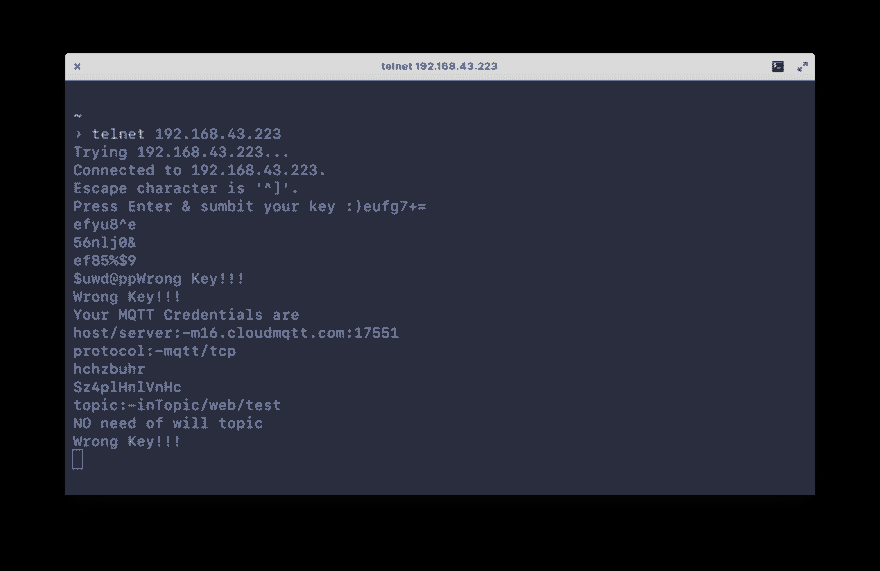](https://res.cloudinary.com/practicaldev/image/fetch/s--vOet8lnx--/c_limit%2Cf_auto%2Cfl_progressive%2Cq_auto%2Cw_880/https://cdn-images-1.medium.com/max/1024/1%2AvY84DrSpJU1H4c9pSvoB5Q.png) 

<figcaption>yeet</figcaption>

</figure>

正如提示文件提到的，我们必须连接到某个地方的 MQTT 实例，并为标志发布一些东西。这就是他们所说的。

对于那些局外人来说， [MQTT](https://en.wikipedia.org/wiki/MQTT) 是在基于物联网的客户端-服务器交互中使用的协议。如果你想理解接下来的部分，就去读一下吧。

### 夺取旗帜

为了与 MQTT 服务器交互，我们将使用 [Mosquitto](https://mosquitto.org) 客户端。然后，我们使用凭证并尝试“发布”一条消息:

```
› mosquitto_pub -h 'm16.cloudmqtt.com' -p 17551 -t 'inTopic/web/test' -u 'hchzbuhr' -P 'Sz4plHnlVnHc' -m '(^.^)' 
```

<figure>[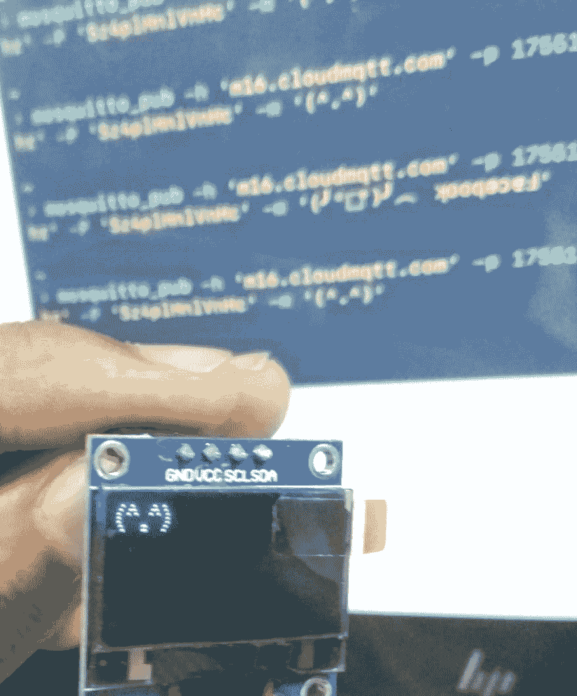](https://res.cloudinary.com/practicaldev/image/fetch/s--9Qy66SSw--/c_limit%2Cf_auto%2Cfl_progressive%2Cq_auto%2Cw_880/https://cdn-images-1.medium.com/max/1024/1%2AW_iVf3vDf4UaelycMbvPvw.png) 

<figcaption>UwU</figcaption>

</figure>

折腾了一段时间后(从后面的屏幕可以明显看出)，我们尝试发送字符串“flag”作为我们的消息，然后……*戏剧性的停顿*我们得到了您所期望的。

<figure>[](https://res.cloudinary.com/practicaldev/image/fetch/s--N6Bq8udt--/c_limit%2Cf_auto%2Cfl_progressive%2Cq_auto%2Cw_880/https://cdn-images-1.medium.com/max/1024/1%2AsO9vDtGgGjejxklF46gTlg.jpeg) 

<figcaption>我们晚了 10 天，请注意</figcaption>

</figure>

### 结论

这是我们第一次玩硬件 CTF，老实说，并没有涉及太多“黑客”的内容——至少按照这个词的教科书定义是这样的。也有很多猜测，这使得它的某些部分难以理解。但总的来说，这可能是我玩过的最有趣的 CTF。这里有一个为 SL7 的人们大声喊出来的口号，他们制作了这个 CTF *和*让我们保留 ESP:)

就是这样。结束了。

*附:非常感谢 Raghav(信息如下)帮我解决了这个 CTF*

> 我是 Raghav，计算机系本科生，专注于硬件安全。我在网上用“沃洛格”这个名字。

#### 链接

*   [GitHub](https://github.com/vologue)
*   [LinkedIn](https://www.linkedin.com/in/raghav-pillai-3a486a12b)
*   [推特](https://twitter.com/raghav_va)

> 我是 Anirudh，也是计算机科学本科生，主要研究攻击性安全和数字取证。我在网上用“icyphox”这个名字。

#### 链接

*   [GitHub](https://github.com/icyphox)
*   [网站](https://icyphox.sh)
*   [推特](https://twitter.com/icyphox)

随时给我发邮件 [icyph0x@pm.me](//mailto:icyph0x@pm.me) 。

* * *