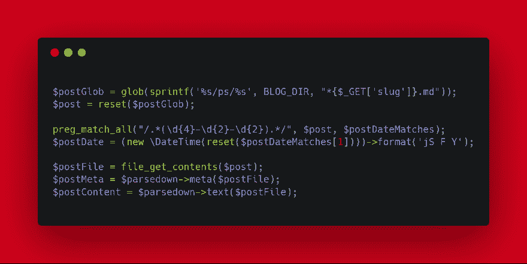

# 打破规则以保持编程的乐趣和实验性

> 原文：<https://dev.to/pretzelhands/breaking-the-rules-to-keep-programming-fun-and-experimental-1982>

<small>Ashim D ' Silva 在 Unsplash 上拍摄的照片</small>

> 这篇文章最初发表在我的个人博客上。

你可能有工作流程。编写代码的风格指南。验证每项功能的单元测试和集成测试。项目中建立的最佳实践超过了数千年的提交历史。你的公司和整个编程社区建立的神圣规则。对于一个潜在的成千上万用户使用的产品来说，遵循这些规则非常重要。

但是有时候，在你的个人项目中，你应该试着把规则扔出窗外。把它们扔出去玩吧！我的博客背后的代码[就是这样一个例子。它是用 PHP 编写的，没有任何框架。这是一个松散的 PHP 文件的松散集合，用一堆重写规则将它结合在一起。它基本上就像一个非抛光版的哲基尔。](https://pretzelhands.com)

下面是使用`tree`
的文件夹结构

```
blog
├── bootstrap.php
├── composer.json
├── composer.lock
├── lib
│   └── Post.php
├── ps
│   ├── 2019-01-02-coloring-terminal-text.md
│   ├── 2019-01-03-non-obvious-behaviors.md
│   ├── 2019-01-04-command-line-flags.md
│   ├── 2019-01-05-bringing-your-entire-infrastructure-down.md
│   ├── 2019-01-07-jinx.md
│   ├── 2019-01-09-how-i-got-into-freelancing.md
│   ├── 2019-01-12-mentoring-junior-team-members.md
│   ├── 2019-01-14-building-responsive-email-with-mjml.md
│   └── 2019-01-15-breaking-the-rules.md
├── public
│   ├── assets/ (images etc.)
│   ├── blog.php
│   └── index.php
├── vendor/ (dependencies)
└── views
    ├── base.mustache
    ├── blog.mustache
    ├── listing.mustache
    └── partials
        ├── about-me.mustache
        ├── description.mustache
        ├── header.mustache
        ├── newsletter-form.mustache
        └── title.mustache 
```

Enter fullscreen mode Exit fullscreen mode

被暴露的是`public`文件夹。`ps`文件夹包含了我用 frontmatter 在 Markdown 写的所有帖子。`lib`文件夹保存了负责加载帖子的类。

在内部，像`https://pretzelhands.com/posts/jinx`这样的 URL 被重写为`https://pretzelhands.com/blog .php?slug=jinx`。然后，我搜索文件，根据弹头匹配正确的文件。我从标题中解析发布日期。所有这些都发生在课后。在此之前，代码是直接在 blog.php 随着一些讨厌的混合 HTML。

这是它看起来的样子

[](https://res.cloudinary.com/practicaldev/image/fetch/s--YzlHwpjm--/c_limit%2Cf_auto%2Cfl_progressive%2Cq_auto%2Cw_880/https://pretzelhands.com/assets/posts/rules-01.png)

是不是很丑的代码？难以置信的是。写作有趣吗？你打赌！在回去工作之前，整个博客系统会在周日的一两个小时内运行。我不想让它变得漂亮，我只想把它拿出来。每当一些代码变得难以忍受时，就会发生一些选择性的重构。

我喜欢在这上面做黑客。我装上一些代码，上传到我的服务器上，然后就收工了。有一些全局失控，有代码重复，有各种各样的东西，我会在代码审查期间被吼。但是没有人会看到我的小博客的代码，所以我完全同意这样做。这是我自己凌乱的小操场。我不断添加，看看有什么坚持。

所以，如果你正在做一个你自己的小项目，而这个项目并不打算成为下一个大项目，为什么不全力以赴地写代码，就好像你在给墙壁上色一样？我告诉你，这非常有疗效！

这里有一个来自一个没有见天日的项目的例子

```
require_once('../../server/bootstrap.php');

use Respect\Validation\Validator;
use Carbon\Carbon;

$database = getDatabaseConnection();
$emailValidator = Validator::email();

if (!isset($request->email) || !$emailValidator->validate($request->email)) {
    sendResponse([
        'error' => true,
        'errors' => [
            'Please provide a valid email for logging in.'
        ],
        'errorFields' => [
            'email'
        ]
    ], 400);
} 
```

Enter fullscreen mode Exit fullscreen mode

这些都没有标准化。`sendResponse`函数是一个小包装器，它只发送几个头，将数组序列化成 JSON，然后全部回显。`$request`不过是被`json_decode`包裹的`STDIN` PHP 提供的，丑中有美。

## 免责声明

这并不意味着我认为你应该像抽象艺术家一样编写产品代码，而忽略工作中的所有规则和惯例。这些惯例背后通常有很好的理由。但是我觉得如果你是为了自己的乐趣而编程，那么更有创造性和实验性会有所帮助。摆脱僵化的结构。谁知道呢，也许你找到了自己真正喜欢的东西，可以提炼提高。

所以不要到处告诉别人理查德允许你写意大利面条代码。😁

尽情享受吧！~