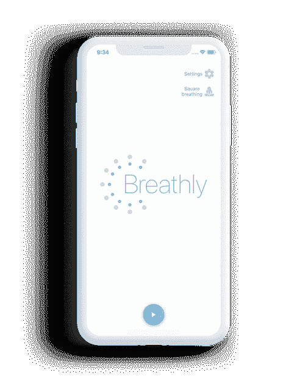
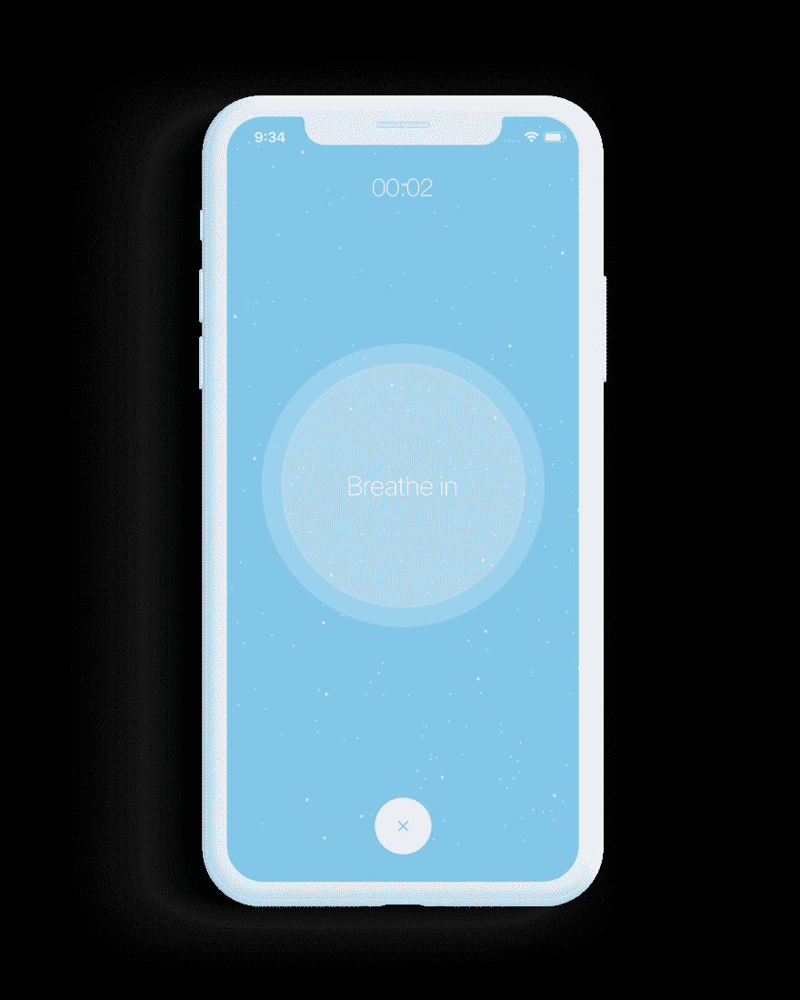

# Breathly 用 React-Native 构建的开源呼吸训练应用程序

> 原文：<https://dev.to/mmazzarolo/breathly--open-source-breathing-training-app-built-with-react-native-i1k>

我刚刚发布了 **Breathly** :一个用 React-Native 构建的开源呼吸训练 app。

##  [ mmazzarolo ](https://github.com/mmazzarolo) / [屏息-app](https://github.com/mmazzarolo/breathly-app)

### 一款用 React-Native 打造的呼吸训练 app

<article class="markdown-body entry-content container-lg" itemprop="text">

# 屏息 

 

Breathly 是一个开源的 React-Native 移动应用程序，允许你专注于你的呼吸，你可以使用 Breathly 进行日常放松和呼吸训练:只需选择一种呼吸技术，并专注于指导练习。

 

 

[屏息 App 登陆页面](https://breathly.app)

## 概观

在这个库中，你会找到 Breathly mobile 应用程序的源代码。

Breathly 是我在 2018 年的空闲时间开发的一个小型 React-Native 应用程序，用于玩 React-Native `Animated` API。随着 React-Native 的钩子支持的到来，我决定重新开始，用钩子重写它，并在 Play Store 和 App Store 中发布。

希望源码对某人有用。

<g-emoji class="g-emoji" alias="point_right" fallback-src="https://github.githubassets.cimg/icons/emoji/unicode/1f449.png">👉</g-emoji> **查看 [DEVLOG](https://raw.githubusercontent.com/mmazzarolo/breathly-app/master/./DEVLOG.md) 获取更多关于应用架构和一些开发亮点的信息和细节。**

### 功能/堆栈

*   react-本机和类型脚本
*   反应钩
*   所有的`Animated`动画都在使用…

</article>

[View on GitHub](https://github.com/mmazzarolo/breathly-app)

热烈欢迎任何形式的讨论或反馈！