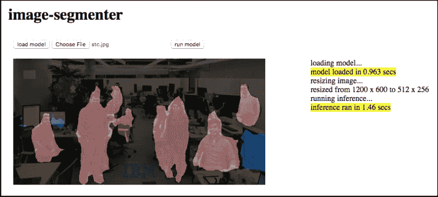

# 使用 TensorFlow.js 将机器学习引入浏览器—第三部分

> 原文：<https://dev.to/vabarbosa/bring-machine-learning-to-the-browser-with-tensorflowjspart-iii-313>

> *从[medium.com](https://medium.com/ibm-watson-data-lab/bring-machine-learning-to-the-browser-with-tensorflow-js-part-iii-62d2b09b10a3)T3】传中*
> 
> ***编辑于 2019 年 3 月 11 日**包含 TensorFlow.js 1.0 中引入的变更。关于 TensorFlow.js 1.0 更新的更多信息可以在[这里](https://gist.github.com/caisq/3fc0beb6597f42d66be806c6692f310d)找到。*

#### 如何从网络友好格式转向网络应用

<figure>

<figcaption>[设计生态学家](https://unsplash.com/@designecologist?utm_source=medium&utm_medium=referral)关于</figcaption>

</figure>

欢迎来到系列文章的第三部分，我将带您了解 TensorFlow.js 如何将机器学习引入浏览器。首先，概述了如何[将预先训练好的模型引入浏览器应用](https://dev.to/vabarbosa/bring-machine-learning-to-the-browser-with-tensorflowjspart-i-4f4m-temp-slug-2078470)。然后你会发现更多关于如何[将你预先训练好的模型转换成网页友好格式的细节](https://dev.to/vabarbosa/bring-machine-learning-to-the-browser-with-tensorflowjspart-ii-1h6p-temp-slug-4911024)。现在，在这篇文章中，我们将逐步介绍在 web 应用程序中使用 web 友好模型。

我们继续使用本系列第二部分的[中转换的](https://dev.to/vabarbosa/bring-machine-learning-to-the-browser-with-tensorflowjspart-ii-1h6p-temp-slug-4911024)[模型资产交易所(MAX)](https://developer.ibm.com/code/exchanges/models/) 的[图像分割器](https://github.com/IBM/MAX-Image-Segmenter)。这里的目标是让您更好地理解 TensorFlow.js 以及如何利用我们制作的模型。我们将创建一个基本的 web 应用程序，没有太多的样式或额外的库。为了避免这篇文章太长，并将重点放在 TensorFlow.js 上，我们将跳过 HTML 和非 TensorFlow.js 特定的 JavaScript 代码。但是你可以在 GitHub 上查看完整的应用程序。

<figure> 

<figcaption>图像分割器应用输出</figcaption>

</figure>

### 导入模型

将模型导入浏览器可读格式的第一步是通过 script 标记将 TensorFlow.js 库包含在 HTML 中。