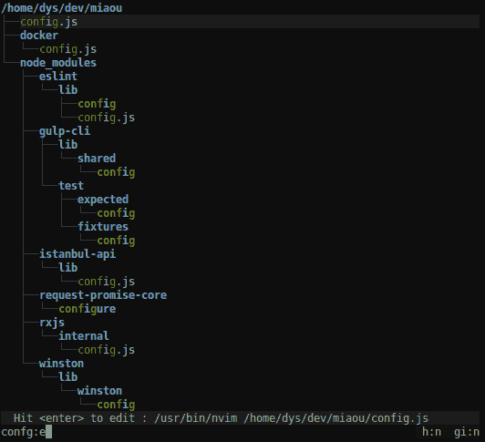
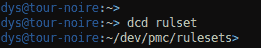
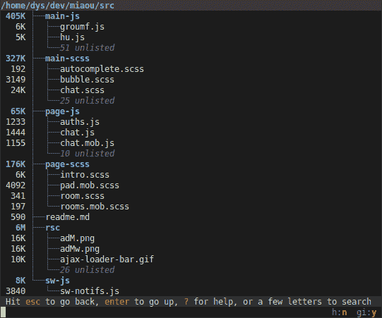
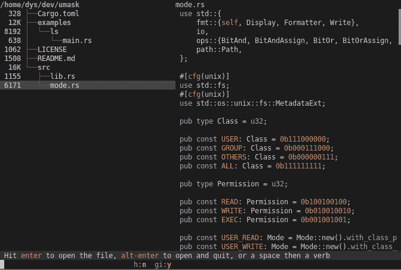

# 浏览目录的新方法

> 原文：<https://dev.to/dystroy/broot-a-new-way-to-browse-directories-779>

我一直喜欢从树状视图中看到的概览。但是`tree`几乎从不可用，因为它通常会生成数页(或数百页)的输出。

也不能交互式搜索，当然也不能充当启动器。

`tree`是反思的起点之一。`fzf`又是一个，我再也离不开模糊搜索了。

因此，我做了一个我一直在使用的[brout](https://github.com/Canop/broot)，它让我只需敲几下键盘就能进入任何目录或文件，比其他任何目录或文件都要快。

现在，它已经为大众消费做好了准备，但我仍然渴望得到反馈。

**brout**可以通过命令启动，这允许非交互式快捷方式，例如:

如果有 rust 专家在场，我很乐意讨论代码，尤其是任何微优化的想法(开发这样的程序完全是为了速度)。

## [【CANopen】](https://github.com/Canop)/[【brookt】](https://github.com/Canop/broot)

### 查看和导航目录树的新方法:https://dystroy.org/broot

<article class="markdown-body entry-content container-lg" itemprop="text">

# 根

[T11】](https://miaou.dystroy.org/3490?broot)

导航目录的更好方法

[安装螺钉](https://dystroy.org/broot/install/)

# 获得一个目录的概览，即使是一个大目录

`br -s`

注意到未列出的了吗？

这使得它在旧的`tree`命令会产生多页输出的情况下也是可用的。

对文件进行适当的处理，将不需要的文件放在一边(不过你可以忽略它们，参见[文档](https://raw.githubusercontent.com/Canop/broot/master/../navigation/#toggles))。

# 预览文件

选择文件并出现预览面板时，点击`ctrl` `→`。

预览面板与树面板中的选择保持同步。

# 找到一个目录然后`cd`到它

打几封信

点击`alt` `enter`就大功告成了。

这样，即使您不记得目录在哪里，也可以用最少的击键次数导航到该目录。

broot 很快，不会阻塞(任何击键都会中断当前搜索以开始下一个搜索)。

对此最有用的键:

*   …

</article>

[View on GitHub](https://github.com/Canop/broot)