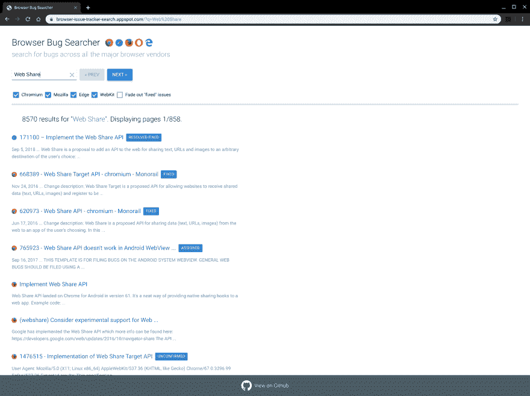

# 浏览器漏洞搜索器

> 原文：<https://dev.to/chromiumdev/browser-bug-searcher-5el3>

我只是在反思我们团队已经完成的一些[工作](https://twitter.com/ChromiumDev)，我发现了罗伯特·尼曼和埃里克·比德尔曼在 2017 年创建的一个项目。[浏览器漏洞搜索器！](https://browser-issue-tracker-search.appspot.com/?q=Web%20Share)。

令人难以置信的是，只需按几个键，你就可以在所有主要的浏览器引擎中浏览你最喜欢的功能。

[源代码可用](https://github.com/GoogleChrome/browser-bug-search)。

这实际上突出了我对 crbug 和 webkit bug 追踪器的一个问题，他们没有一个简单的方法来获取像 RSS 这样格式的数据。我很希望能够使用我的 [topicdeck](https://github.com/PaulKinlan/topicdeck) 聚合器和 bug 类别等，这样我就有了一个基于每个 bug 追踪器的最新信息的所有我感兴趣的东西的仪表板。