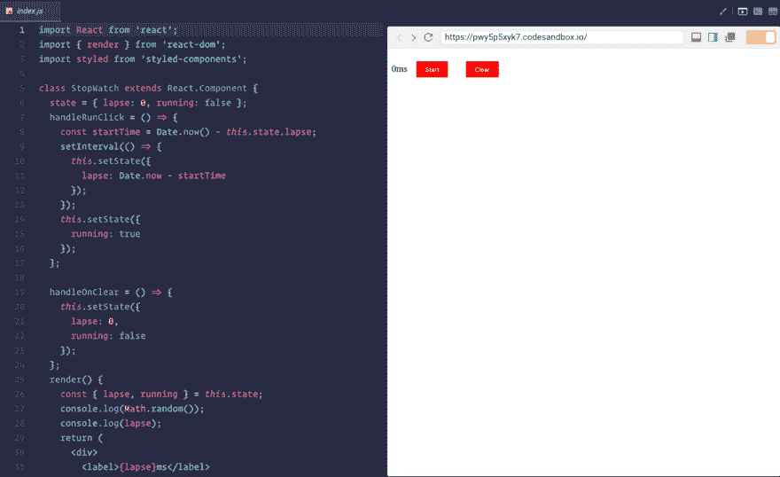
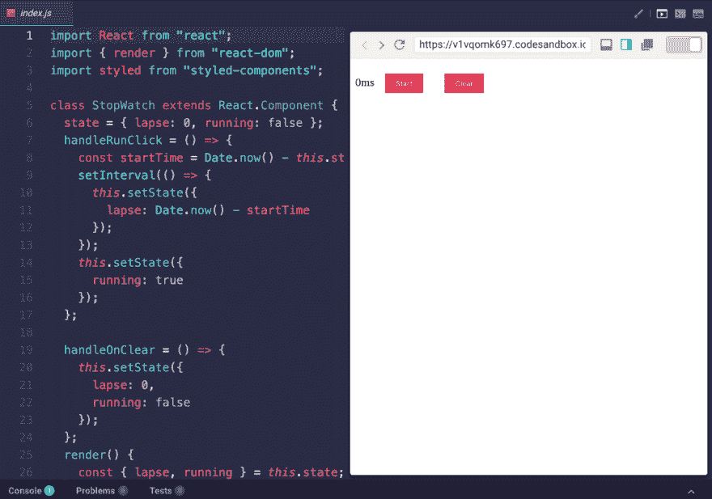
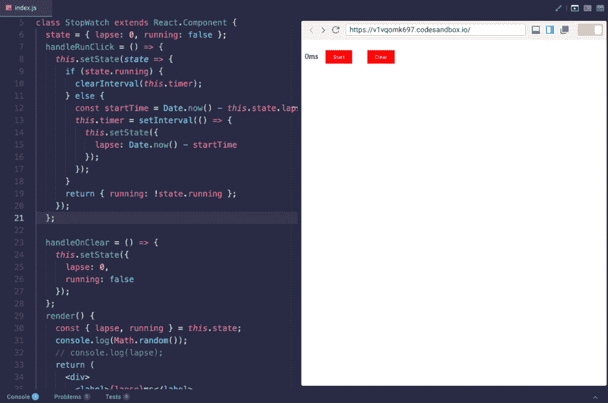
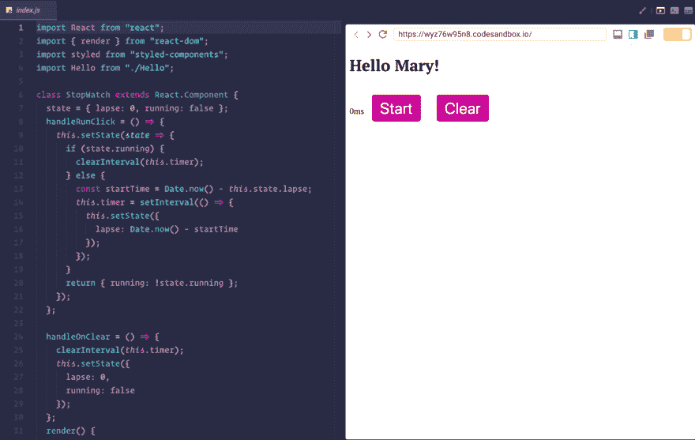

# Bugfix:在别人的代码中挖洞

> 原文：<https://dev.to/tiffany/bugfix-spelunking-in-someone-elses-code-495k>

本文最初发表在[我的博客](https://tiffanywhite.tech/bugfix-spelunking-in-code/)上。

我喜欢代码沙盒。它几乎已经取代了 CodePen，除非我在摆弄 CSS 或 freeCodeCamp 前端项目。

我喜欢浏览沙盒，挑选出不同的沙盒来查看、分解，并弄清楚它们是如何工作的。

当我在 [Egghead.io](https://egghead.io) 上浏览[Kent c . Dodds](https://egghead.io/courses/the-beginner-s-guide-to-react)为初学者编写的 React 教程时，我决定寻找与该课程相关的沙盒，因为我正在使用 Codesandbox 来构建我们在该课程中构建的秒表。

我找到了一个沙箱，我用叉子叉了一下，发现有问题。

为什么秒表不走了？看了几秒钟代码，我马上发现了一些明显的问题。

下面是秒表坏掉的一个例子:

[](https://res.cloudinary.com/practicaldev/image/fetch/s--KBXwq7F9--/c_limit%2Cf_auto%2Cfl_progressive%2Cq_66%2Cw_880/https://cl.ly/89f29a329f05/Screen%25252520Recording%252525202018-12-21%25252520at%2525252002.34%25252520AM.gif)

## 修正了 1 个错误

我首先注意到的是第 7 行:

```
class StopWatch extends React.Component {
  state = { lapse: 0, running: false };
  handleRunClick = () => {
    const startTime = Date.now() - this.state.lapse;
    setInterval(() => {
      this.setState({
        lapse: Date.now - startTime
      });
    });
    this.setState({
      running: true
    });
  }; 
```

Enter fullscreen mode Exit fullscreen mode

`Date.now()`需要括号。`Date`是一个对象构造函数，`.now()`是一个方法。当我们点击开始按钮时，React 不知道在这里做什么；我们没有将`lapse`的状态设置为我们所期望的数字。通过添加括号，我们可以让开始按钮工作。不再有`NaNms`。

但是现在我们又有了一个问题:*计时器不会停止*。

[](https://res.cloudinary.com/practicaldev/image/fetch/s--_OY8A3o---/c_limit%2Cf_auto%2Cfl_progressive%2Cq_66%2Cw_880/https://cl.ly/472b7aa2e4d9/Screen%25252520Recording%252525202019-01-04%25252520at%2525252001.57%25252520PM.gif)

我也删除了`console.log(Math.random());`，因为我觉得它是不需要的。

## 错误修正 2:让秒表停止并清零

每次点击按钮时，我们将状态设置为`running`或`lapse`。当我们点击`start`时，计时器开始计时，但点击`stop`或`clear`似乎不起作用。我们如何解决这个问题？

我们可以创建一个接受当前状态的定时器更新函数。我们可以通过使用诸如`setInterval()`和`clearInterval()`这样的原生 DOM APIs 来实现这一点。我们可以运行条件逻辑来查看计时器是否正在运行:

```
//updater function
this.setState(state => {
  if (state.running) {
    clearInterval(this.timer);
  } else {
    const startTime = Date.now() - this.state.lapse;
    this.timer = setInterval(() => {
      this.setState({
        lapse: Date.now() - startTime
      });
    });
  } 
```

Enter fullscreen mode Exit fullscreen mode

并使用`Date.now()`获得以毫秒为单位的时间戳，为其分配一个`startTime`变量，以比较当前时间和已经过去的时间。当我们点击开始按钮时，它会将`startTime`设置为当前的时间戳。我们还需要返回一个新的状态，因为状态是*而不是*可变的..

```
class StopWatch extends React.Component {
  state = { lapse: 0, running: false };
  handleRunClick = () => {
    //updater function
    this.setState(state => {
      if (state.running) {
        clearInterval(this.timer);
      } else {
        const startTime = Date.now() - this.state.lapse;
        this.timer = setInterval(() => {
          this.setState({
            lapse: Date.now() - startTime
          });
        });
      }
      // returning a new state to not mutate our original state
      return { running: !state.running };
    });
  }; 
```

Enter fullscreen mode Exit fullscreen mode

好的，所以这个*部分地*起作用。但是正如你在下面看到的，如果我在秒表计时器运行时点击`clear`，它*不会*清除计时器，它也不允许我*停止*计时器。

[](https://res.cloudinary.com/practicaldev/image/fetch/s--Cg-Kgj5n--/c_limit%2Cf_auto%2Cfl_progressive%2Cq_66%2Cw_880/https://cl.ly/64d34da82d2d/Screen%25252520Recording%252525202019-01-04%25252520at%2525252004.50%25252520PM.gif)

我们如何修复这个特殊的错误？

如果我们回头看前面的代码，我们可以看到我们正在使用`clearInterval()`来重置秒表计时器。在我们当前的迭代中，我们的`handleOnClear`方法只是*设置*状态，而*不清除*之前的状态。

```
handleOnClear = () => {
  this.setState({
    lapse: 0,
    running: false
  });
}; 
```

Enter fullscreen mode Exit fullscreen mode

我们可以通过添加`clearInterval()`并向`handleOnClear`方法传递计时器函数来清除状态，从而解决这个问题。

```
handleOnClear = () => {
  clearInterval(this.timer);
  this.setState({
    lapse: 0,
    running: false
  });
}; 
```

Enter fullscreen mode Exit fullscreen mode

这会给我们想要的结果。

[](https://res.cloudinary.com/practicaldev/image/fetch/s--My8PMjtm--/c_limit%2Cf_auto%2Cfl_progressive%2Cq_66%2Cw_880/https://cl.ly/77ecb442e8bb/Screen%25252520Recording%252525202018-12-21%25252520at%2525252002.35%25252520AM.gif)

## 潜在问题？

在这个特定的迭代中有一个内存泄漏。计时器将一直运行，直到它在 DOM 中被*显式*停止。我们可以使用一个 [React 生命周期方法](https://reactjs.org/docs/state-and-lifecycle.html#adding-lifecycle-methods-to-a-class)在组件被挂载或卸载时停止 DOM 中的所有进程。

为此，我们可以使用`componentWillUnmount`告诉 React 在渲染完成后卸载组件。

```
componentWillUnmount() {
  clearInterval(this.timer);
} 
```

Enter fullscreen mode Exit fullscreen mode

## 思想和结论

我发现修复别人的*bug 比修复自己的*bug 更令人愉快。这是一个有趣的练习，我计划更经常地做，并把它写在博客上。

这个秒表是一个愚蠢的简单组件，但如果你像我一样只是了解 React 的表面，我确信钻研这个秒表并弄清楚它是如何工作的是一个很好的练习和对时间的利用。

[https://codesandbox.io/embed/wyz76w95n8](https://codesandbox.io/embed/wyz76w95n8)

* * *

### 报名简讯。没有垃圾邮件。我也讨厌那样。

[https://buttondown.email/tiffanywhite](https://buttondown.email/tiffanywhite)