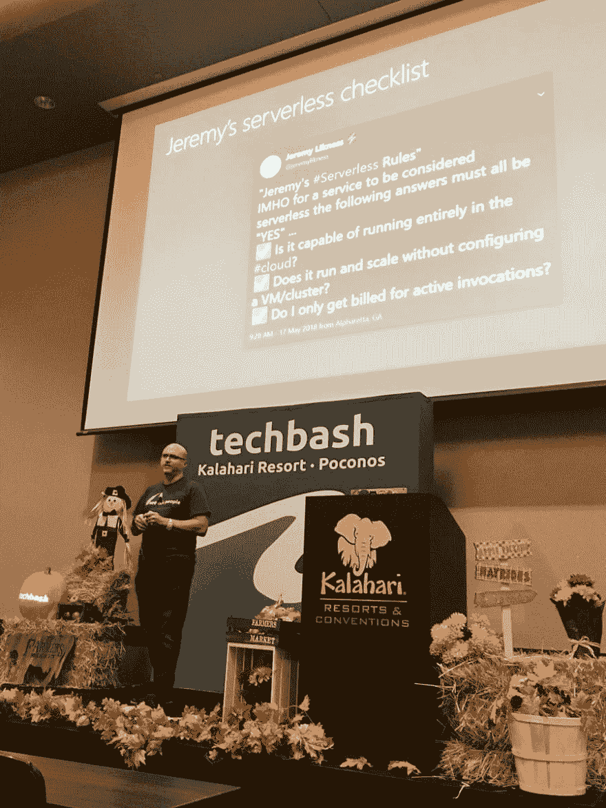
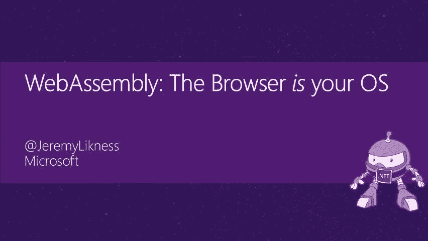
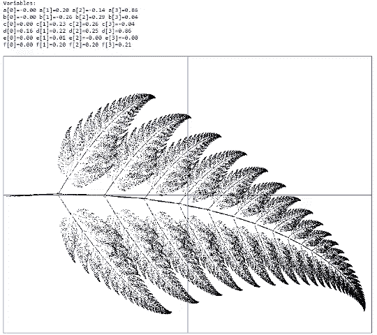
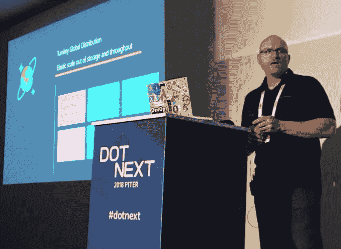

# 建立一个💣炸弹挖掘技术演示(🎤麦克风下降可选)

> 原文：<https://dev.to/azure/build-a-bomb-diggity-technical-presentation-mic-drop-optional-1fhb>

我花了十年时间做技术报告，在此期间我学到了一些东西。这个系列的目的是与你分享这些经验。这些不是让你成为顶级演讲者的最佳实践或秘密提示，而是基于个人经验的实用建议。

在这个系列中:

*   [为什么说话？](https://dev.to/azure/a-guide-for-everyone-who-wants-to-give-technical-presentations-53bo)
*   [在哪里说话？](https://dev.to/azure/how-to-choose-where-to-give-your-technical-presentation-5g14)
*   [谈话格式](https://dev.to/azure/the-many-flavors-of-technical-presentations-3fjj)
*   [征集演示文稿](https://dev.to/azure/the-amazing-secret-to-crafting-conference-submissions-that-don-t-suck-hgf)
*   构建您的演示文稿(您在这里)
*   [练习和反馈](https://dev.to/azure/how-to-practice-for-a-lit-presentation-51n9)
*   [准备出行](https://dev.to/azure/what-s-in-the-bag-packing-tips-for-technical-presentations-4k6n)
*   [你演讲的那天](https://dev.to/azure/it-s-time-to-talk-the-day-of-your-presentation-2kpl)
*   [演讲和总结后](https://dev.to/azure/after-your-talk-the-power-of-leverage-2enj)

# 👉🏻构建您的演示文稿

你收到了✅的录取通知书，现在是时候开工了🏗！你如何进行演讲取决于许多因素，包括[演讲形式](https://dev.to/azure/the-many-flavors-of-technical-presentations-3fjj)。我总是从[摘要和标题](https://dev.to/azure/the-amazing-secret-to-crafting-conference-submissions-that-don-t-suck-hgf)开始。我的承诺是什么？我在会议提交材料中描述的关键要点是什么？我对成功的定义是什么？显然，我想让观众接受价值。这通常是通过结合讲故事和展示来完成的(也称为“演示”)。让我们来分析一下。

## 故事

每个演示都有一个故事。你可以控制剧情的可预测性。涵盖所有最新 JavaScript 语言特性的演示可能只是简单地列出一些要分享的项目。“这是第一个功能:它做什么，看起来像什么，如何以及何时使用，以及下一个功能。”然而，一个更引人注目的故事将包含一些非常具体的元素。

<figure>

[](https://res.cloudinary.com/practicaldev/image/fetch/s--zGiJCeSF--/c_limit%2Cf_auto%2Cfl_progressive%2Cq_auto%2Cw_880/https://thepracticaldev.s3.amazonaws.com/i/7kih38z9h4lpuk3byx73.jpg)

<figcaption>I wonder what stories lie ahead?</figcaption>

</figure>

幸运的是，有大量的知识围绕着什么是好故事。那么，怎样才算是好故事呢？你会发现不同的公式，但我喜欢让事情变得简单，专注于三个的[次方。以下是我关注的三个部分:](https://medium.com/that-conference/raise-your-signal-to-noise-ratio-333ebc8ec49d#36d6)

1.  一个*惊人的，令人兴奋的介绍*快速地抓住兴趣。想想你最喜欢的一些书的开头段落，以及这些段落与你想要传达的信息之间的关系。
2.  主角遭遇的一场*严重冲突*。
3.  一个现实但令人惊讶的解决方案最终解决了问题，通常会有意想不到的转折。

> ⭐ **提示**如果你真的想在演示方面做得更好，你可以看看一些非技术性的地方。专注于更好地讲故事的书籍是一个好的开始。销售也是与你的观众联系起来，讲述一个好故事，碰巧一些好的销售书籍也可以帮助你改善你的演示。把它当成“推销你的想法”花点时间看看那些能帮助你提高软技能的非技术性书籍。

为了说明，我举两个例子。

我做的一个演示一直受到好评，是关于[无服务器技术](https://blog.jeremylikness.com/enterprise-serverless-acc826616d4c?utm_medium=blog&utm_campaign=devto&utm_source=jeliknes)。

> Anthony Chu@ nthonychu学习所有关于 [#serverless](https://twitter.com/hashtag/serverless) 计算从[@ jeremylikness](https://twitter.com/jeremylikness)at[@ tech bash](https://twitter.com/techbash)20:21PM-018 年 10 月 03 日[](https://twitter.com/intent/tweet?in_reply_to=1047582372785532929)

首先，我简要介绍了无服务器的概念，然后直接进入演示，展示当我针对 API 运行负载测试时，服务器是如何自动伸缩的。这产生了最初的反应，并提供了一些“惊喜因素”

这种冲突是构建、托管、维护和扩展 web 应用程序的难度和成本的结合。

我提供的解决方案是一组使用无服务器的演示和解决方案。

我发表的另一个[演讲](https://blog.jeremylikness.com/presentation-webassembly-c-and-blazor-at-codestock-2019-ab2f8636356?utm_campaign=devto&utm_medium=blog&utm_source=jeliknes)是关于一个叫做 WebAssembly 的新技术和一个建立在它之上的叫做 Blazor 的框架。

> <video loop="" controls=""><source src="https://video.twimg.com/amplify_video/1116098107811328000/vid/318x180/SU9aTl82-SLa8pVu.mp4?tag=11" type="video/mp4"></video>jeremylikness⚡️[@ jeremylikness](https://dev.to/jeremylikness)你好 [#CodeStock](https://twitter.com/hashtag/CodeStock) ！
> 
> 我希望你喜欢我关于[# web assembly](https://twitter.com/hashtag/WebAssembly)[# wasm](https://twitter.com/hashtag/Wasm)🕸和 [#Blazor](https://twitter.com/hashtag/Blazor) 的介绍并从中获得价值🔥今天早上。如果您有任何问题、反馈等，请告诉我。
> 
> 此处提供全部资料(最后一张幻灯片上的回购链接)
> [jlikme.blob.core.windows.net/presentations/…](https://t.co/DQy11jtDU9)2019 年 4 月 14:15 日下午[](https://twitter.com/intent/tweet?in_reply_to=1117068673003544577)[](https://twitter.com/intent/retweet?tweet_id=1117068673003544577)15[](https://twitter.com/intent/like?tweet_id=1117068673003544577)50

对于这个演示，我马上提出挑战:不管你是 C、Ruby、PHP、C#、Rust、Go 还是其他开发人员，如果你正在编写客户端 web 代码，你就必须使用 JavaScript 或 TypeScript。还是你？令人惊叹的是，你*可以*在 WebAsssembly 中使用你选择的语言。

该解决方案展示了使用该框架构建单页面应用程序是多么容易。

回到三的力量，我发现在构建演示文稿时关注以下几点很有帮助:

1.  对于较长的演示，将演示分成三个不同的阶段。
2.  始终思考好故事的三个关键部分(哇，冲突，解决)。
3.  记住你是*而不是*故事的主角！英雄应该永远是观众，而对手可能会阻止他们做自己的工作。

作为一个快速练习，想一个你最喜欢的演示。包括这些要素吗？如果不是，有什么不同，你能把它应用到你自己的演讲中吗？

## 试玩

一个好的技术演示的核心是演示。谈论技术是一回事，展示它的工作是另一回事。尽管制作一个展示所有最新的“酷”功能的演示可能很有诱惑力，但这是与你的故事情节联系起来的另一个机会。演示如何说明冲突及其解决方法？这是否有助于观众解决他们的问题并让他们成为英雄？

<figure>

[](https://res.cloudinary.com/practicaldev/image/fetch/s--SUmHtTNs--/c_limit%2Cf_auto%2Cfl_progressive%2Cq_66%2Cw_880/https://thepracticaldev.s3.amazonaws.com/i/a1xsnv3e0gbniipluc9n.gif)

<figcaption>A live demo can be chaos!</figcaption>

</figure>

我最常用的演示方法是首先构建演示，然后围绕这些演示创建一个叙述。这样，我就可以突出演示中特别强调的功能。在其他情况下，我将首先创建叙述，并确定什么样的演示最能支持故事情节。

### 一个大还是多个小？

演示有几种方法。在我之前提到的无服务器演讲中，我有几个独立的演示来说明无服务器堆栈的特定部分。我从头开始构建每一个，因为目标是展示从头开始并获得弹性伸缩和弹性等好处是多么容易。对于其他演示，我可能会构建一个全面的应用程序，而“演示”侧重于运行最终产品，并遍历使其成功的各种组件。

您还可以构建一个“框架”项目，通过重构来展示新技术如何改进最终产品。

### 摘录并提交

片段是你的朋友。现场编码有很多可移动的部分，因此最大限度地减少错别字以专注于主要故事情节是至关重要的。您可以将您的过程分成多个步骤，并将代码存储为片段(根据您的开发环境而有所不同)或宏，您可以执行这些宏来生成代码块。在某些情况下，我会用代码块创建一套循序渐进的指令，这样我就可以轻松地复制和粘贴了。当我复制代码进行粘贴时(我解释这是为了避免让观众看到我打字并避免打字错误)，我可以浏览笔记并确保我没有遗漏任何解释要点。

这里有另一种方法:

## [JeremyLikness](https://github.com/JeremyLikness)/[TypeScript-from-JavaScript](https://github.com/JeremyLikness/TypeScript-from-JavaScript)

### 通过对现有 JavaScript 代码的一系列重构来学习 TypeScript。

<article class="markdown-body entry-content container-lg" itemprop="text">

# 来自 JavaScript 的类型脚本

这是一个项目，您可以通过逐个提交来查看 JavaScript 代码到 TypeScript 的转换。

[@JeremyLikness](https://twitter.com/JeremyLikness)

背景说明:

*   1995 年:摩卡成为 LiveScript，10 天写成
*   1996 年:JavaScript 活了！
*   1997: ECMAScript 1 设定了标准
*   1999 年:ECMAScript 3
*   2005: jQuery“规范化 DOM”
*   2009 年:Node.js，ECMAScript 5
*   2012 年:打字稿(有很多欢乐)
*   2015 年:ECMAScript 2015(“和谐”)

## 介绍

`git checkout d65aed6`

目前，有一个小的 JavaScript“应用程序”,您可以使用命令运行它:

`node index.js`

有一些缺陷，如果您在 IDE 中浏览 JavaScript，您可能会也可能不会得到关于错误的适当提示。

## 转换为类型脚本

`git checkout 08f09e3`

JavaScript 是有效的类型脚本(有一些例外)，所以我们将从设置类型脚本开始。

`npm install --save-dev typescript`

向`package.json`文件添加两个编译脚本，用于编译和在手表上编译:

```
"scripts": {
```

…</article>

[View on GitHub](https://github.com/JeremyLikness/TypeScript-from-JavaScript)

该回购记录了每次提交，并一步一步地解释了如何实现最终结果。演示时，我可以检查单个提交，并展示代码如何随着每一步而变化。

### 现场编码

关于演讲，我从未遵循的第一条建议是:“永远不要现场编写代码。太多会出错。”虽然确实有很多可能发生的事情，但以我的经验来看，观众喜欢看到现场代码，更喜欢成为过程的一部分，而不是从成品开始。我通常会在第一次演讲前进行两到三次练习，但是如果我是现场编码，我会练习很多次。我想对材料了如指掌，这样我就可以处理任何意想不到的障碍。

> ⭐⭐:专业建议:无论如何，你都要练习你的演示，为什么不录下来呢？这有双重目的。首先，如果你遇到技术困难，你可以依靠视频。如果我在做一个依赖于网络的演示，但不确定网络连接会有多好，我会录制一个视频。当我回放时，我不使用声音，而是现场叙述，并经常开玩笑说，“我已经练习了很多次，我甚至不需要把手放在键盘上。”之后，我可以给视频加字幕，并作为资源发布到网上。

## 甲板

幻灯片是演示的重要组成部分，但你要确保它不会成为你的拐杖。我使用一个套牌来捕捉要点和插图，并提供链接和背景供观众参考。再说一次，我发现一个很好的分解演讲的方法是“三的力量”仅举几个例子:

*   对于我的 Azure Cosmos DB 演示，我将它分为三个阶段:什么是 NoSQL，什么是 Azure Cosmos DB，以及演示来说明要点。
*   对于我的**无服务器平台**演示，我首先回答这个问题:“什么是无服务器？”然后列举平台的各种组件，最后将它们联系在一起。
*   对于我的 **Blazor** 演示，我从解释 WebAssembly 的背景开始，进入 Blazor 做什么，并以演示结束。

每个部分也可以分解成自己的主题。

几个总体要点:

*   保持简单的介绍。人们可以通过阅读你的简历或事后与你交谈来了解你。我曾经花了太多的时间来建立自己，好像我必须证明为什么观众应该听我的。我已经学会了一些在一张幻灯片上突出我是谁的导语就足够了；是陈述提供了可信度。
*   避免文本墙。如果我必须阅读，我会停止注意你，然后我会想你为什么会在那里-把幻灯片给我！例外情况是当我想提供参考资料时。在这种情况下，我会解释说幻灯片是供参考的，然后继续(或者更好的是，隐藏幻灯片，让它在幻灯片组中，但不是演示的一部分)。
*   图片很有趣，但不要试图让它们成为焦点。用它们来强化你的信息。在使用图片，尤其是动画 gif 时，一定要理解并遵守版权法。我已经开始完全使用我自己的照片来避免任何顾虑。
*   包括链接。这是一个让你的观众事后查找资料的好方法。
*   我总是看着每一张幻灯片问自己，“如果没有看到我在场，这有意义吗？”如果答案是“不”,那么我会调整它，这样演讲就可以在演讲后作为一种资源继续存在。
*   保持字体大小一致！如果可能的话，使用模板或样式表的内置布局，如果您使用的是编程解决方案的话。
*   没有小图片或文字！确保房间后面的人和前面的人一样舒适。
*   跳过视频，除非它们很重要，并且与你的观点相关。

<figure>

[](https://res.cloudinary.com/practicaldev/image/fetch/s--HZWqRfyq--/c_limit%2Cf_auto%2Cfl_progressive%2Cq_auto%2Cw_880/https://thepracticaldev.s3.amazonaws.com/i/l4osgnbopo954m5rfgo3.jpg)

<figcaption>Presenting with PowerPoint in St. Petersburg, Russia</figcaption>

</figure>

根据你使用的软件，我有一些其他的建议。

### PowerPoint

PowerPoint 是我最喜欢使用的软件。还有其他风格的演示软件，包括开源软件，也有类似的功能，但是我没有这些技巧，因为我不太熟悉。欢迎在下面的讨论中加入你的观点！

*   演示文稿中的字体应该一致(包括大小)，但更重要的是，字体需要安装在主机上。如果您没有嵌入字体或使用预安装的标准字体，那么当您必须从其他人的机器上进行演示时，您的演示文稿可能会看起来完全不同。[这里是 Windows 字体](https://en.wikipedia.org/wiki/List_of_typefaces_included_with_Microsoft_Windows)[这里是 macOS 字体](https://en.wikipedia.org/wiki/List_of_typefaces_included_with_macOS)。
*   设计模式是一个新特性，可以帮助像我这样缺乏美感的开发人员创建相当干净漂亮的幻灯片。看看你的副本中是否有它，并学习如何使用它，查看[这篇文章](https://support.office.com/en-us/article/create-professional-slide-layouts-with-powerpoint-designer-53c77d7b-dc40-45c2-b684-81415eac0617?WT.mc_id=devto-blog-jeliknes)。
*   **智能艺术**是你的朋友。我尽量不在*的任何*幻灯片上有*的任何*项目符号，而是使用 SmartArt 列表。这样可以保持要点的简短和简洁，这是一种比一堵文字墙更具视觉吸引力的展示方式。
*   如果你有的话，变形效果是很棒的。您可以使用它在幻灯片之间切换。如果您想要一个动画列表或形状四处移动，您基本上可以复制幻灯片，为动画的每个“帧”调整它们，然后使用 morph 在它们之间流畅地制作动画。
*   **隐藏式字幕**现已在 PowerPoint 中推出！通过启用此功能获取实时字幕，使您的演示文稿更易于理解。它甚至会翻译成另一种语言！查看详情[这里](https://www.microsoft.com/translator/help/presentation-translator/?WT.mc_id=devto-blog-jeliknes)。

### [T1】reveal . js](#revealjs)

我喜欢 JavaScript 和基于网络的展示。它创建了一个不错的、可共享的项目。

*   字体应该是“网络安全”的，可以在每个人的机器上一致运行。记住你是不是在用表情符号设置`<meta charset="UTF-8">`。
*   用这个框架来演示现场代码真是太棒了。例如，当我展示一些 JavaScript 时，我可能会将代码直接构建到面板中，并展示它是如何运行的。玩得开心，有创意！

## 您的里程可能会有所不同

每个人都不一样。我花了十年的时间学习如何制作一个伟大的演示文稿，但第一次尝试还是失败了。这篇文章只是触及了表面，希望能提供思考的食粮。我最喜欢的制作好演示的工具是人。在我演讲之前，我总是让我的同事来做我的演讲，他们愿意投入他们的时间和注意力，并且经常收到很多有价值的反馈。多次做同样的演讲也是可以的，尤其是在地理位置不同的场合。我的一些最好的演讲是多次演讲和根据观众的反馈修改演讲、演示甚至故事的结果。在这个系列的后面会有更多的介绍，但是现在希望你已经有了建立你的演示的基础。接下来我们就来说说你上台前的练习和反馈！

> ⭐ **提示:**考虑创建一份全面的“培训培训师”文档，其中包括一步一步的指导和演讲视频。至少，它将允许与会者轻松下载并跟随您的演示。当有人采纳了我的演讲，甚至抓住我的素材，稍加修改，使之成为他们自己的，并向听众发表时，我认为这是成功的。这是一种增强其他开发人员(包括演讲者和与会者)能力的方式，并触及到我可能不知道的渠道。还有，每个人的表述都是独一无二的，同样的话别人表述时可能会有不同的衔接。

🗣 **让我们来讨论一下**你认为一场精彩的演讲的关键要素是什么？你用什么技巧来建立有效的谈话？你最喜欢的演示软件或框架是什么？请在下面的评论中分享你的想法！

**上一期** [召集演讲](https://dev.to/azure/the-amazing-secret-to-crafting-conference-submissions-that-don-t-suck-hgf)
T5】下一期 [练习和反馈](https://dev.to/azure/how-to-practice-for-a-lit-presentation-51n9)

> 在这篇文章的前面，我提到了一个记录单个提交的存储库。演示是关于打字稿的，演示*是*故事。我将一个现有的 JavaScript 应用程序重构为 TypeScript。有很多演讲描述了 TypeScript 的好处；我想让*展示它的好处*，让工具自己说话。每个片段都是我演讲中的一个步骤，我把它们分成几分钟的小段。完整的列表可以在这里找到:[来自 JavaScript 的 TypeScript】。](https://dev.to/azure/typescript-for-javascript-developers-by-refactoring-part-1-of-2-52jl)

[https://www.youtube.com/embed/6FEakIehnls](https://www.youtube.com/embed/6FEakIehnls)