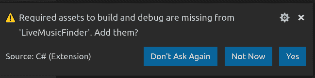
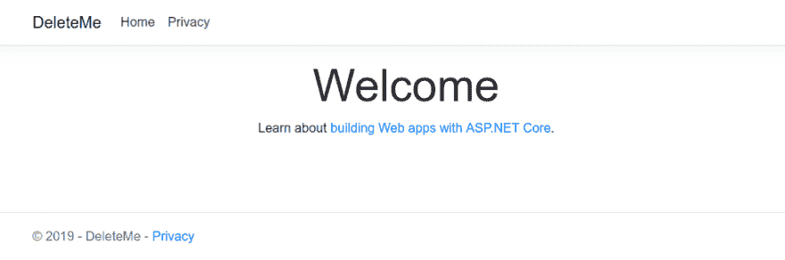
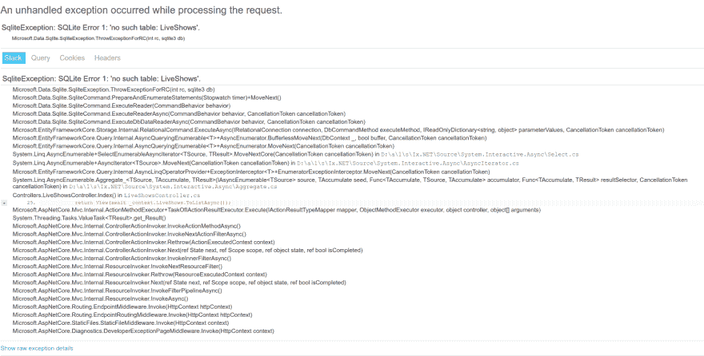
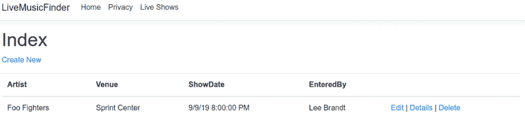
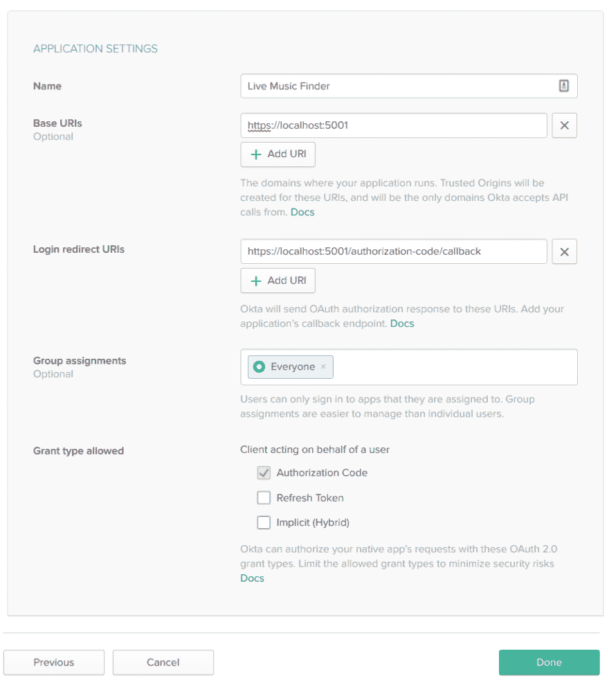
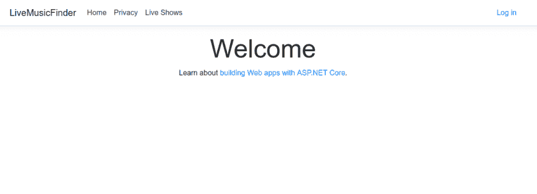
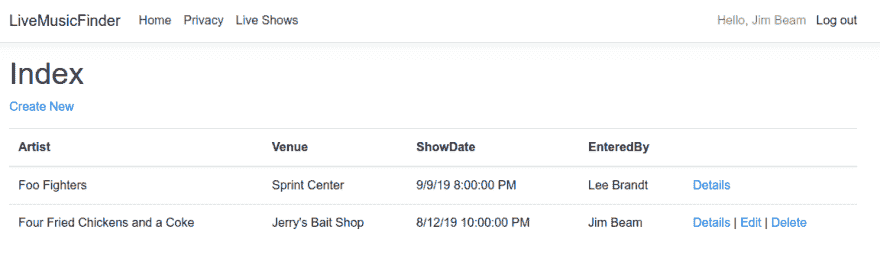

# 使用 ASP.NET 核心 2.2 和实体框架核心构建 CRUD 应用程序

> 原文：<https://dev.to/oktadev/build-a-crud-app-with-asp-net-core-2-2-and-entity-framework-core-1pe9>

如果你像我一样，你热爱音乐。音乐总是在我家的某个地方流动。我特别喜欢去看现场音乐，但是很难知道现场音乐在何时何地发生。LiveMusicFinder 是一个网络应用程序，允许用户输入一些现场音乐的时间和地点。这个测试版非常粗糙，但我会向你展示我是如何用 ASP.NET 核心 2.2 和实体框架核心来构建它的。

ASP.NET 核心 2.2 是微软 ASP.NET 框架的跨平台版本，可以在任何平台上运行。例如，我将使用 Visual Studio 代码在 Ubuntu 笔记本电脑上开发这个。我还将使用 Entity Framework ore 与数据存储进行交互。实体框架核心是迄今为止。NET 开发人员与一个数据库交互，为了方便起见，这个数据库将是 SQLite，一个超级轻量级的数据库。我们开始吧！

## 搭建一个 ASP.NET 核心 2.2 Web 应用

从创建基本应用程序开始。在终端 shell 中运行:

```
dotnet new mvc -n LiveMusicFinder 
```

这将在一个名为`LiveMusicFinder`的文件夹中搭建一个 ASP.NET Core 2.2 MVC 应用程序，这将是您将要工作的主要名称空间。

只需在 Visual Studio 代码中打开该文件夹。

```
cd LiveMusicFinder
code . 
```

系统会提示您添加一些缺失的资产。这是`.vscode`文件夹，允许你用 **F5** 启动和调试应用程序，只需点击**是**按钮。

[](https://res.cloudinary.com/practicaldev/image/fetch/s--8vZL4wKP--/c_limit%2Cf_auto%2Cfl_progressive%2Cq_auto%2Cw_880/https://developer.okta.com/assets-jekyll/blog/aspnet22-crud/add-vscode-folder-3b18881d1e0018b69fc250d85b035ec041462c76ca7af8b558a25b204fea2182.png)

如果您以前在 ASP.NET 核心中开发过，那么在中基本应用程序的外观和感觉会有很大的变化。网芯 2.2，那就火起来看看吧！

您可能会看到一个屏幕，告诉您您的连接不是私有的。这是因为，在最新的。NET Core，开发应用运行过`https`，但是你没有`localhost`的证书。你可以获得一个当地的证书，这很容易做到，或者你可以继续。它不会每次都警告你，所以现在只需点击**高级**按钮，然后点击**前进到本地主机(不安全)**。

[](https://res.cloudinary.com/practicaldev/image/fetch/s--c6tYwjwg--/c_limit%2Cf_auto%2Cfl_progressive%2Cq_auto%2Cw_880/https://developer.okta.com/assets-jekyll/blog/aspnet22-crud/not-private-advanced-b3245243b35b8b3ead4b3beea765a51b91d212fd7ee53fcf75b6d25073399b0d.png)

然后您可以在中看到基础应用程序的新设计。网！

[](https://res.cloudinary.com/practicaldev/image/fetch/s--VputZ-HZ--/c_limit%2Cf_auto%2Cfl_progressive%2Cq_auto%2Cw_880/https://developer.okta.com/assets-jekyll/blog/aspnet22-crud/new-app-running-be09a3cea33c2ce6fc3982305ecd19a4f10c459681a7ae4bbd2ab577886e0d23.png)

我*认识*，对吧？旋转木马里没有大图片。没有链接到。NET 文档。真的很稀疏。这是一件伟大的事情。现在，您不必在开始构建之前从应用程序中删除图像和内容！

## 将实体框架核心类添加到您的 ASP.NET 核心 2.2 应用程序

现在您已经有了一个坚实的基础，开始添加您将用于现场音乐表演的模型。在`Models`文件夹中，添加一个名为“LiveShow”的类。

```
using System;

namespace LiveMusicFinder.Models
{
  public class LiveShow
  {
    public int Id { get; set; }
    public string Artist { get; set; }
    public string Venue { get; set; }
    public DateTime ShowDate { get; set; }
    public string EnteredBy { get; set; }
  }
} 
```

这个类非常简单，将来肯定会用到更多的细节，但是现在，它已经拥有了你需要的一切:谁在玩？他们在哪里付款？表演是什么时候？

接下来，您需要一个数据库上下文来将节目保存到数据库中。为了简单起见，只使用 SQLite 数据库。当应用程序上线时，很容易将连接更改为更“适合生产”的数据库。

在使用 SQLite 之前，您需要一个实体框架 NuGet 包来连接它。

```
dotnet add package Microsoft.EntityFrameworkCore.SQLite -v 2.2.3 
```

现在您已经准备好为 SQLite 创建数据库上下文了。在项目的根目录下创建一个名为`Data`的文件夹，并添加一个名为`ApplicationDbContext.cs`的类文件，其内容如下。

```
using LiveMusicFinder.Models;
using Microsoft.EntityFrameworkCore;

namespace LiveMusicFinder.Data
{
  public class ApplicationDbContext : DbContext
  {
    public ApplicationDbContext(DbContextOptions<ApplicationDbContext> options) : base(options)
    {

    }

    public DbSet<LiveShow> LiveShows { get; set; }
  }
} 
```

这带来了`LiveMusicFinder.Models`名称空间，因此您可以引用`LiveShow`模型类。它源自`Microsoft.EntityFrameworkCore`的`DbContext`，并将所有合适的选项传递给基类。数据库中`LiveShows`集合的公共句柄是`DbSet<LiveShow>`属性。现在，您所要做的就是告诉应用程序，通过将上下文添加到`Startup.cs`类中，将上下文注入到任何需要它的类中。在`ConfigureServices()`方法中，就在`SetCompatibilityVersion()`调用之前，添加一行:

```
services.AddDbContext<ApplicationDbContext>(options => options.UseSqlite("Data Source=LiveMusicFinder.db")); 
```

您需要将两条`using`语句添加到您的`Startup.cs`文件中。您*可以*将上面的行粘贴进去，然后将光标放在`ApplicationDbContext`类型上，使用`CTRL+.`查看将添加`LiveMusicFinder.Data`名称空间`using`语句的菜单项，并对需要`Microsoft.EntityFrameworkCore`的`UseSqlite()`方法做同样的操作，或者您可以从这里剪切并粘贴它们。

```
using LiveMusicFinder.Data;
using Microsoft.EntityFrameworkCore; 
```

这将把新创建的上下文注入到我们的控制器中，并使使用数据库和以后为生产更改它变得容易。

## Scaffold the Entity Framework Core Controller for Live 显示在您的 ASP.NET 2.2 应用程序中

为了使生活变得更简单，您不必为控制器手工编写所有的动作，您将使用`dotnet` CLI 并搭建控制器。这可以在 Visual Studio 2017/2019 中通过导航**文件** > **新**菜单和选项来完成。您也可以只运行两个命令。第一个命令将安装代码生成器模板。

```
dotnet add package Microsoft.VisualStudio.Web.CodeGeneration.Design 
```

然后使用这些模板生成一个数据控制器。

```
dotnet aspnet-codegenerator controller -name LiveShowsController -async -m LiveMusicFinder.Models.LiveShow -dc LiveMusicFinder.Data.ApplicationDbContext -namespace Controllers -outDir Controllers -udl 
```

现在这里有很多东西要解开，当您将来使用这些模板时，知道`dotnet aspnet-codegenerator controller --help`的存在有助于您确定您需要哪些交换机。

上面的命令告诉`aspnet-codegenerator`工具，您想要使用`controller`代码生成器，您想要将其命名为`LiveShowsController`，并且您想要动作方法是异步的(使用`-async`开关)。您还告诉生成器，控制器将是一个数据控制器，它将使用`LiveMusicFinder.Models.LiveShow`模型和`LiveMusicFinder.Data.ApplicationDbContext`数据库上下文进行数据库交互。接下来的几个开关实际上是生成器的内务处理:控制器将放入哪个名称空间以及生成的控制器将放入哪个文件夹。最后一个开关处理将要生成的视图(是的！这生成了与控制器动作相匹配的视图！！).`-udl`开关告诉视图生成器为它生成的视图“使用默认布局”。很甜蜜，是吧？

一旦您运行了这个命令，您应该会在`Views`目录中看到一个名为`LiveShows`的新文件夹(以匹配控制器)。该文件夹中应该有五个新视图！“查看”`LiveShow`模型的不同方式各有一个:`Create.cshtml`、`Delete.cshtml`、`Details.cshtml`、`Edit.cshtml`和`Index.cshtml`(列表)。

您还将在`Controllers`目录中拥有`LiveShowsController`,通过构造函数注入`ApplicationDbContext`,每个视图的动作已经连接到列表、创建、更新和删除`LiveShow`对象！你可以运行它，它都是有线的！

现在您只需要一个菜单项就可以进入`Index`视图。在`Views/Shared`的`_Layout.cshtml`文件中，给`ul`添加一个带有`navbar-nav`类的菜单项。

```
<li class="nav-item">
    <a class="nav-link text-dark" asp-area="" asp-controller="LiveShows" asp-action="Index">Live Shows</a>
</li> 
```

> **注意:**我通常只是复制其他菜单项中的一个，并更改控制器、动作和菜单项文本。

您现在可以运行您的应用程序并点击 **Live Shows** 菜单项，它将带您进入 Live Shows 列表。

[](https://res.cloudinary.com/practicaldev/image/fetch/s--3_P3iapB--/c_limit%2Cf_auto%2Cfl_progressive%2Cq_auto%2Cw_880/https://developer.okta.com/assets-jekyll/blog/aspnet22-crud/database-error-message-b080d5633a215b70f836c06a8b93d9de82cb2bf27353a46f5ced3b3e11b014c9.png)

但是休斯顿，我们有个问题。如果你现在真的尝试运行它，它将会失败。这个错误消息*几乎*有用。它告诉你“LiveShows”表不存在，但是真正的问题是数据库实际上还不存在。为了让您的应用程序在运行时确保它存在，将数据库上下文添加到您的`Startup.cs`的`Configure()`方法中，并告诉它确保数据库被创建。

```
public void Configure(IApplicationBuilder app, IHostingEnvironment env, ApplicationDbContext dbContext)
{
  dbContext.Database.EnsureCreated();
  // ...the rest of the method 
```

当你这次启动应用程序时，一切都会正常工作！！

[](https://res.cloudinary.com/practicaldev/image/fetch/s--uykO7WND--/c_limit%2Cf_auto%2Cfl_progressive%2Cq_auto%2Cw_880/https://developer.okta.com/assets-jekyll/blog/aspnet22-crud/data-app-working-1ef1f31c96c8ade17dcd9ef3621ba90e0e2ce9358f7ca70f89de538a566dcb34.png)

虽然这是一个不错的开始，但任何人不仅可以进入节目，还可以编辑其他人的节目。由于表单允许用户在字段中输入自己的名字，所以实际上没有固定的方法来跟踪人们的提交。你需要认证！但是朋友不让朋友写 auth。他们用[秋葵](https://developer.okta.com)！

## 向您的 ASP.NET 核心 2.2 应用程序添加认证

为什么*不*自己写认证片？登录界面欺骗了大多数开发人员，让他们认为认证很容易。然后他们意识到他们需要一个“忘记密码？”电子邮件工作流程和用户管理屏幕。更不用说您是否需要多因素身份认证。只是不要这样对自己。使用提供商。 [Okta](https://developer.okta.com) 让认证变得简单，它已经内置了所有这些特性！你可以在这里获得你的永久免费开发者账户[。](https://developer.okta.com/signup/)

一旦你注册了，进入你的仪表盘，注意你的 **Org URL** 就在屏幕右侧粉色**升级**按钮的下方。

[](https://res.cloudinary.com/practicaldev/image/fetch/s--k4DwlJNw--/c_limit%2Cf_auto%2Cfl_progressive%2Cq_auto%2Cw_880/https://developer.okta.com/assets-jekyll/blog/aspnet22-crud/okta-org-url-6b1fce3aeb309d0d36fa0bd6d5a7b29013b0b658c476d09ff9bdfd2413dd5b7a.png)

点击**应用**菜单，点击**添加应用**添加新应用。选择 **Web** 作为您的应用平台，然后点击**下一步**。

在**应用设置**页面名称上，它“Live Music Finder”并设置端口为**基地 URIs** 和**登录重定向 URIs** 到`5001`并更改方案为`https`。您可以将其他所有内容保留为默认值。并点击**完成**。

[](https://res.cloudinary.com/practicaldev/image/fetch/s--dkUMtY-v--/c_limit%2Cf_auto%2Cfl_progressive%2Cq_auto%2Cw_880/https://developer.okta.com/assets-jekyll/blog/aspnet22-crud/okta-app-settings-df4aac8282386ab1c29ae23b8fc15c198320c330546515e282de28b5368242b8.png)

一旦你完成了，你会看到一个**通用设置**标签。在该选项卡上点击**编辑**按钮并添加一个**注销重定向 URIs** 条目作为`https://localhost:5001/signout/callback`。这是当从 Okta 注销时中间件将处理的 URL。

从页面的**客户端凭证**部分复制您的**客户端 ID** 和**客户端密码**。

## 在您的 ASP.NET 核心 2.2 应用程序中配置认证

下一部分在你的代码中。你需要奥克塔 ASP.NET SDK。您可以通过运行以下命令来安装它。

```
dotnet add package Okta.AspNetCore --version 1.1.5 
```

在`appsettings.json`文件中，最终版本如下所示。

```
{  "Logging":  {  "LogLevel":  {  "Default":  "Warning"  }  },  "Okta":  {  "ClientId":  "{yourClientId}",  "ClientSecret":  "{yourCliientSecret}",  "OktaDomain":  "https://{yourOktaDomain}",  "PostLogoutRedirectUri":  "https://localhost:5001/"  },  "AllowedHosts":  "*"  } 
```

回到你的`Startup.cs`中，你将需要一些`using`语句。

```
using Okta.AspNetCore;
using Microsoft.AspNetCore.Authentication.Cookies; 
```

在`ConfigureServices()`方法的顶部，添加以下内容。

```
var oktaMvcOptions = new OktaMvcOptions();
Configuration.GetSection("Okta").Bind(oktaMvcOptions);
oktaMvcOptions.Scope = new List<string> { "openid", "profile", "email" };
oktaMvcOptions.GetClaimsFromUserInfoEndpoint = true;

services.AddAuthentication(options =>
{
  options.DefaultAuthenticateScheme = CookieAuthenticationDefaults.AuthenticationScheme;
  options.DefaultSignInScheme = CookieAuthenticationDefaults.AuthenticationScheme;
  options.DefaultChallengeScheme = OktaDefaults.MvcAuthenticationScheme;
})
.AddCookie()
.AddOktaMvc(oktaMvcOptions); 
```

虽然这个*看起来*复杂，但其实很简单。首先，它只是创建了一个新的`OktaMvcOptions()`对象。然后它会绑定您刚刚创建的所有`appsettings.json`设置。然后，这些选项有一个当有人进行身份验证时您想要取回的作用域列表，并将`GetClaimsFromUserInfoEndpoint`的布尔值设置为`true`。这只是告诉中间件，您希望使用 OIDC 端点来计算获取用户信息的 URL 是什么。

下一节实际上是设置中间件来添加认证(带有一些设置 cookies 的选项，等等)。)并使用 Okta SDK 通过我们配置的选项进行身份验证。

您已经*配置了*服务，但是您仍然需要告诉应用程序使用您刚刚配置的服务。在`Configure()`方法中，在`UseMvc()`行之前添加一行代码。

```
app.UseAuthentication(); 
```

现在身份验证已经完成，您只需要添加一些用户界面元素来触发登录和注销。

向名为`AccountController.cs`的`Controllers`文件夹添加一个新文件，内容如下。

```
using Microsoft.AspNetCore.Authentication.Cookies;
using Microsoft.AspNetCore.Mvc;
using Okta.AspNetCore;

namespace LiveMusicFinder.Controllers
{
  public class AccountController : Controller
  {
    public IActionResult Login()
    {
      if (!HttpContext.User.Identity.IsAuthenticated)
      {
        return Challenge(OktaDefaults.MvcAuthenticationScheme);
      }
      return RedirectToAction("Index", "Home");
    }

    public IActionResult Logout()
    {
      return new SignOutResult(new[]
      {
        OktaDefaults.MvcAuthenticationScheme,
        CookieAuthenticationDefaults.AuthenticationScheme
      });
    }
  }
} 
```

`Login()`方法只是检查用户是否已经登录。如果不是，它调用`Challenge()`,这将重定向到 Okta 托管的登录页面，让他们进行身份验证。一旦他们成功登录，操作将重定向到主页。

`Logout()`动作将调用 Okta 中的注销端点，并设置一些方案选项。一旦完成，Okta 将重定向到 OIDC 中间件处理的`/signout/callback`端点，用户将从应用程序的配置重定向到`PostLogoutRedirectUri`设置中的 URL。

剩下唯一要做的就是在用户界面中添加登录和注销按钮。为此，在`Views/Shared`中创建一个名为`_LoginPartial.cshtml`的局部视图，内容如下。

```
@if (User.Identity.IsAuthenticated)
{
  <ul class="navbar-nav">
    <li>
      <span class="navbar-text">Hello, @User.Identity.Name</span>  
      <a onclick="document.getElementById('logout_form').submit();" style="cursor: pointer;">Log out</a>
    </li>
  </ul>
  <form asp-controller="Account" asp-action="Logout" method="post" id="logout_form"></form>
}
else
{
  <ul class="navbar-nav">
    <li><a asp-controller="Account" asp-action="Login">Log in</a></li>
  </ul>
} 
```

这只是检查用户是否登录，并显示适当的按钮。

将这个片段添加到现有导航之后的`_Layout.cshtml`文件中，这样整个导航部分看起来就像这样。

```
<div class="navbar-collapse collapse justify-content-between">
  <ul class="navbar-nav mr-auto">
    <li class="nav-item">
      <a class="nav-link text-dark" asp-area="" asp-controller="Home" asp-action="Index">Home</a>
    </li>
    <li class="nav-item">
      <a class="nav-link text-dark" asp-area="" asp-controller="Home" asp-action="Privacy">Privacy</a>
    </li>
    <li class="nav-item">
      <a class="nav-link text-dark" asp-area="" asp-controller="LiveShows" asp-action="Index">Live Shows</a>
    </li>
  </ul>
  <partial name="_LoginPartial" />
</div> 
```

> **注意**:注意一些类已经改变了。这是将认证菜单推到右边，同时将常规导航项目留在它们原来的位置。

嗯？你还在等什么？点燃那只小狗，享受认证的荣耀吧！！

[](https://res.cloudinary.com/practicaldev/image/fetch/s--B2xCVjUm--/c_limit%2Cf_auto%2Cfl_progressive%2Cq_auto%2Cw_880/https://developer.okta.com/assets-jekyll/blog/aspnet22-crud/app-with-auth-9cfa9a81d419e85d52d4c55edb8a74b6a2ed033b82c009918805b4638a238669.png)

还有一件事需要解决。现在，用户仍然在由输入的**字段中输入自己的名字，任何人都可以编辑或删除其他人的帖子。**

## 向您的 ASP.NET 核心 2.2 应用程序添加授权

首先，给`LiveShowsController` **上的每个动作添加`[Authorize]`属性，除了**`Index`和`Details`动作。

> **注意**:这将需要`Microsoft.AspNetCore.Authorization`的`using`语句。

将`Edit`和`Create`视图改为不要求用户输入名称。移除由两个文件的表单组输入的**。当他们登录后，您可以在控制器中获取并添加它。在`LiveShowsController`中，通过从方法签名的`Bind`列表中删除`EnteredBy`来更改`Create()`方法，然后在`Create()`方法的开头添加下面一行。** 

```
liveShow.EnteredBy = User.Identity.Name; 
```

在`Edit()`方法中，将`try`块内的代码**改为:** 

```
var existingShow = await _context.LiveShows.FindAsync(id);
if(existingShow.EnteredBy != User.Identity.Name)
{
  return Unauthorized();
}
existingShow.Artist = liveShow.Artist;
existingShow.Venue = liveShow.Venue;
existingShow.ShowDate = liveShow.ShowDate;
_context.Update(existingShow);
await _context.SaveChangesAsync(); 
```

这只是获取数据库中现有的带有相关 ID 的节目，并确保登录的用户就是输入它的人。如果没有，它只是返回一个`401 Unauthorized`响应。如果当前用户*拥有*的记录，它只更新现有节目中的所有值并保存更改。方法中的其他内容保持不变。

最后，更改`Index`和`Details`视图，为不是该节目所有者的*用户隐藏编辑和删除按钮。在`Index`视图中，将视图中的最后一个`td`改为这个。* 

```
<td>
  <a asp-action="Details" asp-route-id="@item.Id">Details</a>
  @if (User.Identity.IsAuthenticated && item.EnteredBy == User.Identity.Name)
  {
    <span> |</span>
    <a asp-action="Edit" asp-route-id="@item.Id">Edit</a><span> |</span>
    <a asp-action="Delete" asp-route-id="@item.Id">Delete</a>
  }
</td> 
```

在`Details`视图中做同样的事情，将结尾`div`改为。

```
<div>
  @if (User.Identity.IsAuthenticated && Model.EnteredBy == User.Identity.Name)
  {
    <a asp-action="Edit" asp-route-id="@Model.Id">Edit</a><span> |</span>
    <a asp-action="Delete" asp-route-id="@Model.Id">Delete</a><span> |</span>
  }
  <a asp-action="Index">Back to List</a>
</div> 
```

现在你准备好像贝多芬一样摇滚了！再次启动应用程序，确认您只能更改和删除自己的记录。很酷吧。

[](https://res.cloudinary.com/practicaldev/image/fetch/s--2i1N_7Q8--/c_limit%2Cf_auto%2Cfl_progressive%2Cq_auto%2Cw_880/https://developer.okta.com/assets-jekyll/blog/aspnet22-crud/app-final-running-ca07b9117804f76fa1df7ca7f275510c1048ab96ab041cabdc851e69fb4ea8d7.png)

## 让你的 ASP.NET 核心技能更上一层楼

如果你想了解更多关于 ASP.NET 核心的知识，请查看我们博客上的其他精彩内容！

*   [用 ASP.NET 内核和类型脚本构建一个 CRUD 应用](https://developer.okta.com/blog/2019/03/26/build-a-crud-app-with-aspnetcore-and-typescript)
*   [利用 AWS Lambda 和 ASP.NET 内核构建安全的微服务](https://developer.okta.com/blog/2019/03/21/build-secure-microservices-with-aspnet-core)
*   [用 Visual Studio 代码构建你的第一个 Azure 函数](https://developer.okta.com/blog/2019/02/07/build-your-first-azure-function-visual-studio-code)

一如既往，在下面留下评论，别忘了在 [Twitter](https://twitter.com/oktadev) 和 [YouTube](https://www.youtube.com/channel/UC5AMiWqFVFxF1q9Ya1FuZ_Q) 上关注我们。下次再见，摇滚起来！