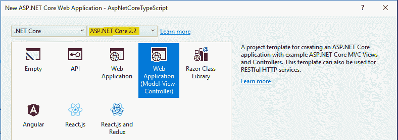
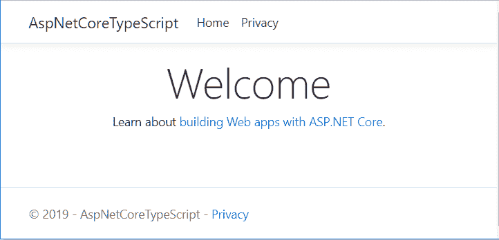
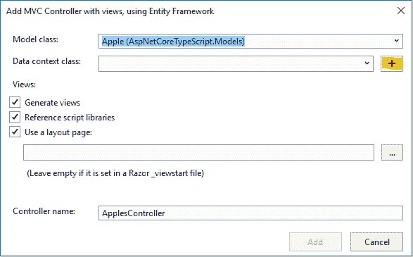
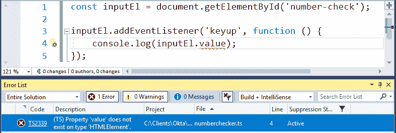
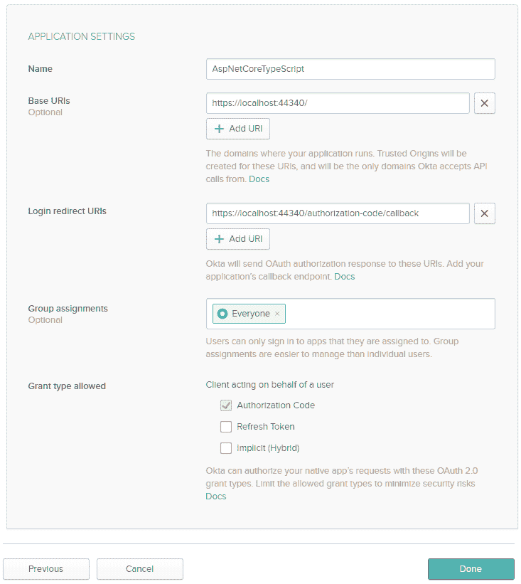
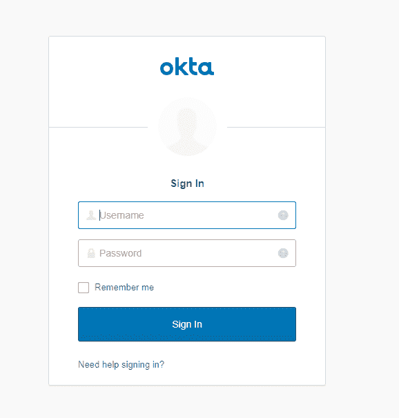
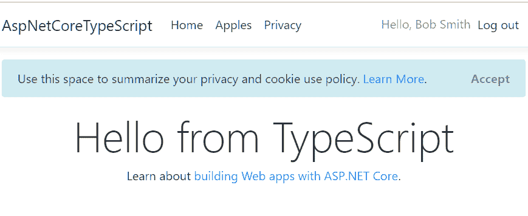

# 使用 ASP.NET 核心和类型脚本构建 CRUD 应用程序

> 原文：<https://dev.to/oktadev/build-a-crud-app-with-asp-net-core-and-typescript-1l53>

有很多事情要做。NET 开发人员喜欢的类型脚本。它有很强的打字能力。NET 开发人员已经习惯并能够使用最新的 JavaScript 特性。因为它只是 JavaScript 的超集，所以切换的成本几乎为零。让 Visual Studio 在构建您的 ASP.NET 核心应用程序时转换类型脚本也非常简单。

在本教程中，您将使用 TypeScript 中的客户端脚本构建一个 ASP.NET 核心应用程序。您将构建一个简单的 CRUD 应用程序，并使用 TypeScript 进行客户端验证。您还将学习如何在 ASP.NET 核心应用程序的构建过程中使用 TypeScript，以便将您的 TypeScript 自动转换为普通的 JavaScript。

准备好学习如何在 Visual Studio 2017 中使用 TypeScript 了吗？我们开始吧！

## 创建一个 ASP.NET MVC 项目

在 Visual Studio 中，进入**文件** > **新建** > **项目…** ，选择 **Visual C#** 项目类别，然后选择**ASP.NET 核心 Web 应用**。将您的项目命名为`AspNetCoreTypeScript`并点击**确定**。

我将为这个项目使用一个**ASP.NET 核心 2.2** 模板。如果看不到该选项，可以运行 Visual Studio 安装程序来获取 Visual Studio 的更新版本。

[](https://res.cloudinary.com/practicaldev/image/fetch/s--U6NM69hZ--/c_limit%2Cf_auto%2Cfl_progressive%2Cq_auto%2Cw_880/https://developer.okta.com/assets-jekyll/blog/netcore-typescript/asp-net-core-2.2-project-templates-highlighted-7afa2e242dae524f8cd6f327196accdcd62ceaa84a3246787798d0cbedda146b.png)

选择 **Web 应用(模型-视图-控制器)**项目模板，点击**确定**。

如果您运行该项目，您将看到如下页面:

[](https://res.cloudinary.com/practicaldev/image/fetch/s--0pM8FbzL--/c_limit%2Cf_auto%2Cfl_progressive%2Cq_auto%2Cw_880/https://developer.okta.com/assets-jekyll/blog/netcore-typescript/asp-net-core-2.2-project-5ff6f826c187549d3c50cdd4d33a69e672a95e991dd8e525a92bdd24405fc177.png)

如果你碰巧使用了一个旧的模板，你会看到一些不同的东西，但是你应该能够完成本教程的大部分内容。

现在让我们给这个项目添加一些 TypeScript。

## 将打字稿添加到您的 ASP.NET 核心应用程序中

在向项目中添加任何 TypeScript 文件之前，需要配置 TypeScript。你可以用一个`tsconfig.json`文件来做这件事。要创建这个文件，右击您的项目并选择**添加** > **新项目…** 。在左侧面板中搜索`TypeScript`或导航至**ASP.NET 核心** > **网络**。然后选择 **TypeScript JSON 配置文件**项，点击**添加**。

现在您应该在根项目文件夹中有一个`tsconfig.json`文件。这是我做了一些修改后文件的样子:

```
{  "compileOnSave":  true,  "compilerOptions":  {  "noImplicitAny":  false,  "noEmitOnError":  true,  "removeComments":  false,  "sourceMap":  true,  "target":  "es5",  "outDir":  "wwwroot/js/"  },  "exclude":  [  "node_modules",  "wwwroot"  ]  } 
```

首先我添加了`"compileOnSave": true`作为根属性，这样我每次保存一个 TypeScript 文件，对应的 JavaScript 文件就会重新生成。我还在编译器选项中添加了`"outDir": "wwwroot/js/"`。现在，TypeScript 编译器会将所有生成的 JavaScript 文件放在这个文件夹中。

确保您的`tsconfig.json`与上面的匹配，并保存您的更改。

现在将名为`TypeScript`的文件夹添加到您的项目中。文件夹的名称并不重要。它不能是排除在`tsconfig.json`文件之外的文件夹之一。右击该文件夹，选择**添加** > **新项目…** 。选择**打字稿文件**项，将文件命名为`home.ts`，点击**添加**。

让我们在这个文件中添加一些普通的旧 JavaScript，看看会发生什么。添加:

```
alert('Hello World'); 
```

现在保存文件。您应该会看到`home.js`出现在`wwwroot/js`文件夹中。如果你打开它，你会看到:

```
alert('Hello World');
//# sourceMappingURL=home.js.map 
```

除了对源映射的引用(嵌套在`.js`文件下)，它看起来与我们的`.ts`文件相同。TypeScript 只是带有一些额外特性的 JavaScript。

现在让我们做一些更有趣的事情。下面是查找页面上第一个`h1`标签并更改标题的一些代码。将`home.ts`中的代码替换为:

```
let titleEl = document.querySelector('h1');
titleEl.innerText = 'Hello from TypeScript'; 
```

如果保存文件并检查重新生成的`home.js`文件，您会看到一个小的变化。因为您的`tsconfig.json`文件指定 TypeScript 编译器应该生成 ES5 兼容的 JavaScript，所以`const`关键字被更改为`var`。

现在让我们在浏览器中测试这个生成的 JavaScript。首先，将这段代码添加到`Views\Home\Index.cshtml`的底部，以便在主页上包含生成的 JavaScript 文件:

```
@section Scripts {
    <script src="~/js/home.js"></script>
} 
```

然后再次运行该项目。主页的标题应该改成`Hello from TypeScript`。开心了吗？

## 用 ASP.NET 核心打造 CRUD App

现在您已经掌握了一点 TypeScript 编码，您可以使用 ASP.NET 核心创建一个 CRUD 应用程序，并使用 TypeScript 来满足您的客户端脚本需求。

您的任务是创建一个简单的应用程序，为苹果批发商管理各种苹果。这个应用程序需要防止垃圾邮件机器人在数据库中创建虚假条目，所以您将使用 TypeScript 来验证是否有人提交了 create apple variety 表单。

您将使用 Visual Studio 内置的脚手架来立即创建这个 CRUD 应用程序。首先为你的苹果品种创建一个数据模型。您的项目中应该已经有了一个 **Models** 文件夹，所以向该文件夹添加一个名为`Apple.cs`的类。粘贴这段代码:

```
namespace AspNetCoreTypeScript.Models
{
    public class Apple
    {
        public int Id { get; set; }
        public string Variety { get; set; }
    }
} 
```

现在右击**控制器**文件夹，选择**添加** > **新脚手架项目…** 。使用实体框架选择**带视图的 MVC 控制器，点击**添加**。**

在下一个屏幕上，为**模型类**选择`Apple`模型，然后点击**数据上下文类**旁边的 **+** 按钮，创建一个实体框架数据上下文。

[](https://res.cloudinary.com/practicaldev/image/fetch/s--ZH2zX0XW--/c_limit%2Cf_auto%2Cfl_progressive%2Cq_auto%2Cw_880/https://developer.okta.com/assets-jekyll/blog/netcore-typescript/scaffold-new-data-context-highlighted-acdfad81b0f340b499b187ff3822667e24da1757148f7261e9ddcd29379b1ac2.png)

接受默认类型(`AspNetCoreTypeScript.Models.AspNetCoreTypeScriptContext`)并点击**添加**。然后点击 **Add** 来创建控制器、视图和其他东西。

现在向应用程序添加一个菜单项，这样您就可以轻松地导航到苹果品种列表。找到`Views\Shared\_Layout.cshtml`，在**首页**和**隐私**菜单项之间添加一个菜单项，像这样:

```
<li class="nav-item">
    <a class="nav-link text-dark" asp-area="" asp-controller="Apples" asp-action="Index">Apples</a>
</li> 
```

如果你现在运行这个应用程序，你会得到一个错误，如果你去苹果网页。这是因为您还没有创建数据库。让我们现在做那件事。

在 Visual Studio 中打开**包管理器控制台**，发出这个命令:

```
Add-Migration "Initial" 
```

这将在您的解决方案中创建一个`Migrations`文件夹，其中包含创建数据库所需的代码。要创建数据库，运行:

```
Update-Database 
```

既然数据库已经创建，您可以再次运行应用程序。确定您可以创建、编辑和删除苹果品种。

## 为你的 ASP.NET 核心应用键入垃圾邮件-Bot 检查

现在，您需要使用 TypeScript 来防止垃圾邮件机器人创建假冒的苹果品种。当您这样做时，您将会对 TypeScript 的工作原理有更多的了解。

让我们假设您遇到问题的机器人都启用了 JavaScript，因此您将禁用表单上的提交按钮，直到这个人解决了一个数学难题。为了简单起见，你只需要这个人在文本框中输入一个偶数。

首先找到`Views\Apples\Create.cshtml`，并在表单内的适当位置添加一个文本框和相关字段，用于垃圾邮件机器人检查:

```
<div class="form-group">
    <label class="control-label">Enter an even number</label>
    <input class="form-control" id="number-check" />
    <div id="number-check-message"></div>
</div> 
```

在上面的代码中，我们有一个告诉用户输入偶数的标签、一个文本框和一个可以向用户显示消息的`div`元素。

在编辑文件时，还要向提交输入控件添加一个`disabled`属性。

然后在文件底部的`Scripts`部分添加`<script src="~/js/numberchecker.js"></script>`，这样页面将加载您将在下一步中生成的 JavaScript 文件。

这是完成所有更改后整个`Create.cshtml`文件的样子:

```
@model AspNetCoreTypeScript.Models.Apple

@{
    ViewData["Title"] = "Create";
}

<h1>Create</h1>

<h4>Apple</h4>
<hr />
<div class="row">
    <div class="col-md-4">
        <form asp-action="Create">
            <div asp-validation-summary="ModelOnly" class="text-danger"></div>
            <div class="form-group">
                <label asp-for="Variety" class="control-label"></label>
                <input asp-for="Variety" class="form-control" />
                <span asp-validation-for="Variety" class="text-danger"></span>
            </div>
            <div class="form-group">
                <label class="control-label">Enter an even number</label>
                <input class="form-control" id="number-check" />
                <div id="number-check-message"></div>
            </div>

            <div class="form-group">
                <input type="submit" value="Create" class="btn btn-primary" disabled />
            </div>
        </form>
    </div>
</div>

<div>
    <a asp-action="Index">Back to List</a>
</div>

@section Scripts {
    <script src="~/js/numberchecker.js"></script>
    @{await Html.RenderPartialAsync("_ValidationScriptsPartial");}
} 
```

您可能希望再次运行应用程序，以验证输入数字的文本框是否出现，以及**创建**按钮是否被禁用。当然，你会得到一个*文件没有找到*的错误，因为我们还没有生成它。让我们现在就解决这个问题。

## 将 TypeScript SpamBot 检查添加到您的 ASP.NET 核心应用程序

在`TypeScript`文件夹中创建一个名为`numbershecker.ts`的空文件并保存。现在你应该看到`numberchecker.js`是在`wwwroot\js`文件夹中生成的。

现在让我们确认您可以在输入值时访问输入到`number-check`输入控件中的值。将此粘贴到`numberchecker.ts`并保存:

```
const inputEl = document.getElementById('number-check');

inputEl.addEventListener('keyup', function () {
    console.log(inputEl.value);
}); 
```

这只是普通的 ES6 JavaScript，用于查找输入元素，并添加一个事件侦听器来记录输入的值。

但是不管用。如果您检查生成的 JavaScript 文件，您会发现它没有更新。这是怎么回事？

问题是，虽然这是有效的 JavaScript(因此也是有效的 TypeScript)，但其中有一个错误。我换一种说法:TypeScript 代码有错误并不意味着它无效。

TypeScript 编译器可以从任何*有效的* TypeScript 生成 JavaScript，即使存在错误。它没有生成更新的 JavaScript 文件是因为你*告诉*它不要这样做。看看你的`tsconfig.json`档案。`noEmitOnError`编译器选项被设置为`true`。改成`false`保存文件。然后给`numberchecker.ts`添加评论并保存。果然，这次更新了对应的 JavaScript 文件。

现在让我们来看看这个错误。

[](https://res.cloudinary.com/practicaldev/image/fetch/s---yPszx7n--/c_limit%2Cf_auto%2Cfl_progressive%2Cq_auto%2Cw_880/https://developer.okta.com/assets-jekyll/blog/netcore-typescript/typescript-error-c39a19b1c01a278094eb0ec1f4fa0f5d9d08e5904b86fe663f7f41b645f01e62.png)

我们知道我们的`input`元素有一个`value`属性。为什么 TypeScript 不知道这件事？

TypeScript 编译器知道`getElementById`将返回一个`HTMLElement`，但是它不知道它可能返回什么类型的元素。我们需要通过指定我们正在使用的确切类型来帮助编译器(这种语言被称为 *Type_Script，因为它为 JavaScript 增加了 _types* 的功能)。

在这种情况下，我们需要通知编译器我们正在处理一个`HTMLInputElement`。有两种方法可以做到这一点。第一种方式是这样的:

```
const inputEl = <HTMLInputElement> document.getElementById('number-check'); 
```

这很好，但是由于 TypeScript 有时在 JSX 使用(用于 React 项目)，尖括号中的类型断言可能会被误认为是 html 标记。所以这里是首选语法:

```
const inputEl = document.getElementById('number-check') as HTMLInputElement; 
```

现在，TypeScript 错误消失了，因为 TypeScript 编译器将`inputEl`视为一个`HTMLInputElement`(事实上，无论它是否是一个)。

如果您运行该项目，您将看到在我们的 spam-bot 检查字段中键入的值被记录到控制台中。

现在用完整的数字检查脚本:
替换`numberchecker.ts`的内容

```
const inputEl = document.getElementById('number-check') as HTMLInputElement;
const messageEl = document.getElementById('number-check-message');
const submitButton = document.querySelector('form input[type="submit"]') as HTMLInputElement;

inputEl.addEventListener('keyup', function () {
    const number = parseInt(inputEl.value);
    let message = '';
    let disable = true;
    if (isNaN(number)) {
        message = 'not a number';
    }
    else if (number % 2 === 0) {
        message = number + ' is even';
        disable = false;
    }
    else {
        message = number + ' is odd';
    }
    messageEl.innerText = message;
    submitButton.disabled = disable;
}); 
```

在 Visual Studio 中，您可以将鼠标悬停在该脚本中的每个变量上，以查看编译器推断的类型。这些类型决定了什么被认为是错误，什么不是。例如，您会注意到您能够将`number + ' is even'`赋给`message`变量，因为当向一个数字添加一个字符串时，该数字将自动转换为一个字符串。但是如果你试图给一个字符串类型的变量赋值一个数字(比如`message = number;`，你会得到一个错误(它在 JavaScript 中是有效的，因为变量只是被简单地改成了一个数字)。TypeScript 关注可能导致运行时错误的事情，并允许您在编码时修复它们。相当不错的东西。

## 保护您的 ASP.NET 核心+打字稿应用

想象一下，你已经部署了这个苹果品种数据库，却发现垃圾邮件机器人比你想象的要聪明。您需要一种更好的方法来保护您的应用程序。你可以用个人用户帐号来保护它，但是这需要很多工作，不是吗？

事实上，不。如果你把困难的部分外包给像 [Okta](https://developer.okta.com/) 这样的身份提供者，这其实很容易。以下是如何保护您的？NET Core CRUD app 只需几分钟。

首先，注册一个[永远免费的 Okta 开发者账户](https://developer.okta.com/signup/)(或者如果你已经有了账户就登录`{yourOktaDomain}`)。

登录 Okta 后，注册您的客户端应用程序。

*   在顶部菜单中，点击**应用**
*   点击**添加应用**
*   选择**网页**，点击**下一步**
*   为**名称**输入`AspNetCoreTypeScript`
*   将**基 URIs** 更改为您的应用程序在本地运行的确切 URL，包括尾部的反斜杠。如果它运行在 https 上，确保 URI 以此启动。
*   将第一个**登录重定向 URIs** 更改为与上面相同的方案、主机和端口号。应该还是以`authorization-code/callback`结尾。
*   点击**完成**

[](https://res.cloudinary.com/practicaldev/image/fetch/s--3Wl9a3ve--/c_limit%2Cf_auto%2Cfl_progressive%2Cq_auto%2Cw_880/https://developer.okta.com/assets-jekyll/blog/netcore-typescript/okta-add-new-application-8c4804fd7fd1c6633e767be03ae68bbd334c356e6713f81e4b4a09dd92524c29.png)

在下一个屏幕上，您将看到设置概述。你需要添加一个之前屏幕上没有的东西，所以点击页面**通用设置**部分顶部的**编辑**按钮。

在**注销重定向 URIs** 旁边，点击**添加 URI** 并输入类似`https://localhost:{yourPortNumber}/signout/callback`的 URL，其中的方案、主机名和端口与页面上的其他 URL 相同。然后点击**保存**。

在**常规设置**部分下面，您会看到**客户端凭证**部分。请注意下一页的**客户端 ID** 和**客户端密码**。你马上就会需要它们。

回到 Visual Studio，使用包管理器控制台安装 Okta NuGet 包。

```
Install-Package Okta.AspNetCore -Version 1.1.5 
```

现在将您之前记下的 Okta 凭证添加到您的`appsettings.json`文件中。确保这些值与 Okta 仪表板中的值完全匹配。你的 Okta 域名是显示在 Okta 主**仪表板**页面左上角的 **Org URL** 。

```
"Okta":  {  "ClientId":  "{OktaClientId}",  "ClientSecret":  "{OktaClientSecret}",  "Domain":  "https://{yourOktaDomain}"  } 
```

> 注意，为了使这些秘密不受源代码控制，您应该在提交之前将`ClientId`和`ClientSecret`设置移动到您的**用户秘密**文件中。你可以跳过这一步，因为这只是一个教程。

现在，在您的`Startup.cs`文件的顶部添加以下 using 语句:

```
using Microsoft.AspNetCore.Authentication.Cookies;
using Okta.AspNetCore; 
```

之后在`Startup.cs`的`ConfigureServices`方法中配置认证。在`services.AddMvc().SetCompatibilityVersion(CompatibilityVersion.Version_2_2);`前增加以下内容:

```
services.AddAuthentication(options =>
{
  options.DefaultAuthenticateScheme = CookieAuthenticationDefaults.AuthenticationScheme;
  options.DefaultSignInScheme = CookieAuthenticationDefaults.AuthenticationScheme;
  options.DefaultChallengeScheme = OktaDefaults.MvcAuthenticationScheme;
})
.AddCookie()
.AddOktaMvc(new OktaMvcOptions
{
  OktaDomain = Configuration["Okta:Domain"],
  ClientId = Configuration["Okta:ClientId"],
  ClientSecret = Configuration["Okta:ClientSecret"]
}); 
```

您添加的代码将您的应用程序配置为使用 Okta 作为身份提供者，使用您在`appsettings.json`中指定的设置。

现在在上面的`app.UseMvc();` :
之前添加下面一行 Configure 方法

```
app.UseAuthentication(); 
```

最后，将`Authorize`属性添加到`ApplesController`类。在`ApplesController.cs`文件中使用
添加以下内容

```
using Microsoft.AspNetCore.Authorization; 
```

在 ApplesController 类名上方添加授权属性:

```
[Authorize]
public class ApplesController : Controller 
```

该代码确保对该控制器的所有请求只允许授权用户使用。

现在，当您运行应用程序并导航到苹果品种管理页面时，系统会提示您登录 Okta。如果您仍然登录 Okta dashboard，您将自动登录。在这种情况下，您可以使用一个匿名选项卡来验证是否提示未经身份验证的用户登录。

登录屏幕将如下所示:

[](https://res.cloudinary.com/practicaldev/image/fetch/s--hRP6TXwa--/c_limit%2Cf_auto%2Cfl_progressive%2Cq_auto%2Cw_880/https://developer.okta.com/assets-jekyll/blog/netcore-typescript/okta-sign-in-80edc74df26ec008acba6586b26441475f778f05e21047d49504b3e5ac8462e8.png)

## 为您的 ASP.NET 核心 MVC + TypeScript 应用程序添加登录和注销链接

尽管当你访问一个带有`[Authorize]`属性的控制器时，系统会提示你登录你的应用程序，但是仍然没有一个好的方法来登录和退出你的应用程序。现在，您可以将这些链接添加到菜单中。

首先，在`Controllers`文件夹中创建一个名为`AccountController.cs`的新类。用以下代码替换文件内容:

```
using Microsoft.AspNetCore.Authentication.Cookies;
using Microsoft.AspNetCore.Mvc;
using Okta.AspNetCore;

namespace OktaMvc.Controllers
{
    public class AccountController : Controller
    {
        public IActionResult Login()
        {
            if (!HttpContext.User.Identity.IsAuthenticated)
            {
                return Challenge(OktaDefaults.MvcAuthenticationScheme);
            }

            return RedirectToAction("Index", "Home");
        }

        [HttpPost]
        public IActionResult Logout()
        {
            return new SignOutResult(new[]
            {
                OktaDefaults.MvcAuthenticationScheme,
                CookieAuthenticationDefaults.AuthenticationScheme
            });
        }
    }
} 
```

上面的`Login`方法确保如果用户还没有被认证，用户将被自动重定向到登录屏幕。

`Logout`方法确保用户从 Cookie 方案和 Okta 的定制方案中退出。

现在在`Views\Shared`文件夹中创建一个名为`_LoginPartial.cshtml`的文件，并粘贴以下代码:

```
<ul class="navbar-nav">
    @if (User.Identity.IsAuthenticated)
    {
        <li class="nav-item">
            <span class="navbar-text">Hello, @User.Identity.Name</span>
        </li>
        <li class="nav-item">
            <form class="form-inline" asp-controller="Account" asp-action="Logout" method="post">
                <button type="submit" class="nav-link btn btn-link text-dark">Log out</button>
            </form>
        </li>
    }
    else
    {
        <li class="nav-item">
            <a class="nav-link text-dark" asp-controller="Account" asp-action="Login">Log in</a>
        </li>
    }
</ul> 
```

现在修改`Views\Shared\_Layout.cshtml`。找到下面的代码:

```
<ul class="navbar-nav flex-grow-1">
    <li class="nav-item">
        <a class="nav-link text-dark" asp-area="" asp-controller="Home" asp-action="Index">Home</a>
    </li>
    <!-- more code here -->
</ul> 
```

在上面代码片段中显示的`ul`元素的前的*处，添加下面这一行:* 

```
<partial name="_LoginPartial" /> 
```

现在运行您的应用程序。如果您仍处于登录状态，您将看到如下屏幕:

[](https://res.cloudinary.com/practicaldev/image/fetch/s--0NJBr8SV--/c_limit%2Cf_auto%2Cfl_progressive%2Cq_auto%2Cw_880/https://developer.okta.com/assets-jekyll/blog/netcore-typescript/signed-in-32ce1c0a8bd2a5fe2ef1b064721300f9372251db8553d45b027f55f5e0a4e0f2.png)

确保可以登录和退出后，就大功告成了！

## 了解更多关于 ASP.NET 核心 CRUD 应用和 TypeScript 的信息

有兴趣了解更多关于 ASP.NET 核心、TypeScript 或构建安全应用的信息吗？查看以下任何一个好资源:

*   [添加登录到您的 ASP.NET 核心 MVC 应用](https://developer.okta.com/blog/2018/10/29/add-login-to-you-aspnetcore-app)
*   [如果不是打字稿，就不性感](https://developer.okta.com/blog/2019/02/11/if-it-aint-typescript)
*   [用 ASP.NET 内核和 Angular 构建 CRUD 应用](https://developer.okta.com/blog/2018/04/26/build-crud-app-aspnetcore-angular)

要了解更多关于 TypeScript 配置文件的信息，请看一下[官方文档](https://www.typescriptlang.org/docs/handbook/tsconfig-json.html)。

一如既往，如果你有任何问题，请在下面留下评论。别忘了在[推特](https://twitter.com/oktadev)和[脸书](https://www.facebook.com/oktadevelopers/)上关注我们！