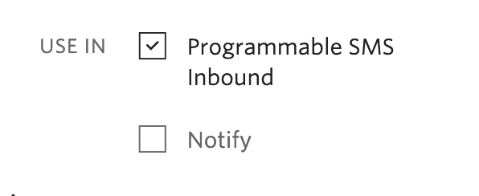
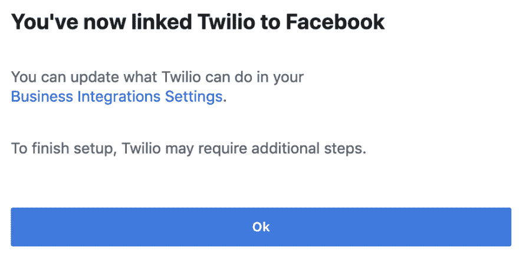
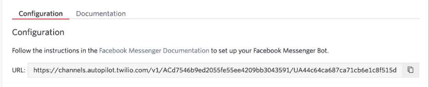
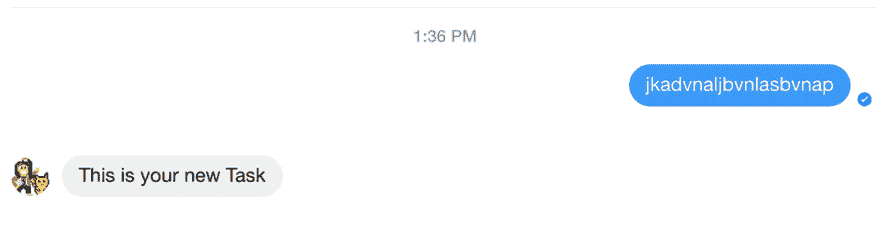
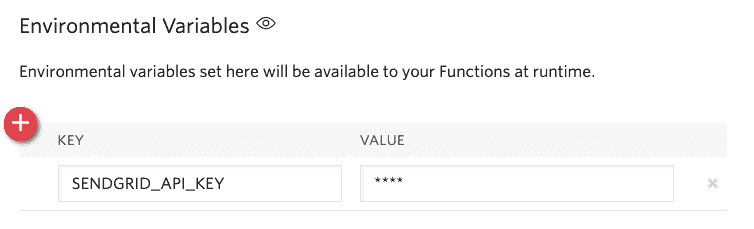
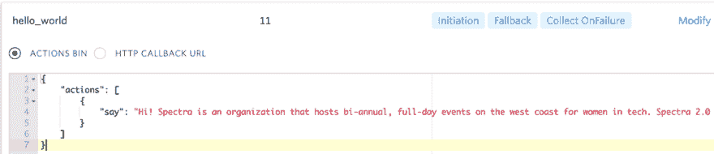
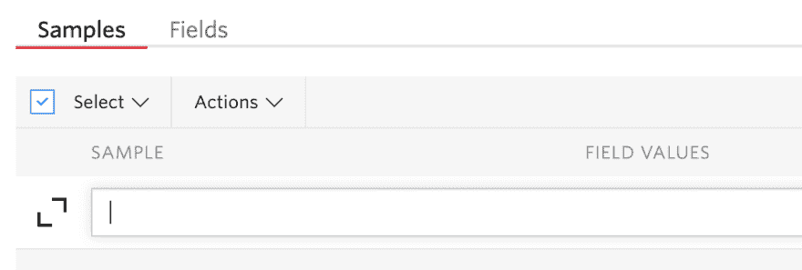
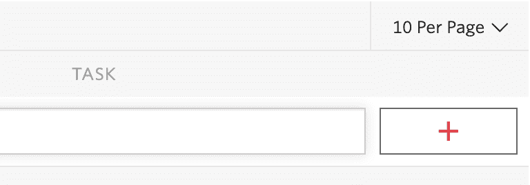
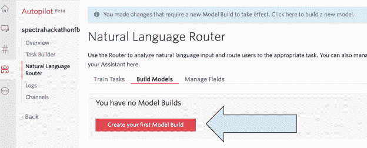
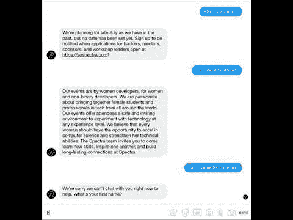

# 用 Twilio 自动驾驶仪、函数和 Node.js 中的 SendGrid 构建一个 Facebook Messenger bot

> 原文：<https://dev.to/twilio/build-a-facebook-messenger-bot-with-twilio-autopilot-functions-and-sendgrid-in-node-js-272b>

[](https://res.cloudinary.com/practicaldev/image/fetch/s--StW3meM9--/c_limit%2Cf_auto%2Cfl_progressive%2Cq_auto%2Cw_880/https://s3.amazonaws.com/com.twilio.prod.twilio-doimg/sendgridspectraautopilot.width-1616.png)

对于活动组织者和企业主来说，提供快速的 24/7 客户服务可能很困难。我帮助运营一个面向女性和非二进制人群的黑客马拉松，我们的脸书页面必须回答很多问题，比如活动何时开始，我们是否在寻找新的组织团队成员，黑客应用程序何时开放，等等！回答这些问题可能会变得重复和乏味——如果我们开发人员有一种方法来自动化这个过程就好了！

[](https://res.cloudinary.com/practicaldev/image/fetch/s--v1o7jusq--/c_limit%2Cf_auto%2Cfl_progressive%2Cq_auto%2Cw_880/https://s3.amazonaws.com/com.twilio.prod.twilio-docs/original_images/-Cb6Jrox4LpmkhX4ujmJsYNNWs_7iqNMT3paen5j2v5foRQhBi1exjI4nLcdYiByrOKQgFttz2GkeQ)

不要担心，这个循序渐进的教程将向您展示如何在 Node.js 中使用 Twilio Autopilot、函数和 SendGrid 构建一个智能 Facebook Messenger bot。如果 Autopilot 助手卡住了，用户想要与人类交谈，助手会将对话移交给企业，通过电子邮件将他们与人类连接起来，以获得无缝的客户体验。
[T3】](https://res.cloudinary.com/practicaldev/image/fetch/s--9wgDNIMP--/c_limit%2Cf_auto%2Cfl_progressive%2Cq_auto%2Cw_880/https://s3.amazonaws.com/com.twilio.prod.twilio-doimg/QRMhIBzZcCW81UIhirA8o6BjMWdoLZ4SiDem128IBJKYcR.width-500.png)

## 设置

在你开始之前，你需要有一个你的品牌或业务的脸书网页。如果您没有，请按照这些说明创建一个。

要用 Twilio 链接你的脸书页面，你必须[安装 Facebook Messenger for auto pilot](https://www.twilio.com/console/channels/XB93e989ba4b741738f51c3f0e12076d42)。在*配置*选项卡中，向下滚动到*属性*并选中*使用 in - >可编程短信入站*，如下图所示。
[](https://res.cloudinary.com/practicaldev/image/fetch/s--4XY19uwB--/c_limit%2Cf_auto%2Cfl_progressive%2Cq_auto%2Cw_880/https://s3.amazonaws.com/com.twilio.prod.twilio-doimg/ncYN3tC6q-fskqXTsG-LjHXeCiIuYQnk9xmAUggsVRIxy.width-1000.png) 
向下滚动到*凭证*部分，点击*脸书登录*按钮进行链接。按照指示将你的脸书页面与你的 Twilio 帐户链接，直到你看到这样一个页面:
[](https://res.cloudinary.com/practicaldev/image/fetch/s--vQRa7g2e--/c_limit%2Cf_auto%2Cfl_progressive%2Cq_auto%2Cw_880/https://s3.amazonaws.com/com.twilio.prod.twilio-doimg/8faACmoC2fkldY9lGpqCpQIRM_YligDDpxUn1hAxH9HxX.width-1000.png) 
再次在*凭证*下，选择你想要为其构建 Bot 的脸书页面，然后点击`Save`。现在转到你的自动驾驶控制台，点击红色加号按钮创建一个新的自动驾驶助手，或者选择一个你已经创建的助手。点击左侧面板上的*频道*，向下滚动选择 *Facebook Messenger* 。复制下面配置 URL。
[](https://res.cloudinary.com/practicaldev/image/fetch/s--MPfNbFxj--/c_limit%2Cf_auto%2Cfl_progressive%2Cq_auto%2Cw_880/https://s3.amazonaws.com/com.twilio.prod.twilio-doimg/uDn-jN-Ayu5UJl1KkbsfpoCqWVqKhO_ATdXjueRcFTiEP.width-1000.png) 
将*回调 URL* 字段中的 URL 粘贴回您的 [Facebook Messenger 配置页面](https://www.twilio.com/console/channels/XB93e989ba4b741738f51c3f0e12076d42)中，然后点击`Save`。现在，带着你的手机或笔记本电脑访问 https://messenger.com T42 或 Facebook Messenger 移动应用程序。发送任何消息到您的脸书页面。您应该会看到回复“这是您的新任务。”
[](https://res.cloudinary.com/practicaldev/image/fetch/s--a_Sjjz-x--/c_limit%2Cf_auto%2Cfl_progressive%2Cq_auto%2Cw_880/https://s3.amazonaws.com/com.twilio.prod.twilio-doimg/IF6aifFAmJW1-LIPbyHVrxgn53ErivhuYwFLO7sJInDlc.width-1000.png) 
最后，您将需要一个 [SendGrid](https://app.sendgrid.com/) 帐户来[获取一个 API 密钥](https://app.sendgrid.com/settings/api_keys)。在 [Twilio 函数配置部分](https://www.twilio.com/console/runtime/functions/configure)，将它保存为环境变量`SENDGRID_API_KEY`，就像这样:
[](https://res.cloudinary.com/practicaldev/image/fetch/s--J-kkct9J--/c_limit%2Cf_auto%2Cfl_progressive%2Cq_auto%2Cw_880/https://s3.amazonaws.com/com.twilio.prod.twilio-doimg/g9BJdoZi-CcAiJmoq6kIJzM97jbaRs6dj-5KElib9_gVw.width-1000.png) 
现在它可以在你的任何 Twilio 函数中被`context.SENDGRID_API_KEY`引用。

## 制定你的第一个任务

Autopilot 让你在任何你想完成的工作中执行不同的“动作”。您可以使用“说”向用户传达一些信息，[“传递”](https://www.twilio.com/docs/autopilot/actions/hand-off)将信息传递给一个人，[“重定向”](https://www.twilio.com/docs/autopilot/actions/redirect)点击 webhook 以执行不同的下一步操作，[“收集”](https://www.twilio.com/docs/autopilot/actions/collect)收集数据，等等。

从[自动驾驶控制台](https://www.twilio.com/console/autopilot)到*任务生成器*为你的自动驾驶助手。将“这是你的新任务”替换为以下内容(以下内容用于我们的女性黑客马拉松页面。)

```
{
        "actions": [
                {
                        "say": "Hi! Spectra hosts full-day events in the Bay Area for women and non-binary people in tech. Spectra 2.0 was held at Domino Data Lab in 2018 and our inaugural women's hackathon was at YouTube HQ in July 2016\. Never fear! We're currently planning our 2019 event."
                }
        ]
} 
```

Enter fullscreen mode Exit fullscreen mode

现在是时候添加一些训练样本来提示我们刚刚添加的`hello_world`响应了。点击*修改*按钮，如下图所示，然后点击*查看样品*。
[](https://res.cloudinary.com/practicaldev/image/fetch/s--v8cmG5ed--/c_limit%2Cf_auto%2Cfl_progressive%2Cq_auto%2Cw_880/https://s3.amazonaws.com/com.twilio.prod.twilio-doimg/DzY_kCfbGToaF74Uq8clRBgEn1wD-6IqwkCv8FrOL6PFx.width-1000.png) 
然后点击文本字段旁边的*展开*按钮，一次在不同行添加多个样本。
[](https://res.cloudinary.com/practicaldev/image/fetch/s--C0JY7wN6--/c_limit%2Cf_auto%2Cfl_progressive%2Cq_auto%2Cw_880/https://s3.amazonaws.com/com.twilio.prod.twilio-doimg/Screen_Shot_2019-03-27_at_11.02.37_AM.width-1600.png) 
随意添加你想要的任何例句或复制如下:
 `What page is this
hi
What is spectra
Hello
What are you
Who is this
Who are you
What business is this
What is this page
What is spectra women's hackathon` 
你应该为每项任务准备至少十个例句，这样你的助手就有足够的数据将用户输入正确地映射到任务中。按文本字段右侧的红色“+”按钮添加它们。
[](https://res.cloudinary.com/practicaldev/image/fetch/s--gy7i_V4E--/c_limit%2Cf_auto%2Cfl_progressive%2Cq_auto%2Cw_880/https://s3.amazonaws.com/com.twilio.prod.twilio-doimg/Screen_Shot_2019-03-27_at_11.04.12_AM.width-1000.png) 
在对自动驾驶助手做了所有这些改动之后，我们需要创建一个新的模型。转到自然语言路由器下的 Build Models 选项卡，创建一个新的模型构建，名称类似于“v0.1”。
[](https://res.cloudinary.com/practicaldev/image/fetch/s--thhlVG3I--/c_limit%2Cf_auto%2Cfl_progressive%2Cq_auto%2Cw_880/https://s3.amazonaws.com/com.twilio.prod.twilio-doimg/image.width-1000.png) 
您可以使用与上述相同的说明为我们的 Facebook Messenger bot 添加其他静态任务。现在让我们继续做一个动态任务。
T31T33】

## 制作动态任务

大多数任务是静态的，需要一个相当简单的答案。然而，假设您想从样本中提取一些重要的数据。该数据可能因用户而异。在女子黑客马拉松的情况下，向脸书页面发送消息的用户可能希望与人类交谈，而黑客马拉松组织者可能希望获得用户的电子邮件来联系他们。
进入 [Twilio 运行时](https://www.twilio.com/console/runtime/overview)的[配置功能部分](https://www.twilio.com/console/runtime/functions/configure)。点击*依赖关系*下的红色“+”按钮，添加一个 NPM 模块。在名称框中输入`@sendgrid/mail`并在*版本*下添加`6.3.1`。
保存后点击*概述*下的*管理*。选择红色“+”按钮创建一个新的“空白”功能。给它一个像“开始与用户的电子邮件对话”这样的名字，并添加一个像`/getemail`这样的路径。将您的函数代码更改如下:

```
exports.handler = function(context, event, callback) {
    const sgMail = require('@sendgrid/mail');
    sgMail.setApiKey(context.SENDGRID_API_KEY);
    const moment = require('moment');
    let memory = JSON.parse(event.Memory);
    let first_name = memory.twilio.collected_data.email_user.answers.first_name.answer || 'to whom it may concern';
    let email = memory.twilio.collected_data.email_user.answers.email.answer;
    console.log("first name ", first_name, "email ", email);
    const msg = {
        to: email,
        from: context.FROM_EMAIL_ADDRESS,
        subject: `Hi From Spectra!`,
        text: `Hi, ${first_name}! This is Lizzie from Spectra. Thanks for speaking with our Facebook bot, and now you're speaking with me! How can I help you?`
    };
    sgMail.send(msg)
    .then(response => {
        const resp = {
            actions: [
            {
                say: "Thank your for talking with our bot. You will receive an email via SendGrid connecting you with a Spectra human soon."
                }         
                ]
        }
        callback(null, resp);
    })
    .catch(err => {
      callback(err);
    });
} 
```

Enter fullscreen mode Exit fullscreen mode

这段代码是做什么的？我们导入一些必需的库，获得用户给我们的答案(他们的名字和电子邮件)，打印出他们的答案，通过 SendGrid 发送电子邮件开始你和用户之间的对话，然后通过 Facebook Messenger 回复用户。
[T3】](https://i.giphy.com/media/3oriNUctGOi5sTtvGg/giphy.gif)

使用`${first_name}`访问用户提供的名字，有助于人性化和个性化交互。

现在回到*Task Builder(创建一个名为`email_user`的新任务)。添加这些示例，或类似的示例:
 `I need help
My questions aren't being answered
You're not helping
This isn't helping
I want to speak to a human
My question isn't answered
Help
help me
aid me
I need a human` 
然后创建一个名为`email_user`的任务，添加以下代码并用您自己的 Twilio 函数 URL:
替换`redirect`中的值

```
{
    "actions": [
        {
            "collect": {
                "name": "email_user",
                "questions": [
                    {
                        "question": {
                            "say": "We're sorry we can't chat with you right now to help. What's your first name?"
                        },
                        "name": "first_name",
                        "type": "Twilio.FIRST_NAME"
                    },
                    {
                        "question": {
                            "say": "What is your email?"
                        },
                        "name": "email",
                        "type": "Twilio.EMAIL"
                    }
                ],
                "on_complete": {
                    "redirect": "https://your-function-url.twil.io/getemail"
                }
            }
        }
    ]
} 
```

Enter fullscreen mode Exit fullscreen mode

这段代码会让机器人提示你输入你的名字，然后在你给它识别为帮助任务匹配的东西发消息后，提示你的电子邮件。然后你的 Twilio 函数被触发发送邮件。

创建一个新的*构建模型*，再次构建你的自动驾驶助手，并通过发送类似“你能帮我吗？”
T3T5】

## 接下来是什么

[](https://res.cloudinary.com/practicaldev/image/fetch/s--BJxOXRCX--/c_limit%2Cf_auto%2Cfl_progressive%2Cq_auto%2Cw_880/https://s3.amazonaws.com/com.twilio.prod.twilio-docs/original_images/DZNiTolJIThVbuYQGZlwZspyIjC6kJKNmwDZaR_rgdvcCkciOVdEq5WJnZ5zhXw4N7Cc0MAV-2VV01) 
Autopilot 让某些任务自动化变得如此容易，同时也让其他任务交给真人来实现人性化的在线交互。我的机器人议程的下一步是为我的[个人科技事件简讯](https://tinyletter.com/lizziepika)建立一个脸书页面和相应的信使机器人。让我知道在评论或在线什么脸书机器人你想建立下一个！

邮箱:[lsiegle@twilio.com](mailto:lsiegle@twilio.com)
推特:[@ lizzie pika](https://twitter.com/lizziepika)T5】GitHub:[elizabethsiegle](https://github.com/elizabethsiegle)