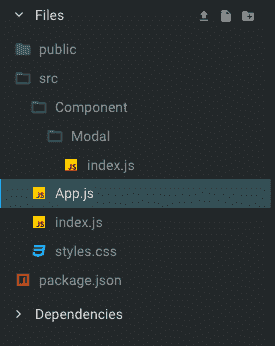
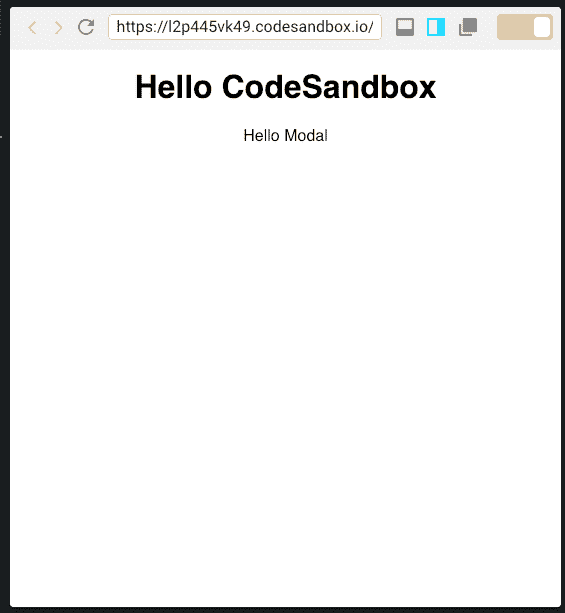
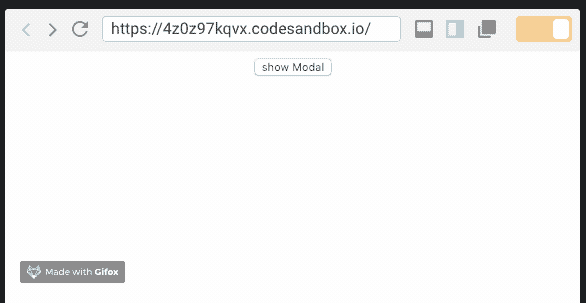
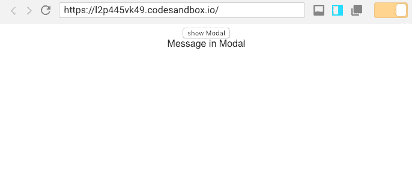
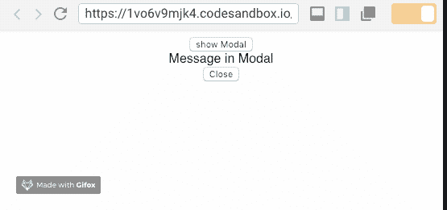
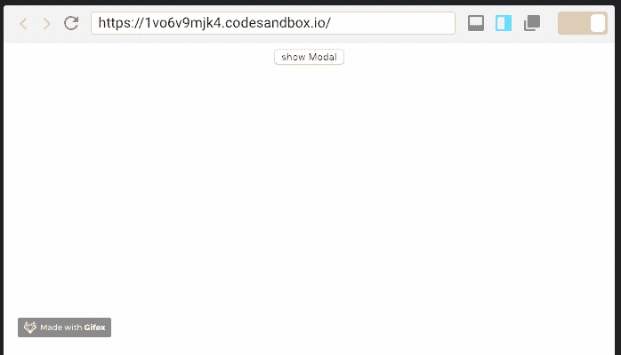
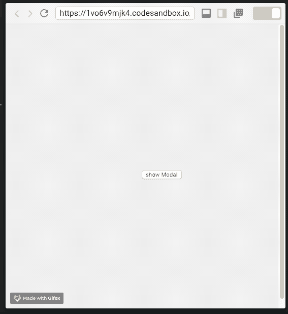
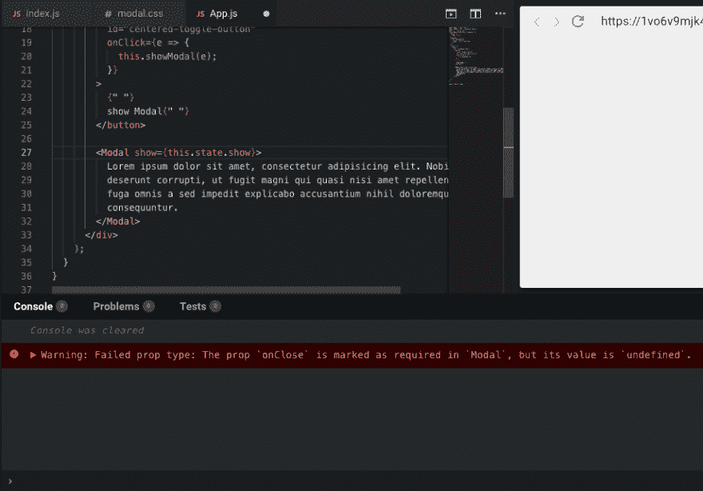

# 用 React 构建一个模态组件

> 原文：<https://dev.to/kris/build-a-modal-component-with-react-2am0>

[](https://res.cloudinary.com/practicaldev/image/fetch/s--plVf9BiU--/c_limit%2Cf_auto%2Cfl_progressive%2Cq_auto%2Cw_880/https://cdn-images-1.medium.com/max/1024/1%2Aim6JRlRr4MQWARQDhKMzsg.png)

我喜欢模态，因为它们节省了加载新标签所需的大量时间。

在这篇文章中，我们将学习如何从零开始用 React 创建一个很棒的可重用模型。本教程的步骤如下:

#### 我们会学到什么

1.  **创建一个简单的文件结构**
2.  **使用 react 切换状态构建一个简单的模态**
3.  **用道具在组件间传递数据**
4.  **警告用户在使用组件**时传递参数

**提示**:当使用 React 组件时，用 [Bit](https://github.com/teambit/bit) 共享它们，这样它们就成为可重用的构建模块，你的团队可以很容易地在你的项目间共享、使用和同步。当你用一个共享的乐高积木盒子建造时，你会建造得更快。试试看:

[位共享和构建代码组件](https://bitsrc.io)

### 创建模态组件结构

[](https://res.cloudinary.com/practicaldev/image/fetch/s--ft-ODFi6--/c_limit%2Cf_auto%2Cfl_progressive%2Cq_auto%2Cw_880/https://cdn-images-1.medium.com/max/275/0%2AOZcDy4d7ilohPW95.png)

所以，首先让我们添加样板代码。

```
import React from "react";

export default class Modal extends React.Component {
  render() {
    return <div>Hello Modal</div>;
  }
} 
```

然后，让我们在主应用程序中包含模态。

```
import React from "react";
import Modal from "./Component/Modal";
import "./styles.css";
class App extends React.Component {
  render() {
    return (
      <div className="App">
        <h1>Hello CodeSandbox</h1>
        <Modal />
      </div>
    );
  }
}

export default App; 
```

现在将 App 组件注入到入口点。

```
import React from "react";
import ReactDOM from "react-dom";
import App from "./App";
const rootElement = document.getElementById("root");
ReactDOM.render(<App />, rootElement); 
```

这是初始设置后的输出。

[](https://res.cloudinary.com/practicaldev/image/fetch/s--90FNTszj--/c_limit%2Cf_auto%2Cfl_progressive%2Cq_auto%2Cw_880/https://cdn-images-1.medium.com/max/565/0%2A4Mb25T4NxAi3asMe.png)

### 切换模态的状态

模态的机制是**显示**和**隐藏。**这在 react 中很容易实现，因为有内置的切换状态。

首先，创建一个按钮来切换状态。

```
<button onClick={e => {
              this.showModal();
         }}
          > show Modal </button> 
```

现在创建一个 showModal 函数

```
state = {
    show: false
  };
  showModal = e => {
    this.setState({
      show: true
    });
  }; 
```

现在将此状态应用于模态组件。

```
<Modal show={this.state.show} /> 
```

接下来，从模式进行条件渲染，条件是显示状态。

如果 show 为 false，不要忘记返回 null，这不会呈现任何内容。当 show 为 true 时渲染组件。

```
export default class Modal extends React.Component {
  render() {
      if(!this.props.show){
          return null;
      }
    return <div>Hello Modal</div>;
  }
} 
```

让我们单击按钮——输出应该是这样的。

[](https://res.cloudinary.com/practicaldev/image/fetch/s--iCa0T-kV--/c_limit%2Cf_auto%2Cfl_progressive%2Cq_66%2Cw_880/https://cdn-images-1.medium.com/max/586/0%2AhaU55EWBE8fB5zLU.gif)

### 使内容动态化

现在，Modal 中的内容是硬编码的。让我们通过传递一个道具来使它动态化。

```
<Modal show={this.state.show}>Message in Modal</Modal> 
```

将*消息*替换为模态组件中的{this.props.children}。

```
export default class Modal extends React.Component {
  render() {
    if (!this.props.show) {
      return null;
    }
    return <div>{this.props.children}</div>;
  }
} 
```

这将呈现传递给该组件的任何内容，这对于动态模式来说是完美的。

[](https://res.cloudinary.com/practicaldev/image/fetch/s--GMGCdfYW--/c_limit%2Cf_auto%2Cfl_progressive%2Cq_auto%2Cw_880/https://cdn-images-1.medium.com/max/686/0%2ADfn8ehwpZ-ORUCwd.png)

### 关闭模态

打开一个模态后，需要将其关闭。

让我们添加一个新的关闭按钮。

```
return (
      <div>
        <div>{this.props.children}</div>
        <div>
          <button
            onClose={e => {
              this.onClose(e);
            }}
          >
            Close
          </button>
        </div>
      </div>
    ); 
```

定义 onClose 函数。

```
onClose = e => {
    this.props.show = false;
  }; 
```

现在将显示状态设置为 false，这将使模式隐藏。

[](https://res.cloudinary.com/practicaldev/image/fetch/s--FmO-JGDr--/c_limit%2Cf_auto%2Cfl_progressive%2Cq_66%2Cw_880/https://cdn-images-1.medium.com/max/555/0%2AKk8LJZmyAaUGtgmt.gif)

等等！它不起作用，因为显示状态是在应用程序组件中定义的。

因此，将一个值传递回应用程序组件。

```
onClose = e => {
    this.props.onClose && this.props.onClose(e);
  }; 
```

现在将整个事件对象传递回 App 组件，然后触发 showModal

```
<Modal onClose={this.showModal} show={this.state.show}>
          Message in Modal
</Modal> 
```

并切换显示状态:

```
showModal = e => {
    this.setState({
      show: !this.state.show
    });
  }; 
```

结果隐藏了关闭按钮，正如预期的那样。

[](https://res.cloudinary.com/practicaldev/image/fetch/s--yMu_Jbmc--/c_limit%2Cf_auto%2Cfl_progressive%2Cq_66%2Cw_880/https://cdn-images-1.medium.com/max/698/0%2A_JgVDqCrMskMBSYz.gif)

### 造型情态

现在你看不到任何模态体，因为它不在那里。

让我们创建 modal.css。

[](https://res.cloudinary.com/practicaldev/image/fetch/s--sxBgtYNk--/c_limit%2Cf_auto%2Cfl_progressive%2Cq_auto%2Cw_880/https://cdn-images-1.medium.com/max/1024/0%2AB7yRwaeTMLR7Nc4Y.png)

点击获取 [Codepen 中的 CSS 片段。](https://codepen.io/chriscoyier/pen/NgNymx)

还包括 Modal.js 的 JavaScript，并在返回的 div 中添加一个类 Modal，以及更多如下所示的类。

```
import React from "react";
import "./modal.css";

export default class Modal extends React.Component {
  onClose = e => {
    this.props.onClose && this.props.onClose(e);
  };
  render() {
    if (!this.props.show) {
      return null;
    }
    return (
      <div class="modal" id="modal">
        <h2>Modal Window</h2>
        <div class="content">{this.props.children}</div>
        <div class="actions">
          <button class="toggle-button" onClick={this.onClose}>
            close
          </button>
        </div>
      </div>
    );
  }
} 
```

在 App 组件中，向按钮添加一个类 toggle-button。

```
<div className="App">
        <button
          class="toggle-button"
          id="centered-toggle-button"
          onClick={e => {
            this.showModal(e);
          }}
        > 
```

现在，结果！是不是很美？💅

[](https://res.cloudinary.com/practicaldev/image/fetch/s--R7cQ2WYy--/c_limit%2Cf_auto%2Cfl_progressive%2Cq_66%2Cw_880/https://cdn-images-1.medium.com/max/567/0%2Af4qzg_2ajLYRriO6.gif)

### 需要 onClose

如果调用 Modal 的组件没有通过 onClose，那么 Modal 不会关闭，因为 show 状态没有任何效果。要解决这个问题，请警告组件传递 onClose。

导入道具类型。

```
import PropTypes from "prop-types"; 
```

将以下内容添加到文件的底部，在类的外部。

```
Modal.propTypes = {
  onClose: PropTypes.func.isRequired,
  show: PropTypes.bool.isRequired
}; 
```

这将导致如下警告。

[](https://res.cloudinary.com/practicaldev/image/fetch/s--S8dzUggA--/c_limit%2Cf_auto%2Cfl_progressive%2Cq_auto%2Cw_880/https://cdn-images-1.medium.com/max/921/0%2AqY2Lz5w2h9Lac1sf.png)

### 重述

在本教程中，您学习了如何实现使用 div 创建的简单模态组件，并使用切换状态来显示和隐藏模态。我们经历了从创建文件结构到样式化模型的不同步骤。你可以在 GitHub 上找到完整的代码:

[krissnawat/简单反应模式](https://github.com/krissnawat/simple-react-modal)

希望你喜欢这篇文章，并请随时删除一些👏并在下面评论问我任何事情！我总是很乐意交谈和帮助。

### 了解更多

*   [在 React 中加快开发的 5 种工具](https://blog.bitsrc.io/5-tools-for-faster-development-in-react-676f134050f2)
*   [如何在 React 中写出更好的代码](https://blog.bitsrc.io/how-to-write-better-code-in-react-best-practices-b8ca87d462b0)
*   【2019 年反应状态管理状态

* * *