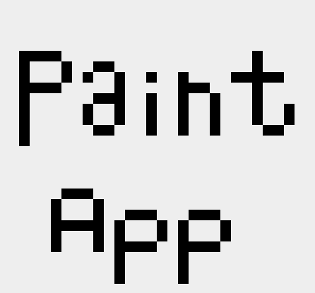
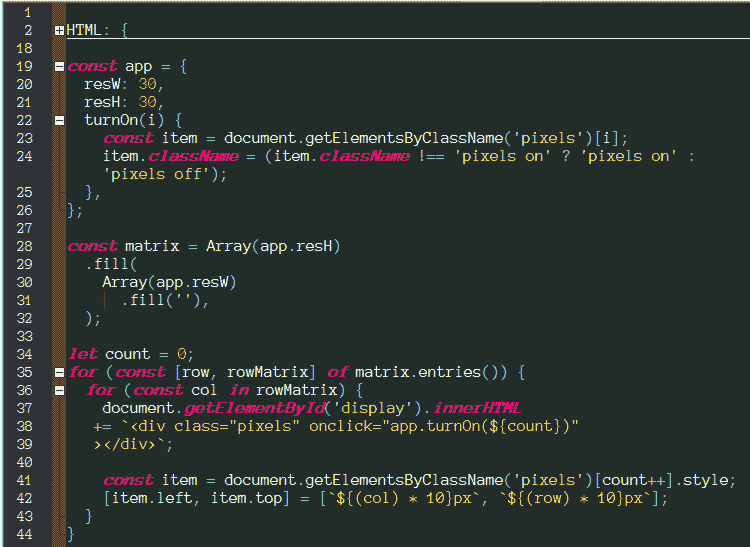
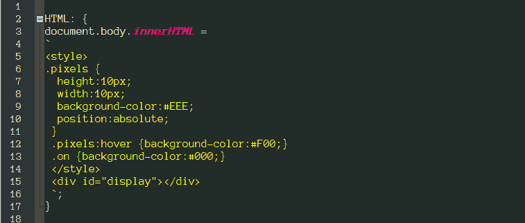
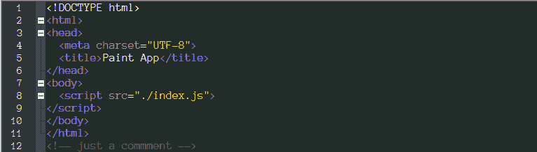
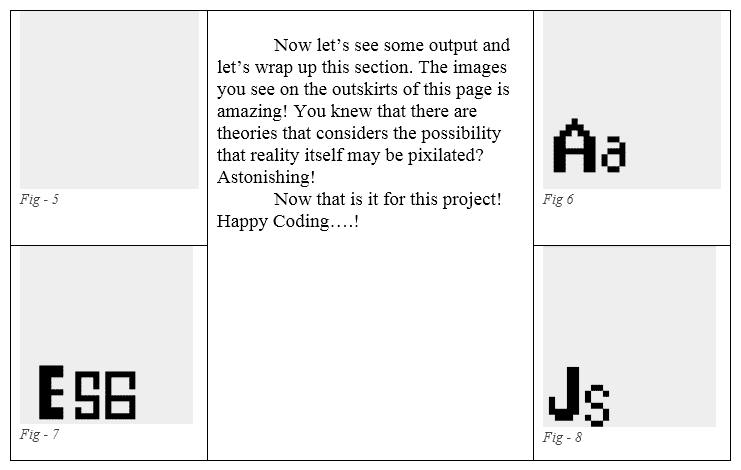

# 10 分钟搭建一个画图 App！

> 原文：<https://dev.to/annashorthead/build-a-paint-app-in-10-minutes-g7o>

 
在本教程中，我将详细告诉你如何用 javaScript/ES6 在 10 分钟或更短的时间内构建一个画图应用程序，所以振作起来，享受这段旅程吧！
现在这只是一个简单的“绘画应用”，但基于同样的逻辑，许多复杂的软件都可以开发出来。
通过下面的练习，保持简单，顺其自然:
1)使用 javaScript/ES6 生成 HTML & CSS。
2)构建一个能够通过改变 app.resW & app.resH 变量来改变分辨率的“画图应用”。
3)显示屏应显示一个名为 matrix 的二维数组。
4)应使用复合循环来遍历矩阵/多维数组。
下面是我们掌握的代码:
 
图-1。

HTML 部分是:
 
图-2。

在浏览器中查看:
 
图-3。
现在让我来叙述每一行代码，这样我们可以更好地学习:
首先是 HTML 标签，它涵盖了我们代码的大部分 HTML & CSS 生成过程。
有一个名为 pixels 的类属于我们画布上的每个像素，它使我们的像素呈方形。现在，在现代，实际像素是屏幕上那些非常小的方块之一，然而在过去，那些方块曾经像我们应用程序中的方块一样巨大，如果我们试图生成 1px，600px*800px 的画布，我们的浏览器可能会崩溃，所以我们生成的是 10px，30px*30px 的画布。
像素上有一个悬停伪类，它高亮显示(红色)像素，以向用户显示他们的标识符/光标正在瞄准哪个像素。
有一个名为 on 的类，它将白色像素的颜色改为黑色像素，使用户能够用黑色在画布上绘画和书写。
有一个 id 为“display”的分隔线，它会将我们所有的像素夹在其中。我们代码的 HTML 标签部分到此结束。
然后在第 19 行，我们有一个名为“app”的对象，在这个对象中，我们绘制了应用程序的一些重要策略，我们在 resW 属性中建立了应用程序画布中每行像素的宽度和像素数量，在 resH 属性中建立了应用程序画布中每列像素的高度和像素数量。最后，我们有了在黑白颜色之间切换像素的方法，这样我们就可以在画布上绘图了。到目前为止，我们只是存储数据，这是展开可变画布的先决条件。
然后，在第 29 行到第 33 行，我们有一个名为“矩阵”的变量，这是我们画布中每个像素的记录，如果我们需要将我们的绘图导出到一个单独的文件中保存，我们实际上将保存一个像素数据的二维矩阵。这段代码是这样叙述的“声明一个名为 matrix 的变量，在这个变量中我们有一个有(resH)个成员的数组，在这个数组中所有的成员都是数组，后面的每个数组都有(resW)个成员，每个成员都是一个空字符串”。
现在，从第 35 行到第 47 行，我们有一个双向循环，从我们的矩阵中提取每个像素数据，并将其导向第 39 行到第 41 行的显示；现在，在第 43 行到第 46 行，我们把每个像素放到合适的位置。第 36 & #37 行的 row & col 变量是索引号，用作像素的坐标。代码是这样叙述的:“从矩阵中提取第一个像素，并将其分布在(#display)画布上，给这个像素一个类`pixels`,并能够在单击时在黑色和白色之间切换；将该像素放置在坐标(x，y)上，其中 x 等于其在矩阵中的垂直位置的 10 倍，y 等于其在矩阵中的水平位置的 10 倍”。
 
这段代码摘自排名第一的畅销书[简单来说就是雷之声的 ES6。](https://www.amazon.com/dp/B07QGNW4FY/ref=cm_sw_r_tw_awdb_t1_x_O7MQCb95VJPM4)简单来说，如果你刚开始网络开发培训，ES6 是一本很棒的书。这本书将为你省下一年又一年令人沮丧的教训。这些课程结构良好，每一节都以简短的介绍开始，随后是大量的例子供学习和使用；每章都以一个详细解释的实践项目结尾，然后是该章的总结，以真正浓缩所学的技能。如果你喜欢 JavaScript，那么这本书就是给你的！如果你想掌握 JavaScript，那么这本书就是给你的！

现在就从亚马逊给自己买一本排名第一的新书和畅销书吧！

关注我们 [@RayShortHead](https://twitter.com/rayshorthead) 。&[@安娜肖特海德](https://twitter.com/annashorthead)。