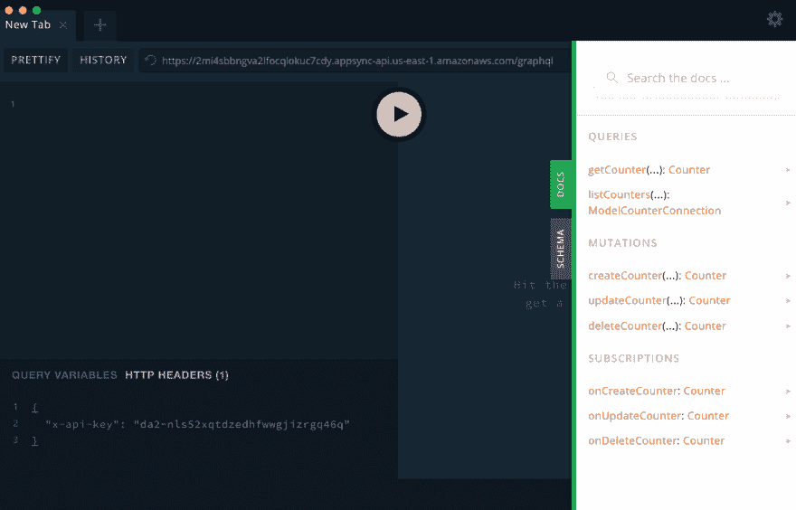

# 介绍 AWS Amplify 无服务器的强大功能

> 原文：<https://dev.to/trek10inc/build-a-real-time-serverless-visitor-counter-with-aws-amplify-1c0l>

# 关于无服务器的一个小故事

自 2014 年以来，我的日常工作一直是帮助人们在亚马逊网络服务(AWS)上构建和维护东西。从最小众的初创公司到家喻户晓的公司，我都曾帮助过各种组织，从实时库存管理到披萨的机器学习等等。

我看到容器变得流行起来。我看到“无服务器”这个词被用得太多了，以至于我都不知道它到底是什么意思了。不过，有一点是肯定的，我参与创建的现实世界无服务器系统已经处理了数十亿次交易，是我职业生涯中见过的维护和操作最愉快的系统之一。

那么，我为什么喜欢无服务器，这有什么关系呢？你们都记得 2018 年初的 Spectre/Meltdown 精神错乱，当时发现了芯片级漏洞，每个人都吓坏了，争先恐后地修复它？我操作的无服务器环境在大多数组织预订会议室来建立响应计划之前就被修补了。

<figure>

[](https://i.giphy.com/media/bDmK86uwmptio/giphy.gif)

<figcaption>Here is a real depection of myself and the Trek10 team patching our Clients' serverless environments the night of the Spectre/Meltdown.</figcaption>

</figure>

我收到的一些最有趣的罚单和回复都是这样的:“你好，我们来自 X 公司的安全团队，我们需要一份完整的维护和审计计划，以便尽快解决最近的安全问题。”没有什么比在漏洞公开之前就链接到 AWS 补丁说明来说“已经处理”更好的了。

最终，您希望交付商业价值。通过使用无服务器实践，您也可以利用最优秀、最聪明的计算人员的操作，只需花费很少的钱。不用担心服务器补丁、网络、ssh 密钥等等，您可以专注于交付您的核心价值。

# 交易的工具

现在有很多选择，从[无服务器框架](https://serverless.com/)到 [Apex Up](https://github.com/apex/up) 以及许多其他提供商和框架(其中许多专注于特定的用例或语言)。

这些天来，我的大多数新项目都是从 AWS Amplify CLI 开始的。AWS Amplify CLI 在某种程度上是对云复杂性的包装，提供了自以为是的解决方案，同时还提供了您需要的可定制性。

确保您有 Node.js 8.11.x 或更高版本以及一个 AWS 帐户(不要担心配置任何东西，我们只需要这个帐户)，然后我们就可以开始了。

我们今天的项目将会是过去的一次爆炸，有一点小小的改变。还记得那些小的“访客柜台”徽章吗？每个人过去都在他们网站的底部，通常就在他们国家国旗的动画 gif 旁边。

让我们这样做，但更好...我们将使**成为实时**！

首先安装带有`npm install -g @aws-amplify/cli`的 Amplify CLI，并在您的终端中运行`amplify configure`。您将在终端和浏览器窗口的组合中完成各个步骤，最后您将创建并配置一个新的 IAM 用户。

```
$ npm install -g @aws-amplify/cli
$ amplify configure
Follow these steps to set up access to your AWS account:

Sign in to your AWS administrator account:
https://console.aws.amazon.com/
Press Enter to continue

Specify the AWS Region
? region:  us-east-1
Specify the username of the new IAM user:
? user name:  captain-counter
Complete the user creation using the AWS console
https://console.aws.amazon.com/iam/home?region=undefined#/users$new?step=final&accessKey&userNames=captain-counter&permissionType=policies&policies=arn:aws:iam::aws:policy%2FAdministratorAccess
Press Enter to continue

Enter the access key of the newly created user:
? accessKeyId:  AKIAWTXIHO**********
? secretAccessKey:  AfGA3kTlGyv6F0GMyzQS********************
This would update/create the AWS Profile in your local machine
? Profile Name:  captain-counter

Successfully set up the new user. 
```

Enter fullscreen mode Exit fullscreen mode

让我们建立我们的项目目录并初始化我们的 amplify 应用程序。

```
$ mkdir counter && cd counter
$ amplify init
Note: It is recommended to run this command from the root of your app directory
? Enter a name for the project counter
? Enter a name for the environment dev
? Choose your default editor: Visual Studio Code
? Choose the type of app that you're building javascript
Please tell us about your project
? What javascript framework are you using none
? Source Directory Path:  src
? Distribution Directory Path: dist
? Build Command:  npm run-script build
? Start Command: npm run-script start
Using default provider  awscloudformation

For more information on AWS Profiles, see:
https://docs.aws.amazon.com/cli/latest/userguide/cli-multiple-profiles.html

? Do you want to use an AWS profile? Yes
? Please choose the profile you want to use captain-counter
⠙ Initializing project in the cloud... 
```

Enter fullscreen mode Exit fullscreen mode

这些步骤(大部分使用默认答案)最终会在你的 AWS 账户中运行一个基本的 amplify 应用程序。现在做的不多，还是继续编码吧。一定要注意；我选择不使用任何特定的框架。我想让这个*非常*轻量级，因为我们将在其他网站加载脚本，我们去的地方不需要框架。

# 添加 API

如果我们没有追踪点击率的方法，我们的小项目就不会很成功。我们将利用 GraphQL API 和一个名为 AWS AppSync 的服务。AppSync 是一个完全托管的 GraphQL 解决方案，允许您快速而轻松地映射到各种数据源，我个人已经用它做了许多事情，它是标签上所说的一切，然后还有一些。

```
$ amplify add api
? Please select from one of the below mentioned services: GraphQL
? Provide API name: counter
? Choose an authorization type for the API API key
? Do you have an annotated GraphQL schema? No
? Do you want a guided schema creation? No
? Provide a custom type name Counter
Creating a base schema for you... 
```

Enter fullscreen mode Exit fullscreen mode

很好，现在让我们打开`amplify/backend/api/counter/schema.graphql`并改变模式。

```
type  Counter  @model  {  id:  String!  hits:  Int  } 
```

Enter fullscreen mode Exit fullscreen mode

现在有趣的部分，让我们部署我们的 API。在幕后，Amplify 将您的模式编译为各种查询和变化，更新您的 CloudFormation 模板以管理您的 API 所需的所有资源，代码生成一个小客户端以访问您的 API，最后通过 CloudFormation 将一切部署到您的 AWS 帐户。

```
$ amplify push

Current Environment: dev

| Category | Resource name | Operation | Provider plugin   |
| -------- | ------------- | --------- | ----------------- |
| Api      | counter       | Create    | awscloudformation |
? Are you sure you want to continue? Yes

GraphQL schema compiled successfully.
Edit your schema at /Users/jshort/Work/counter/amplify/backend/api/counter/schema.graphql or place .graphql files in a directory at /Users/jshort/Work/counter/amplify/backend/api/counter/schema
? Do you want to generate code for your newly created GraphQL API Yes
? Choose the code generation language target javascript
? Enter the file name pattern of graphql queries, mutations and subscriptions src/graphql/**/*.js
? Do you want to generate/update all possible GraphQL operations - queries, mutations and subscriptions Yes
? Enter maximum statement depth [increase from default if your schema is deeply nested] 2
⠦ Updating resources in the cloud. This may take a few minutes...

....sometime later

GraphQL endpoint: https://ol2t5s4qlvbidcx2mwmigeya4m.appsync-api.us-east-1.amazonaws.com/graphql
GraphQL API KEY: da2-rbk5t2xpuvevlm6qza4onbly7m 
```

Enter fullscreen mode Exit fullscreen mode

在这个过程的最后，您将获得一个 GraphQL 端点和 API 密匙。您可以使用它们立即开始使用和探索您的 API。使用 GraphQL Playground 或失眠症可能是最快的玩法。

<figure>

[](https://res.cloudinary.com/practicaldev/image/fetch/s--phB0Txwl--/c_limit%2Cf_auto%2Cfl_progressive%2Cq_auto%2Cw_880/https://thepracticaldev.s3.amazonaws.com/i/91o7bsyc2jsvxjp1fui4.png)

<figcaption>Example configured GraphQL Playground, note the HTTP headers for authorization and all the pre-generated CRUD operations</figcaption>

</figure>

如果你检查你的 API，你会注意到普通 CRUD 操作(创建、读取、更新、删除)的大量预建功能。对于我们的用例，我们不需要它，我们将替换我们自己的。

更改您的`amplify/backend/api/counter/schema.graphql`来反映这个更加锁定的模式。我们去掉了几乎所有的 CRUD 操作，重命名了一些操作，并添加了一个过滤的**订阅**方法。如果你想了解这方面的更多信息，请查看 GraphQL 转换的 [AWS Amplify 文档](https://aws-amplify.github.io/docs/cli/graphql)。

```
type  Counter  @model(  queries:  {  get:  "counter"  },  mutations:  {  create:  "hit"  },  subscriptions:  null  )  {  id:  String!  hits:  Int  }  type  Subscription  {  hits(id:  String!):  Counter  @aws_subscribe(mutations:  ["hit"])  } 
```

Enter fullscreen mode Exit fullscreen mode

在幕后，Amplify 正在为我们管理一个 DynamoDB 表。一个可以处理巨大负载的托管 NoSQL 数据库(在我的经验中是最好的无服务器数据库之一)。

接下来，我们将定制我们的 GraphQL 解析器，以利用 Amazon DynamoDB 中的[原子更新](https://docs.aws.amazon.com/amazondynamodb/latest/developerguide/WorkingWithItems.html#WorkingWithItems.AtomicCounters)，这意味着对于计数器的每一个“命中”变异，我们将“命中”列增加 1。

Amplify 为我们提供了一种便捷的方式，用`amplify/backend/api/counter/resolvers`中的`resolvers`文件夹覆盖默认的解析器实现。创建一个名为`Mutation.hit.req.vtl`的文件，并在下面弹出[速度模板语言](https://docs.aws.amazon.com/appsync/latest/devguide/resolver-mapping-template-reference-programming-guide.html)代码。

```
$util.qr($context.args.input.put("__typename", "Counter"))

#if( $util.isNullOrBlank($context.args.input.id) )
    $util.error("You MUST pass an `id` parameter")
#else

{
  "version": "2017-02-28",
  "operation": "UpdateItem",
  "key": {
      "id": $util.dynamodb.toDynamoDBJson($ctx.args.input.id)
  },
  "update": {
    "expression": "SET #typename = :typename ADD hits :one",
    "expressionNames": {
        "#typename": "__typename"
    },
    "expressionValues": {
        ":one": $util.dynamodb.toDynamoDBJson(1),
        ":typename": $util.dynamodb.toDynamoDBJson("Counter")
    }
  }
}
#end 
```

Enter fullscreen mode Exit fullscreen mode

另一个快速的`amplify push`(继续并同意提示)拿起你自己选择的饮料，然后回来一个闪亮的新 API 供我们使用。

继续在您的 GraphQL 编辑器中进行尝试。

```
mutation{  hit(input:  {  id:  "test"  }){  id  hits  }  } 
```

Enter fullscreen mode Exit fullscreen mode

您应该会得到类似这样的响应。

```
{  "data":  {  "hit":  {  "id":  "test",  "hits":  118  }  }  } 
```

Enter fullscreen mode Exit fullscreen mode

太棒了。下一步，给我们自己做一个小柜台。

从您的项目根。你会在那里看到一些其他的文件和文件夹，比如`aws-exports.js`和`graphql`。用以下内容创建一个名为`package.json`的新文件。

```
{  "name":  "counter",  "version":  "1.0.0",  "description":  "",  "main":  "index.js",  "scripts":  {  "test":  "echo \"Error: no test specified\" && exit 1",  "start":  "parcel index.html"  },  "author":  "",  "license":  "ISC",  "devDependencies":  {  "parcel-bundler":  "^1.12.3"  },  "dependencies":  {  "aws-amplify":  "^1.1.28"  },  "browserslist":  [  "last 2 Chrome versions"  ]  } 
```

Enter fullscreen mode Exit fullscreen mode

一旦您将文件放在适当的位置并保存 run `npm install`，这可能需要几分钟。作为其中的一部分，我们正在安装 aws-amplify Javascript SDK，以及[package](https://parceljs.org/)，这是一个零配置捆绑器，因此我们可以捆绑我们的模块，利用 SDK，并使其易于以后的开发。

<figure>[](https://res.cloudinary.com/practicaldev/image/fetch/s--jKNdgo_D--/c_limit%2Cf_auto%2Cfl_progressive%2Cq_auto%2Cw_880/https://thepracticaldev.s3.amazonaws.com/i/zu3pcmym9cpfcl232evp.jpeg) 

<figcaption>不要放弃，我们就快到了！</figcaption>

</figure>

好了，大回报前的最后两位。

首先，在`src`中创建一个`index.html`文件。

```
<!DOCTYPE html>
<html>
<head>
    Counter Widget
</head>
<body>
    <div data-counter-id="test">Loading...</div>
    <script type="text/javascript" src="/index.js"></script>
</body>
</html> 
```

Enter fullscreen mode Exit fullscreen mode

我们需要这个来钩住包裹。请注意，你可以在 React，Vue，Svelte 中做这些，或者使用 WebPack 或任何可以让你的船漂浮的东西。Amplify SDK 得到了利用，其余的代码是为了保持简单并展示幕后的强大功能而编写的，我并不想改变任何特定的前端方法。

最终，我们获得了巨大的回报。让我们也在`src`中创建`index.js`。

```
import Amplify, { API, graphqlOperation } from 'aws-amplify';
import awsmobile from './aws-exports';

Amplify.configure(awsmobile);

import * as mutations from "./graphql/mutations";
import * as subscriptions from "./graphql/subscriptions";

/*
Find all the unique counter id on the page.
Send a single hit request for each unique ID.
Subscribe to all updates for each one as well.
*/

const init = function createUpdateCounters() {
    const countersToUpdate = document.querySelectorAll(`[data-counter-id]`);
    const counterHitIdSet = new Set();

    countersToUpdate.forEach((counter) => {
        counterHitIdSet.add(counter.dataset.counterId);
    })

    counterHitIdSet.forEach((id) => {
        hitCounter(id);
    });
}

/*
Send a mutation to your GraphQL to let it know we hit it.
This also means we get back the current count, including our own hit.
*/
async function hitCounter(id) {
    const counter = await API.graphql(graphqlOperation(mutations.hit, { input: { id } }));
    updateText(counter.data.hit)
    subscribeCounter(id)
}

function updateText(counter) {
    const countersToUpdate = document.querySelectorAll(`[data-counter-id=${counter.id}]`);
    countersToUpdate.forEach(function (elem) {
        elem.innerHTML = counter.hits;
    })
}

/*
Subscribe via WebSockets to all future updates for the counters
we have on this page.
*/
function subscribeCounter(id) {
    const subscription = API.graphql(
        graphqlOperation(subscriptions.hits, { id })
    ).subscribe({
        next: (counter) => updateText(counter.value.data.hits)
    });
}

// On dom loaded, kick things off
document.addEventListener("DOMContentLoaded", function () {
    init();
}); 
```

Enter fullscreen mode Exit fullscreen mode

评论包含了关于正在发生的事情的大部分提示，但是 Amplify 和 GraphQL 为我们做了大量的工作。

继续在终端中运行`npm start`,并访问它所说的启动本地开发服务器的 URL。如果一切正常，您应该能够在简短的`Loading...`消息后看到一个计数器。

<figure>

打开多个选项卡以查看计数器随着更多点击的累积而增加，点击一次或两次刷新以查看更改实时传播到所有打开的选项卡。

<figcaption>Check out the little demo below, see how many visits have hit this page and codepen! Open it in a couple tabs and hit "rerun" button to watch real-time updates.</figcaption>

</figure>

[https://codepen.io/shortjared/embed/wbEBWw?height=600&default-tab=result&embed-version=2](https://codepen.io/shortjared/embed/wbEBWw?height=600&default-tab=result&embed-version=2)

所以，我们成功了！这里有几个重要的要点需要考虑。我们所做的是在生产就绪、可大规模扩展的服务上运行。这可以很容易地扩展到每秒数千个请求(在取消一些默认限制之后)。我们实际编写的代码非常少，允许 Amplify 完成繁重的工作，更不用说一切实际上都是“基础设施即代码”，这意味着我们可以按需创建全新的应用实例和环境。

无服务器的理念是卸载“无差别的重担”，利用 AWS Amplify 和 AppSync 等工具和服务让我们更接近产生商业价值，而不是管理基础设施。