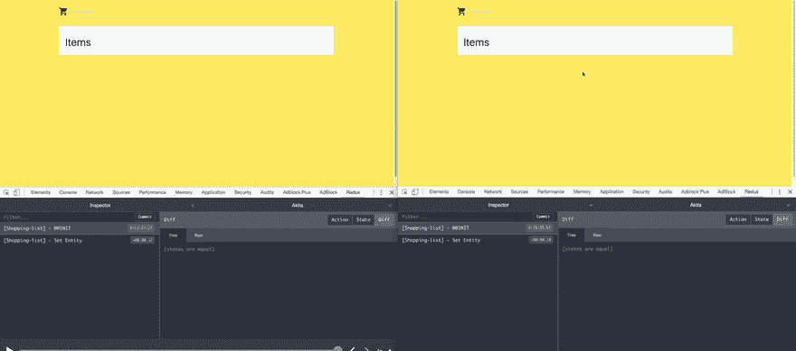

# 用 Angular，Socket 构建一个实时购物清单 App。木卫一和秋田

> 原文：<https://dev.to/arielgueta/build-a-real-time-shopping-list-app-with-angular-socket-io-akita-26cl>

在本文中，我们将使用 Angular、Akita 和 Socket.io 构建一个实时购物清单。

## 什么是秋田？

[Akita](https://netbasal.gitbook.io/akita/) 是一种状态管理模式，构建在 RxJS 之上，它采用 Flux 中的多个数据存储和 Redux 中的不可变更新的思想，以及流数据的概念，来创建可观察的数据存储模型。

秋田鼓励简单。它省去了创建样板代码的麻烦，并提供了具有适度学习曲线的强大工具，适合有经验和无经验的开发人员。

## 创建服务器

我们将从创建服务器开始。首先，我们安装快速应用程序生成器:

```
npm install express-generator -g 
```

接下来，我们创建一个新的 express 应用程序:

```
express --no-view shopping-list 
```

现在，删除`app.js`文件中的所有内容，并用以下代码替换它:

```
const app = require('express')();
const server = require('http').Server(app);
const io = require('socket.io')(server);

let list = [];

io.on('connection', function(socket) {

  // Send the entire list
  socket.emit('list', {
    type: 'SET',
    data: list
  });

  // Add the item and send it to everyone
  socket.on('list:add', item => {
    list.push(item);
    io.sockets.emit('list', {
      type: 'ADD',
      data: item
    });
  });

  // Remove the item and send the id to everyone
  socket.on('list:remove', id => {
    list = list.filter(item => item.id !== id);

    io.sockets.emit('list', {
      type: 'REMOVE',
      ids : id
    });
  });

  // Toggle the item and send it to everyone
  socket.on('list:toggle', id => {
    list = list.map(item => {
      if( item.id === id ) {
        return {
          ...item,
          completed: !item.completed
        }
      }
      return item;
    });

    io.sockets.emit('list', {
      type: 'UPDATE',
      ids : id,
      data: list.find(current => current.id === id)
    });
  })
});

server.listen(8000);

module.exports = app; 
```

我们定义了一个新的`socket-io`服务器，并将用户列表保存在内存中(在现实生活中，它将保存在数据库中)。我们根据客户机中需要的动作创建了几个监听器:SET (GET)、ADD、REMOVE、UPDATE。

请注意，我们使用了一种特定的模式。我们发送动作`type`和动作`payload`。我们将很快看到我们如何使用秋田。

## 创建角度应用

首先，我们需要安装`angular-cli`包并创建一个新的 Angular 项目:

```
npm i -g @angular/cli
ng new akita-shopping-list 
```

接下来，我们需要将 Akita 添加到我们的项目中:

```
ng add @datorama/akita 
```

上述命令自动将 Akita、Akita 的开发工具和 Akita 的原理图添加到我们的项目中。我们需要维护一个项目集合，因此我们构建了一个新的实体特性:

```
ng g af shopping-list 
```

这个命令为我们生成一个存储、一个查询、一个服务和一个模型:

```
// store
import { Injectable } from '@angular/core';
import { EntityState, EntityStore, StoreConfig } from '@datorama/akita';
import { ShoppingListItem } from './shopping-list.model';

export interface ShoppingListState extends EntityState<ShoppingListItem> {}

@Injectable({ providedIn: 'root' })
@StoreConfig({ name: 'shopping-list' })
export class ShoppingListStore extends EntityStore<ShoppingListState, ShoppingListItem> {

  constructor() {
    super();
  }

}

// query
import { Injectable } from '@angular/core';
import { QueryEntity } from '@datorama/akita';
import { ShoppingListStore, ShoppingListState } from './shopping-list.store';
import { ShoppingListItem } from './shopping-list.model';

@Injectable({ providedIn: 'root' })
export class ShoppingListQuery extends QueryEntity<ShoppingListState, ShoppingListItem> {

  constructor(protected store: ShoppingListStore) {
    super(store);
  }

}

// model
import { guid, ID } from '@datorama/akita';

export interface ShoppingListItem {
  id: ID;
  title: string;
  completed: boolean;
}

export function createShoppingListItem({ title }: Partial<ShoppingListItem>) {
  return {
    id: guid(),
    title,
    completed: false,
  } as ShoppingListItem;
} 
```

现在，让我们安装`socket-io-client`库:

```
npm i socket.io-client 
```

并将其用于我们的服务:

```
import { Injectable } from '@angular/core';
import io from 'socket.io-client';
import { ShoppingListStore } from './state/shopping-list.store';
import { ID, runStoreAction, StoreActions } from '@datorama/akita';
import { createShoppingListItem } from './state/shopping-list.model';

const resolveAction = {
  ADD: StoreActions.AddEntities,
  REMOVE: StoreActions.RemoveEntities,
  SET: StoreActions.SetEntities,
  UPDATE: StoreActions.UpdateEntities
};

@Injectable({ providedIn: 'root' })
export class ShoppingListService {
  private socket;

  constructor(private store: ShoppingListStore) {
  }

  connect() {
    this.socket = io.connect('http://localhost:8000');

    this.socket.on('list', event => {
      runStoreAction(this.store.storeName, resolveAction[event.type], {
        payload: {
          entityIds: event.ids,
          data: event.data
        }
      });
    });

    return () => this.socket.disconnect();
  }

  add(title: string) {
    this.socket.emit('list:add', createShoppingListItem({ title }));
  }

  remove(id: ID) {
    this.socket.emit('list:remove', id);
  }

  toggleCompleted(id: ID) {
    this.socket.emit('list:toggle', id);
  }
} 
```

首先，我们创建一个`connect`方法，连接到我们的套接字服务器并监听`list`事件。当这个事件触发时，我们调用`runStoreAction`方法，传递商店名称、动作、实体 id 和从服务器获取的数据。我们还返回一个 dispose 函数，这样我们就不会有内存泄漏。

接下来，我们创建三个方法，`add`、`remove`和`toggleCompleted`，它们用所需的数据发出相应的事件。现在，我们可以在组件中使用它:

```
import { Component, OnDestroy, OnInit } from '@angular/core';
import { ShoppingListService } from './shopping-list.service';
import { Observable } from 'rxjs';
import { ShoppingListQuery } from './state/shopping-list.query';
import { ID } from '@datorama/akita';
import { ShoppingListItem } from './state/shopping-list.model';

@Component({
  selector: 'app-root',
  templateUrl: './app.component.html',
  styleUrls: ['./app.component.scss']
})
export class AppComponent implements OnInit, OnDestroy {
  items$: Observable<ShoppingListItem[]>;
  private disposeConnection: VoidFunction;

  constructor(private shoppingListService: ShoppingListService, 
              private shoppingListQuery: ShoppingListQuery) {
  }

  ngOnInit() {
    this.items$ = this.shoppingListQuery.selectAll();
    this.disposeConnection = this.shoppingList.connect();
  }

  add(input: HTMLInputElement) {
    this.shoppingListService.add(input.value);
    input.value = '';
  }

  remove(id: ID) {
    this.shoppingListService.remove(id);
  }

  toggle(id: ID) {
    this.shoppingListService.toggleCompleted(id);
  }

  track(_, item) {
    return item.title;
  }

  ngOnDestroy() {
    this.disposeConnection();
  }

} 
```

和组件的 HTML:

```
 <div>

  <div>
    <input(keyup.enter)="add(input)" #input placeholder="Add Item..">
  </div>

  <ul>
    <li *ngFor="let item of items$ | async; trackBy: track">
      <div [class.done]="item.completed">{{item.title}}
        <i (click)="remove(item.id)">X</i>
        <i (click)="toggle(item.id)">done</i>
      </div>
    </li>
  </ul>

</div> 
```

而下面是结果:
[](https://res.cloudinary.com/practicaldev/image/fetch/s--2zfmDpwZ--/c_limit%2Cf_auto%2Cfl_progressive%2Cq_66%2Cw_880/https://thepracticaldev.s3.amazonaws.com/i/ud8dschg65rlinhn39nf.gif)

这很酷。这里有一个[链接](https://github.com/ArielGueta/akita-socketio)到完整的代码。