# 用 React 和 Bit 构建一个可重用的 Accordion 组件

> 原文：<https://dev.to/kris/build-a-reusable-accordion-component-with-react-and-bit-32bi>

<figure>[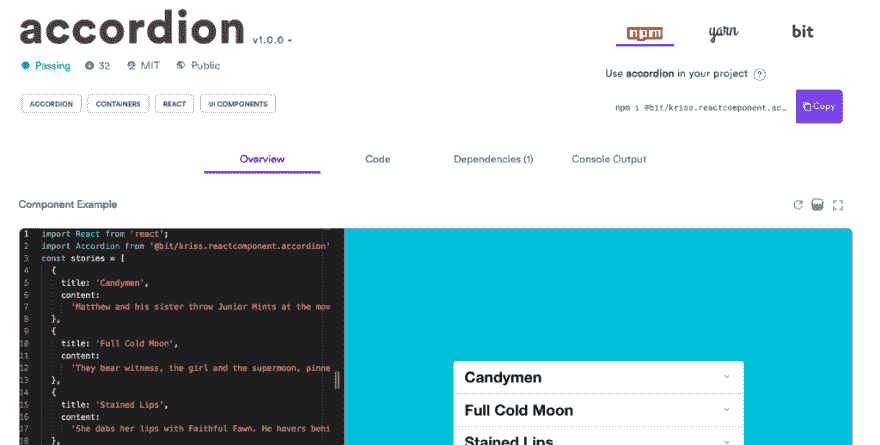](https://bitsrc.io/kriss/reactcomponent/accordion) 

<figcaption>用钻头反应手风琴</figcaption>

</figure>

在本教程中，我们将从头开始创建一个可重用的 React accordion 组件，并与 Bit 共享它，以便它可以用于其他应用程序和人员。

完成后，您将可以为您正在开发的任何应用程序使用、共享和开发该组件！让我们开始吧。

### 入门

手风琴可以让你将任何内容的大部分分解成小块，比如 FAQ。用户可以一个接一个地查看各个部分，改善用户体验，帮助用户在正确的时间关注正确的信息。

这是这个组件的输出。

我从[100wordstory.org](http://www.100wordstory.org/category/stories/)那里抓来短篇小说。标题总是出现，点击故事标题可以显示/隐藏内容。

[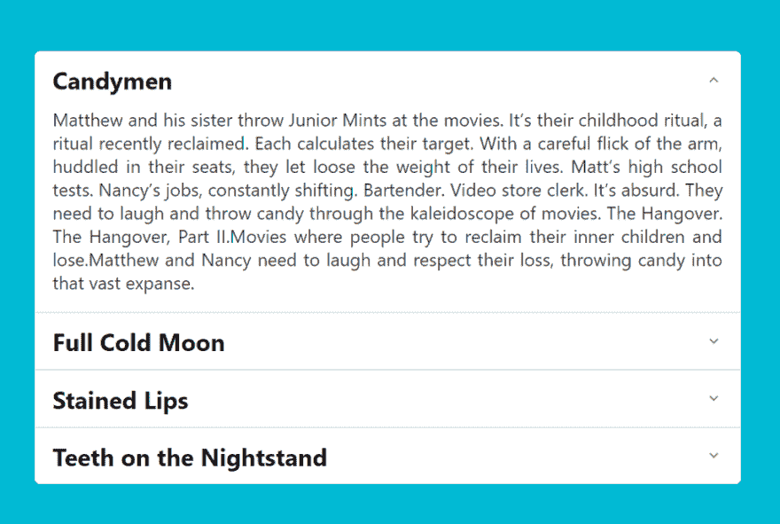](https://res.cloudinary.com/practicaldev/image/fetch/s--EjBN_LNZ--/c_limit%2Cf_auto%2Cfl_progressive%2Cq_auto%2Cw_880/https://cdn-images-1.medium.com/max/1024/0%2A4rD658qV5e_yDRqh.png)

### 盗梦

处理组件的两种基本方式是 JavaScript 和 CSS。

这个组件是 css-heavy。对于手风琴来说，即使它像预期的那样完美地工作，也总是有这种权衡。

[https://medium . com/media/6a 391 c8 c 9 aff 886614 a 84 B4 D5 FB 7 f 52 c/href](https://medium.com/media/6a391c8c9aff886614a84b4d5fb7f52c/href)

虽然 CSS 非常高效，但是 JavaScript 使用 CPU。

故事里的内容没有固定的高度。JavaScript 抓取内容计算高度，跟踪它，然后显示/隐藏它。

CSS 不能做到这一点，但 CSS 动画没有 CPU 使用率。所以，CSS 动画将不得不使用一些任意的高度。

反过来说，隐藏的内容不应该在 DOM 上。但是，在制作手风琴时，我认为事情应该有点不同。我只想整理屏幕上的信息，不介意搜索引擎和其他机器人访问所有常见问题或故事。我只是希望改善用户体验，而不是阻止访问现在没有显示的内容。

考虑到这一点，我选择了基于 CSS 的方法。内容的最大高度为 100 雷姆(默认浏览器设置为 1600 像素)。我用 0.5 秒的时间在贝塞尔曲线中制作了这个高度的动画，而内容的不透明度在 0.2 秒内从 0 变到 1。看起来好像是在容器膨胀的同时装载内容。

右边的箭头是作为背景的 base64 编码图像，当内容打开时旋转 180 度(通过 CSS)。

这就是 CSS 除了设置边距和填充之外的功能。所有的 CSS 代码都在 *index.css* 文件中。

### 故事

在这里将故事定义为一个对象数组，每个对象都应该有标题和故事。它的格式如下。

```
const stories = [
  {
    title: 'The Title',
    story: 'Story Here'
  },
  {
    title: 'Another Title',
    story: 'Another Story '
  },
  {
    title: 'Next Title',
    story: 'Next Story Here'
  }
]
export default stories; 
```

### App

应用程序是父组件。将故事导入应用程序。

```
import React from 'react';
import './App.css';
import AccordionItem from './AccordionItem';
import stories from './stories';

const App = () => {
  return (
    <div className="wrapper">
      <ul className="accordion-list">
        {stories.map((story) => {
          return (
            <li className="accordion-list\_\_item">
              <AccordionItem {...story} />
            </li>
          );
        })}
      </ul>
    </div>
  );
};

export default App; 
```

它有一个包装器 div，然后创建一个故事列表。每个故事都有自己的列表项。使用 *AccordionItem* 渲染单个项目。*手风琴项目*得到这个故事作为道具。

一个**故事**是一组对象。

每个对象是一个**故事**是一个以**标题**和**内容**为关键字的对象。对象**故事**被传递给 ***符合项*** *。*懂了吗？:)

### 手风琴单品

手风琴的状态为*打开*，如果手风琴展开，则状态为真。它还有切换状态的 *onClick* 方法。

如果 accordion 被打开，它将获得一个额外的 accordion-item - opened 类。这使得内容在我讨论的所有动画中都是可见的。

```
class AccordionItem extends Component {
  state = {
    opened: false
  };

  render() {
    const {
      props: { title, content },
      state: { opened }
    } = this;
    const onClick = () => {
      this.setState({ opened: !opened });
    };
    const className = `accordion-item ${opened && 'accordion-item--opened'}`;
    return (
      <div className={className} onClick={onClick}>

      </div>
    );
  }
}

export default AccordionItem; 
```

我们需要返回带有标题和内容的 JSX。在使用 render 方法中的 props 和 states 之前，先对变量进行析构。

这是回归的 JSX。

```
return (
      <div className={className} onClick={onClick}>
        <div className="accordion-item\_\_line">
          <h3 className="accordion-item\_\_title">{title}</h3>
          <span className="accordion-item\_\_icon" />
        </div>
        <div className="accordion-item\_\_inner">
          <div className="accordion-item\_\_content">
            <p className="accordion-item\_\_paragraph">{content}</p>
          </div>
        </div>
      </div>
    ); 
```

它返回一个带有 *onClick 的包装器 div，*您可以通过单击 div 上的任意位置来显示/隐藏手风琴。有一个带有已传递标题的标题，以及图标。图标本身是一个设置为背景的 png 图像。

故事的内容在另一个 div 中，只有当父类有 accordion-item - opened 时才可见，这就是为什么使用了 *className* 变量。它还包含所有的动画。

每个 accordion-list _ _ 项目都有一个顶部边框(第一个除外)。

所以我们得到了想要的输出…

### 输出

[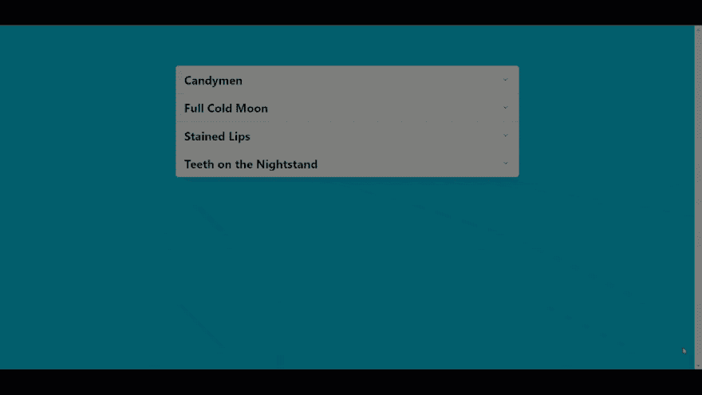](https://res.cloudinary.com/practicaldev/image/fetch/s--3drlt43K--/c_limit%2Cf_auto%2Cfl_progressive%2Cq_66%2Cw_880/https://cdn-images-1.medium.com/max/1024/0%2Aauk2Jf6g02wD5wB1.gif)

### 用 Bit 使组件可重用

<figure>[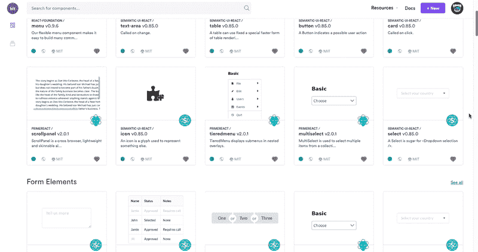](https://bitsrc.io/components) 

<figcaption>组件带位:选择、播放、使用</figcaption>

</figure>

[**Bit**](http://bitsrc.io) ( [开源](https://github.com/teambit/bit))是共享可复用组件的快速可视化中枢。

它帮助您的团队组织和共享组件，这些组件可用于构建新的应用程序并在团队成员之间共享。

组件可以与来自不同项目和库的 Bit 共享，并且可以在您的应用程序中发现、使用和安装。

简单地说，您可以将 Bit 视为您的组件“Lego box ”,您可以在其中共享来自任何项目的组件，然后找到并使用它们来构建新的东西。有用吧？还有很多，但我们现在不会深入讨论。

首先，[登录到 Bit](https://bitsrc.io/signup) 并创建您的组件集合。

现在我们的系列已经准备好了；让我们使用 Bit 从它所在的存储库中快速共享组件(Bit 发挥了“魔力”；它会自动隔离组件，并将其共享到云，无需更改任何代码或文件！).

我们来分享一下 tab 组件。

### 安装钻头

如果您还没有 Bit，使用
进行全局安装

```
npm install -g bit-bin 
```

### 为项目初始化位

用
初始化 Bit 工作空间

```
bit init 
```

[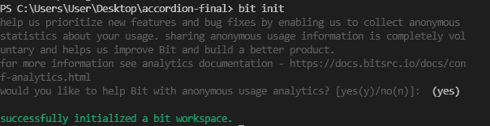](https://res.cloudinary.com/practicaldev/image/fetch/s--i_WZPhiW--/c_limit%2Cf_auto%2Cfl_progressive%2Cq_auto%2Cw_880/https://cdn-images-1.medium.com/max/604/1%2AmYDl8n0Xu0cUuW5BCxvAmQ.png)

这个命令添加 bit.json 和。位图文件，这样 Bit 就可以开始跟踪和隔离存储库中的组件。

在下面的位文档中，我们需要组件的入口点

[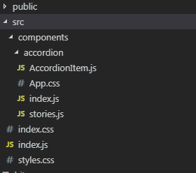](https://res.cloudinary.com/practicaldev/image/fetch/s--YjIgCxp1--/c_limit%2Cf_auto%2Cfl_progressive%2Cq_auto%2Cw_880/https://cdn-images-1.medium.com/max/280/1%2AYSpEBRGrR4e4RQnX_YRvJw.png)

创建 **index.js 并从 App.js**
中移走所有代码

```
import React from 'react';
import './App.css';
import AccordionItem from './AccordionItem';
import stories from './stories';

const App = () => {
  return (
    <div className="wrapper">
      <ul className="accordion-list">
        {stories.map((story) => {
          return (
            <li className="accordion-list\_\_item">
              <AccordionItem {...story} />
            </li>
          );
        })}
      </ul>
    </div>
  );
};

export default App; 
```

现在，让 Bit 跟踪你放在 src/components 目录中的所有组件。

```
bit add src/components/\* 
```

[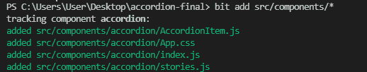](https://res.cloudinary.com/practicaldev/image/fetch/s--2OK_A0cG--/c_limit%2Cf_auto%2Cfl_progressive%2Cq_auto%2Cw_880/https://cdn-images-1.medium.com/max/518/1%2ATd29qzeLrxyHdMNALIsq0Q.png)

登录 Bit 账户，准备将代码推送到 Bit repo

```
bit login 
```

[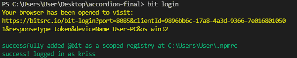](https://res.cloudinary.com/practicaldev/image/fetch/s--N-Xdoitd--/c_limit%2Cf_auto%2Cfl_progressive%2Cq_auto%2Cw_880/https://cdn-images-1.medium.com/max/601/1%2AS93S000thVgmne-0WjxaNw.png)

[为工作区设置一个 Bit 编译器](https://bitsrc.io/bit/envs)(我用 react) :

```
bit import bit.envs/compilers/react --compiler 
```

[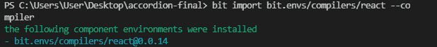](https://res.cloudinary.com/practicaldev/image/fetch/s--PtIaGojB--/c_limit%2Cf_auto%2Cfl_progressive%2Cq_auto%2Cw_880/https://cdn-images-1.medium.com/max/618/1%2A_e9iQtRtg9XfdB0nrPt5ag.png)

您可以构建自己的组件。

```
bit build 
```

[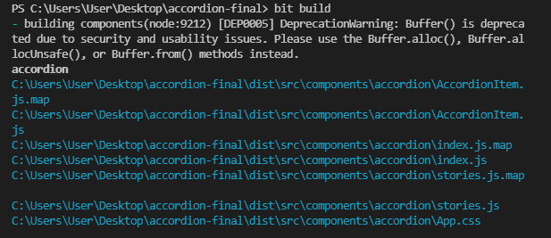](https://res.cloudinary.com/practicaldev/image/fetch/s--z5xaIYFO--/c_limit%2Cf_auto%2Cfl_progressive%2Cq_auto%2Cw_880/https://cdn-images-1.medium.com/max/617/1%2A_Shq4D5eaOsNOlNj7WrDQA.png)

现在，声明这是 1.0.0 版本。

```
bit tag --all 1.0.0 
```

[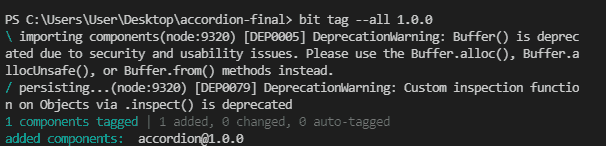](https://res.cloudinary.com/practicaldev/image/fetch/s--VE8_jj0Y--/c_limit%2Cf_auto%2Cfl_progressive%2Cq_auto%2Cw_880/https://cdn-images-1.medium.com/max/606/1%2AJEvpOJfpk23ftj5ObKPLoQ.png)

再次运行 bit status 以确认是否附加了此版本:

[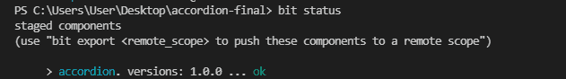](https://res.cloudinary.com/practicaldev/image/fetch/s--7sgSW3S6--/c_limit%2Cf_auto%2Cfl_progressive%2Cq_auto%2Cw_880/https://cdn-images-1.medium.com/max/631/1%2AJmLZWCiA6QXKWxhtzqWjuQ.png)

将它们推到 Bit 远程作用域:

```
bit export kriss.reactcomponent 
```

就是这样！您刚刚导出的组件现在将显示在您的集合中。

[](https://bitsrc.io/kriss/reactcomponent)

组件定义上面的任何注释块都被用作组件描述，如果我要添加测试，Bit 也会运行它们。您现在可以使用 Bit 和 NPM 安装组件，甚至可以将它们导入到其他项目中并继续开发它们。看一看。

[accordion - reactcomponent 位](https://bitsrc.io/kriss/reactcomponent/accordion)

### 结论

您已经为自己创建了一个很好的 Accordion 组件，并与 Bit 共享。现在，您和您的团队可以在任何您喜欢的应用程序中使用它，以加快构建速度。希望你喜欢，并请随时评论和询问任何事情！干杯😃

*   [加快 Vue.js 应用开发的 5 种工具](https://blog.bitsrc.io/5-tools-for-faster-vue-js-app-development-ad7eda1ee6a8)
*   [在 React 中加快开发的 5 种工具](https://blog.bitsrc.io/5-tools-for-faster-development-in-react-676f134050f2)
*   【2019 年 11 个 JavaScript 动画库

* * *