# 在 5 分钟内构建一个 Slack Bot，使用标准库和 Node.js 验证销售线索

> 原文：<https://dev.to/janeth/build-a-slack-bot-in-5-minutes-to-qualify-leads-with-standard-library-and-nodejs-eoi>

每天都有数百名用户注册使用您的在线服务，您是否不堪重负？您是否需要更好的方法来跟踪和确认销售线索？如果是这样，不用再看了！以下是帮助您和您的团队所需的所有工具😉。

**我们将构建:**我们将创建一个 Slack bot，当访问者将数据输入到嵌入到您网站的表单中时，它会提醒您的频道。我们的 Slack bot 会将个人标记为“高优先级！”如果他们属于一个拥有超过 50 名员工的公司。我们的机器人还将显示个人的全名、电子邮件、职位、位置、Linkedin、公司名称、x 公司的员工人数、筹集的金额、估计的年收入和公司域名，如下例所示🤓。

[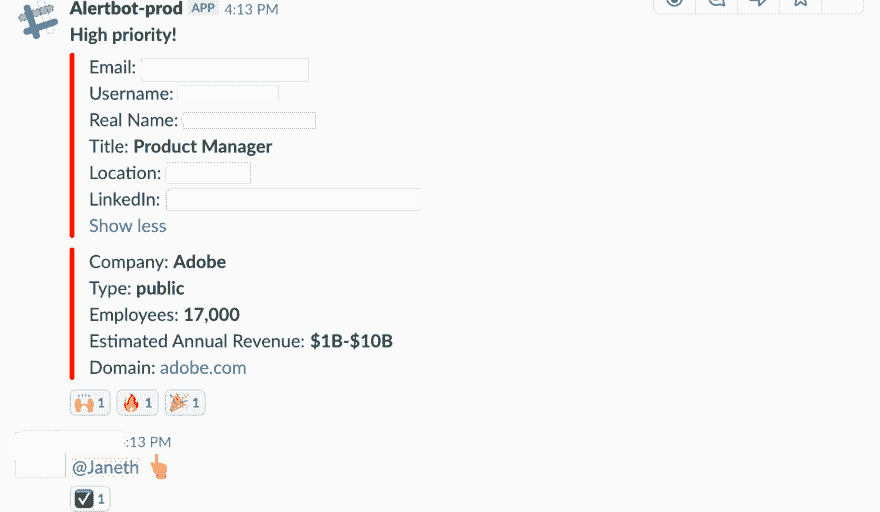](https://res.cloudinary.com/practicaldev/image/fetch/s--NdVB_JSy--/c_limit%2Cf_auto%2Cfl_progressive%2Cq_auto%2Cw_880/https://cdn-images-1.medium.com/max/1440/1%2AisUkfvgV4_OiHTXqCMVGSQ.png)

所以…让我们开始吧！

## 你事先需要什么

1x [Slack](https://slack.com/signin) 自由账户
1x [Typeform](https://www.typeform.com/) 自由账户
1x [Clearbit](https://clearbit.com/) 自由账户
1x [标准库](https://stdlib.com/)自由账户
5x 分钟(300x 秒)

*如果你不熟悉[标准图书馆](https://stdlib.com/)，那你一定会喜欢！标准库正在把你组织中的每个人都变成拥有标准库上[代码的开发者——一个用于轻松构建 API、webhooks 和工作流自动化任务的嵌入式开发环境。](https://code.stdlib.com)*

# 第 1 分钟:在 Slack 的 API 页面准备你的 Slack App

[登录您的 Slack 账户](https://slack.com/signin)，访问您在 https://api.slack.com/apps[的 Slack 应用页面](https://api.slack.com/apps)。点击**创建新应用。**您将看到一个模式，输入您的应用程序名称和您想要添加到的开发空闲工作区。从这里，点击创建应用程序，你会发现自己在一个**基本信息**页面。

[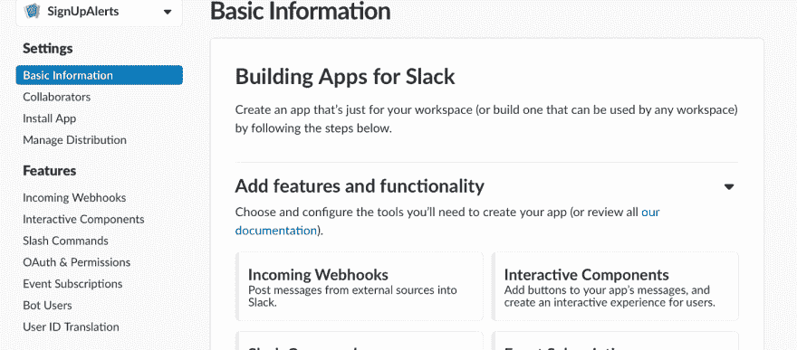](https://res.cloudinary.com/practicaldev/image/fetch/s--q5o1E4Ph--/c_limit%2Cf_auto%2Cfl_progressive%2Cq_auto%2Cw_880/https://cdn-images-1.medium.com/max/1440/1%2A8k1cFASIfP7x62fq9Ua1Fw.png)

在左侧菜单栏的**【功能】**类别下找到**【来电挂钩】**，打开按钮激活来电挂钩。

[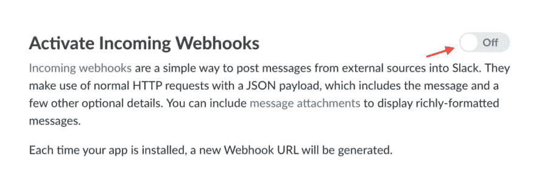](https://res.cloudinary.com/practicaldev/image/fetch/s--54RJ39RI--/c_limit%2Cf_auto%2Cfl_progressive%2Cq_auto%2Cw_880/https://cdn-images-1.medium.com/max/1440/1%2AOqJwSpGuwWN6apgU1cPMMw.png) 
切换按钮开启

[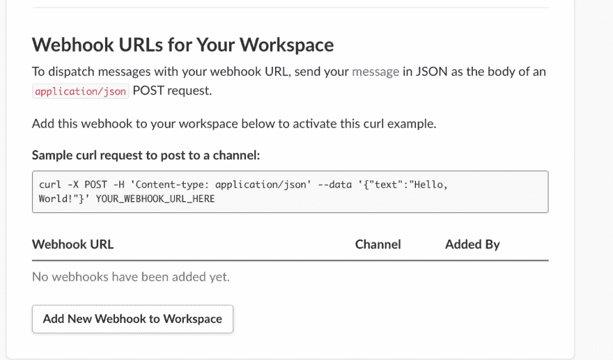](https://res.cloudinary.com/practicaldev/image/fetch/s--V42d_gpg--/c_limit%2Cf_auto%2Cfl_progressive%2Cq_auto%2Cw_880/https://cdn-images-1.medium.com/max/1440/1%2AP4ZWIHBU11jfhijOQu2DbQ.png) 
选择向工作区添加新的 Webhook。

接下来，选择**“向工作区添加新的 web hook”**并授权您的 Slack 应用程序在频道上发布。

[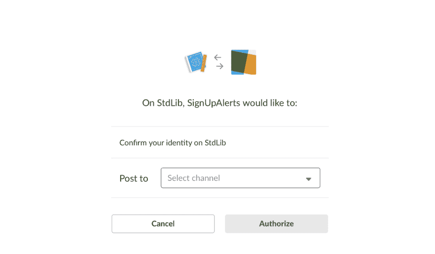](https://res.cloudinary.com/practicaldev/image/fetch/s--p8T0gqQ---/c_limit%2Cf_auto%2Cfl_progressive%2Cq_auto%2Cw_880/https://cdn-images-1.medium.com/max/1440/1%2Av_BpksCWUhShcaCwhkMBAw.png)

一旦获得授权， [Slack](https://slack.com/) 会自动生成一个惟一的 URL，您将使用该 URL 通过 HTTP 请求将消息发送到 Slack，该请求带有来自 Clearbit 的 JSON 有效负载。复制并保存此 URL 我们很快就会需要它。

[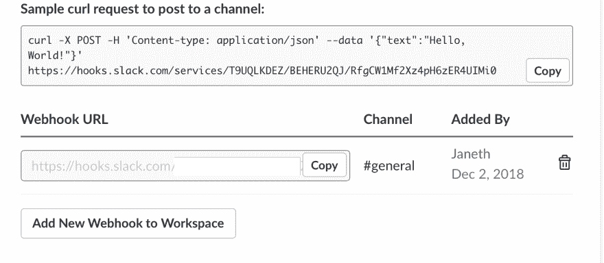](https://res.cloudinary.com/practicaldev/image/fetch/s--KVilP2lz--/c_limit%2Cf_auto%2Cfl_progressive%2Cq_auto%2Cw_880/https://cdn-images-1.medium.com/max/1440/1%2AlzfoG0UDOGxYBpN8LLpzpw.png)

检查以确保您已经正确设置了 Slack 应用程序。如果有，您应该会在您的 Slack 频道上看到如下消息。如果没有，重复此步骤😉。

# 第 2 分钟:使用标准库上的代码设置和部署 Signupalertsbot API

既然您已经设置了您的 [Slack](https://slack.com/) 应用程序并激活了传入的 webhooks，那么您需要部署将通过 webhooks 连接[类型表单](https://www.typeform.com/)、 [Clearbit](https://clearbit.com/) 和 [Slack](https://slack.com/) 的代码。为此，我们将使用[标准库的](https://stdlib.com/) API 平台和 API 在线编辑器——如果你不是程序员，不用担心！你不需要写任何代码。我们已经为您提供了代码，它会自动处理高优先级注册和 [Clearbit](https://clearbit.com/) 没有电子邮件信息的情况！

前往标准库上的[代码。如果你点击那个链接，一个用于 Signupalertsbot API 的](http://stdlib.com/@janethl/src/signupalertsbot/0.0.0)[模板会自动打开](http://stdlib.com/@janethl/src/signupalertsbot/0.0.0)。如果没有，导航到**“社区 API 源”**选项卡，搜索**“Janet HL/signupalertsbot”。**打开左侧边栏菜单上的 env.json 文件，您会发现需要填写的三个环境变量。

[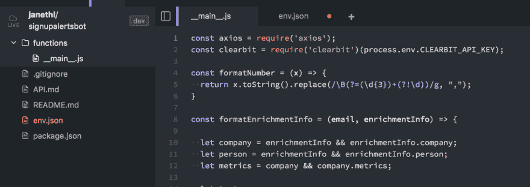](https://res.cloudinary.com/practicaldev/image/fetch/s--JQBPEtAo--/c_limit%2Cf_auto%2Cfl_progressive%2Cq_auto%2Cw_880/https://cdn-images-1.medium.com/max/1440/1%2AjnO-8wbXYwxXo2td-tfKBw.png)

将第 1 部分中的 [Slack](https://slack.com/) webhook URL 输入到 dev 部分下的 SLACK_WEBHOOK_URL 中。

# 第 3 分钟:复制并粘贴您的 Clearbit API 密钥

接下来，你需要登录，或者在 https://clearbit.com/的[注册一个](https://clearbit.com/)[免费 Clearbit](https://clearbit.com/) 账户。

一旦登录到您的 Clearbit 的仪表板，导航到 API 密钥选项卡，并复制第一个密钥-秘密 API 密钥。

[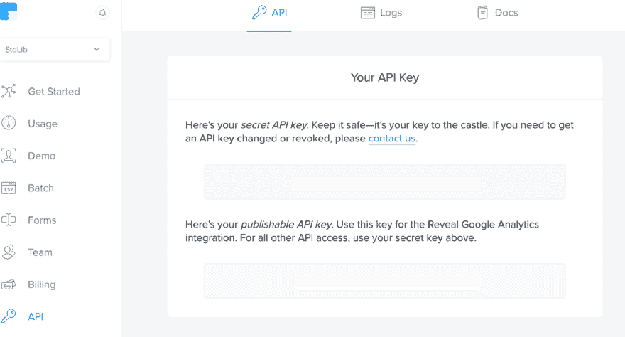](https://res.cloudinary.com/practicaldev/image/fetch/s--63et6gnz--/c_limit%2Cf_auto%2Cfl_progressive%2Cq_auto%2Cw_880/https://cdn-images-1.medium.com/max/1440/1%2AASySYoq1KUWSEbJDomhGJA.png)

*注意，在你的密钥下面，Clearbit 有抑制设置，从你的浓缩项目中排除某些联系人，以满足 GDPR。*

现在返回到标准库上的[代码，并在 env.json 中填充“CLEARBIT_API_KEY”变量。](https://stdlib.com/)

最后，通过在两个引号之间单击鼠标右键来填充“STDLIB_LIBRARY_TOKEN”变量，并从下拉菜单中选择 **Insert Library Token** 。

[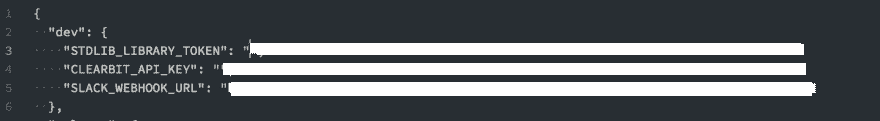](https://res.cloudinary.com/practicaldev/image/fetch/s--rs1jfchK--/c_limit%2Cf_auto%2Cfl_progressive%2Cq_auto%2Cw_880/https://cdn-images-1.medium.com/max/1440/1%2APoMF5BtXA_IYoWNT8NZLtw.png)

现在已经填充了三个环境变量，单击右下角橙色的**“Save”**按钮保存这些更改。

您现在已经准备好部署您的 API 了。返回到**主**。js 文件，然后单击右下角的绿色“运行”按钮。

[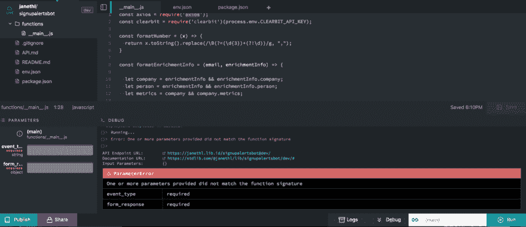](https://res.cloudinary.com/practicaldev/image/fetch/s--X8fU33k4--/c_limit%2Cf_auto%2Cfl_progressive%2Cq_auto%2Cw_880/https://cdn-images-1.medium.com/max/1440/1%2ApPtOCtgfBt_PLzU5r1umiw.png)

一旦你把你的 API 部署到标准库，你会注意到一个**“参数错误”**，因为你的函数/ **main** 。js 端点需要两个参数。这两个参数；event_type、form_response 将由 Typeform 提供。最后一步是为您的 API 获取**“API 端点 URL”**，并将其设置为[类型表单](https://www.typeform.com/)上的 webhook。

# 第 4 分钟:在 Typeform 上设置 Webhook

一旦您登录到[类型表单](https://www.typeform.com/)，从仪表板中选择**“新类型表单”**。找到并选择**【联系表】**模板。

[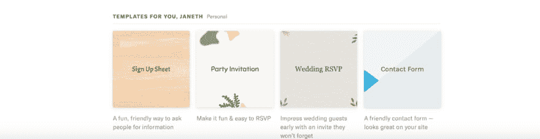](https://res.cloudinary.com/practicaldev/image/fetch/s--Ib6Vc1lV--/c_limit%2Cf_auto%2Cfl_progressive%2Cq_auto%2Cw_880/https://cdn-images-1.medium.com/max/1440/1%2Az1JIZK6Gjcv4YUtE5MgLtA.png)

现在，让我们按原样使用这个模板；你可以随时回来修改你喜欢的风格和问题。选择顶部菜单上的**“整合”**。

导航到中间上方的选项卡，选择**“集成”**，然后选择**“web hooks”**

将您的标准库 API 的端点 url 输入到目标 URL，并打开**“web hooks”**按钮。

[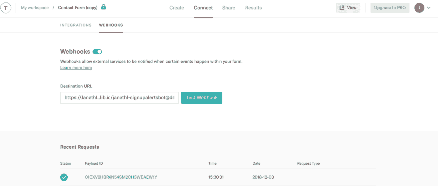](https://res.cloudinary.com/practicaldev/image/fetch/s--vNUPdnei--/c_limit%2Cf_auto%2Cfl_progressive%2Cq_auto%2Cw_880/https://cdn-images-1.medium.com/max/1800/1%2AmLnq3K-NfSxhfv9jtXqzGA.png)

# 第 5 分钟:测试你的 Slack Bot

你的 Slack 机器人已经可以测试了！选择字体右上角的**“查看”**按钮。

输入有效的电子邮件进行测试，并回答示例问题。一旦提交，你应该会收到你的 Slack 机器人通知。🙌

[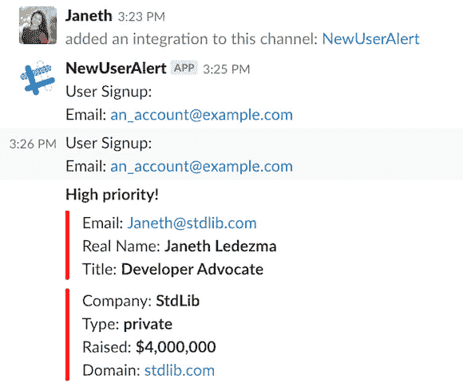](https://res.cloudinary.com/practicaldev/image/fetch/s--8r79zk7U--/c_limit%2Cf_auto%2Cfl_progressive%2Cq_auto%2Cw_880/https://cdn-images-1.medium.com/max/1440/1%2ANSZpiJzDC07mncLhKqOFOA.png)

# 就是这样！🤗

感谢您花时间阅读和测试这一点！如果你觉得这个教程有帮助，请告诉我！