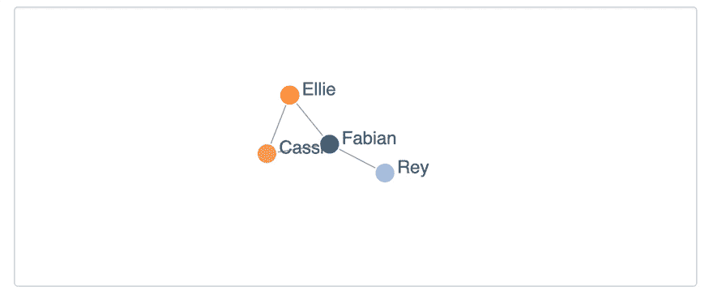
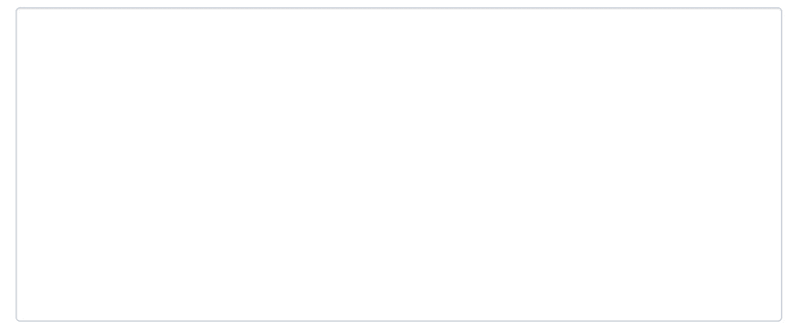

# 用 JavaScript 和图表建立一个社交网络！

> 原文：<https://dev.to/hinsencamp/build-a-social-network-in-javascript-with-graphs-2lnn>

> 你会如何为脸书或 Linkedin 这样的大型社交网络设计数据结构？

众所周知，像谷歌、亚马逊、脸书和 Linkedin 这样的顶级科技公司会在招聘过程中问这样的问题。

原因是，社交网络是图形数据结构的一个很好的用例。在本教程中，我们将通过一个实际操作的例子深入主题，并自己建立一个社交网络！因此，我们将学习图形是如何工作的，以及为什么它是如此重要和强大的数据结构。

该教程也适合初学者，唯一的先决条件是对面向对象 JavaScript 的基本理解。如果你想提前阅读一些关于图论的知识，请查看本文底部的[资源部分](#resources)中的其他资源。

稍后，我们使用一些助手函数，你可以在这个 [repo](https://github.com/fh48/tutorial_SocialNetworkGraph) 中的剩余代码中找到它们；

让我们首先对我们实际想要达到的目标有一个基本的了解！

## 什么是社交网络的核心？

当我们试图描述社交网络的核心时，我们很快就会谈到用户和他们之间的联系。典型地，用户与其他用户有某种联系。尽管理论上有几百万个连接是可能的，但大多数用户的连接不会超过几百个。换句话说，用户与网络中的大多数其他用户没有连接。
想想就知道了。与全球现有的个人资料相比，你在脸书上有多少朋友？友谊圈是一种常见的模式，由有限数量的用户共享许多共同的联系组成。

现在，在考虑了社交网络中用户的基本交互之后，我们可以开始构建一个允许我们轻松实现这些需求的数据结构。在下一节中，您将看到为什么图形数据结构非常适合这个问题。

## 为什么是图表？

简单地说，图只不过是节点和连接它们的边的集合。在书中，你会发现节点通常也被称为顶点。一般来说，节点可以表示任何种类的抽象数据对象。在社交网络环境中，用节点来代表用户是显而易见的。还包括其他抽象实体，如组、公司、事件等。可以建模为节点。

节点之间的连接称为边。它存在一系列不同类型的边，允许您对节点之间的各种关系进行建模。阅读由 [@amejiarosario](//www.twitter.com/amejiarosario) 撰写的文章 *Graph Data Structures for 初学者*，了解更多关于有向图、无向图、循环图和无环图的区别。您可以在[资源部分](#resources)找到链接。

你怎么想呢?听起来很有希望，对吧？让我们开始构建一个图表，看看它是否真的一样好。

## 创建图表

在上面的中，我们已经明白了社交网络的核心功能是什么。为了表示这一点，我们将构建一个带有表示用户的节点和双向边的图，以模拟用户之间的平等连接。

我们以面向对象的方式实现这个图。因此，我们开始编写一个`Graph`构造函数，它包含一个空对象作为唯一的属性。

```
function Graph() {
  this.graph = {};
} 
```

Enter fullscreen mode Exit fullscreen mode

现在，为了继续实现，我们在图中添加了`getter`和`setter`方法。要添加节点，我们只需将用户作为键-值对添加到`graph`对象中，并使用用户名作为键。注意，在生产中，唯一的 id 是更好的选择。

```
Graph.prototype.addUser = function(user) {
  this.graph[user.name] = user;
}; 
```

Enter fullscreen mode Exit fullscreen mode

对于`getter`方法，我们简单地返回我们通过作为属性传递的名称检索的用户。

```
Graph.prototype.getNode = function(name) {
  return this.graph[name];
}; 
```

Enter fullscreen mode Exit fullscreen mode

接下来，我们创建节点构造函数。

## 创建节点

节点的构造函数只带有一个名称和一个 friends 属性。

```
function Node(user) {
  this.name = user.name;
  this.friends = {};
} 
```

Enter fullscreen mode Exit fullscreen mode

一般来说，有两种方法可以用图来表示节点和它们之间的关系。

我们将在这里应用的第一种方法称为`adjacency list`，它依赖于一个列表，由每个单独的节点保存，存储所有节点的边。

```
a -> { b c }
b -> { a d }
c -> { a }
d -> { b c } 
```

Enter fullscreen mode Exit fullscreen mode

第二种方法叫做`adjacency matrix`。这对于复杂(有向和加权边)和高度密集的图形特别有用。在*中阅读更多关于每种表示的好处，什么时候邻接表或矩阵是更好的选择？*你可以在的[资源部分找到链接。](#resources)

`friends`属性充当我们的`adjacency list`并存储所有连接的用户。我们可以简单地使用数组或集合来存储连接的名称。
然而，一个对象更有性能，因为当我们创建一个边时，我们需要检查已经存在的连接。

## 创建边缘

完成基本网络所缺少的最后一块是在节点之间添加连接的方法。当我们决定使用双向边时，我们需要添加到两个相关节点的连接。为此，我们用我们想要连接的用户节点在自身内部调用`addConnection`。

```
Node.prototype.addConnection = function(user) {
  if (!this.friends[user.name]) {
    this.friends[user.name] = { name: user.name };
    user.addConnection(this);
  }
}; 
```

Enter fullscreen mode Exit fullscreen mode

感谢包装实际逻辑的条件，我们不会陷入无限循环。所有这些都准备就绪后，我们就可以开始向我们的网络添加用户了！

## 成长网络！

为了开始我们的网络，让我们创建几个节点并连接它们。因此，我们首先创建几个节点。

```
const fabian = new Node({ name: "Fabian" });
const rey = new Node({ name: "Rey" });
const ellie = new Node({ name: "Ellie" });
const cassi = new Node({ name: "Cassi" }); 
```

Enter fullscreen mode Exit fullscreen mode

接下来，我们实例化一个图，并向其中添加节点。

```
const graph = new Graph();

graph.addNode(fabian);
graph.addNode(rey);
graph.addNode(ellie);
graph.addNode(cassi); 
```

Enter fullscreen mode Exit fullscreen mode

最后一步，我们将节点相互连接起来。

```
graph.get("Fabian").addConnection(graph.get("Rey"));
graph.get("Fabian").addConnection(graph.get("Ellie"));
graph.get("Fabian").addConnection(graph.get("Cassi"));

graph.get("Ellie").addConnection(graph.get("Cassi")); 
```

Enter fullscreen mode Exit fullscreen mode

您可以使用助手函数`writeToJSON`将您的图表导出到 json 以获得更好的概览。在这个[回购](https://github.com/fh48/tutorial_SocialNetworkGraph)你可以找到它。

```
writeToJSON(graph.graph, "graph"); 
```

Enter fullscreen mode Exit fullscreen mode

很酷，对吧？

## 将网络可视化！

[](https://res.cloudinary.com/practicaldev/image/fetch/s--wAnbeamV--/c_limit%2Cf_auto%2Cfl_progressive%2Cq_66%2Cw_880/https://thepracticaldev.s3.amazonaws.com/i/m7ne6lauuwd8bksqfeq6.gif)

如果你想可视化你的网络并玩它，检查一下[hinsencamp.com](https://hinsencamp.com/article/social-network-graph/#visualise-the-network)上的可视化工具。

下一步，您应该运行另一个助手函数——网络生成器。它生成多达 150 个用户的随机网络。

```
generateRandomNetwork(graph, 10);

writeToJSON(graph.graph, "graph"); 
```

Enter fullscreen mode Exit fullscreen mode

玩弄参与者的数量。您将会看到，随着网络规模的增加，仅仅通过查看 JSON 对象来保持一个概览变得非常复杂。为了更好地查看，您也可以将 JSON 对象放到 visualiser 中。

它应该看起来像这样:

[](https://res.cloudinary.com/practicaldev/image/fetch/s--D0so5UQo--/c_limit%2Cf_auto%2Cfl_progressive%2Cq_66%2Cw_880/https://thepracticaldev.s3.amazonaws.com/i/pg20ty1ochecg92vgaqg.gif)

## 结论

我们已经建立了社交网络的初始数据结构。因此，我们为表示用户的图形和节点创建了构造函数。此外，我们添加了连接这些节点的双向边。这种结构为在其上构建更强大的功能打下了坚实的基础。以下是接下来可以添加的内容的一些提示:

*   删除边和节点的方法
*   不同类型的节点，如“组”或“公司”
*   像广度优先搜索(BFS)这样的搜索算法
*   通过比较边集向用户推荐新朋友。

在 twitter 上让我知道你最感兴趣的是什么 [@hinsencamp](https://twitter.com/hinsencamp) ！根据您的反馈，我将选择下一个教程主题。
当您有兴趣将基于图形的解决方案投入生产时，您应该考虑阅读更多关于
图形数据库的信息，它提供了许多开箱即用的图形功能。值得一看下面的免费图数据库 [Neo4J](https://neo4j.com/) 、 [OrientDB](https://orientdb.com/) 和 [GunDB](https://github.com/amark/gun) 。

## 资源

*   [Javascript 开发人员关于图和检测图中循环的指南](https://hackernoon.com/the-javascript-developers-guide-to-graphs-and-detecting-cycles-in-them-96f4f619d563)
*   什么时候邻接表或矩阵是更好的选择？
*   [面向初学者的图形数据结构](https://adrianmejia.com/blog/2018/05/14/data-structures-for-beginners-graphs-time-complexity-tutorial/)
*   [利用图论在 JavaScript 中构建一个简单的推荐引擎](https://medium.com/@keithwhor/using-graph-theory-to-build-a-simple-recommendation-engine-in-javascript-ec43394b35a3)
*   相当于 C# HashSet 的 JavaScript 是什么？