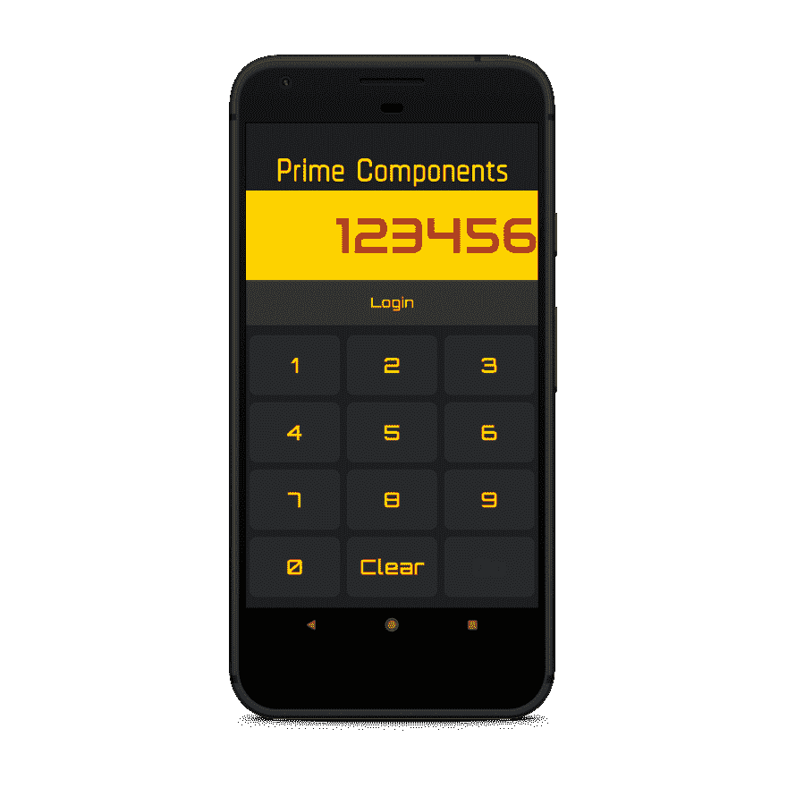
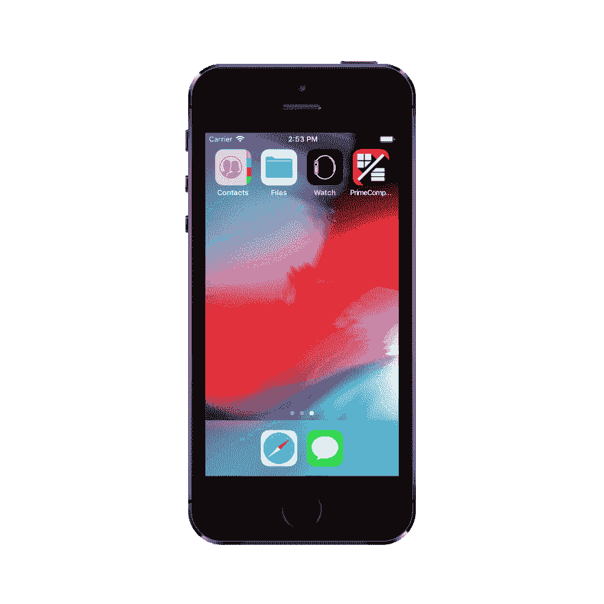
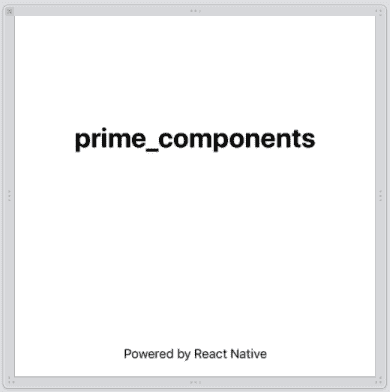
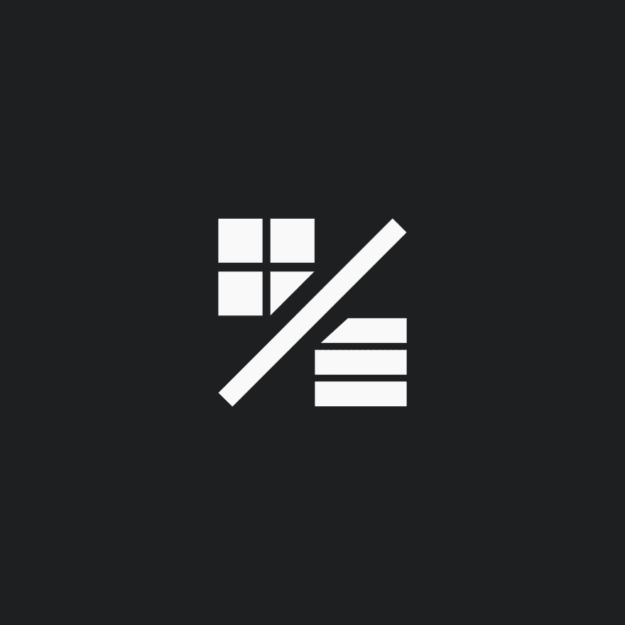
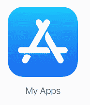
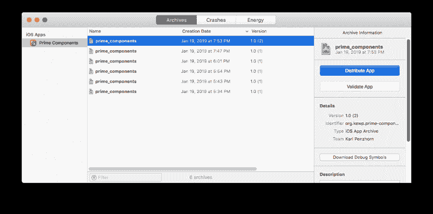

# 用 React Native 构建一个 iOS 应用，发布到 App Store

> 原文：<https://dev.to/oktadev/build-an-ios-app-with-react-native-and-publish-it-to-the-app-store-340i>

苹果的应用商店是移动开发者的圣杯。有了 React Native，你可以使用单一代码库为 Android 和 iOS 开发原生应用，但准备好发布可能会很棘手，尤其是如果你从一个最初只支持 Android 的应用开始。

在这里，你将从[以前的 monster Okta 博客文章](/blog/2018/12/26/react-native-android-play-store)的代码开始，在 Android Play store 上设计和发布一个类似计算器的应用程序，其中包括通过 [Okta](https://developer.okta.com/) 的认证。

[](https://res.cloudinary.com/practicaldev/image/fetch/s--k6helmJK--/c_limit%2Cf_auto%2Cfl_progressive%2Cq_auto%2Cw_880/https://developer.okta.com/assets-jekyll/blog/react-native-ios-app-store/final-result-6c2283edbb9d20b29d8ef3e544a28e36d3adc422334a5a55b85c896834f3bfbf.png)

在这篇文章中，你将首先让 Android 应用程序在 iOS 上运行良好，并添加一个闪屏和应用程序图标。然后，您将完成签名流程，并发布到 App Store。

首先克隆 repo 并安装所有需要的库。

```
git clone https://github.com/oktadeveloper/okta-react-native-prime-components-example
cd okta-react-native-prime-components-example
npm install 
```

从这里你应该能够说`react-native run-android`部署到一个模拟器或附加的 Android 手机。一切都会好的。

## 为您的 React 原生 iOS 应用配置认证

现在，当您点击登录时，您将被带到 Okta 登录页面。这和我开发用的一个 Okta 账户有关联。你需要创建自己的帐户，并配置此应用以使用它。

首先，[注册一个免费的 Okta 开发者账户](https://developer.okta.com/signup/)，或者[登录](https://login.okta.com/?SAMLRequest=fc%2B7CsJAEAXQXvAflu1NNJUMeZBGELTx1a%2FrYILJTtyZGD%2FfSBRiYzlw77lMnD3rSj3Qc0ku0YtgrhU6S5fSXRN9PKxmS52l00nMpq6iBvJWCrfDe4ss6vStRe9aDzmGIZfo1jsgwyWDMzUyiIV9vt1AH4XGk5ClSvewUgMNa%2BYW%2FVj5jxhm9NLP67QQaSAMu64L6CYmsFSHlnzT4ZlLwTgcL6Sf8%2FeX9AU%3Dhttps://login.okta.com/?SAMLRequest=fc%2B7CsJAEAXQXvAflu1NNJUMeZBGELTx1a%2FrYILJTtyZGD%2FfSBRiYzlw77lMnD3rSj3Qc0ku0YtgrhU6S5fSXRN9PKxmS52l00nMpq6iBvJWCrfDe4ss6vStRe9aDzmGIZfo1jsgwyWDMzUyiIV9vt1AH4XGk5ClSvewUgMNa%2BYW%2FVj5jxhm9NLP67QQaSAMu64L6CYmsFSHlnzT4ZlLwTgcL6Sf8%2FeX9AU%3D)，如果你已经有一个的话。然后导航到**应用** > **添加应用**。选择**原生**，点击**下一步**。选择一个名称并点击**完成**。请注意您的**登录重定向 URI** 和**客户端 ID** ，因为您必须将它们添加到您的应用程序中。

现在，在您的`App.js`中找到定义**配置**变量的位置(靠近顶部),并将相关值更改为 Okta 应用程序的值:

```
const config = {
  issuer: 'https://{yourOktaDomain}/oauth2/default',
  clientId: '{clientId}',
  redirectUrl: '{redirectUrl}',
  additionalParameters: {},
  scopes: ['openid', 'profile', 'email', 'offline_access']
}; 
```

## 在 iOS 模拟器上运行 React 原生应用

从在 Mac 电脑上运行`react-native run-ios`开始。应该会出现一个 iOS 模拟器，在控制台中，您的项目将会编译。

**注意:**如果你得到一个错误`Print: Entry, ":CFBundleIdentifier", Does Not Exist`在 Github 上有[几个](https://github.com/facebook/react-native/issues/7308) [问题](https://github.com/facebook/react-native/issues/14423)跟踪这个问题，有各种各样的修复建议。最简单的方法可能就是在 Xcode 中打开`ios/prime_components.xcodeproj`,然后从那里开始构建项目。

您应该会看到一个错误`'AppAuth/AppAuth.h' file not found`。你需要[将 AppAuth 库链接到 iOS](https://github.com/FormidableLabs/react-native-app-auth#ios-setup) 。最简单的是椰子。将以下内容放入`ios/Podfile`:

```
platform :ios, '11.0'

target 'prime_components' do
  pod 'AppAuth', '>= 0.94'
end 
```

在[安装好协同程序](https://guides.cocoapods.org/using/getting-started.html)后，进入`ios/`并运行`pod install`。这需要一段时间。现在关闭 Xcode，打开`ios/prime_components.xcworkspace`(注意:工作区，不是项目！)在 Xcode 里。这些单元应该作为一个单独的项目出现。选择一个设备，项目就可以构建并运行了(只需点击 play 按钮)。如果本教程中使用的包标识符已经被占用，您可能需要更改它。

此时，因式分解应该可以工作，但是如果您单击 Login，它将崩溃，因为您的 AppDelegate 类需要符合`RNAppAuthAuthorizationFlowManager`。打开`AppDelegate.h`并更改如下:

```
#import <UIKit/UIKit.h>
#import "RNAppAuthAuthorizationFlowManager.h" 
@interface AppDelegate : UIResponder <UIApplicationDelegate, RNAppAuthAuthorizationFlowManager>

@property (nonatomic, weak) id<RNAppAuthAuthorizationFlowManagerDelegate>authorizationFlowManagerDelegate;
@property (nonatomic, strong) UIWindow *window;

@end 
```

现在，登录按钮应该会带您完成授权过程。

## 在 React 原生 iOS 应用中调整样式

当我运行应用程序时，字体有点大，横幅看起来像是在显示应用程序背后的背景。要解决这些问题:

*   在`components/Button.js`中，将字体大小改为 25
*   在`components/Header.js`中，将字体大小改为 65
*   在`components/Input.js`中，将伸缩性改为 1.5，字体大小改为 60

标题中的透明度问题来自 iOS 状态栏显示。要隐藏来自`App.js`中`react-native`的导入`StatusBar`，并在容器顶部添加`<StatusBar hidden />`:

```
return (
  <Container>
    <StatusBar hidden /> 
```

应用程序现在应该看起来是正确的。

## 设置图标和显示名称并在设备上运行

如前所述，你可以使用像[图标](https://play.google.com/store/apps/details?id=xeus.iconic&hl=en)这样的应用程序来创建一个图标(尽管那个是为 Android 设计的)。一旦你有了一个图标，你就可以使用像 [MacAppIcon](https://makeappicon.com/) 这样的在线服务来获得你需要的所有尺寸。然后在 Xcode 中打开`prime_components`项目，点击`Images.xcassets`。你会看到所有你需要填充的图标——只需从 Finder 中拖动它们到正确的大小。

您还需要更改项目的显示名称，以便在设备上固定应用程序名称。这是在项目设置的**标识**部分。

确保你已经让[建立了签名团队](https://help.apple.com/xcode/mac/current/#/dev60b6fbbc7)，并且对于两个项目的调试和发布都将**只构建活动架构**设置为**是**——这可以修复很多与 AppAuth 库的集成问题。

完成后，您应该能够部署到设备上，并看到应用程序的正确图标和名称。

[](https://res.cloudinary.com/practicaldev/image/fetch/s--e4X0Oebg--/c_limit%2Cf_auto%2Cfl_progressive%2Cq_auto%2Cw_880/https://developer.okta.com/assets-jekyll/blog/react-native-ios-app-store/icon-and-title-f13247d32ce8f068f7b57de06041f670514807038f93830465f2a4408efa4236.png)

## 为你的 React 原生 iOS 应用创建闪屏

iOS 应用程序在加载时会出现闪屏。React Native 创建了一个基本的`LaunchScreen.dib`图像，它只是一个带有应用程序名称的白色屏幕。

[](https://res.cloudinary.com/practicaldev/image/fetch/s--brMvm7fx--/c_limit%2Cf_auto%2Cfl_progressive%2Cq_auto%2Cw_880/https://developer.okta.com/assets-jekyll/blog/react-native-ios-app-store/splash-screen-old-819feb09db6ab3e0c0873aed98c5954decc709c868627b680f627dc0a8bb4699.png)

改变这一点最简单的方法是使用 [React 原生工具箱](https://github.com/bamlab/generator-rn-toolbox/blob/master/generators/assets/README.md#generate-splashscreens)。

*   创建至少 2208x2208 像素的正方形图像
*   确保你的符号周围有足够的空白

例如:

[](https://res.cloudinary.com/practicaldev/image/fetch/s--oDwkTJ7e--/c_limit%2Cf_auto%2Cfl_progressive%2Cq_auto%2Cw_880/https://developer.okta.com/assets-jekyll/blog/react-native-ios-app-store/splash-screen-new-9a896fb9325729ea36a5d8cee1cc7534a498264d09a0ff36d8b1f068b04f9aa5.png)

一个很好的图像处理程序是 GIMP。

接下来，安装工具箱和 ImageMagick:

```
npm install -g yo@2.0.5 generator-rn-toolbox@3.8.0
brew install imagemagick 
```

现在把你的图像放到你的项目中，**关闭 XCode** 中的工作空间，运行下面的命令:

```
yo rn-toolbox:assets --splash image.png --ios 
```

确保指定正确的项目名称！(在这种情况下，它是 **prime_components** ，而不是`prime-components`)。应该会生成图像并更新您的项目。**从模拟器/设备**中卸载您的应用程序，并从 Xcode 重新部署，您应该会在加载应用程序时看到新的 splash。

## 将您的 React 原生应用提交至 iOS 商店

以下是将你的应用程序提交到 App Store 的说明，但由于 Prime Components 应用程序已经存在，这是为那些有其他应用程序想要提交的人准备的。在这种情况下，在这里继续之前，请遵循上一篇博文(链接如上)中关于如何设计和构建您自己的应用程序的说明。

### 复习指南

在你开始之前，有必要通读一下苹果的[应用商店审查指南](https://developer.apple.com/app-store/review/guidelines/)。用简单的英语，它解释了你需要什么来确保你的应用程序准备就绪(以及为什么应用程序可能会在审查期间被拒绝)。安全和性能之类的东西都包括在内，还有广告之类的商业行为。很多都是非常明智的。

### App Store 连接

要开始使用，请登录 [App Store，连接](https://appstoreconnect.apple.com/)并接受条款和条件。然后点击我的应用程序图标。

[](https://res.cloudinary.com/practicaldev/image/fetch/s--tjqPZV2C--/c_limit%2Cf_auto%2Cfl_progressive%2Cq_auto%2Cw_880/https://developer.okta.com/assets-jekyll/blog/react-native-ios-app-store/app-store-connect-649a1221e55ed46801388a08d303aaf38d370555d8f64cf634ae2aa91591fc2d.png)

点击加号并选择**新应用**。填写所需的值。这里的**包 ID** 是您在项目设置中设置的包标识符。重要的是这是一个独特的价值——好的做法是从你自己的网站开始，比如 com.myblog.my_app。一旦您提交了构建，您就不能更改它。

填写完所有内容后，您将进入应用管理页面，该页面包含应用商店部分的三个选项卡:应用信息、定价和可用性，以及 iOS 提交页面。

尽你所能填写每一项。当您尝试提交应用程序进行审核时，任何缺失的信息都会显示出来。将定价设置为“免费”,并将可用性设置为适用于所有地区。在应用信息中为你的应用选择两个类别。这是为浏览新应用的人准备的。

因为你没有对你的应用程序收费，也没有广告，这个过程会很顺利。

### 建立档案

iOS 应用程序随归档一起分发。要构建归档文件，确保在`prime_components`项目的构建阶段将 RnAppAuth 添加到目标依赖项中。然后转到产品并选择存档。这将重建和归档到一个文件中的一切。

完成后，管理器窗口应该会弹出(可以在窗口菜单中找到):

[](https://res.cloudinary.com/practicaldev/image/fetch/s--Bp0BMCFX--/c_limit%2Cf_auto%2Cfl_progressive%2Cq_auto%2Cw_880/https://developer.okta.com/assets-jekyll/blog/react-native-ios-app-store/organizer-window-0ef19a58be1b4d4d607224ba58dabadfca1d8d5569f529a123c355fcbd8b5ee5.png)

在这里，您可以验证您的应用程序。点击“分发”将其上传至 App Store Connect。一旦完成，您应该在提交页面中看到构建。

### 截图

你需要为你的应用程序添加一些截图。要做到这一点，只需进入模拟器菜单-那里有一个截图选项。你可能会喜欢使用类似于 [MockUPhone](https://mockuphone.com/#ios) 的服务来给你的截图添加一个手机边框。

然后你需要在 Gimp 这样的应用中调整它们的大小。你的截图需要[大小合适](https://help.apple.com/app-store-connect/#/devd274dd925)。

完成后，在准备提交页面下选择 iPhone 5.5 英寸显示屏(这是您唯一需要填写的)，上传您的截图。

### 隐私政策

自 2018 年 10 月起，App Store 中的所有应用都需要一个隐私政策，指定为一个 URL。基本上，你需要解释你收集什么数据，你用它做什么。在这种情况下，根本不会收集数据，但你需要具体说明，并在网站上为其撰写文章。有几个例子可以说明在这种情况下隐私政策可能是什么样的，比如[这个](https://termsfeed.com/blog/privacy-policy-no-personal-data-collected/)。

### 投稿

一切准备就绪后，点击准备页面中的**提交审核**按钮。在这里，您将被要求对您的应用程序进行评级(您将被要求回答几个关于应用程序内容的问题)。请确保您已经填写了审阅者可以联系到您的信息。

一旦接通，你应该会在两天内收到回复。

## 了解 React 本机和安全认证的更多信息

您已成功将一款 Android React 原生应用转换到 iOS，并发布到应用商店！我们希望审查过程进展顺利。

你可以在[okta developer/okta-react-native-prime-components-example/tree/app-store](https://github.com/oktadeveloper/okta-react-native-prime-components-example/tree/app-store)找到本教程的源代码。

也可以从[应用商店](https://itunes.apple.com/us/app/prime-components/id1450080976?mt=8)下载 iOS 应用。

如果您有兴趣了解更多关于 React Native、iOS 或 Okta 安全用户管理的信息，请查看以下资源:

*   [构建一个 React 原生应用，并使用 OAuth 2.0 进行认证](/blog/2018/03/16/build-react-native-authentication-oauth-2)
*   [在 20 分钟内构建一个具有安全认证的 iOS 应用](/blog/2017/11/20/build-an-iOS-app-with-secure-authentication-in-20-minutes)
*   [将身份管理添加到您的 iOS 应用程序中](https://developer.okta.com/code/ios/)
*   [2018 年如何在苹果应用商店发布你的应用](https://themanifest.com/app-development/how-publish-your-app-apples-app-store-2018)

喜欢你今天学到的吗？在 Twitter 上关注我们[，在脸书](https://twitter.com/oktadev)上关注我们[，在 LinkedIn](https://www.facebook.com/oktadevelopers/) 上关注我们[，在 YouTube】上订阅我们的频道](https://www.linkedin.com/company/oktadev/)[。](https://www.youtube.com/channel/UC5AMiWqFVFxF1q9Ya1FuZ_Q)