# 用 Hapi.js 和 Nexmo Messages API 在 Glitch 上构建一个短信机器人

> 原文：<https://dev.to/vonagedev/build-an-sms-bot-on-glitch-with-hapijs-and-the-nexmo-messages-api-25ha>

[Nexmo Messages API](https://developer.nexmo.com/messages/overview) 允许您使用一个 API 通过多个渠道发送消息，如 SMS、MMS 和几个流行的社交聊天应用程序。您可以处理收到的消息，决定如何处理消息内容，并相应地发送回复。这篇博文将讲述如何构建一个简单的机器人，它可以告诉你关于数字的随机事实。

[Glitch](https://glitch.com/) 是一个在线开发环境，允许开发人员开始构建和部署他们的应用，而没有服务器设置的麻烦。该平台上的所有应用程序都可以重新组合和个性化，这使得它成为一个分享代码和了解事物如何工作的完美场所。

### 先决条件

在开始本教程之前，对 Javascript 和 Node.js 有一个基本的了解会很有帮助。

### 在 Glitch 上启动 Hapi.js 应用

Glitch 正在不断改进其界面和功能，因此截至本文撰写时，您可以在 Glitch 上创建一个新帐户，方法是点击页面右上角的按钮中的*登录，并选择 Github 或脸书进行登录。*

[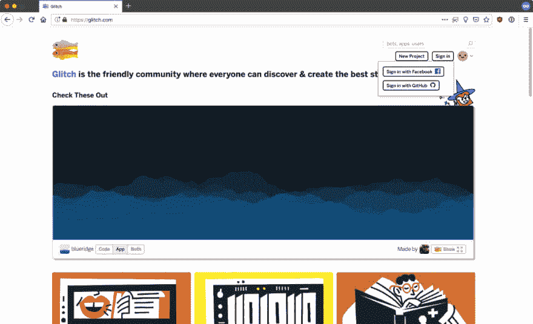](https://res.cloudinary.com/practicaldev/image/fetch/s--48kO1jFe--/c_limit%2Cf_auto%2Cfl_progressive%2Cq_auto%2Cw_880/https://cdn.glitch.com/df802ecc-0da6-4e3b-adb3-740a4b639b86%252F02.jpg%3F1543233500276)

之后可以点击*新建项目*按钮开始。有三种选择，*hello-网页*、 *hello-express* 和 *hello-sqlite* 。出于本教程的目的，请使用 *hello-express* ，因为这将为您提供一个已经安装了 Node.js 和 npm 的环境。

[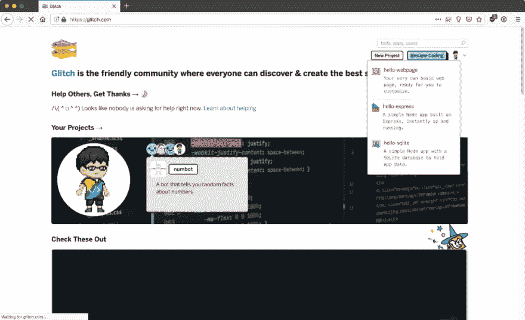](https://res.cloudinary.com/practicaldev/image/fetch/s--nECe4QoH--/c_limit%2Cf_auto%2Cfl_progressive%2Cq_auto%2Cw_880/https://cdn.glitch.com/df802ecc-0da6-4e3b-adb3-740a4b639b86%252F03.jpg%3F1543233500695)

要安装额外的节点包，您可以通过单击状态窗口中的*控制台*按钮来访问命令行。

[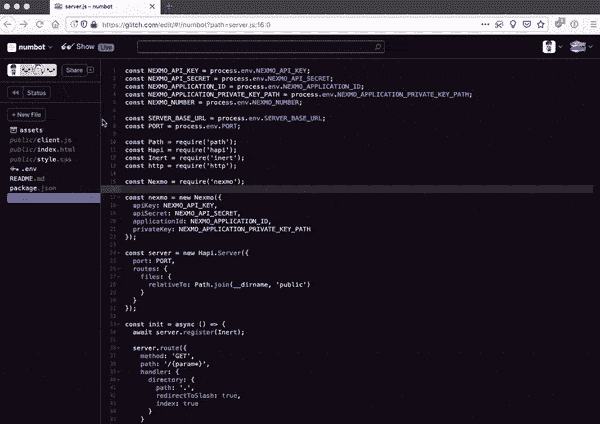](https://res.cloudinary.com/practicaldev/image/fetch/s--RUM5on0---/c_limit%2Cf_auto%2Cfl_progressive%2Cq_66%2Cw_880/https://cdn.glitch.com/df802ecc-0da6-4e3b-adb3-740a4b639b86%252Fglitch-status.gif%3F1543287520827)

您可以通过点击侧边栏顶部附近的*状态*按钮来切换状态窗口。从那里，您可以在 bash 环境中使用所有标准的 CLI 命令。唯一的区别是，在 Glitch 上，您将使用`pnpm`而不是`npm`。

Glitch 使用 [Express](https://expressjs.com/) 作为其默认的 Node.js 框架，但是将 app 转换为 [Hapi.js](https://hapijs.com/) 并不太复杂。

[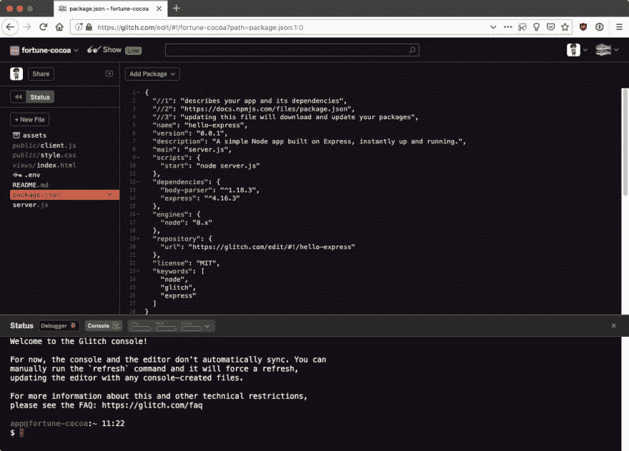](https://res.cloudinary.com/practicaldev/image/fetch/s--ar7cxI-L--/c_limit%2Cf_auto%2Cfl_progressive%2Cq_auto%2Cw_880/https://cdn.glitch.com/df802ecc-0da6-4e3b-adb3-740a4b639b86%252F04.jpg%3F1543233503752)

用下面的命令从项目中删除`express`和`body-parser`:

```
pnpm uninstall express body-parser 
```

Enter fullscreen mode Exit fullscreen mode

使用以下命令安装 hapi . js:

```
pnpm install hapi --save 
```

Enter fullscreen mode Exit fullscreen mode

控制台和编辑器不会自动同步，所以运行`refresh`命令来更新编辑器中的`package.json`文件。

[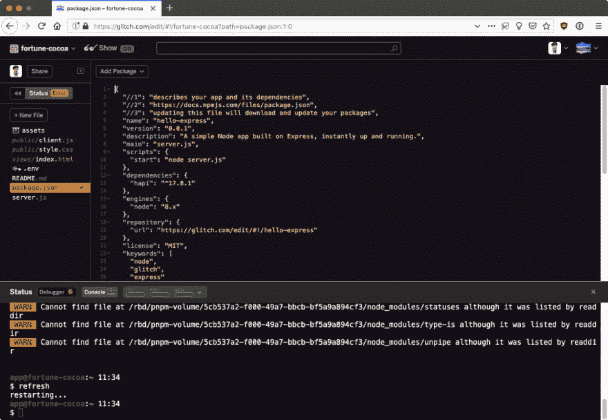](https://res.cloudinary.com/practicaldev/image/fetch/s--HgKtj98d--/c_limit%2Cf_auto%2Cfl_progressive%2Cq_auto%2Cw_880/https://cdn.glitch.com/df802ecc-0da6-4e3b-adb3-740a4b639b86%252F05.jpg%3F1543233500787)

您还会注意到应用程序的状态显示了一个错误。这是意料之中的，因为默认的`server.js`文件仍然引用`express`。

要解决这个问题，用下面的代码替换`server.js`的内容:

```
const Hapi = require('hapi');

// Create a server with a host and port
const server = Hapi.server({
  port: 8000
});

const init = async () => {
  // Add a basic route
  server.route({
    method: 'GET',
    path: '/',
    handler: function(request, h) {
      return 'hello world';
    }
  });

  // Start the server
  await server.start();
  console.log('Server running at:', server.info.uri);
};

init(); 
```

Enter fullscreen mode Exit fullscreen mode

现在，当您尝试查看您的应用程序时，它应该会显示一个空白页，上面写着 *hello world* 。

### 服务静态文件

尽管消息大部分是在服务器端处理的，但为你的机器人提供一个基本的登陆页面还是不错的。为此，当人们试图通过浏览器访问您的应用程序时，我们可以提供一个基本的 HTML 页面。

惰性是 hapi.js 的一个静态文件和目录处理插件。通过控制台用下面的命令把它安装到你的项目中:

```
pnpm install inert --save 
```

Enter fullscreen mode Exit fullscreen mode

为了使事情不那么复杂，将登录页面所需的所有文件放在`public`文件夹中。您可以通过重命名侧边栏上的文件路径，将`index.html`文件从`views`文件夹移动到`public`文件夹。

[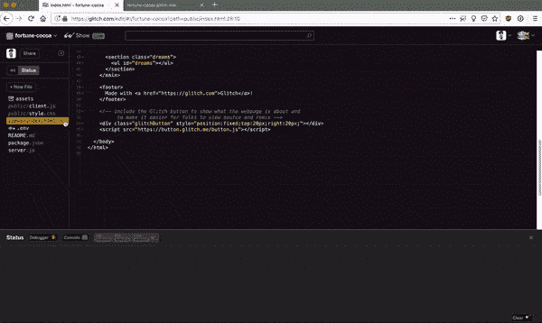](https://res.cloudinary.com/practicaldev/image/fetch/s--LldISSjH--/c_limit%2Cf_auto%2Cfl_progressive%2Cq_66%2Cw_880/https://cdn.glitch.com/df802ecc-0da6-4e3b-adb3-740a4b639b86%252Fmove-file.gif%3F1543297797376)

您也可以通过控制台的命令行来完成。

一旦完成，修改`server.js`文件以使用惰性文件，并从`public`文件夹中提供文件，如下所示:

```
const Hapi = require('hapi');
const Path = require('path');
const Inert = require('inert');

// Create a server with a host and port
const server = Hapi.server({
  port: 8000,
  routes: {
    files: {
      relativeTo: Path.join(__dirname, 'public')
    }
  }
});

const init = async () => {
  await server.register(Inert);

  // Add the route
  server.route({
    method: 'GET',
    path: '/{param*}',
    handler: {
      directory: {
        path: '.',
        redirectToSlash: true,
        index: true
      }
    }
  });

  // Start the server
  await server.start();
  console.log('Server running at:', server.info.uri);
};

init(); 
```

Enter fullscreen mode Exit fullscreen mode

现在，代替 *hello world* ，你的应用程序应该提供默认的故障`index.html`文件。你可以随意定制文件。

### NEX mo API 入门

您还需要[注册一个 Nexmo 帐户](https://dashboard.nexmo.com/sign-up)来访问您的 API 密钥和秘密，这是使用 Nexmo REST API 客户端所必需的。登录到您的帐户后，您将能够在仪表板上看到您的 API 凭据。

[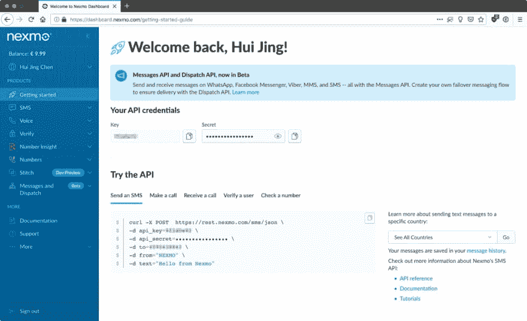](https://res.cloudinary.com/practicaldev/image/fetch/s--l_iqMOqU--/c_limit%2Cf_auto%2Cfl_progressive%2Cq_auto%2Cw_880/https://cdn.glitch.com/df802ecc-0da6-4e3b-adb3-740a4b639b86%252F01.jpg%3F1543233501145)

回到你的 Glitch 应用程序，用下面的命令安装 Node.js 的 [Nexmo REST API 客户端:](https://github.com/Nexmo/nexmo-node) 

```
pnpm install nexmo@beta --save 
```

Enter fullscreen mode Exit fullscreen mode

如果你刷新你的项目，你的`package.json`应该是这样的:

[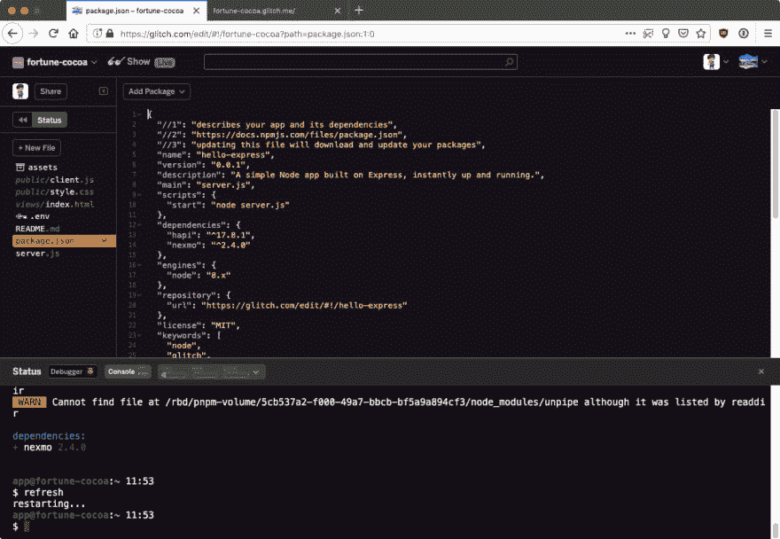](https://res.cloudinary.com/practicaldev/image/fetch/s--KLqv7uBU--/c_limit%2Cf_auto%2Cfl_progressive%2Cq_auto%2Cw_880/https://cdn.glitch.com/df802ecc-0da6-4e3b-adb3-740a4b639b86%252F06.jpg%3F1543233501345)

现在，您可以开始构建自己的机器人了。本教程描述了如何使用 [NumbersAPI](http://numbersapi.com/) 构建一个返回关于数字的随机琐事的机器人，NumbersAPI 是一个返回关于数字的有趣事实的 API。但是您可以自由地使用其他 API 来生成您的机器人的响应。

## 通过短信发送和接收消息

### 获取虚拟电话号码

要通过 Messages API 发送和接收 SMS，您还需要一个虚拟电话号码，它与任何标准电话号码一样，只是它们不依赖于任何物理电话线或设备。

您可以通过选择*购买号码*从侧边栏的*号码*部分购买虚拟号码。您可以根据自己选择的国家/地区、支持的功能和号码类型选择本地号码，无论是移动电话、座机还是免费电话。

[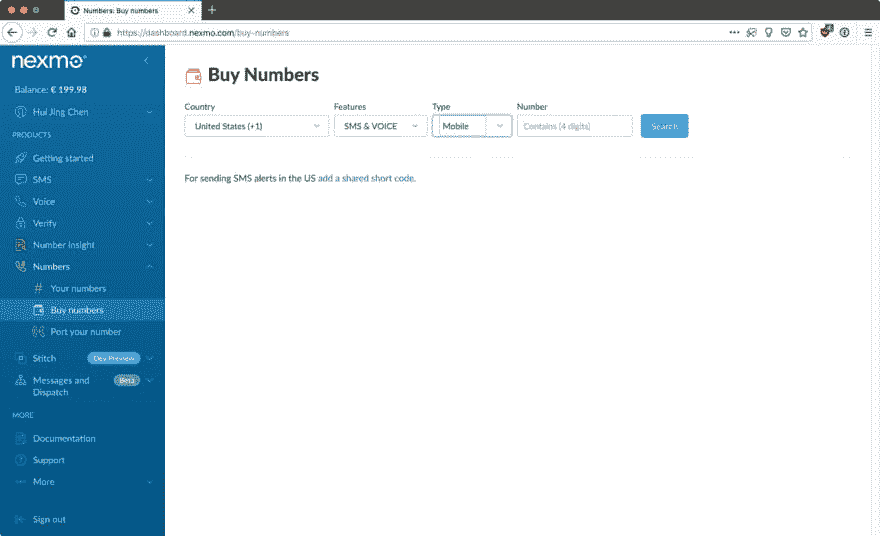](https://res.cloudinary.com/practicaldev/image/fetch/s--Nky_Kwo4--/c_limit%2Cf_auto%2Cfl_progressive%2Cq_auto%2Cw_880/https://cdn.glitch.com/df802ecc-0da6-4e3b-adb3-740a4b639b86%252F07.jpg%3F1543289564135)

一旦你有了你的号码，它就会出现在*你的号码*部分。点击最右边的*管理*栏下的铅笔图标，配置您的入站 webhook URL。这是接收短信所必需的。向您的号码发送短信时，会向该 URL 发送一个`POST`请求，其中包含消息有效载荷。

[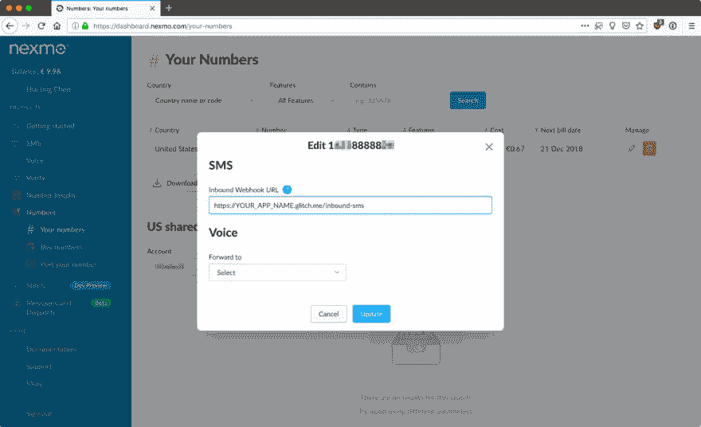](https://res.cloudinary.com/practicaldev/image/fetch/s--wsdWz1DP--/c_limit%2Cf_auto%2Cfl_progressive%2Cq_auto%2Cw_880/https://cdn.glitch.com/df802ecc-0da6-4e3b-adb3-740a4b639b86%252F08.jpg%3F1543290832091)

### 创建信息应用程序

接下来，导航到侧边栏上*消息下的*创建应用程序*页面和*部分。填写您的应用程序名称，以及以 Glitch 应用程序 URL 为主机的 webhook URLs。您还需要生成一个公钥/私钥对，这将提示您下载`private.key`文件。

[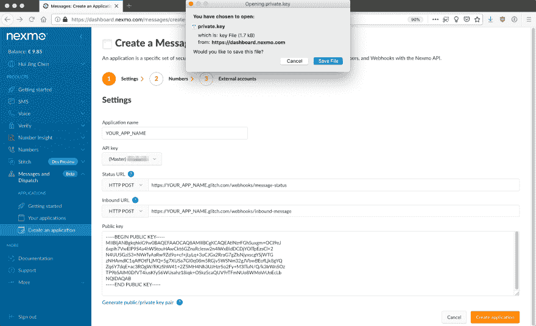](https://res.cloudinary.com/practicaldev/image/fetch/s--BTBA6WZj--/c_limit%2Cf_auto%2Cfl_progressive%2Cq_auto%2Cw_880/https://cdn.glitch.com/03f552cb-b122-492c-94c5-0802f09a5185%252Fgenerate-key.png%3F1545658727093)

然后，点击橙色的*创建应用*按钮。下一个屏幕将允许您通过点击*管理*栏下的*链接*按钮将您的虚拟号码链接到您的应用程序。

[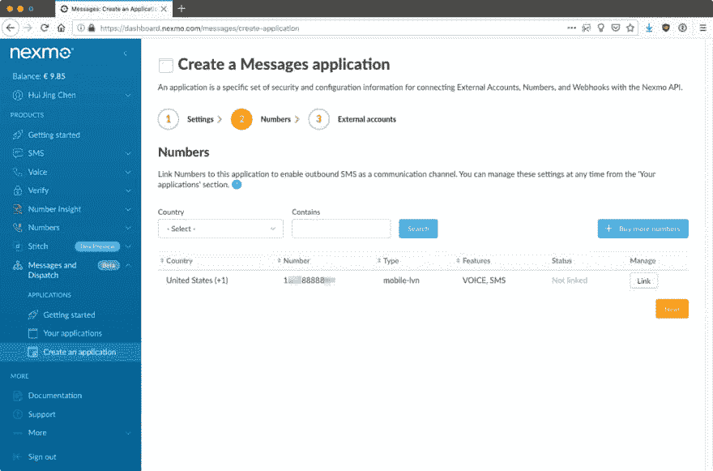](https://res.cloudinary.com/practicaldev/image/fetch/s--ytu_KM18--/c_limit%2Cf_auto%2Cfl_progressive%2Cq_auto%2Cw_880/https://cdn.glitch.com/df802ecc-0da6-4e3b-adb3-740a4b639b86%252F12.jpg%3F1543306036765)

最后，系统会询问您是否想要链接任何外部帐户，但您可以暂时不做任何操作。

[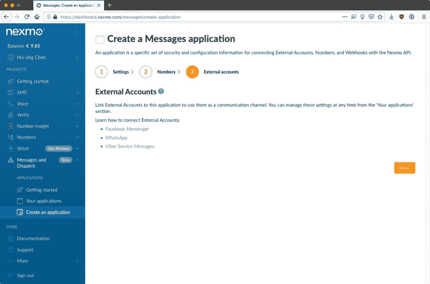](https://res.cloudinary.com/practicaldev/image/fetch/s--ueu8bqlK--/c_limit%2Cf_auto%2Cfl_progressive%2Cq_auto%2Cw_880/https://cdn.glitch.com/df802ecc-0da6-4e3b-adb3-740a4b639b86%252F13.jpg%3F1543306033533)

要将`private.key`文件上传到 Glitch 并保密，您可以在`.data`文件夹中创建该文件。此文件夹的内容仅对您和您添加到项目中的任何受信任的协作者可见。将您先前下载的`private.key`的内容复制到这个新文件中。

[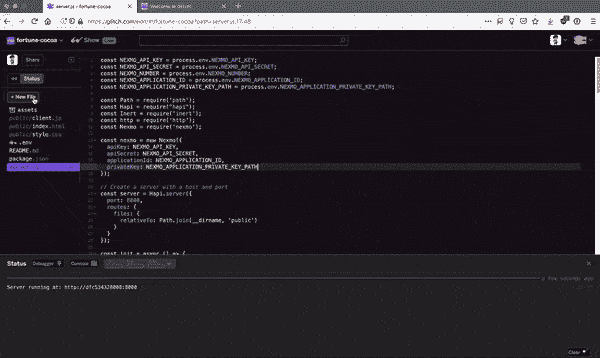](https://res.cloudinary.com/practicaldev/image/fetch/s---L_5ea88--/c_limit%2Cf_auto%2Cfl_progressive%2Cq_66%2Cw_880/https://cdn.glitch.com/df802ecc-0da6-4e3b-adb3-740a4b639b86%252Fprivate-key.gif%3F1543307314328)

### 凭证设置

Glitch 通过`.env`文件支持[环境变量](http://help-center.glitch.me/help/env/)，这是一种存储您的 API 凭证和其他项目私有数据的安全方式。在`.env`文件中设置您的 API 密钥、密码、Nexmo 虚拟号码、消息应用 ID 和私钥路径。

一定要用引号将它们括起来，因为每个值都需要是一个字符串。我们将引用它们来初始化一个新的 Nexmo 实例，我们用它来发送 SMS 消息。

[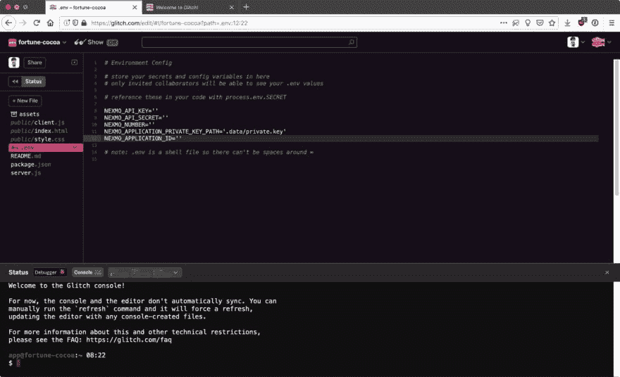](https://res.cloudinary.com/practicaldev/image/fetch/s--GO48twbq--/c_limit%2Cf_auto%2Cfl_progressive%2Cq_auto%2Cw_880/https://cdn.glitch.com/df802ecc-0da6-4e3b-adb3-740a4b639b86%252F09.jpg%3F1543307191837)

将您的 API 凭证添加到`server.js`文件中，并初始化一个新的 Nexmo 实例。

```
const NEXMO_API_KEY = process.env.NEXMO_API_KEY;
const NEXMO_API_SECRET = process.env.NEXMO_API_SECRET;
const NEXMO_APPLICATION_ID = process.env.NEXMO_APPLICATION_ID;
const NEXMO_APPLICATION_PRIVATE_KEY_PATH = process.env.NEXMO_APPLICATION_PRIVATE_KEY_PATH;
const NEXMO_NUMBER = process.env.NEXMO_NUMBER;

const Nexmo = require('nexmo');

const nexmo = new Nexmo({
  apiKey: NEXMO_API_KEY,
  apiSecret: NEXMO_API_SECRET,
  applicationId: NEXMO_APPLICATION_ID,
  privateKey: NEXMO_APPLICATION_PRIVATE_KEY_PATH
}); 
```

Enter fullscreen mode Exit fullscreen mode

### 接收一条呼入短信

要接收入站短信，您需要添加一个路由来处理当有人向您的虚拟号码发送短信时触发的入站`POST`请求。将以下路线添加到您的`server.js`文件中:

```
server.route({
  method: 'POST',
  path: '/inbound-sms',
  handler: (request, h) => {
    const payload = request.payload;
    console.log(payload);
    return h.response().code(200); 
  }
}); 
```

Enter fullscreen mode Exit fullscreen mode

请注意，这里的`path`参数必须与您之前设置的虚拟号码的入站 webhook URL 相匹配。为确保一切正常，请向您的虚拟号码发送短信。您应该会在状态窗口中看到消息有效负载。

[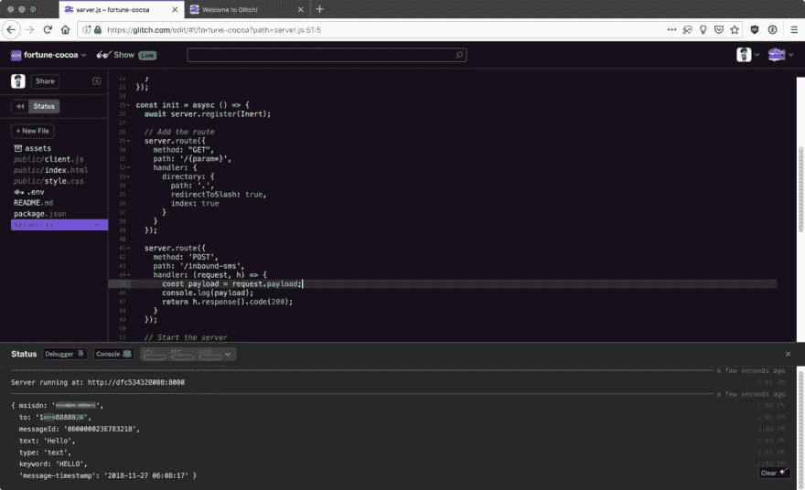](https://res.cloudinary.com/practicaldev/image/fetch/s--YtHfQu0w--/c_limit%2Cf_auto%2Cfl_progressive%2Cq_auto%2Cw_880/https://cdn.glitch.com/df802ecc-0da6-4e3b-adb3-740a4b639b86%252F10.jpg%3F1543299274420)

### 发送出站短信响应

现在，您需要通过提取消息内容并使用它从 [NumbersAPI](http://numbersapi.com/) 中检索随机事实来处理消息负载。您可以编写一个函数来检查 SMS 的内容是否是一个数字，如果不是，您可以返回一个请求数字的响应。

```
function parseSms(payload) {
  const message = payload.text;
  const phone = payload.msisdn;

  const isNum = /^\d+$/.test(message);
  console.log(isNum);

  if (isNum) {
    getFactSms(message, phone);
  } else {
    smsResponse("Sorry, but Numbot can only give you facts about whole numbers. Try something like 42.", phone);
  }
} 
```

Enter fullscreen mode Exit fullscreen mode

用对新的`parseSms()`函数的调用替换显示`console.log(payload)`的行。您会注意到，如果消息内容是一个数字，我将调用另一个名为`getFactSms()`的函数。这将是调用 Numbers API 的函数，用于您将发送回您的用户的随机事实。

为此，你需要提出一个基本的`GET`请求。有许多库可以做到这一点，但是考虑到这是一个相对简单的请求，您可以使用 native Node.js `http`模块。

```
const http = require('http');

function getFactSms(number, phone) {
  return http.get(
    {
      host: 'numbersapi.com',
      path: '/' + number
    },
    function(response) {
      let fact = '';
      response.on('data', function(d) {
        fact += d;
      });
      response.on('end', function() {
        smsResponse(fact, phone);
      });
    }
  );
} 
```

Enter fullscreen mode Exit fullscreen mode

最后一个函数`smsResponse()`将触发发送随机事实给你的用户。

```
function smsResponse(fact, phone) {
  nexmo.channel.send(
    { "type": "sms", "number": phone },
    { "type": "sms", "number": NEXMO_NUMBER },
    {
      "content": {
        "type": "text",
        "text": fact
      }
    },
    (err, data) => { console.log(data.message_uuid); }
  )
} 
```

Enter fullscreen mode Exit fullscreen mode

仅此而已。你现在有了一个基本的短信机器人，它会根据你发送的号码随机做出响应。