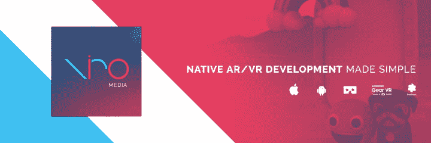
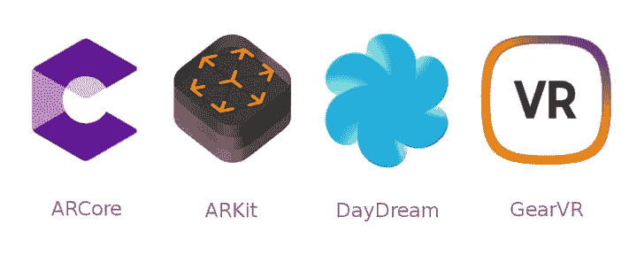
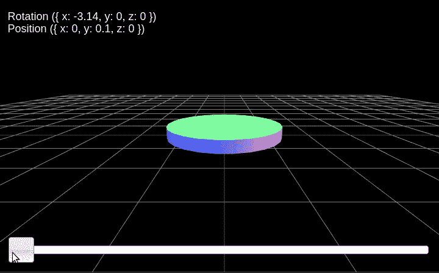

# 使用 React-Native 构建增强现实应用

> 原文：<https://dev.to/juliendemangeon/build-augmented-reality-applications-with-react-native-3g73>

*注:此帖子最初发布于[marmelab.com](https://marmelab.com/blog/2019/04/25/react-native-augmented-reality.html)。*

增强现实是当前最重要的趋势之一。因此，在一年多前我们使用浏览器进行试验之后，我想测试一个框架，为 T2 创造本地增强现实体验提供可能性。请继续阅读，看看我是如何使用 React-Native 在移动设备上开发 reversi 游戏应用程序的。

[https://player.vimeo.com/video/316986012](https://player.vimeo.com/video/316986012)

## 什么是增强现实？

由于“人工智能”一词可能会与其他相关概念混淆，**增强现实** (AR)经常被误认为是**虚拟现实** (VR)。其实， **VR** 和 **AR** 根本不一样。VR 是虚拟世界在我们眼中的投影，而 AR 是虚拟物体在现实世界中的*混合*投影。

我邀请你在我们之前关于浏览器中的 [AR 的博客文章中查看这些概念的更详细描述。](https://marmelab.com/blog/2017/06/19/augmented-reality-html5.html#what-is-augmented-reality)

## Javascript 中的增强现实与原生性能

在 Marmelab，我们是 React 及其生态系统的绝对粉丝。这就是为什么我们使用这项技术为我们的客户开发了许多开源工具和 T2 项目。

我不会假装自己是一个优秀的 Java、Kotlin、CSharp 或 Swift 开发者。但是我也希望在移动设备上有良好的性能，所以使用 React 这样的 web 框架是不可能的。所以我开始寻找一个原生框架，让我用 Javascript 和 React 开发 iOS 和 Android 应用程序。

[](https://res.cloudinary.com/practicaldev/image/fetch/s--mM_YbJij--/c_limit%2Cf_auto%2Cfl_progressive%2Cq_auto%2Cw_880/https://marmelab.com/static/6949bbe5488350d751c835ed3f4873fc/dcb89/viro.png)

经过几分钟的研究，唯一明显的选择是使用 [ViroReact](https://viromedia.com/viroreact) 。在引擎盖下，这个框架基于两个主导手机增强和虚拟现实世界的 API:**iOS 版 ARKit】和【Android 版 ARCore**。

**ARKit** 实际上是现有最大的 AR 平台。它允许在至少具有 A9 芯片和 iOS 11 的苹果设备上开发丰富的沉浸式体验。

ARCore 或多或少是相同的，除了它支持一系列[设备](https://developers.google.com/ar/discover/supported-devices)，这些设备被认为足够强大，能够以最佳状态运行 API。还有 iOS 设备，[显然？](https://developers.google.com/ar/develop/ios/overview)。

目前，对设备的支持相当有限是这些 API 的主要弱点。随着时间的推移，手机将变得越来越强大，这将使更多地使用手机成为可能。

## 维罗，局外人

Viro 是一个免费的 AR/VR 开发平台，允许使用 React-Native 构建跨平台应用程序，使用 Java 构建完全原生的 Android 应用程序。它支持多种平台和 API，如 ARKit、ARCore、Cardboard、Daydream 或 GearVR。

[](https://res.cloudinary.com/practicaldev/image/fetch/s--C5zCWdkV--/c_limit%2Cf_auto%2Cfl_progressive%2Cq_auto%2Cw_880/https://marmelab.com/static/b2dd8be5a48c6d852e8eb4781b281f58/dcb89/viro-devices.png)

如前所述，Viro 允许构建完全原生的应用程序和反应原生的应用程序。这就是为什么 Viro 提供了两个不同的包: [ViroCore](https://virocore.viromedia.com/) 和 [ViroReact](https://docs.viromedia.com/) 。

要使用它，你仍然需要注册。注册后提供的 API 密钥是使用平台所必需的。

可悲的是， **Viro 并不是开源的，而是(只能)免费使用**，没有发布限制。根据 ViroMedia 首席执行官的说法，API 密钥用于内部分析，并防止可能的[许可](https://docs.viromedia.com/docs/license)违规。

> VIRO 保留在通知或不通知的情况下随时修改、暂停或停止软件或更改访问要求的权利。

关于上面的许可说明，因此有必要对其使用保持警惕，因为**我们无法保证平台**的发展。

## 第一次接触 ViroReact

在这一节中，我将用一个简单的用例来介绍 Viro 框架的主要部分:Marmelab 徽标的 3D 投影！

[https://www.youtube.com/embed/cxT63CxU-ag](https://www.youtube.com/embed/cxT63CxU-ag)

首先，我们需要创建一个 3D 网格，以便能够将它包含在我们的项目中。特别感谢 [@jpetitcolas](https://github.com/jpetitcolas) 几年前用 blender 创作了 Marmelab 的 logo。

### 安装

在使用 Viro 之前，我们需要安装一些 npm 依赖项。Viro 要求将`react-native-cli`和`react-viro-cli`作为全局包。

```
npm install -g react-native-cli
npm install -g react-viro-cli 
```

Enter fullscreen mode Exit fullscreen mode

然后，我们可以使用特殊命令`react-viro init`初始化一个 Viro 项目，后跟项目名称。然后会创建一个同名的文件夹。

```
react-viro init marmelab_for_real 
```

Enter fullscreen mode Exit fullscreen mode

那么，在这个项目中我们能看到什么呢？嗯，文件夹结构与我们在 React-Native 中遇到的常见结构非常相似，这一点并不奇怪。

```
├── android
├── bin
├── ios
├── js
├── node_modules
├── App.js
├── app.json
├── index.android.js
├── index.ios.js
├── index.js
├── metro.config.js
├── package.json
├── rn-cli.config.js
├── setup-ide.sh
└── yarn.lock 
```

Enter fullscreen mode Exit fullscreen mode

### 开发者体验

一旦项目被初始化，我们只需使用`npm start`命令启动它。Viro 将自动创建一个 [ngrok 隧道](https://ngrok.com/)，它可以被全球任何连接到互联网的手机使用。

```
julien@julien-laptop /tmp/foo $ npm start

> foo@0.0.1 prestart /tmp/foo
> ./node_modules/react-viro/bin/run_ngrok.sh

 ----------------------------------------------------------
|                                                          |
| NGrok Packager Server endpoint: http://32a5a3d7.ngrok.io |
|                                                          |
 ----------------------------------------------------------

> foo@0.0.1 start /tmp/foo
> node node_modules/react-native/local-cli/cli.js start

┌──────────────────────────────────────────────────────────────────────────────┐
│                                                                              │
│  Running Metro Bundler on port 8081\.                                         │
│                                                                              │
│  Keep Metro running while developing on any JS projects. Feel free to        │
│  close this tab and run your own Metro instance if you prefer.               │
│                                                                              │
│  https://github.com/facebook/react-native                                    │
│                                                                              │
└──────────────────────────────────────────────────────────────────────────────┘ 
```

Enter fullscreen mode Exit fullscreen mode

要访问应用程序，我们只需使用来自 Viro 的特殊[测试平台应用程序](https://play.google.com/store/apps/details?id=com.viromedia.viromedia)以及相应的隧道或本地 ip(如果您是本地连接的)。在这些方面，维罗让我想起了 T2 世博会。然后，我们能够访问测试应用程序:

[https://player.vimeo.com/video/326854583](https://player.vimeo.com/video/326854583)

除了这些运行工具之外，Viro 还直接在设备上提供热重装、实时重装、错误消息和警告，就像任何 React-Native 应用程序一样。

### 初始化场景导航器

根据您想要的项目类型，Viro 提供了以下 3 个不同的`SceneNavigator`组件:

*   ViroVRSceneNavigator:用于虚拟现实应用
*   ViroARSceneNavigator:用于增强现实应用
*   Viro3DSceneNavigator:用于 3D(非 AR/VR)应用

这个组件被用作我们的应用程序的入口点。你必须根据你想做的事情来选择一个，在我们的例子中`ViroARSceneNavigator`是增强现实。

每个`SceneNavigator`需要两个不同的道具，分别是`apiKey`和`initialScene`。第一个来自您在 Viro 网站上的注册，第二个是一个带有`scene`属性的对象，值为我们的场景组件。

```
// App.js

import React from 'react';
import { View, StyleSheet } from 'react-native';
import { ViroARSceneNavigator } from 'react-viro';
import { VIROAPIKEY } from 'react-native-dotenv';

import PlayScene from './src/PlayScene';

const styles = StyleSheet.create({
    root: {
        flex: 1,
        backgroundColor: '#fff',
    },
});

const App = () => (
    <View style={styles.root}>
        <ViroARSceneNavigator
            apiKey={VIROAPIKEY}
            initialScene={{ scene: PlayScene }}
        />
    </View> );

export default App; 
```

Enter fullscreen mode Exit fullscreen mode

因为我们想保持我们的 Viro `apiKey`私有，我们使用`react-native-dotenv`包和项目文件夹根目录下的`.env`文件。

要使它可行，只需安装这个带有`yarn add -D react-native-dotenv`的包，并创建一个带有`VIROAPIKEY=<YOUR-VIRO-API-KEY>`的`.env`文件。

最后一步是添加预置到巴别塔已经描述如下。

```
// .babelrc

{
  "presets": [
    "module:metro-react-native-babel-preset",
+   "module:react-native-dotenv"
  ]
} 
```

Enter fullscreen mode Exit fullscreen mode

### 添加场景

现在自举完成了，是时候开发我们的第一个场景了！

[虚拟场景](https://docs.viromedia.com/docs/scenes)充当我们所有 UI 对象、灯光和 3D 对象的容器。场景组件有两种类型:`ViroScene`和`ViroARScene`。

每个`Scene`包含由全功能 3D 场景图形引擎管理的节点的分层树结构。`ViroScene`通过代表 3D 空间中**位置**和**变换**的`ViroNode`组件来定位孩子。

因此，几乎树下的每个对象都有一个`position`、`rotation`和`scale`属性，它们接受一个坐标/向量(x，y，z)数组，如下所述。

```
<ViroNode
    position={[2.0, 5.0, -2.0]}
    rotation={[0, 45, 45]}
    scale={[2.0, 2.0, 2.0]}
 /> 
```

Enter fullscreen mode Exit fullscreen mode

现在我们知道了它是如何工作的，我们可以创建我们的第一个`ViroARScene`(又名`PlayScene`)。

```
// src/PlayScene.js

import React from 'react';

import {
    ViroARScene,
    Viro3DObject,
    ViroAmbientLight
} from 'react-viro';

const MarmelabLogo = () => (
    <Viro3DObject
        source={require('../assets/marmelab.obj')}
        resources={[require('../assets/marmelab.mtl')]}
        highAccuracyEvents={true}
        position={[0, 0, -1]} // we place the object in front of us (z = -1)
        scale={[0.5, 0.5, 0.5]} // we reduce the size of our Marmelab logo object
        type="OBJ"
    />
);

const PlayScene = () => (
    <ViroARScene displayPointCloud>
        <ViroAmbientLight color="#fff" />
        <MarmelabLogo />
    </ViroARScene> );

export default PlayScene; 
```

Enter fullscreen mode Exit fullscreen mode

在前面的代码中，我们引入了两个新的 Viro 组件，分别是`Viro3DObject`和`ViroAmbiantLight`。

`Viro3DObject`允许从 3D 结构/纹理文件创建 3D 对象，这些文件可以放在我们的 Viro `Scene`上。在我们的例子中，我们使用之前混合的 Marmelab 徽标对象声明一个组件。

`ViroAmbientLight`在我们的`Scene`中引入一些照明。没有光，任何物体都是看不见的。

[https://player.vimeo.com/video/331017433](https://player.vimeo.com/video/331017433)

最后的结果真的很神奇，尤其是我们在这上面花的时间非常少。

## 升级:在 AR 中开发一个黑白棋

在这个小小的探索之后，是时候让我们使用这项技术开发一个更实际的应用程序了。由于这次我不想对业务逻辑进行建模或编码，我将重用一个现有的代码库和以前项目中的混合对象(磁盘)。这是一个使用三个 j 的[黑白棋游戏。](https://marmelab.com/blog/2017/06/15/animate-you-world-with-threejs-and-tweenjs.html)

[](https://res.cloudinary.com/practicaldev/image/fetch/s--3KzY-9Xp--/c_limit%2Cf_auto%2Cfl_progressive%2Cq_auto%2Cw_880/https://marmelab.com/static/bae5d3a3e2917b6c1cfd1bf5d14a465a/dcb89/arcoretarget.png)

### 黑白棋游戏场景

根据我们之前的实验，我们将替换我们的`PlayScene`以包含一个新的`Game`组件，该组件包含一个`Board`，该组件本身包含`Disk`对象组件。

```
// src/PlayScene.js

import React from 'react';

import {
    ViroARScene,
    ViroAmbientLight,
} from 'react-viro';

import Game from './components/Game';
import { create as createGame } from './reversi/game/Game';
import { create as createPlayer } from './reversi/player/Player';
import { TYPE_BLACK, TYPE_WHITE } from './reversi/cell/Cell';

const defaultGame = createGame([
    createPlayer('John', TYPE_BLACK),
    createPlayer('Charly', TYPE_WHITE),
]);

const PlayScene = () => {
    const [game] = useState(defaultGame);

    return (
        <ViroARScene displayPointCloud>
            <ViroAmbientLight color="#fff" />
                <Game game={game} />
        </ViroARScene>
    );
};

export default PlayScene; 
```

Enter fullscreen mode Exit fullscreen mode

```
// src/components/Game.js

import React, { Component } from 'react';

import Board from './Board';
import { getCurrentPlayer } from '../reversi/game/Game';

class Game extends Component {
    // ...

    render() {
        const { game } = this.state;

        return (
            <Board
                board={game.board}
                currentCellType={getCurrentPlayer(game).cellType}
                onCellChange={this.handleCellChange}
            />
        );
    }
}

export default Game; 
```

Enter fullscreen mode Exit fullscreen mode

游戏依靠一个棋盘和一个圆盘组件:

```
// src/components/Board.js

import React, { Component } from 'react';
import PropTypes from 'prop-types';
import { ViroNode } from 'react-viro';

import Disk from './Disk';
import { TYPE_WHITE, TYPE_EMPTY } from '../reversi/cell/Cell';

class Board extends Component {
    // ...

    renderCellDisk = cell => (
        <Disk
            key={`${cell.x}${cell.y}`}
            position={[0.03 * cell.x, 0, -0.3 - 0.03 * cell.y]}
            rotation={[cell.type === TYPE_WHITE ? 180 : 0, 0, 0]}
            opacity={cell.type === TYPE_EMPTY ? 0.15 : 1}
            onClick={this.handleClick(cell)}
        />
    );

    render() {
        const { board } = this.props;

        return (
            <ViroNode position={[0.0, 0.0, 0.5]}>
                {board.cells
                    .reduce(
                        (agg, row, y) => [...agg, ...row.map((type, x) => createCell(x, y, type))],
                        [],
                    )
                    .map(this.renderCellDisk)}
            </ViroNode>
        );
    }
}

Board.propTypes = {
    onCellChange: PropTypes.func.isRequired,
    currentCellType: PropTypes.number.isRequired,
    board: PropTypes.shape({
        cells: PropTypes.array,
        width: PropTypes.number,
        height: PropTypes.number,
    }),
};

export default Board; 
```

Enter fullscreen mode Exit fullscreen mode

```
// src/Disk.js

import React from 'react';
import { Viro3DObject } from 'react-viro';

const Disk = props => (
    <Viro3DObject
        source={require('../assets/disk.obj')}
        resources={[require('../assets/disk.mtl')]}
        highAccuracyEvents={true}
        position={[0, 0, -1]}
        scale={[0.0007, 0.0007, 0.0007]}
        type="OBJ"
        {...props}
    /> );

export default Disk; 
```

Enter fullscreen mode Exit fullscreen mode

起作用了！然而，我想我们都同意在浮动棋盘上玩黑白棋是不可能的...这就是为什么我们要定义一个[锚点](https://docs.viromedia.com/docs/ar-tracking-and-anchors)，在其上我们可以放置我们的`Game` / `Board`。

### 在现实世界中放置物体

在增强现实术语中，*将虚拟物体附着到现实世界的一个点*上的概念被称为**锚定**。按照那个词的说法，**主播**就是用来完成这个任务的。

锚点是由 AR 系统(ARCore 或 ARKit)在现实世界中发现的**垂直或水平平面**，或**图像**(通常是标记)，我们可以依靠它们来构建虚拟世界。

在 Viro 中，锚由一个`Anchor`对象表示，该对象可以使用不同的检测方法通过**目标**找到，如下所述。

*   这个组件允许使用“手动”(通过一个“anchorId”)或“自动”检测现实世界中的一个平面来放置物体。
*   `ViroARPlaneSelector`:该组件显示系统发现的所有可用平面，并允许用户选择一个。
*   这个组件允许使用一张带插图的纸作为我们虚拟物体的物理锚。

在我的例子中，我选择了`ViroARImageMarker`锚定系统，因为它看起来更稳定，性能更好(乍一看)。

`ViroARImageMarker`有一个强制道具叫`target`。这个属性必须包含一个注册目标的名字，这个注册目标之前已经使用`ViroARTrackingTargets`模块声明过了。

首先要做的是使用`createTargets`函数创建我们的目标。在我们的例子中，我们声明了一个名为`marmelabAnchor`的图像目标(是的，我很有团队精神...)因为我用了 Marmelab 的 logo 做主播。

然后，我们可以将这个锚名直接用作我们的`Game`周围的新`ViroARImageMarker`元素的锚属性值。

```
// src/PlayScene.js

import React from 'react';

import {
    ViroARScene,
    ViroAmbientLight,
+   ViroARTrackingTargets,
+   ViroARImageMarker, } from 'react-viro';

import Game from './components/Game';
import { create as createGame } from './reversi/game/Game';
import { create as createPlayer } from './reversi/player/Player';
import { TYPE_BLACK, TYPE_WHITE } from './reversi/cell/Cell'; 
const defaultGame = createGame([
    createPlayer('John', TYPE_BLACK),
    createPlayer('Charly', TYPE_WHITE),
]);

const PlayScene = () => {
    const [game] = useState(defaultGame);

    return (
        <ViroARScene displayPointCloud>
            <ViroAmbientLight color="#fff" />
+           <ViroARImageMarker target={'marmelabAnchor'}>
                <Game game={game} />
+           </ViroARImageMarker>
        </ViroARScene>
    );
};

+ ViroARTrackingTargets.createTargets({
+     marmelabAnchor: {
+         type: 'Image',
+         source: require('./assets/target.jpg'), // source of the target image
+         orientation: 'Up', // desired orientation of the image
+         physicalWidth: 0.1, // with of the target in meters (10 centimeters in our case)
+     },
+ }); 
export default PlayScene; 
```

Enter fullscreen mode Exit fullscreen mode

在树中的`ViroARImageMarker`元素下声明的所有`children`都相对于它放置。在我们的例子中，`Game`组件被放置在`ViroARImageMarker`目标上。

### 制作场景动画

现在 AR 黑白棋游戏效果更好了。但是它缺少一点点的动画效果。那么，我们怎样才能添加和之前的 ThreeJS 项目一样的磁盘翻转效果呢？

[](https://res.cloudinary.com/practicaldev/image/fetch/s--rlWOm0A1--/c_limit%2Cf_auto%2Cfl_progressive%2Cq_66%2Cw_880/https://marmelab.com/disk-flip-7216a5c65182c405694040170d061d68.gif)

为了满足这种通常的需求，ViroReact 提供了一个名为 **ViroAnimations** 的全局动画注册表，可以在任何地方与任何接受`animation`道具的组件结合使用。

在我们的例子中，我们将**合成变换**来创建一个完整的磁盘翻转效果。下面是一段时间内的预期情景:

| 0-300 毫秒 | **上移** |
| 300-600 毫秒 | **下移** |
| 150-350 毫秒 | **旋转(在磁盘到达顶部期间)** |

首先，我们要根据这个变换时间线注册一个动画。

```
import { ViroAnimations } from 'react-viro';

// ...

ViroAnimations.registerAnimations({
    moveUp: {
        properties: { positionY: '+=0.03' },
        duration: 300,
        easing: 'EaseInEaseOut',
    },
    moveDown: {
        properties: { positionY: '-=0.03' },
        duration: 300,
        easing: 'EaseInEaseOut',
    },
    flip: {
        properties: { rotateX: '+=180' },
        duration: 300,
        easing: 'EaseInEaseOut',
        delay: 150
    },
    flipDisk: [['moveUp', 'moveDown'], ['flip']],
}); 
```

Enter fullscreen mode Exit fullscreen mode

如你所见，我们声明了 3 个不同的动画，并用第四个动画`flipDisk`将它们组合起来。`moveUp`和`moveDown`在同一个数组中，因为它们是相继执行的。`flip`与这两个转换并行运行。

其次，我们只需要使用`animation`道具在我们的`Disk`组件中使用这个注册的动画，如下:

```
 // ...

    renderCellDisk = cell => {
        const { flipping } = this.state;

        return (
            <Disk
                key={`${cell.x}${cell.y}`}
                position={[0.03 * cell.x, 0, -0.3 - 0.03 * cell.y]}
                rotation={[cell.type === TYPE_WHITE ? 180 : 0, 0, 0]}
                opacity={cell.type === TYPE_EMPTY ? 0.15 : 1}
                onClick={this.handleClick(cell)}
                animation={{
                    name: 'flipDisk',
                    run: !!flipping.find(hasSamePosition(cell)),
                    onFinish: this.handleEndFlip(cell),
                }}
            />
        );
    };

    // ... 
```

Enter fullscreen mode Exit fullscreen mode

`animation`属性接受以下结构的对象:

```
{
    name: string            // name of the animation
    delay: number           // number of ms before animation starts
    loop: bool              // animation can loop?
    onFinish: func          // end callback of the animation
    onStart: func           // start callback of the animation
    run: bool               // animation is active or not?
    interruptible: bool     // can we change animation when running?
} 
```

Enter fullscreen mode Exit fullscreen mode

在我们的例子中，我们刚刚使用了`name`、`run`和`onFinish`属性来定义当前正在翻转的磁盘，并在动画结束时将其从翻转列表中删除。

## 结论

出于多种原因，使用 ViroReact 构建增强现实项目是一个很好的选择。鉴于这是我在这个领域的第一次经历，我在任何时候都没有遇到任何困难。恰恰相反，Viro 帮助我充满信心地探索这个世界。

**开发者体验丰富**,因为它提供 ReactJS 绑定、热重装和明确的文档。然而，**我不建议在复杂/基于性能的应用中使用它**，因为 React-Native javascript 线程会导致事件拥塞和延迟。因此，如果性能很重要，我会推荐全原生解决方案。

顺便说一下，谷歌正在不断地在其应用程序中添加增强现实功能，如谷歌地图上的。**增强现实从未如此扩张**。所以，不要错过。

其他许多功能还有待探索，比如[骨骼动画](https://docs.viromedia.com/docs/animation#section-skeletal-animation)、[粒子特效](https://docs.viromedia.com/docs/particle-effects)、[物理](https://docs.viromedia.com/docs/physics)、[视频](https://docs.viromedia.com/docs/video)和[声音](https://docs.viromedia.com/docs/audio)。不要害羞，**通过评论分享你的经历**；)

你可以在 GitHub 的 marmelab/virothello 库中找到最终代码。