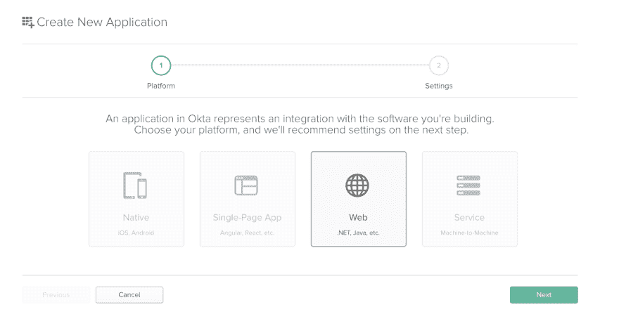
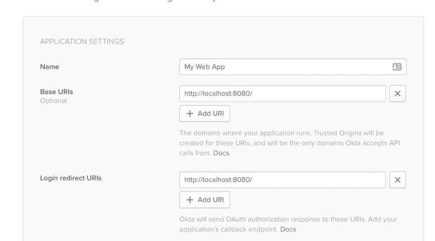
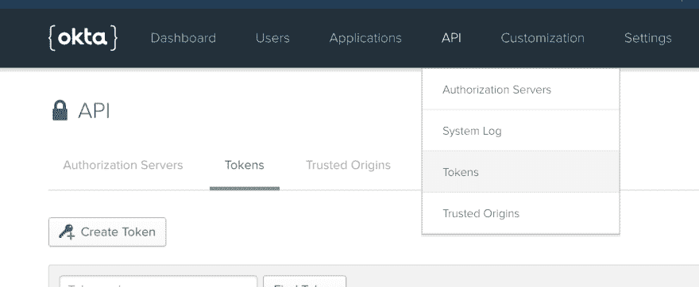
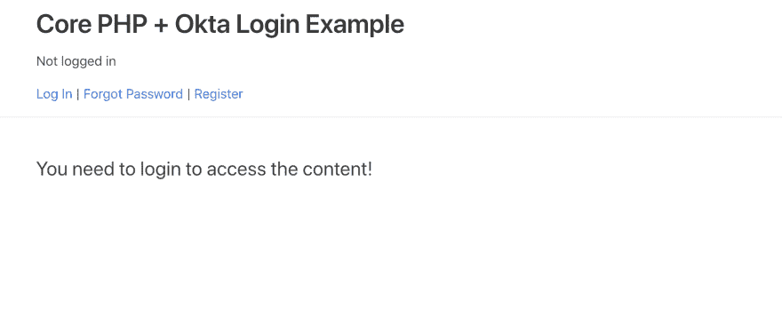
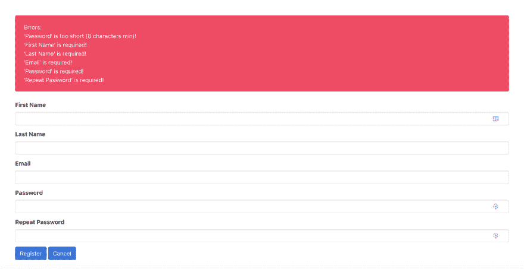

# 用 PHP 构建简单的登录

> 原文：<https://dev.to/oktadev/build-simple-login-in-php-4ojb>

从头开始为您的 Web 应用程序构建一个用户认证系统可能是一项看似棘手的工作。起初看起来很容易，但是有很多细节需要考虑——正确地散列密码，保护用户会话，提供一种重置忘记的密码的方法。大多数现代框架都提供了处理所有这些问题的样板代码，但是即使你没有使用框架，也不要绝望。在本文中，我将向您展示如何从头构建一个 PHP 应用程序(只依赖于一个外部库- DotEnv，因此我们可以将我们的秘密存储在代码存储库之外的. Env 文件中)。该应用程序将利用 Okta 的简单 OAuth 2.0 API 提供用户登录/注销、新用户注册和“忘记密码”表单。

按照教程，你只需要一个 Okta 开发者账户([你可以免费创建一个](https://developer.okta.com/signup/))、PHP 和 Composer。

## 为什么要用 Okta 进行认证？

Okta 让[身份管理](https://developer.okta.com/product/user-management/)比你习惯的更容易、更安全、更可扩展。Okta 是一个 API 服务，允许您创建、编辑和安全地存储用户帐户和用户帐户数据，并将它们与一个或多个应用程序连接。我们的 API 使您能够:

*   [认证](https://developer.okta.com/product/authentication/)和[授权](https://developer.okta.com/product/authorization/)您的用户
*   存储用户数据
*   执行基于密码的[社交登录](https://developer.okta.com/authentication-guide/social-login/)
*   通过[多重身份验证](https://developer.okta.com/use_cases/mfa/)保护您的应用
*   还有更多！查看我们的[产品文档](https://developer.okta.com/documentation/)了解更多信息

[注册一个永远免费的开发者账户](https://developer.okta.com/signup/)，当你完成后，回来从头开始学习如何构建一个带有用户认证的 PHP 应用程序。

## 创建免费的 Okta 开发者账户

在您继续之前，您需要登录您的 Okta 帐户(或者[创建一个免费的新帐户](https://developer.okta.com/signup/))并创建一个 OAuth 应用程序。您需要为您的应用程序获得一个客户机 ID 和一个客户机秘密，并且您还需要一个 API 令牌，以便应用程序可以远程注册用户。

以下是逐步说明:

1.  转到“应用程序”菜单项，单击“添加应用程序”按钮:

[](https://res.cloudinary.com/practicaldev/image/fetch/s--mHrVDNE8--/c_limit%2Cf_auto%2Cfl_progressive%2Cq_auto%2Cw_880/https://developer.okta.com/assets-jekyll/blog/php-simple-login/add-application-ec29d9f298f8a4213f5bcea00798fdeeddc844cba2f4d9a5e838270120099912.png)

1.  选择**网页**，点击**下一步**。

[](https://res.cloudinary.com/practicaldev/image/fetch/s--LlUmXije--/c_limit%2Cf_auto%2Cfl_progressive%2Cq_auto%2Cw_880/https://developer.okta.com/assets-jekyll/blog/php-simple-login/create-new-application-c356a96f200e7706a547b0159fc5bc4ea26f743b5a2029d75f1108a8d4399e88.png)

1.  输入标题，并将 [http://localhost:8080/](http://localhost:8080/) 设置为基本 URI 和登录重定向 URI，然后点击完成。您可以保持其余设置不变:

[](https://res.cloudinary.com/practicaldev/image/fetch/s--1zcgqTER--/c_limit%2Cf_auto%2Cfl_progressive%2Cq_auto%2Cw_880/https://developer.okta.com/assets-jekyll/blog/php-simple-login/application-settings-11e93f1c01f1348a0b42b8c56579703707e76e7895e55a1d7b4bbf951eaf8e9b.png)

1.  从应用程序设置中复制客户端 ID 和客户端密码。

2.  进入 **API** > **令牌**，点击**创建令牌**:

[](https://res.cloudinary.com/practicaldev/image/fetch/s--Zs97XTAj--/c_limit%2Cf_auto%2Cfl_progressive%2Cq_auto%2Cw_880/https://developer.okta.com/assets-jekyll/blog/php-simple-login/create-token-4815f155635cca9fc4f230e719bda59e9c6a9f6cf2a54099cc26e7543793b98e.png)

为您的令牌输入一个标题，并确保复制令牌的值并安全存储。您将只能看到它一次-如果您丢失了它，您需要创建一个新的令牌。

记下您的主要组织 URL(看起来像 https://{yourOktaDomain}) -您也将需要它。

## 创建项目骨架

首先创建一个/src 目录，并在顶层目录中创建一个简单的`composer.json`文件，该文件只有一个依赖项:DotEnv 库，它允许我们将 Okta 认证细节保存在代码存储库之外的一个`.env`文件中:

`composer.json`

```
{  "require":  {  "vlucas/phpdotenv":  "^2.4"  },  "autoload":  {  "psr-4":  {  "Src\\":  "src/"  }  }  } 
```

我们还配置了一个 PSR-4 自动加载器，它会自动在`/src`目录中寻找 PHP 类。

我们现在可以安装我们的依赖项了:

```
composer install 
```

我们有一个`/vendor`目录，并且安装了 DotEnv 依赖项(我们也可以使用我们的自动加载器从`/src`加载我们的类，而不需要`include()`调用)。

让我们为我们的项目创建一个包含两行的`.gitignore`文件，因此`/vendor`目录和我们的本地`.env`文件将被忽略:

```
/vendor
.env 
```

接下来，我们将为 Okta 认证变量
创建一个`.env.example`文件

```
CLIENT_ID=
CLIENT_SECRET=
REDIRECT_URI=http://localhost:8080/
METADATA_URL=https://{yourOktaDomain}/oauth2/default/.well-known/oauth-authorization-server
API_URL_BASE=https://{yourOktaDomain}/api/v1/
API_TOKEN= 
```

和一个`.env`文件，我们将在其中填写我们 Okta 帐户的实际细节(Git 将忽略它，因此它不会出现在我们的存储库中)。

该项目将具有以下目录结构(您现在可以创建其余的文件):

```
/public/index.php 
/src
    /controllers
    /services
    /views
bootstrap.php
.env
.env.example 
```

`/public/index.php`文件是我们简单的前端控制器。它加载`bootstrap.php`脚本，然后处理传入的 HTTP 请求，将其委托给控制器。这是最初的版本:

`/public/index.php`

```
<?php
require('../bootstrap.php');

// view data
$data = null;

view('home', $data); 
```

现在，它只是加载没有数据的“主页”视图。

`bootstrap.php`脚本启动自动加载，初始化我们的依赖项(在本例中只有 DotEnv)，启动一个会话并提供用于加载视图文件的助手函数`view()`(我们已经在`/public/index.php`中使用了它)。这里是`bootstrap.php`文件的完整版本:

`bootstrap.php`

```
<?php
require 'vendor/autoload.php';
use Dotenv\Dotenv;

$dotenv = new DotEnv( __DIR__ );
$dotenv->load();

session_start();

function view($title, $data = null)
{
    $filename = __DIR__. '/src/views/' . $title . '.php';
    if (file_exists($filename)) {
        include($filename);
    } else {
        throw new Exception('View ' . $title . ' not found!');
    }
} 
```

目录保存了我们的控制器类。目录保存了我们的服务层的类。`/src/views`目录保存了我们的视图(我们在这个项目中使用简单的 PHP 视图，没有模板系统)。

让我们开始构建视图:

`/src/views/home.php`

```
<?php view('header', $data); ?>
<section class="hero">
    <div class="hero-body">
        <div class="container">

<?php
    if (isset($data['thank_you'])) {
?>
<div class="notification is-info">
<?php
    echo $data['thank_you'];
?>  
</div>
<?php
    }
?>

<?php
    if (isset($data['loginError'])) {
?>
<div class="notification is-danger">
<?php
    echo $data['loginError'];
?>
</div>
<?php
    }
?>

<?php
    if (isset($_SESSION['username'])) {
?>
            <p class="subtitle is-4">
            This is some great content for logged in users
            <p>
<?php 
    } else {
?>
            <p class="subtitle is-4">
            You need to login to access the content!
            </p>
<?php
    }
?>
        </div>
    </div>
</section>
<?php view('footer'); ?> 
```

主页视图加载了一个页眉和一个页脚，并且能够显示通知消息和错误消息。它还根据用户是否登录(通过检查`$_SESSION['username']`确定)显示不同的内容。

以下是页眉和页脚视图的完整版本:

`/src/views/header.php`

```
<!DOCTYPE html>
<html lang="en">
    <head>
        <meta charset="utf-8">
        <meta http-equiv="X-UA-Compatible" content="IE=edge">
        <meta name="viewport" content="width=device-width, initial-scale=1">
        <meta name="description" content="PHP Login App bd-index-custom-example">
        Core PHP + Okta Login Example 
        <link rel="stylesheet" href="https://cdnjs.cloudflare.com/ajax/libs/bulma/0.7.2/css/bulma.min.css">
    </head>
    <body class="layout-default">
        <nav id="navbar" class="navbar has-shadow is-spaced">
            <div class="container">
            <div class="content">
                <h1>Core PHP + Okta Login Example</h1>
                <?php
                    if (isset($_SESSION['username'])) {
                ?>
                        <p>
                            Logged in as <?php echo $_SESSION['username'] ?>
                        </p>
                        <p><a href="/?logout">Log Out</a></p>
                <?php 
                    } else {
                ?>
                        <p>Not logged in</p>
                        <p><a href="/?login">Log In</a> | <a href="/?forgot">Forgot Password</a> | <a href="/?register">Register</a></p>
                <?php
                    }
                ?>
            </div>
            </div>
        </nav>

/src/views/footer.php

   </body>
</html> 
```

标题加载布尔玛 CSS 框架，如果有登录用户，显示用户名和注销链接，如果没有登录用户，显示登录/忘记密码/注册链接。

启动内置的 PHP 服务器:

```
php -S 127.0.0.1:8080 -t public 
```

当你加载 [http://localhost:8080](http://localhost:8080) 时，你应该会看到这个应用程序:

[](https://res.cloudinary.com/practicaldev/image/fetch/s--IR9fFOWD--/c_limit%2Cf_auto%2Cfl_progressive%2Cq_auto%2Cw_880/https://developer.okta.com/assets-jekyll/blog/php-simple-login/app-5c704b0476bced7d779ef6a869d20656c73c7d7b12380a233a0d0ed8b14cf254.png)

## 实现 Okta 登录/注销

Okta 登录分几个阶段进行:

1.  构建登录 URL
2.  重定向到 URL
3.  Okta 认证远程进行，然后重定向回我们的重定向 URI
4.  处理响应并在我们的应用程序中授权用户。

我们将修改`public/index.php`来处理上面的步骤 1 和 2，将它添加到行`view('home');` :
之上

```
// build login URL and redirect the user
if (isset($_REQUEST['login']) && (! isset($_SESSION['username']))) {
    $_SESSION['state'] = bin2hex(random_bytes(5));
    $authorizeUrl = $oktaApi->buildAuthorizeUrl($_SESSION['state']);
    header('Location: ' . $authorizeUrl);
    die();
} 
```

并且当它接收到重定向返回(包括来自 Okta 的代码)时处理步骤 4:

```
if (isset($_GET['code'])) {
    $result = $oktaApi->authorizeUser();
    if (isset($result['error'])) {
        $data['loginError'] = $result['errorMessage'];
    }
} 
```

我们还将添加一个非常简单的注销处理程序，它只是取消会话变量`username`。

这是新版本:

`/public/index.php`

```
<?php
require('../bootstrap.php');

use Src\Services\OktaApiService;

$oktaApi = new OktaApiService;

// view data
$data = null;

// build login URL and redirect the user
if (isset($_REQUEST['login']) && (! isset($_SESSION['username']))) {
    $_SESSION['state'] = bin2hex(random_bytes(5));
    $authorizeUrl = $oktaApi->buildAuthorizeUrl($_SESSION['state']);
    header('Location: ' . $authorizeUrl);
    die();
}

// handle the redirect back
if (isset($_GET['code'])) {
    $result = $oktaApi->authorizeUser();
    if (isset($result['error'])) {
        $data['loginError'] = $result['errorMessage'];
    }
}

if (isset($_REQUEST['logout'])) {
    unset($_SESSION['username']);
    header('Location: /');
    die();
}

view('home', $data); 
```

让我们也构建`OktaApiService`并添加我们需要的方法(`buildAuthorizeUrl()`和`authorizeUser()`):

`/src/services/OktaApiService.php`

```
<?php
namespace Src\Services;

class OktaApiService
{
    private $clientId;
    private $clientSecret;
    private $redirectUri;
    private $metadataUrl;
    private $apiToken;
    private $apiUrlBase;

    public function __construct()
    {
        $this->clientId = getenv('CLIENT_ID');
        $this->clientSecret = getenv('CLIENT_SECRET');
        $this->redirectUri = getenv('REDIRECT_URI');
        $this->metadataUrl = getenv('METADATA_URL');
        $this->apiToken = getenv('API_TOKEN');
        $this->apiUrlBase = getenv('API_URL_BASE');
    }

    public function buildAuthorizeUrl($state)
    {
        $metadata = $this->httpRequest($this->metadataUrl);
        $url = $metadata->authorization_endpoint . '?' . http_build_query([
            'response_type' => 'code',
            'client_id' => $this->clientId,
            'redirect_uri' => $this->redirectUri,
            'state' => $state,
        ]);
        return $url;
    }

    public function authorizeUser()
    {
        if ($_SESSION['state'] != $_GET['state']) {
            $result['error'] = true;
            $result['errorMessage'] = 'Authorization server returned an invalid state parameter';
            return $result;
        }

        if (isset($_GET['error'])) {
            $result['error'] = true;
            $result['errorMessage'] = 'Authorization server returned an error: '.htmlspecialchars($_GET['error']);
            return $result;
        }

        $metadata = $this->httpRequest($this->metadataUrl);

        $response = $this->httpRequest($metadata->token_endpoint, [
            'grant_type' => 'authorization_code',
            'code' => $_GET['code'],
            'redirect_uri' => $this->redirectUri,
            'client_id' => $this->clientId,
            'client_secret' => $this->clientSecret
        ]);

        if (! isset($response->access_token)) {
            $result['error'] = true;
            $result['errorMessage'] = 'Error fetching access token!';
            return $result;
        }
        $_SESSION['access_token'] = $response->access_token;

        $token = $this->httpRequest($metadata->introspection_endpoint, [
            'token' => $response->access_token,
            'client_id' => $this->clientId,
            'client_secret' => $this->clientSecret
        ]);

        if ($token->active == 1) {
            $_SESSION['username'] = $token->username;
            $result['success'] = true;
            return $result;
        }
    }

    private function httpRequest($url, $params = null)
    {
        $ch = curl_init($url);
        curl_setopt($ch, CURLOPT_RETURNTRANSFER, true);
        if ($params) {
            curl_setopt($ch, CURLOPT_POSTFIELDS, http_build_query($params));
        }
        return json_decode(curl_exec($ch));
    }
} 
```

相当多的事情发生在`OktaApiService`类中，所以让我解释一下这个过程:

在构建授权 URL 之前，我们生成一个随机的`state`值，用于验证响应:

```
$_SESSION['state'] = bin2hex(random_bytes(5));
$authorizeUrl = $oktaApi->buildAuthorizeUrl($_SESSION['state']); 
```

方法`buildAuthorizeUrl()`使用对元数据 URL 的调用来获取服务器的授权端点，然后为该端点构建一个查询:

```
 $metadata = $this->httpRequest($this->metadataUrl);
        $url = $metadata->authorization_endpoint . '?' . http_build_query([
            'response_type' => 'code',
            'client_id' => $this->clientId,
            'redirect_uri' => $this->redirectUri,
            'state' => $state,
        ]); 
```

当我们得到重定向时，我们会收到与授权重定向一起发送的状态变量和来自 Okta 的代码。当我们得到一个代码时，我们调用`authorizeUser()`方法，首先验证状态值是否匹配，并且响应中没有错误代码:

```
 if ($_SESSION['state'] != $_GET['state']) {
            $result['error'] = true;
            $result['errorMessage'] = 'Authorization server returned an invalid state parameter';
            return $result;
        }

        if (isset($_GET['error'])) {
            $result['error'] = true;
            $result['errorMessage'] = 'Authorization server returned an error: '.htmlspecialchars($_GET['error']);
            return $result;
        } 
```

然后，我们使用`token_endpoint`(来自元数据调用)将代码交换为访问令牌:

```
 $metadata = $this->httpRequest($this->metadataUrl);

        $response = $this->httpRequest($metadata->token_endpoint, [
            'grant_type' => 'authorization_code',
            'code' => $_GET['code'],
            'redirect_uri' => $this->redirectUri,
            'client_id' => $this->clientId,
            'client_secret' => $this->clientSecret
        ]);

        if (! isset($response->access_token)) {
            $result['error'] = true;
            $result['errorMessage'] = 'Error fetching access token!';
            return $result;
        }
        $_SESSION['access_token'] = $response->access_token; 
```

之后，我们使用自省端点来确认令牌是有效的和活动的，并获得新授权用户的用户名:

```
 $token = $this->httpRequest($metadata->introspection_endpoint, [
            'token' => $response->access_token,
            'client_id' => $this->clientId,
            'client_secret' => $this->clientSecret
        ]);

        if ($token->active == 1) {
            $_SESSION['username'] = $token->username;
            $result['success'] = true;
            return $result;
        } 
```

## 通过 Okta API 注册新用户

新用户注册将在一个`UserController`类中处理。我们在前端控制器中需要三个处理程序:

`public/index.php`

```
...
use Src\Controllers\UserController;
...
$userController = new UserController($oktaApi);
...
if (isset($_REQUEST['register'])) {
    view('register');
    die();
}

if (isset($_REQUEST['command']) && ($_REQUEST['command'] == 'register')) {
    $userController->handleRegistrationPost();
    die();
}

if (isset($_REQUEST['thankyou'])) {
    $data['thank_you'] = 'Thank you for your registration!';
}
... 
```

当点击**注册**链接时，第一个处理程序简单地加载`register`视图:

`/src/views/register.php`

```
<?php view('header', $data); ?>
<section class="hero">
    <div class="hero-body">
        <div class="container">
            <form method="post" action="/">

<?php
    if ($data && $data['errors']) {
?>
<div class="notification is-danger">
<?php
    echo "Errors:";
    echo $data['errorMessage'];
?>  
</div>
<?php
    }
?>

<div class="field">
    <label class="label">First Name</label>
    <div class="control">
        <input class="input" name="first_name" type="text" value="<?php if ($data) { echo $data['input']['first_name']; } ?>">
    </div>
</div>

<div class="field">
    <label class="label">Last Name</label>
    <div class="control">
        <input class="input" name="last_name" type="text" value="<?php if ($data) { echo $data['input']['last_name']; } ?>">
    </div>
</div>

<div class="field">
    <label class="label">Email</label>
    <div class="control">
        <input class="input" name="email" type="email" value="<?php if ($data) { echo $data['input']['email']; } ?>">
    </div>
</div>

<div class="field">
    <label class="label">Password</label>
    <div class="control">
        <input class="input" name="password" type="password" value="">
    </div>
</div>

<div class="field">
    <label class="label">Repeat Password</label>
    <div class="control">
        <input class="input" name="repeat_password" type="password" value="">
    </div>
</div>

<input type="hidden" name="command" value="register">

<div class="control">
    <button class="button is-link">Register</button>
    <a class="button is-link" href="/">Cancel</a>
</div>

            </form>
        </div>
    </div>
</section>
<?php view('footer'); ?> 
```

当提交表单时，第二个处理程序委托给用户控制器:

`/src/controllers/UserController.php`

```
<?php
namespace Src\Controllers;

use Src\Services\OktaApiService;

class UserController
{

    private $errors = null;
    private $errorMessage = null;

    public function __construct(OktaApiService $oktaApi)
    {
        $this->oktaApi = $oktaApi;
    }

    public function handleRegistrationPost()
    {
        if ($_SERVER['REQUEST_METHOD'] === 'POST') {

            $input = [
                'first_name' => $_POST['first_name'],
                'last_name' => $_POST['last_name'],
                'email' => $_POST['email'],
                'password' => $_POST['password'],
                'repeat_password' => $_POST['repeat_password'],
            ];

            // local form validation
            $this->validateRegistrationForm($input);
            if ($this->errors) {
                $viewData = [
                    'input' => $input,
                    'errors' => $this->errors,
                    'errorMessage' => $this->errorMessage
                ];
                view('register', $viewData);
                return true;
            }

            // if local validation passes, attempt to register the user
            // via the Okta API
            $result = $this->oktaApi->registerUser($input);
            $result = json_decode($result, true);
            if (isset($result['errorCode'])) {
                $viewData = [
                    'input' => $input,
                    'errors' => true,
                    'errorMessage' => '<br>(Okta) ' . $result['errorCauses'][0]['errorSummary']
                ];
                view('register', $viewData);
                return true;
            }

            header('Location: /?thankyou');
            return true;
        }

        header('HTTP/1.0 405 Method Not Allowed');
        die();
    }

    private function validateRegistrationForm($input)
    {
        $errorMessage = '';
        $errors = false;

        // validate field lengths
        if (strlen($input['first_name']) > 50) {
            $errorMessage .= "<br>'First Name' is too long (50 characters max)!";
            $errors = true;            
        }
        if (strlen($input['last_name']) > 50) {
            $errorMessage .= "<br>'Last Name' is too long (50 characters max)!";
            $errors = true;            
        }
        if (strlen($input['email']) > 100) {
            $errorMessage .= "<br>'Email' is too long (100 characters max)!";
            $errors = true;            
        }
        if (strlen($input['password']) > 72) {
            $errorMessage .= "<br>'Password' is too long (72 characters max)!";
            $errors = true;            
        }
        if (strlen($input['password']) < 8) {
            $errorMessage .= "<br>'Password' is too short (8 characters min)!";
            $errors = true;            
        }

        // validate field contents
        if (empty($input['first_name'])) {
            $errorMessage .= "<br>'First Name' is required!";
            $errors = true;
        }
        if (empty($input['last_name'])) {
            $errorMessage .= "<br>'Last Name' is required!";
            $errors = true;
        }
        if (empty($input['email'])) {
            $errorMessage .= "<br>'Email' is required!";
            $errors = true;
        } else if (! filter_var($input['email'], FILTER_VALIDATE_EMAIL)) {
            $errorMessage .= "<br>Invalid email!";
            $errors = true;
        }
        if (empty($input['password'])) {
            $errorMessage .= "<br>'Password' is required!";
            $errors = true;
        }
        if (empty($input['repeat_password'])) {
            $errorMessage .= "<br>'Repeat Password' is required!";
            $errors = true;
        }
        if ($input['password'] !== $input['repeat_password']) {
            $errorMessage .= "<br>Passwords do not match!";
            $errors = true;
        }

        $this->errors = $errors;
        $this->errorMessage = $errorMessage;
    }
} 
```

我们还需要向`OktaApiService`类添加一个新方法`registerUser()`:

`/src/services/OktaApiService.php`

```
...
   public function registerUser($input)
    {
        $data['profile'] = [
            'firstName' => $input['first_name'],
            'lastName' => $input['last_name'],
            'email' => $input['email'],
            'login' => $input['email']
        ];
        $data['credentials'] = [
            'password' => [
                'value' => $input['password']
            ]
        ];
        $data = json_encode($data);

        $ch = curl_init($this->apiUrlBase . 'users');
        curl_setopt($ch, CURLOPT_CUSTOMREQUEST, "POST");
        curl_setopt($ch, CURLOPT_POSTFIELDS, $data);
        curl_setopt($ch, CURLOPT_RETURNTRANSFER, true);
        curl_setopt($ch, CURLOPT_HTTPHEADER, [
            'Accept: application/json',
            'Content-Type: application/json',
            'Content-Length: ' . strlen($data),
            'Authorization: SSWS ' . $this->apiToken
        ]);

        return curl_exec($ch);
    }
... 
```

第三个处理程序只是在注册成功后在仪表板上显示一条消息“谢谢您的注册”。

表单如下所示，代码包括验证和错误处理(屏幕截图显示了提交空表单后的输出):

[](https://res.cloudinary.com/practicaldev/image/fetch/s--CazVcKNx--/c_limit%2Cf_auto%2Cfl_progressive%2Cq_auto%2Cw_880/https://developer.okta.com/assets-jekyll/blog/php-simple-login/app-validation-a7c647503dc9774033cf2330dcedb5886c53484a57b9ce415c958c438bf7fd2d.png)

如果你去**用户** > **人**，你可以在你的 Okta 管理面板中看到新用户。

## 通过 Okta API 忘记密码

“忘记密码”功能将遵循相同的模式:

`/public/index.php` :
中的新处理程序

```
...

if (isset($_REQUEST['forgot'])) {
    view('forgot');
    die();
}

if (isset($_REQUEST['command']) && ($_REQUEST['command'] == 'forgot_password')) {
    $userController->handleForgotPasswordPost();
    die();
}

if (isset($_REQUEST['password_reset'])) {
    $data['thank_you'] = 'You should receive an email with password reset instructions';
}
... 
```

当单击忘记密码链接时，第一个处理程序加载`forgot`视图:

`/src/views/forgot.php`

```
<?php view('header', $data); ?>
<section class="hero">
    <div class="hero-body">
        <div class="container">
            <form method="post" action="/">

<?php
    if ($data && $data['errors']) {
?>
<div class="notification is-danger">
<?php
    echo "Errors:";
    echo $data['errorMessage'];
?>
</div>
<?php
    }
?>

<div class="field">
    <label class="label">Email</label>
    <div class="control">
        <input class="input" name="email" type="email" value="<?php if ($data) { echo $data['input']['email']; } ?>">
    </div>
</div>

<input type="hidden" name="command" value="forgot_password">

<div class="control">
    <button class="button is-link">Reset Password</button>
    <a class="button is-link" href="/">Cancel</a>
</div>

            </form>
        </div>
    </div>
</section>
<?php view('footer'); ?> 
```

当提交表单时，第二个处理程序委托给用户控制器:

`/src/controllers/UserController.php`

```
...
   public function handleForgotPasswordPost()
    {
       if ($_SERVER['REQUEST_METHOD'] === 'POST') {

            $input = [
                'email' => $_POST['email']
            ];

            // validate the email address
            if (empty($input['email']) ||
                strlen($input['email']) > 100 ||
                (! filter_var($input['email'], FILTER_VALIDATE_EMAIL))) {
                $viewData = [
                    'input' => $input,
                    'errors' => true,
                    'errorMessage' => '<br>Invalid email!'
                ];
                view('forgot', $viewData);
                return true;
            }

            // search for this user via the OktaApi
            $result = $this->oktaApi->findUser($input);
            $result = json_decode($result, true);
            if (! isset($result[0]['id'])) {
                $viewData = [
                    'input' => $input,
                    'errors' => true,
                    'errorMessage' => '<br>User not found!'
                ];
                view('forgot', $viewData);
                return true;
            }

            // attempt to send a reset link to this user
            $userId = $result[0]['id'];
            $result = $this->oktaApi->resetPassword($userId);

            header('Location: /?password_reset');
            return true;
        }

        header('HTTP/1.0 405 Method Not Allowed');
        die();
    }
... 
```

控制器使用了`OktaApiService` : `findUser()`和`resetPassword()`中的两种新方法:

`/src/services/OktaApiService.php`

```
...
   public function findUser($input)
    {
        $url = $this->apiUrlBase . 'users?q=' . urlencode($input['email']) . '&limit=1';
        $ch = curl_init($url);
        curl_setopt($ch, CURLOPT_RETURNTRANSFER, true);
        curl_setopt($ch, CURLOPT_HTTPHEADER, [
            'Accept: application/json',
            'Content-Type: application/json',
            'Authorization: SSWS ' . $this->apiToken
        ]);

        return curl_exec($ch);
    }

    public function resetPassword($userId)
    {
        $url = $this->apiUrlBase . 'users/' . $userId . '/lifecycle/reset_password';

        $ch = curl_init($url);
        curl_setopt($ch, CURLOPT_CUSTOMREQUEST, "POST");
        curl_setopt($ch, CURLOPT_POSTFIELDS, []);
        curl_setopt($ch, CURLOPT_RETURNTRANSFER, true);
        curl_setopt($ch, CURLOPT_HTTPHEADER, [
            'Accept: application/json',
            'Content-Type: application/json',
            'Authorization: SSWS ' . $this->apiToken
        ]);

        return curl_exec($ch);
    }
... 
```

第三个处理程序在触发重置过程后在仪表板上显示一条消息。

应用程序现在已经完成。您可以在 Okta 授权服务器中注册新用户，在您的 Web 应用程序中授权他们，并远程触发“重置密码”例程。

## 了解 PHP 和 Okta OAuth 2.0 的更多信息

你可以在这里找到完整的代码示例: [GitHub 链接](https://github.com/oktadeveloper/okta-php-core-login-example)

如果您想更深入地了解本文涉及的主题，以下资源是一个很好的起点:

*   [OAuth 2.0 和 OpenID 连接](https://developer.okta.com/authentication-guide/auth-overview/)
*   [Okta 用户 API](https://developer.okta.com/docs/api/resources/users)
*   [用 Laravel 和 React 构建一个基本的 CRUD 应用](https://dev.to/blog/2018/12/06/crud-app-laravel-react)
*   [通过 Okta 进行 Wordpress 认证](https://dev.to/blog/2018/10/30/wordpress-authentication-with-okta)

和往常一样，如果你对这篇文章有任何问题、评论或担忧，请在下面留下你的评论。有关 Okta 开发团队的其他精彩内容，请在 Twitter [@OktaDev](https://twitter.com/oktadev) 、[脸书](https://www.facebook.com/oktadevelopers)、 [LinkedIn](https://www.linkedin.com/company/oktadev/) 和 [YouTube](https://www.youtube.com/channel/UC5AMiWqFVFxF1q9Ya1FuZ_Q) 上关注我们！