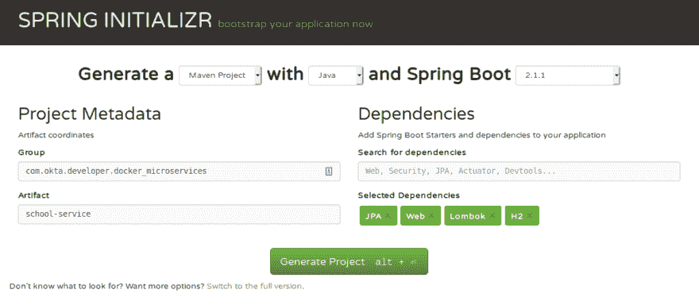
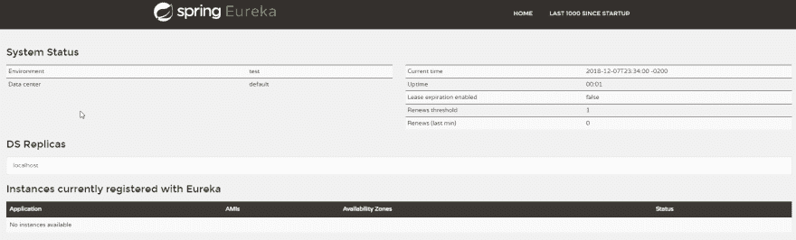
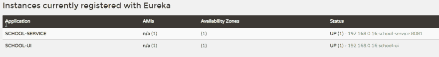
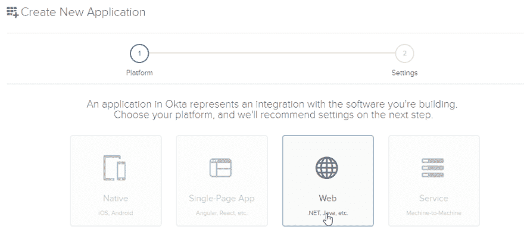
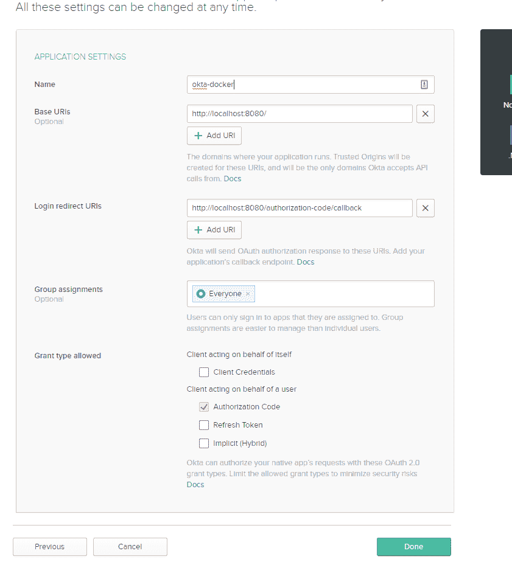
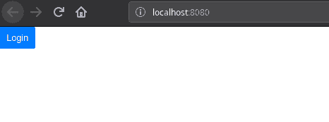
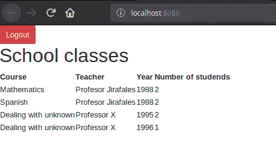

# 构建 Spring 微服务并将其用于生产

> 原文：<https://dev.to/oktadev/build-spring-microservices-and-dockerize-them-for-production-1i4g>

在本帖中，您将了解微服务架构以及如何使用 Spring Boot 实现它。使用该技术创建一些项目后，您将把工件部署为 Docker 容器，并使用 *Docker Compose* 来模拟一个*容器编排器*(如 Kubernetes)以进行简化。锦上添花的是使用 Spring Profiles 的认证集成；您将看到如何使用生产概要文件来启用它。

但首先，我们来说说微服务。

## 了解现代微服务架构

与整体架构相反，微服务要求你必须将你的应用分成小的、逻辑上相关的部分。这些部分是独立的软件，例如使用 HTTP 或消息与其他部分通信。

有一些关于微的大小的讨论。有人说微服务是可以在一次冲刺中创建的软件；其他人说，如果逻辑上相关，微服务可以有更大的规模(例如，你不能把苹果和橘子混在一起)。我同意[马丁·福勒](https://martinfowler.com/articles/microservices.html)的观点，我认为尺寸没那么重要，更多的是与风格有关。

微服务有许多优势:

*   **没有高耦合风险**——由于每个应用程序都存在于不同的进程中，因此不可能创建相互通信的类。
*   **轻松扩展** -如你所知，每项服务都是一个独立的软件。因此，它可以根据需要放大或缩小。此外，由于代码比 monolith 的*小*，它可能会启动得更快。
*   **多个堆栈** -您可以为每项服务使用最好的软件堆栈。当 Python 更适合你正在构建的东西时，就不再需要使用 Java 了。
*   **更少的合并和代码冲突**——因为每个服务都是不同的存储库，所以更容易处理和审查提交。

然而，也有一些缺点:

*   你有了一个新的敌人- **网络问题**。服务开始了吗？如果服务中断，您能做什么？
*   **复杂的部署流程** -好的 CI/CD 在这里，但是现在每个服务都有一个工作流。如果他们使用不同的栈，你甚至不能为每个栈复制一个工作流。
*   **更复杂更难理解的架构**——这取决于你如何设计它，但是考虑一下这个:如果你不知道一个方法在做什么，你可以读它的代码。在微服务架构中，这个方法可能在另一个项目中，你可能连代码都没有。

如今，人们普遍认为应该在一开始就避免微服务架构。在一些迭代之后，代码划分会变得更加清晰，项目的需求也会变得更加清晰。在您的开发团队开始小项目之前，处理微服务通常太昂贵了。

## 用 Docker 打造春季微服务

在本教程中，您将构建两个项目:一个服务(school-service)和一个 UI (school_ui)。服务提供了持久层和业务逻辑，UI 提供了图形用户界面。用最少的配置连接它们是可能的。

在初始设置之后，我将讨论发现和配置服务。这两种服务都是任何大规模分布式架构的重要组成部分。为了证明这一点，您将把它与 OAuth 2.0 集成在一起，并使用配置项目来设置 OAuth 2.0 密钥。

最后，每个项目都将转化为 Docker 图像。Docker Compose 将用于模拟一个*容器编排器*,因为 Compose 将通过服务之间的内部网络管理每个容器。

最后，将引入 Spring 概要文件，以便根据当前适当分配的环境来更改配置。这样，您将拥有两个 OAuth 2.0 环境:一个用于开发，另一个用于生产。

少字多码！克隆本教程的存储库并检查`start`分支。

```
git clone -b start https://github.com/oktadeveloper/okta-spring-microservices-docker-example.git 
```

根文件`pom.xml`不是必需的。但是，一次管理多个项目会很有帮助。让我们看看里面:

```
<?xml version="1.0" encoding="UTF-8"?>
<project xmlns="http://maven.apache.org/POM/4.0.0" xmlns:xsi="http://www.w3.org/2001/XMLSchema-instance"
    xsi:schemaLocation="http://maven.apache.org/POM/4.0.0 http://maven.apache.org/xsd/maven-4.0.0.xsd">
    <modelVersion>4.0.0</modelVersion>
    <groupId>com.okta.developer.docker_microservices</groupId>
    <artifactId>parent-pom</artifactId>
    <version>0.0.1-SNAPSHOT</version>
    <packaging>pom</packaging>
    <name>parent-project</name>
    <modules>
        <module>school-service</module>
        <module>school-ui</module>    
    </modules>
</project> 
```

这被称为*聚合项目*，因为它聚合子项目。这对于在所有声明的模块上运行相同的 Maven 任务很有用。模块不需要使用根模块作为父模块。

有两个模块可用:学校服务和学校 UI。

## 学校服务微服务

`school-service`目录包含一个 Spring Boot 项目，它充当项目的持久层和业务规则。在更复杂的场景中，您会有更多这样的服务。该项目是使用始终优秀的 [Spring Initializr](https://start.spring.io/) 创建的，配置如下:

[](https://res.cloudinary.com/practicaldev/image/fetch/s--yHzj1i5R--/c_limit%2Cf_auto%2Cfl_progressive%2Cq_auto%2Cw_880/https://d33wubrfki0l68.cloudfront.net/5c3293f45330ad393fe162bffe791019ed3226c3/e4bb3/assets-jekyll/blog/spring-microservices-docker/initializr-service-2bd44240a1ab84d9d9f5d5ed87a6b096cc2af2869e5ba8f6a6d4ca0ffb4a6777.png)

*   组- `com.okta.developer.docker_microservices`
*   神器- `school-service`
*   依赖性- JPA、Web、龙目岛、H2

你可以通过阅读 [Spring Boot 与 PostgreSQL、Flyway 和 JSONB](https://developer.okta.com/blog/2019/02/20/spring-boot-with-postgresql-flyway-jsonb) 来了解这个项目的更多细节。总而言之，它有实体`TeachingClass`、`Course,`、`Student`，并使用`TeachingClassServiceDB`和`TeachingClassController`通过 REST API 公开一些数据。要测试它，打开一个终端，导航到`school-service`目录，运行下面的命令:

```
./mvnw spring-boot:run 
```

应用程序将在端口`8081`(如文件`school-service/src/main/resources/application.properties`中所定义的)上启动，因此您应该能够导航到`http://localhost:8081`并看到返回的数据。

```
> curl http://localhost:8081
[
   {
      "classId":13,
      "teacherName":"Profesor Jirafales",
      "teacherId":1,
      "courseName":"Mathematics",
      "courseId":3,
      "numberOfStudents":2,
      "year":1988
   },
   {
      "classId":14,
      "teacherName":"Profesor Jirafales",
      "teacherId":1,
      "courseName":"Spanish",
      "courseId":4,
      "numberOfStudents":2,
      "year":1988
   },
   {
      "classId":15,
      "teacherName":"Professor X",
      "teacherId":2,
      "courseName":"Dealing with unknown",
      "courseId":5,
      "numberOfStudents":2,
      "year":1995
   },
   {
      "classId":16,
      "teacherName":"Professor X",
      "teacherId":2,
      "courseName":"Dealing with unknown",
      "courseId":5,
      "numberOfStudents":1,
      "year":1996
   }
] 
```

## 基于 Spring 的学校 UI 微服务

顾名思义，学校 UI 是利用学校服务的用户界面。它是使用 Spring Initializr 通过以下选项创建的:

*   组- `com.okta.developer.docker_microservices`
*   神器- `school-ui`
*   依赖关系-网络，Hateoas，百里香叶，龙目岛

UI 是一个单独的网页，列出了数据库中可用的类。为了获取信息，它通过文件`school-ui/src/main/resources/application.properties`中的配置与`school-service`连接。

```
service.host=localhost:8081 
```

类`SchoolController`具有查询服务的所有逻辑:

```
package com.okta.developer.docker_microservices.ui.controller;

import com.okta.developer.docker_microservices.ui.dto.TeachingClassDto;
import org.springframework.beans.factory.annotation.*;
import org.springframework.core.ParameterizedTypeReference;
import org.springframework.http.*;
import org.springframework.stereotype.Controller;
import org.springframework.web.bind.annotation.*;
import org.springframework.web.client.RestTemplate;
import org.springframework.web.servlet.ModelAndView;
import java.util.List;

@Controller
@RequestMapping("/")
public class SchoolController {
    private final RestTemplate restTemplate;
    private final String serviceHost;

    public SchoolController(RestTemplate restTemplate, @Value("${service.host}") String serviceHost) {
        this.restTemplate = restTemplate;
        this.serviceHost = serviceHost;
    }

    @RequestMapping("")
    public ModelAndView index() {
        return new ModelAndView("index");
    }

    @GetMapping("/classes")
    public ResponseEntity<List<TeachingClassDto>> listClasses(){
        return restTemplate
                .exchange("http://"+ serviceHost +"/class", HttpMethod.GET, null,
                        new ParameterizedTypeReference<List<TeachingClassDto>>() {});
    }
} 
```

如您所见，服务有一个硬编码的位置。您可以使用类似于`-Dservice.host=localhost:9090`的环境变量来更改属性设置。尽管如此，它必须手动定义。有很多*校服*应用的实例怎么样？现阶段不可能。

在*学校服务*开启的情况下，启动`school-ui`，在浏览器中导航到`http://localhost:8080` :

```
./mvnw spring-boot:run 
```

您应该会看到如下页面:

[](https://res.cloudinary.com/practicaldev/image/fetch/s--AtBO-RHE--/c_limit%2Cf_auto%2Cfl_progressive%2Cq_auto%2Cw_880/https://d33wubrfki0l68.cloudfront.net/801646a287061b487e82637bd73243dfb83248d4/0a615/assets-jekyll/blog/spring-microservices-docker/school-ui-867b9d191ee2409b8a8309f15482cf5f9a4ad9298658d0e8a43cbc60399f9ae0.png)

## 使用 Spring Cloud 和 Eureka 构建发现服务器

现在，您有了一个使用两个服务向最终用户提供信息的工作应用程序。它有什么问题？在现代应用程序中，开发人员(或操作人员)通常不知道应用程序可能部署在哪里或什么端口上。部署应该是自动化的，这样就没有人*关心*服务器名称和物理位置。(除非你在数据中心工作。如果有，希望你在意！)

尽管如此，拥有一个工具来帮助服务发现它们的对应对象是非常重要的。有许多可用的解决方案，对于本教程，我们将使用来自网飞的 *Eureka* ，因为它具有出色的 Spring 支持。

返回到 [start.spring.io](http://start.spring.io) 并创建一个新项目，如下所示:

*   组:`com.okta.developer.docker_microservices`
*   神器:`discovery`
*   依赖关系:尤里卡服务器

编辑主`DiscoveryApplication.java`类，添加一个`@EnableEurekaServer`注释:

```
package com.okta.developer.docker_microservices.discovery;

import org.springframework.boot.SpringApplication;
import org.springframework.boot.autoconfigure.SpringBootApplication;
import org.springframework.cloud.netflix.eureka.server.EnableEurekaServer;

@SpringBootApplication
@EnableEurekaServer
public class DiscoveryApplication {
    public static void main(String[] args) {
        SpringApplication.run(DiscoveryApplication.class, args);
    }
} 
```

而且，您需要更新它的`application.properties`文件，这样它就可以在端口 8761 上运行，而不会试图向自己注册。

```
spring.application.name=discovery-server
server.port=8761
eureka.client.register-with-eureka=false
eureka.client.fetch-registry=false 
```

让我们定义每个属性:

*   `spring.application.name` -应用程序的名称，也被发现服务用来*发现*服务。您会看到每个其他应用程序也有一个应用程序名称。
*   `server.port` -服务器运行的端口。`8761`是 Eureka 服务器的默认端口。
*   告诉 Spring 不要在发现服务中注册自己。
*   `eureka.client .fetch-registry` -表示此实例不应从服务器获取发现信息。

现在，运行并访问`http://localhost:8761`。

```
 ./mvnw spring-boot:run 
```

[](https://res.cloudinary.com/practicaldev/image/fetch/s--9HqrD31m--/c_limit%2Cf_auto%2Cfl_progressive%2Cq_auto%2Cw_880/https://d33wubrfki0l68.cloudfront.net/c6094740fd8a6ce53602f48648920f169eec7973/5290b/assets-jekyll/blog/spring-microservices-docker/eureka-empty-cbe2c80d74cec1e134dfb153f332d5d17f0603e352704a69f06a1eb215ba211b.png)

上面的屏幕显示了准备注册新服务的 Eureka 服务器。现在，是时候改变*学校服务*和*学校界面*来使用它了。

**注意:**如果你在启动时收到一个`ClassNotFoundException: javax.xml.bind.JAXBContext`错误，那是因为你运行的是 Java 11。您可以将 JAXB 依赖项添加到您的`pom.xml`中来解决这个问题。

```
<dependency>
  <groupId>javax.xml.bind</groupId>
  <artifactId>jaxb-api</artifactId>
  <version>2.3.1</version>
</dependency>
<dependency>
  <groupId>org.glassfish.jaxb</groupId>
  <artifactId>jaxb-runtime</artifactId>
  <version>2.3.2</version>
</dependency> 
```

### 使用服务发现在微服务之间进行通信

首先，添加所需的依赖项很重要。将以下内容添加到两个`pom.xml`文件中(在 *school-service* 和 *school-ui* 项目中):

```
<dependency>
    <groupId>org.springframework.cloud</groupId>
    <artifactId>spring-cloud-starter-netflix-eureka-client</artifactId>
</dependency> 
```

这个模块是 Spring Cloud 计划的一部分，因此需要一个新的依赖管理节点，如下所示(不要忘记添加到两个项目中):

```
<dependencyManagement>
    <dependencies>
        <dependency>
            <groupId>org.springframework.cloud</groupId>
            <artifactId>spring-cloud-dependencies</artifactId>
            <version>${spring-cloud.version}</version>
            <type>pom</type>
            <scope>import</scope>
        </dependency>
    </dependencies>
</dependencyManagement> 
```

现在您需要配置这两个应用程序来注册 Eureka。

在两个项目的`application.properties`文件中，添加以下行:

```
eureka.client.serviceUrl.defaultZone=${EUREKA_SERVER:http://localhost:8761/eureka}
spring.application.name=school-service 
```

不要忘记在 *school-ui* 项目中将应用程序名称从`school-service`更改为`school-ui`。注意在第一行中有一种新的参数:`{EUREKA_SERVER:http://localhost:8761/eureka}`。意思是“如果环境变量 EUREKA_SERVER 存在，使用它的值，如果不存在，这里是一个默认值。”这在以后的步骤中会很有用。

你猜怎么着两个应用程序都准备好向发现服务注册自己。你不需要再做什么了。我们的主要目标是*学校界面*项目不需要知道*学校服务在哪里。因此，您需要更改`SchoolController`(在`school-ui`项目中)以在其 REST 端点中使用`school-service`。你也可以删除这个类中的`serviceHost`变量。* 

```
package com.okta.developer.docker_microservices.ui.controller;

import com.okta.developer.docker_microservices.ui.dto.TeachingClassDto;
import org.springframework.core.ParameterizedTypeReference;
import org.springframework.http.HttpMethod;
import org.springframework.http.ResponseEntity;
import org.springframework.stereotype.Controller;
import org.springframework.web.bind.annotation.GetMapping;
import org.springframework.web.bind.annotation.RequestMapping;
import org.springframework.web.client.RestTemplate;
import org.springframework.web.servlet.ModelAndView;

import java.util.List;

@Controller
@RequestMapping("/")
public class SchoolController {
    private final RestTemplate restTemplate;

    public SchoolController(RestTemplate restTemplate) {
        this.restTemplate = restTemplate;
    }

    @RequestMapping("")
    public ModelAndView index() {
        return new ModelAndView("index");
    }

    @GetMapping("/classes")
    public ResponseEntity<List<TeachingClassDto>> listClasses() {
        return restTemplate
                .exchange("http://school-service/classes", HttpMethod.GET, null,
                        new ParameterizedTypeReference<List<TeachingClassDto>>() {});
    }
} 
```

在整合 Eureka 之前，您有一个配置指出了学校服务在哪里。现在，您已经将服务调用更改为使用另一个服务使用的名称:没有端口，没有主机名。你需要的服务就在某个地方，你不需要知道在哪里。

*学校服务*可能有多个实例，在这些实例之间进行调用负载平衡是个好主意。幸运的是，Spring 有一个简单的解决方案:在创建`RestTemplate` bean 时，添加如下的`@LoadBalanced`注释。每次你向服务器请求时，Spring 将管理多个实例调用。

```
package com.okta.developer.docker_microservices.ui;

import org.springframework.boot.SpringApplication;
import org.springframework.boot.autoconfigure.SpringBootApplication;
import org.springframework.cloud.client.loadbalancer.LoadBalanced;
import org.springframework.context.annotation.Bean;
import org.springframework.web.client.RestTemplate;
import org.springframework.web.servlet.config.annotation.*;

@SpringBootApplication
public class UIWebApplication implements WebMvcConfigurer {

    public static void main(String[] args) {
        SpringApplication.run(UIWebApplication.class, args);
    }

    @Bean
    @LoadBalanced
    public RestTemplate restTemplate() {
        return new RestTemplate();
    }

    @Override
    public void addResourceHandlers(ResourceHandlerRegistry registry) {
        if(!registry.hasMappingForPattern("/static/**")) {
            registry.addResourceHandler("/static/**")
                    .addResourceLocations("classpath:/static/", "classpath:/static/js/");
        }
    }
} 
```

现在，开始重启*学校服务*和*学校用户界面*(并保持发现服务运行)。再快速浏览一下`http://localhost:8761`:

[](https://res.cloudinary.com/practicaldev/image/fetch/s--D8DnHUWt--/c_limit%2Cf_auto%2Cfl_progressive%2Cq_auto%2Cw_880/https://d33wubrfki0l68.cloudfront.net/b49d78b935c0a82b7e10b0afd55e4aa48910df3d/5f683/assets-jekyll/blog/spring-microservices-docker/eureka-filled-e66d5d433fa4dc8b7d9cf7078926930b051735e61c2dc271dcd5b61b8ca595bb.png)

现在，您的服务正在与发现服务器共享信息。您可以再次测试应用程序，并看到它一如既往地工作。只需在您最喜欢的浏览器中进入`http://localhost:8080`。

## 为您的微服务架构添加配置服务器

虽然这种配置可以工作，但是最好在项目的源代码中删除任何配置值的痕迹。首先，配置 URL 从项目中移除，并由服务管理。现在，您可以使用 [Spring Cloud Config](https://spring.io/projects/spring-cloud-config) 对项目的每个配置做类似的事情。

首先，使用 [Spring Initializr](http://start.spring.io) 和以下参数创建配置项目:

*   组:`com.okta.developer.docker_microservices`
*   神器:`config`
*   依赖关系:配置服务器，尤里卡发现

在主类中，添加`@EnableConfigServer` :

```
package com.okta.developer.docker_microservices.config;

import org.springframework.boot.SpringApplication;
import org.springframework.boot.autoconfigure.SpringBootApplication;
import org.springframework.cloud.config.server.EnableConfigServer;

@SpringBootApplication
@EnableConfigServer
public class ConfigApplication {
    ...
} 
```

在项目的`application.properties`中添加以下属性和值:

```
spring.application.name=CONFIGSERVER
server.port=8888
spring.profiles.active=native
spring.cloud.config.server.native.searchLocations=.
eureka.client.serviceUrl.defaultZone=${EUREKA_SERVER:http://localhost:8761/eureka} 
```

关于属性的一些说明:

*   `spring.profiles.active=native` -表示 Spring Cloud Config 必须使用本地文件系统来获取配置。通常使用 Git 存储库，但是为了简单起见，我们将坚持使用原生文件系统。
*   `spring.cloud.config.server.native.searchLocations` -包含配置文件的路径。如果您将其更改为硬盘上的特定文件夹，请确保在其中创建`school-ui.properties`文件。

现在，您需要一些东西来配置并应用到这个例子中。 [Okta](https://developer.okta.com) 的配置怎么样？让我们将我们的 *school-ui* 放在授权层之后，并使用配置项目提供的属性值。

你可以注册一个[永远免费的开发者账户](https://developer.okta.com/signup/)，这将使你能够创建尽可能多的用户和应用程序！创建您的帐户后，在 Okta 的仪表板中创建一个新的 Web 应用程序(**应用程序** > **添加应用程序**):

[](https://res.cloudinary.com/practicaldev/image/fetch/s--x7MGHQoX--/c_limit%2Cf_auto%2Cfl_progressive%2Cq_auto%2Cw_880/https://d33wubrfki0l68.cloudfront.net/3ab562b43b97d75d27cb0ddd2b8c03ff0b0acbad/ed67c/assets-jekyll/blog/spring-microservices-docker/okta-new-web-application-46e727dc1c761708faa3bf23d52db23aa7680666173c5862d281cddb273075b3.png)

并用以下值填写下一个表单:

[](https://res.cloudinary.com/practicaldev/image/fetch/s--vQdQaLfp--/c_limit%2Cf_auto%2Cfl_progressive%2Cq_auto%2Cw_880/https://d33wubrfki0l68.cloudfront.net/cd7b3752553922bbd00c069e384f95869c32a564/83ff8/assets-jekyll/blog/spring-microservices-docker/okta-new-web-application-step2-bd67c564cf471b4ba039d0c4c3982a9f55004f8ee23f4831c2dbdd4c97138278.png)

该页面将返回一个应用程序 ID 和一个密钥。保持安全，在`config`项目的根文件夹中创建一个名为`school-ui.properties`的文件，内容如下。不要忘记填充变量值:

```
okta.oauth2.issuer=https://{yourOktaDomain}/oauth2/default
okta.oauth2.clientId={yourClientId}
okta.oauth2.clientSecret={yourClientSecret} 
```

现在，运行`config`项目并检查它是否正确地获得了配置数据:

```
./mvnw spring-boot:run
> curl http://localhost:8888/school-ui.properties
okta.oauth2.clientId: YOUR_CLIENT_ID
okta.oauth2.clientSecret: YOUR_CLIENT_SECRET
okta.oauth2.issuer: https://YOUR_DOMAIN/oauth2/default 
```

### 更改学校 UI 使用 Spring Cloud Config 和 OAuth 2.0

现在你需要稍微改变一下 Spring UI 项目。

首先，您需要更改`school-ui/pom.xml`并添加一些新的依赖项:

```
<dependency>
    <groupId>org.springframework.cloud</groupId>
    <artifactId>spring-cloud-starter-config</artifactId>
</dependency>
<dependency>
    <groupId>com.okta.spring</groupId>
    <artifactId>okta-spring-boot-starter</artifactId>
    <version>1.1.0</version>
</dependency>
<dependency>
    <groupId>org.thymeleaf.extras</groupId>
    <artifactId>thymeleaf-extras-springsecurity5</artifactId>
</dependency> 
```

在`com.okta...ui.config`包中创建一个新的`SecurityConfiguration`类:

```
package com.okta.developer.docker_microservices.ui;

import org.springframework.context.annotation.Configuration;
import org.springframework.security.config.annotation.method.configuration.EnableGlobalMethodSecurity;
import org.springframework.security.config.annotation.web.builders.HttpSecurity;
import org.springframework.security.config.annotation.web.configuration.WebSecurityConfigurerAdapter;

@Configuration
@EnableGlobalMethodSecurity(prePostEnabled = true)
public class SpringSecurityConfiguration extends WebSecurityConfigurerAdapter {

   @Override
    protected void configure(HttpSecurity http) throws Exception {
        http
            .authorizeRequests()
                .antMatchers("/").permitAll()
                .anyRequest().authenticated()
            .and()
                .logout().logoutSuccessUrl("/")
            .and()
                .oauth2Login();
    }
} 
```

更改您的`SchoolController`，以便只允许范围为`profile`的用户使用(每个经过验证的用户都将拥有它)。

```
import org.springframework.security.access.prepost.PreAuthorize;

....

@GetMapping("/classes")
@PreAuthorize("hasAuthority('SCOPE_profile')")
public ResponseEntity<List<TeachingClassDto>> listClasses(){
    return restTemplate
        .exchange("http://school-service/class", HttpMethod.GET, null,
                new ParameterizedTypeReference<List<TeachingClassDto>>() {});
} 
```

有些配置需要在项目启动时定义。Spring 有一个聪明的解决方案，在上下文启动之前正确定位并提取配置数据*。您需要创建一个文件`src/main/resources/bootstrap.yml`，如下所示:* 

```
eureka:
  client:
    serviceUrl:
      defaultZone: ${EUREKA_SERVER:http://localhost:8761/eureka}
spring:
  application:
    name: school-ui
  cloud:
    config:
      discovery:
        enabled: true
        service-id: CONFIGSERVER 
```

引导文件创建一个预引导 Spring 应用程序上下文，负责在真正的应用程序启动之前提取配置。您需要将所有属性从`application.properties`移动到这个文件中，因为 Spring 需要知道您的 Eureka 服务器位于哪里，以及它应该如何搜索配置。在上面的例子中，您通过发现服务(`spring.cloud.config.discovery.enabled`)启用了配置，并指定了配置`service-id`。

更改您的`application.properties`文件，使其只有一个 OAuth 2.0 属性:

```
okta.oauth2.redirect-uri=/authorization-code/callback 
```

最后修改的文件是`src/main/resources/templates/index.hml`。如果用户未通过身份验证，调整它以显示登录按钮，如果用户已登录，则显示注销按钮。

```
<!doctype html>
<html lang="en" xmlns:th="http://www.thymeleaf.org">
<head>
    <!-- Required meta tags -->
    <meta charset="utf-8">
    <meta name="viewport" content="width=device-width, initial-scale=1, shrink-to-fit=no">

    <!-- Bootstrap CSS -->
    <link rel="stylesheet" href="https://stackpath.bootstrapcdn.com/bootstrap/4.1.3/css/bootstrap.min.css" integrity="sha384-MCw98/SFnGE8fJT3GXwEOngsV7Zt27NXFoaoApmYm81iuXoPkFOJwJ8ERdknLPMO" crossorigin="anonymous">

    Hello, world!
</head>
<body>
<nav class="navbar navbar-default">
    <form method="post" th:action="@{/logout}" th:if="${#authorization.expression('isAuthenticated()')}" class="navbar-form navbar-right">
        <input type="hidden" th:name="${_csrf.parameterName}" th:value="${_csrf.token}" />
        <button id="logout-button" type="submit" class="btn btn-danger">Logout</button>
    </form>
    <form method="get" th:action="@{/oauth2/authorization/okta}" th:unless="${#authorization.expression('isAuthenticated()')}">
        <button id="login-button" class="btn btn-primary" type="submit">Login</button>
    </form>
</nav>

<div id="content" th:if="${#authorization.expression('isAuthenticated()')}">
    <h1>School classes</h1>

    <table id="classes">
        <thead>
        <tr>
            <th>Course</th>
            <th>Teacher</th>
            <th>Year</th>
            <th>Number of students</th>
        </tr>
        </thead>
        <tbody>

        </tbody>
    </table>

    <!-- Optional JavaScript -->
    <!-- jQuery first, then Popper.js, then Bootstrap JS -->

    <script src="http://code.jquery.com/jquery-3.3.1.min.js" crossorigin="anonymous"></script>
    <script src="https://cdnjs.cloudflare.com/ajax/libs/popper.js/1.14.3/umd/popper.min.js" integrity="sha384-ZMP7rVo3mIykV+2+9J3UJ46jBk0WLaUAdn689aCwoqbBJiSnjAK/l8WvCWPIPm49" crossorigin="anonymous"></script>
    <script src="https://stackpath.bootstrapcdn.com/bootstrap/4.1.3/js/bootstrap.min.js" integrity="sha384-ChfqqxuZUCnJSK3+MXmPNIyE6ZbWh2IMqE241rYiqJxyMiZ6OW/JmZQ5stwEULTy" crossorigin="anonymous"></script>
    <script src="static/js/school_classes.js"></script>
</div>

</body>
</html> 
```

在这个 HTML 中有一些你应该知道的百里香的属性:

*   `@{/logout}` -返回后端定义的注销 URL
*   `th:if="${#authorization.expression('isAuthenticated()')}"` -仅在用户**登录**时打印 HTML
*   `@{//oauth2/authorization/okta}` -这是 Spring Security 重定向到 Okta 的 URL。你也可以链接到`/login`,但是那只是呈现相同的链接，你必须点击它。
*   `th:unless="${#authorization.expression('isAuthenticated()')}"` -仅在用户**注销**时打印节点内的 HTML

现在重新启动配置项目和 school-ui。如果您导航到键入`http://localhost:8080`，您应该会看到以下屏幕:

[](https://res.cloudinary.com/practicaldev/image/fetch/s--vru7WRf2--/c_limit%2Cf_auto%2Cfl_progressive%2Cq_auto%2Cw_880/https://d33wubrfki0l68.cloudfront.net/eda82766e9ce347eb24da3f4db48b86e58bd93af/f3541/assets-jekyll/blog/spring-microservices-docker/school-ui-loggedin-6f52e90fa174717a674072c1de04bd784558a50161dcefebb087df40d3f43922.png)

登录后，屏幕应该如下所示:

[](https://res.cloudinary.com/practicaldev/image/fetch/s--_vFQY5B0--/c_limit%2Cf_auto%2Cfl_progressive%2Cq_auto%2Cw_880/https://d33wubrfki0l68.cloudfront.net/1dd184823311c52d8c6c8539abe41fb4ed7768d4/5fae9/assets-jekyll/blog/spring-microservices-docker/school-ui-loggedoff-09e0697c91195aae3cd07dc1357c94d41a6f46861a4018bed9e0eafd077a33bd.png)

恭喜，您使用 Spring Cloud config 和 Eureka 为服务发现创建了一个微服务架构！现在，让我们更进一步，对每个服务进行 Dockerize。

## 使用 Docker 打包你的 Spring 应用

Docker 是一项了不起的技术，它允许创建类似于*虚拟机*的系统映像，但共享相同的主机操作系统内核。此功能提高了系统性能和启动时间。此外，Docker 提供了一个巧妙的系统，保证一旦图像被创建；永远不会改变。换句话说:不再有“它在我的机器上工作！”

**提示:**需要更深的 Docker 背景？看看我们的[Docker](https://developer.okta.com/blog/2017/05/10/developers-guide-to-docker-part-1)开发者指南。

您需要为每个项目创建一个 Docker 图像。每个图像在每个项目的根文件夹中应该有相同的 Maven 配置和`Dockerfile`内容(例如`school-ui/Dockerfile`)。

在每个项目的 pom 中，添加`dockerfile-maven-plugin` :

```
<plugins>
    ...
    <plugin>
        <groupId>com.spotify</groupId>
        <artifactId>dockerfile-maven-plugin</artifactId>
        <version>1.4.9</version>
        <executions>
            <execution>
                <id>default</id>
                <goals>
                    <goal>build</goal>
                    <goal>push</goal>
                </goals>
            </execution>
        </executions>
        <configuration>
            <repository>developer.okta.com/microservice-docker-${project.artifactId}</repository>
            <tag>${project.version}</tag>
            <buildArgs>
                <JAR_FILE>${project.build.finalName}.jar</JAR_FILE>
            </buildArgs>
        </configuration>
    </plugin>
</plugins> 
```

这个 XML 配置了 [Dockerfile Maven](https://github.com/spotify/dockerfile-maven) 插件，以便在每次运行`./mvnw install`时构建一个 Docker 映像。每个图像都将被命名为`developer.okta.com/microservice-docker-${project.artifactId}`，其中`project.artifactId`因项目而异。

在每个项目的根目录下创建一个`Dockerfile`文件。

```
FROM openjdk:8-jdk-alpine
VOLUME /tmp
ADD target/*.jar app.jar
ENV JAVA_OPTS="
ENTRYPOINT ["sh", "-c", "java $JAVA_OPTS -Djava.security.egd=file:/dev/./urandom -jar /app.jar"] 
```

`Dockerfile`号遵循了 [Spring Boot 和](https://spring.io/guides/gs/spring-boot-docker/)号的建议。

现在，更改`school-ui/src/main/resources/bootstrap.yml`以添加新的`failFast`设置:

```
eureka:
  client:
    serviceUrl:
      defaultZone: ${EUREKA_SERVER:http://localhost:8761/eureka}
spring:
  application:
    name: school-ui
  cloud:
    config:
      discovery:
        enabled: true
        serviceId: CONFIGSERVER
      failFast: true 
```

`spring.cloud.failFast: true`设置告诉 Spring Cloud Config 一旦找不到配置服务器就终止应用程序。这对下一步很有用。

### 添加 Docker 撰写运行一切

创建一个名为`docker-compose.yml`的新文件，定义每个项目如何开始:

```
version: '3'
services:
  discovery:
    image: developer.okta.com/microservice-docker-discovery:0.0.1-SNAPSHOT
    ports:
      - 8761:8761
  config:
    image: developer.okta.com/microservice-docker-config:0.0.1-SNAPSHOT
    volumes:
      - ./config-data:/var/config-data
    environment:
      - JAVA_OPTS=
         -DEUREKA_SERVER=http://discovery:8761/eureka
         -Dspring.cloud.config.server.native.searchLocations=/var/config-data
    depends_on:
      - discovery
    ports:
      - 8888:8888
  school-service:
    image: developer.okta.com/microservice-docker-school-service:0.0.1-SNAPSHOT
    environment:
      - JAVA_OPTS=
        -DEUREKA_SERVER=http://discovery:8761/eureka
    depends_on:
      - discovery
      - config
  school-ui:
    image: developer.okta.com/microservice-docker-school-ui:0.0.1-SNAPSHOT
    environment:
      - JAVA_OPTS=
        -DEUREKA_SERVER=http://discovery:8761/eureka
    restart: on-failure
    depends_on:
      - discovery
      - config
    ports:
      - 8080:8080 
```

如您所见，每个项目现在都是 Docker compose 文件中声明的服务。它将暴露其端口和一些其他属性。

*   除了*发现*之外的所有项目都将有一个变量值`-DEUREKA_SERVER=http://discovery:8761/eureka`。这将告诉我们在哪里可以找到发现服务器。Docker Compose 在服务之间创建一个虚拟网络，每个服务使用的 DNS 名称就是它的名称:这就是为什么可以使用`discovery`作为主机名。
*   配置服务将有一个卷转到配置文件。这个卷将被映射到 docker 容器中的`/var/config-data`。同样，属性`spring.cloud.config.server.native.searchLocations`将被覆盖为相同的值。您必须将文件`school-ui.properties`存储在卷映射上指定的同一个文件夹中(在上面的例子中，是相对于文件夹的`./config-data`)。
*   *school-ui* 项目将拥有属性`restart: on-failure`。这将 Docker Compose 设置为在应用程序失败时立即重启。与`failFast`属性一起使用允许应用程序继续尝试启动，直到*发现*和*配置*项目完全准备好。

就是这样！现在，构建图像:

```
cd config && ./mvnw clean install
cd ../discovery && ./mvnw clean install
cd .. && ./mvnw clean install 
```

最后一个命令可能会失败，并在`school-ui`项目中出现以下错误:

```
java.lang.IllegalStateException: Failed to load ApplicationContext
Caused by: java.lang.IllegalStateException: No instances found of configserver (CONFIGSERVER) 
```

要解决这个问题，创建一个`school-ui/src/test/resources/test.properties`文件并添加属性，以便 Okta 的配置通过，并且在测试时不使用发现或配置服务器。

```
okta.oauth2.issuer=https://{yourOktaDomain}/oauth2/default
okta.oauth2.clientId=TEST
spring.cloud.discovery.enabled=false
spring.cloud.config.discovery.enabled = false
spring.cloud.config.enabled = false 
```

然后修改`UIWebApplicationTests.java`来加载这个测试属性的文件:

```
import org.springframework.test.context.TestPropertySource;

...
@TestPropertySource(locations="classpath:test.properties")
public class UIWebApplicationTests {
    ...
} 
```

现在您应该能够在`school-ui`项目中运行`./mvnw clean install`。

一旦完成，运行 Docker Compose 来启动所有的容器(在与`docker-compose.yml`相同的目录中)。

```
docker-compose up -d
Starting okta-microservice-docker-post-final_discovery_1 ... done Starting okta-microservice-docker-post-final_config_1 ... done Starting okta-microservice-docker-post-final_school-ui_1 ... done Starting okta-microservice-docker-post-final_school-service_1 ... done 
```

现在，您应该能够像以前一样浏览应用程序了。

## 使用 Spring Profiles 修改您的微服务配置

现在，您已经到达了今天微服务之旅的最后一个阶段。[弹簧剖面图](https://docs.spring.io/spring-boot/docs/current/reference/html/boot-features-profiles.html)是一个强大的工具。使用概要文件，通过完全注入不同的依赖或配置来修改程序行为是可能的。

假设您有一个架构良好的软件，它的持久层与业务逻辑相分离。例如，您还提供对 MySQL 和 PostgreSQL 的支持。每个数据库可以有不同的数据访问类，只由定义的概要文件加载。

另一个用例是配置:不同的概要文件可能有不同的配置。以认证为例。您的测试环境会有身份验证吗？如果是的话，它不应该使用与生产相同的用户目录。

更改您的配置项目，使 Okta 中有两个应用程序:一个默认应用程序(用于开发)，另一个用于生产。在 Okta 网站上创建一个新的 Web 应用程序，命名为“okta-docker-production”

现在，在您的`config`项目中，创建一个名为`school-ui-production.properties`的新文件。您已经有了`school-ui.properties`，它将被每个学校 UI 实例使用。当在文件末尾添加环境时，Spring 将合并这两个文件，并优先于最具体的文件。使用您的生产应用程序的客户端 ID 和密码保存文件，如下所示:

**学校-界面-生产.属性**

```
okta.oauth2.clientId={YOUR_PRODUCTION_CLIENT_ID}
okta.oauth2.clientSecret={YOUR_PRODUCTION_CLIENT_SECRET} 
```

现在，使用 Maven 运行配置项目，然后运行以下两个`curl`命令:

```
./mvnw spring-boot:run

> curl http://localhost:8888/school-ui.properties

okta.oauth2.issuer: https://{yourOktaDomain}/oauth2/default
okta.oauth2.clientId: ==YOUR DEV CLIENT ID HERE==
okta.oauth2.clientSecret: ==YOUR DEV CLIENT SECRET HERE==

> curl http://localhost:8888/school-ui-production.properties
okta.oauth2.issuer: https://{yourOktaDomain}/oauth2/default
okta.oauth2.clientId: ==YOUR PROD CLIENT ID HERE==
okta.oauth2.clientSecret: ==YOUR PROD CLIENT SECRET HERE== 
```

如您所见，尽管文件`school-ui-production`有两个属性，但是`config`项目显示了三个属性(因为配置被合并了)。

现在，您可以将`docker-compose.yml`中的`school-ui`服务更改为使用`production`配置文件:

```
school-ui:
  image: developer.okta.com/microservice-docker-school-ui:0.0.1-SNAPSHOT
  environment:
    - JAVA_OPTS=
      -DEUREKA_SERVER=http://discovery:8761/eureka
      -Dspring.profiles.active=production
  restart: on-failure
  depends_on:
    - discovery
    - config
  ports:
    - 8080:8080 
```

您还需要将`school-ui-production.properties`复制到您的`config-data`目录中。然后关闭所有 Docker 容器并重启它们。

```
docker-compose down
docker-compose up -d 
```

您应该会在`school-ui`容器的日志中看到以下内容:

```
The following profiles are active: production 
```

就是这样！现在，您的微服务架构已经可以使用生产配置文件运行了。万岁。

**提示:**如果你想证明你的`okta-docker-production` app 被使用而非`okta-docker`，你可以在 Okta 中停用`okta-docker` app，确认在`http://localhost:8080`时仍可登录。

## 了解有关微服务、Spring、Docker 和现代应用安全的更多信息

在这篇文章中，您了解了更多关于微服务以及如何部署它们的内容，同时还了解了:

*   什么是微服务？
*   在事先不知道服务位于何处的情况下，服务应该如何发现其依赖项。
*   如何用一个中心信息点维护分布式配置？该配置可以管理一个或多个应用程序和环境。
*   如何使用 Spring Cloud Config 配置 OAuth 2.0？
*   如何使用 Docker 和 Docker Compose 部署微服务？
*   如何使用 Spring 概要文件在生产环境中进行部署。

如果您有兴趣在 Spring 中了解更多关于微服务或现代应用程序开发的信息，我鼓励您查看以下资源:

*   [使用 Spring Boot 2.0 和 OAuth 2.0 构建和保护微服务](https://developer.okta.com/blog/2018/05/17/microservices-spring-boot-2-oauth)
*   [使用 JHipster 和 OAuth 2.0 开发微服务架构](https://developer.okta.com/blog/2018/03/01/develop-microservices-jhipster-oauth)
*   [用 Spring Boot 为微啤酒构建微服务架构](https://developer.okta.com/blog/2017/06/15/build-microservices-architecture-spring-boot)
*   [Spring Boot 2.1:出色的 OIDC、OAuth 2.0 和反应式 API 支持](https://developer.okta.com/blog/2018/11/26/spring-boot-2-dot-1-oidc-oauth2-reactive-apis)
*   [用 Spring Boot 和 MongoDB 构建一个反应式应用](https://developer.okta.com/blog/2019/02/21/reactive-with-spring-boot-mongodb)

如果你对这篇文章有任何问题，请在下面留言。您可以[在 Twitter 上关注@ oktadev](https://twitter.com/oktadev)获取更多精彩内容！