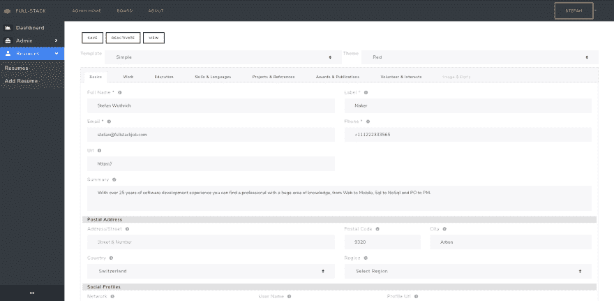

# 构建您的免费全栈开发人员简历

> 原文：<https://dev.to/golangch/build-your-free-full-stack-developer-resume-28oi>

正如大约 3 周前宣布的那样，我想向合格的招聘人员展示一份准备充分的简历/候选人简介。对于招聘人员，我们提供接触合格候选人的机会。

所有这些，就像工作岗位一样，是基于质量而不是数量。我只会检查和接受真正的全栈开发候选人和招聘人员，这可以是合格的公司，招聘机构和猎头公司。

立即免费注册，并作为全栈开发人员创建您的在线简历:
[https://fullstackjob.com/developer/resumes](https://fullstackjob.com/developer/resumes)

