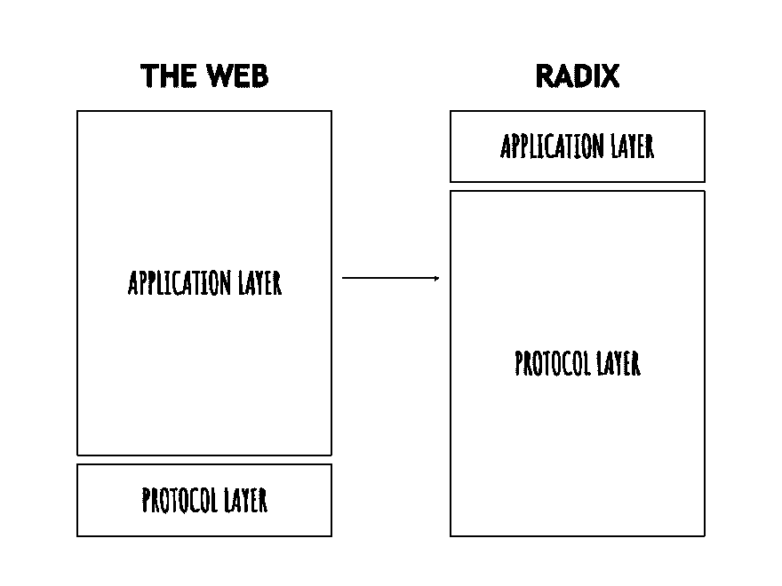
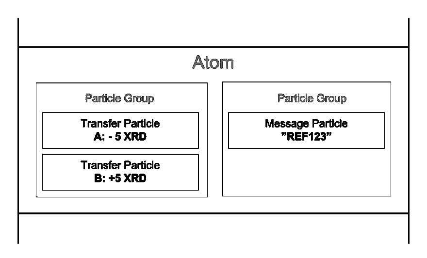

# 可构建性-基数

> 原文：<https://dev.to/radixdlt/buildability-radix-1m4e>

# 建立在基数上

通过使用由一组灵活的分类帐“约束”严格控制的“构建块”,可以轻松、快速、安全地构建 Radix。这种组合允许开发人员提供与智能合约相同的功能，但具有最小的复杂性，没有容易出错的用户代码，并减少了网络负担。

可构建性也有助于实现更具可扩展性的协议，确保 Radix 上流行的分散式应用程序(DApps)不会对其他网络活动产生负面影响。这些构建块基于 Radix Atom 模型，这也将在本文中解释。

我们从介绍为什么我们需要在我们的平台中交付可构建性开始这篇文章。我们将重点讨论 dapp 迄今为止是如何构建的，以及常用的三种类型的 dapp(协议级、客户端和智能合约)。

# dapp 是什么？

分散式应用程序是为无单点故障运行而构建的应用程序，并且可以(一旦启动)在没有集中式基础设施的情况下运行。这与所有类型的企业应用程序都使用的传统集中式系统形成了对比，后者需要使用服务器和数据中心。这些服务器和数据中心接收和处理来自客户端(用户)的请求，并存储数据和文件。

这些集中式系统还必须依赖金融服务公司来处理支付，并保存它们代表它们产生的价值。

将分布式和分散式网络与分散式金融系统(最初由比特币创建)的优势相结合，可以规避中央实体，因为中央实体可能:

-收取过高的费用(如跨境汇款)

-阻止影响全球受众(例如，组织的银行合作伙伴仅在选定的国家接受付款)

-关闭操作(例如，法律和法规；尽管应该注意的是，还有其他手段可以迫使 DApps 遵守当地法律)

然而，并不是所有的 DApps 都是生而平等的。它们的属性因其架构而有很大变化，主要有三个可识别的类别:

-协议级 DApps

-客户端 DApps

-基于智能合约的 DApps

# 协议级 DApps

协议级 DApps 通过在协议级建立一组约束来工作。任何 DLT 协议都可以定义一套规则，强制每个参与者遵守。然后，这些规则可以用来构建应用程序，其成本只是传统开发成本的一小部分。

例如，比特币的协议提供了几个约束条件:

-BTC 永远不会超过 2100 万

-分类账中的条目是不可变的

-只有私钥的所有者才能签署特定公钥的交易

-每笔交易都需要收费

-一个人不能花同样的比特币两次

-一个人不能发送比自己拥有的更多的比特币

-N/M 多签名账户只有在至少有 N 名共同签名人签署交易时才能交易

例如，如果爱丽丝给鲍勃寄去 1 BTC，那么分类账的状态就会更新以反映这一交易(“状态变化”)。为了进行这种状态改变，Alice 必须遵守协议的约束:

-“她账户里有 1 BTC 或更多吗？”

——“她已经花了 1 BTC？”

——“她用自己的私钥签名了吗？”

这样，一个人可以管理一个具有少量余额的地址或数百万个具有大量余额的地址，因为许可和控制系统根据我可以证明控制的内容而缩放，而不是授予中央机构使用的许可。

其中一些限制似乎很明显。然而，有一点很重要，那就是在传统的数据库上，始终实施其中任何一项都是代价高昂的(而且永远无法完全实现)。

因此，组织可以将其中一些优势应用到他们的系统中，例如:

-分布式分类帐中的价值存储

-不可变数据存储

-用户管理(使用私钥作为密码)

-事件的公证和时间戳

-简单安全的权限管理

# 客户端 DApps

由于分类帐是不可信和不可变的，所以通过分散客户端而不是服务器端可以做很多事情。

这种方法并不常见，因为它不像智能合约那样通用。然而，这是了解如何充分利用 DLT 发展的必要途径。

主要原因是，由于分类账存储的是单一的事实，所有优秀的演员都会以同样的方式理解数据。每个想要使用应用程序的设备都必须知道如何解释(读取)以及如何以统一的方式与数据结构交互(写入)。

由于约束是由在每个用户的设备上以相同方式存储和执行的客户端逻辑实施的，所以这种方法是完全分散的。在某些情况下，不需要服务器，因为数据可以完全存储在分类账中。

虽然比实现智能合约更便宜，但它仍然需要应用程序开发人员自己实现约束。此外，还必须非常仔细地定义数据结构，以避免在以后的版本中出现迁移问题。

# 基于智能合约的 DApps

与更简单的协议级 dapp 不同，基于智能契约的 dapp 提供了无限范围的承诺。以太坊等智能合约协议带来的兴奋在于 Web 3.0 的愿景；通过将比特币的不变性与智能合约相结合来驱动的去中心化平台。

智能合同允许开发者建立他们自己的规则。这使得它是通用的，并且能够在基础协议之上创建新的应用协议。

然而，智能合同的工作方式与“纸质”合同略有不同。本质上，智能契约通过定义一系列动作来工作。一旦开始，这些行动就会展开。实际上，这可能看起来像:

-智能合同可以手动启动(例如，用户点击“接受”以在 DApp 上启动操作)，也可以通过预设条件启动(例如，如果航班延误超过 30 分钟，则航班延误保险 DApp 开始启动)

-智能合约的指定条件展开(例如，如果用户点击在事件 X 上下注 1 ETH，则 1 ETH 从用户的账户发送到托管账户。如果下注成功，则 1 ETH 连同他们的赢款一起返回给用户)

智能合同被写入网络上的块(例如，状态改变记录 ETH 被从用户的地址重新分配到托管地址，然后在随后的块中，原始 ETH 以及奖金被归于原始用户的地址)

网络上的所有节点更新它们的分类帐以反映这种状态变化

智能合约为开发人员构建 DApps 提供了广泛的机会，并且可以自动执行广泛的其他难以执行的操作。该流程与 DLT 协同工作。在这种情况下，智能合约协议允许开发人员将业务逻辑存储在分类账上，并确保代码由网络中的所有节点以确定的方式执行，由每个节点产生相同的输出。

但是，它也为开发人员和用户带来了新的复杂性。这意味着智能合约可以:

-难以创建和保护

-降低网络速度

# 难以创造和稳固

尽管 live DApps 运行效果显著，但糟糕的智能合约一直是一些最引人注目的 DLT 损失的核心，数亿美元因编码错误而损失或冻结。

这包括由于奇偶多重签名合同中的一个错误而冻结了超过 500，000 ETH(事件发生时超过 3 亿美元)。这份合同由一个拥有 50 多名开发人员的团队编写，其中包括以太坊的联合创始人和以太坊编程语言 Solidity 的创始人，以及以太坊基金会最初的安全主管。

出于同样的原因，很难安全地写合同，审计也很棘手，不能完全依赖。例如，[DAO](https://www.coindesk.com/understanding-dao-hack-journalists)进行了一次外部安全审计——但正如 Christoph Jentzsch(slock . it 的创始人兼首席执行官，自 2014 年以来一直是以太坊的首席测试员)解释的那样,“我们认为更多的安全审计或更多的测试不会有什么不同。主要问题是评论者不知道要寻找什么。”最近，[Bancor smart 合同中的 1350 万美元](https://twitter.com/Bancor/status/1016420621666963457)被盗，尽管之前进行了安全审计。

一个典型的应用程序能够修复任何发现的错误；不可变的智能合约就没有这种奢侈。由于服务和令牌的融合，错误是不允许的。

这种复杂性意味着使用智能合约构建 DApp 非常耗时，并且需要丰富的专业知识。考虑到这一领域还处于起步阶段，这既昂贵又供不应求。

# 减慢网络速度

智能合同必须在链上处理，以便记录输出。所有节点都必须执行智能合约，并使用结果和交易更新链，从而降低网络速度、增加费用并影响常规交易活动。当流行的 DApp 密码猫使以太坊网络停止时，这种影响得到了充分的体现。

# Radix 如何处理 DApps？

最基本的交易通常很简单。给定的输入(例如，为了将 X 个硬币移动到地址 X)导致适当的输出。

复杂智能合约的工作方式不同，因为它们涉及几个其他参数。它们旨在提供一个循序渐进的“如果这样，那么那样”的过程，但有时可能无法按预期方式运行。这可以通过使用声明性智能协定来避免。

声明式编程不同于命令式编程。不是“如果这样，那么那样”的一步一步的过程来描述应该如何实现，而是描述我们想要实现什么。

声明式编程创建了更可靠的代码，出错的可能性更小，因为这意味着:

-不必定义导致期望结果的所有步骤，相反，程序可以从所述结果反向工作，以最终达到它
-对于开发人员来说，为所有潜在的可能性编写许多具体细节的负担更少

声明式编程创建了一个默认的不允许动作的系统，在这个系统中，动作只有在特定的状态下才是可能的。这些被称为“约束”。

当所使用的协议足够通用并且本身提供足够的约束时，协议级和客户端 dapp 的组合架构可以有效地消除 dapp 所具有的大多数问题。这是基数方法。

# 约束:强有力的工具

这些约束最终违背了前面解释的“如果这那么那”过程。它们提供了一种更直接的方式来理解契约，通过这种方式，用户可以更好地了解他们可以做出什么样的状态更改以及将会有什么样的解决方案。这使得智能合约的功能可以以更少的技术和更人性化的方式来创建，最终使广泛的任务能够在不需要诉诸智能合约的情况下得到解决。

Radix 提供了一个大的协议层，可以在其上轻松快速地部署 DApps，而不是在一个薄的协议层上构建一个大的应用层。

通过在协议级构建和实施约束，Radix 允许开发人员像使用框架和库一样使用这些约束。

请注意，术语“约束”并不意味着从功能角度的限制。约束是一个强大的工具，能够创建智能合约中可用的大多数功能。事实上，智能契约也提供约束 Radix 的目标是减少或消除开发人员自己创建这些约束的需要，相反，提供开发人员实际上想要使用的内置且随时可用的约束。

此外，使用约束(而不是智能合约)有几个好处:

-使开发人员能够创建更快、更便宜的产品
-删除常见功能的重复代码
-提高可伸缩性并实现更快的分类帐
-实现不易出错且可读性更高的声明式编程
-简单概述分类帐的功能

# 更快更便宜的产品开发

通过将风险推到协议层，Radix 为开发人员提供了更少的犯严重错误的机会，因为许多核心功能都内置于协议层。例如，在 Radix 上创建一个令牌需要一行代码——一个 API 调用来创建一个带有必要参数的令牌。

通过消除对公共功能的重复代码的需求，我们减少了引入新的错误和缺陷的机会。通过让开发人员直接使用 API 访问一组经过审核、测试和安全的链上特性，我们提高了安全性。这减少了开发时间，并允许团队以更低的成本更快地进入市场。

# 扩展性改进

通过消除网络上所有节点执行的链上智能契约的影响，约束还提高了可伸缩性。

与智能合约允许的全面选项不同，约束将选择归结为“有效”或“无效”，这提供了状态分片，因为之前/之后的状态是显式的。一个状态被分成更小的部分，这些部分可以在不需要所有其他状态的情况下被验证，因为这些改变是显式的。然而，约束意味着所有需要记录在状态变化(即交易)中的内容，因为期权以前被简化为有效或无效，所以如果有交易，我们知道它是有效的。

此外，约束提供了更轻的代码大小和最终更快的分类帐。

# 声明式编程

使用声明式编程，开发人员可以编程有效的状态转换，而不是状态管理。这通过有效选项限制了状态改变的可能性，并防止了未知的或意外的状态改变。

Radix 旨在推出这些协议级约束，以便开发人员可以使用它们来实现许多与他们目前必须通过智能合约实现的功能相同的功能。这些约束最初将由 Radix 团队硬编码，在进入任何人都可以定义自己的约束的状态之前，会添加越来越多的约束。

# 原子模型

为了解释这些概念在实践中是如何工作的，我们引入了原子模型，它使我们的约束系统能够工作。该模型允许结构化事务，并提供了将分类帐状态划分为更小的子状态的机制，以促进分片和可伸缩性。为了实现这一点，状态改变必须是明确的，并且能够被成批地接受或拒绝。粒子在这些状态变化时起作用，可以被认为是组成一个动作的子动作(粒子组)。这些粒子群然后被放入原子内部。其结构举例如下:

# 原子

原子作为一个内聚的原子单位提交。账本上的所有东西都必须放在原子内部，因为原子包含额外的信息，如签名、碎片和元数据，没有这些信息，粒子将毫无用处。提交的原子只有在没有粒子被拒绝的情况下才会被接受和存储。

正是这种原子属性，以及组合、创建和扩展任意粒子的能力，赋予了原子模型灵活性。

# 粒子群

通过将粒子分成粒子组，处理包含许多粒子的原子变得更加容易。每个粒子组代表一个由底层粒子定义的应用程序级动作(例如发送消息)。因为每个粒子组都是唯一可识别的，并且独立于其他粒子组，所以只引用和查询原子的某些方面是很容易的。

# 粒子

粒子表达单个的状态变化，可以和其他粒子结合形成复杂的动作。简而言之，粒子是对分类帐进行更改的手段，它们构成了分类帐的整个状态。

现成的粒子有很多种类型，可扩展的设计使新粒子的添加变得简单而安全。每种粒子都定义了该类型的任何粒子必须遵守的规则和约束。

# 弹性制度

Atom 模型被设计为易于升级和扩展。它提供了一个灵活的、可组合的约束系统，对于开发人员来说使用起来很简单，并且限制了犯错的可能性。简而言之，它允许:

-开发人员使用灵活而强大的构建对象构建 dapp
-在执行前知道状态变化，使用智能合约消除未知状态变化的问题
-将状态分成更小的片段(子状态)，无需所有其他状态即可验证，有助于可伸缩性和分片
-提供智能合约带来的大量功能，同时避免其缺陷

这种模式在[节奏](https://papers.radixdlt.com/tempo/latest/)之上运行；Radix 的分布式数据库体系结构和一致性算法。Tempo 提供冲突解决、事件排序(对于许多类型的 DApps，如游戏、赌博和金融科技)和快速终结，它还提供了分散网络的基础，可以线性扩展而没有网络瓶颈。Atom 模型提供了创建的结构，而 Tempo 提供了该结构的工作机制。它们一起允许开发者创建安全的、可伸缩的 DApps。

# 开发者的积木

约束用于创建开发人员可以利用的构建块。DApps 建立在这些模块之上，因此开发人员不必自己开发底层功能。

这些构建模块的示例包括:

# 交易时间戳

基数时间协议为每个原子提供所有节点都同意的提交时间戳。这与大多数区块链不同，在那里时间戳块和交易是按照他们支付的费用而不是提交的时间来排序的。时间戳是至关重要的，因为它意味着网络可以用来保持可审计的交易记录。这对于像供应链和文件验证系统这样的情况很有用，在这些情况下，知道采取行动的时间和事件发生的顺序是至关重要的。

# 账目

账户是所有交易到一个地址的集合；以原子形式存储资产和记录的虚拟空间。在最基本的层面上，帐户使用户能够保存带有令牌和其他信息(如消息和数据)的原子。然而，它们可以用于产生广泛的用例，包括表示数据库索引(索引帐户)或事件分类帐(日志帐户)。

# 令牌

可以使用可配置的参数创建各种类型的令牌。随着 DLT 的不断发展，出现了新的令牌类型。Radix 旨在提供与这些令牌标准相同的功能，但向所有令牌添加了限制，令牌创建者可以从中选择要实施的限制。

例如，令牌可以是单次发行(一次性固定供应生成)或多次发行(可以在持续的基础上铸造)。它们可以是可转让的，也可以是不可转让的(以允许诸如积分卡之类的用例)。随着安全令牌产品(s to)的兴起，一些 DApps 现在使用智能合约来限制特定令牌仅转移到之前已经历 KYC 的授权账户。使用 Radix，令牌可以在创建供应时以这种方式被允许，而无需任何进一步的开发。

# 消息传递

DApps 可以通过使用可以发送到地址的原子和消息粒子来存储消息和其他非事务性信息。这允许消息从一个帐户传输到另一个帐户，或者允许建立一个非用户帐户，允许用户发送和接收来自生成的消息组的消息。

这可以与私钥的使用相结合，以允许加密的端到端对等通信。

# 结构化为建筑

为了说明如何使用这些构件来创建功能性 DApps，我们可以构建一个仅包含帐户类型的别名系统。索引帐户可用于存储指向用户帐户及其地址的简单和命名空间别名(例如，@Radix，Radix@Radix)。然后，这可以用于构建一个简单的多个人签署系统，给予个人帐户的文档需要多签名权限才能签署，并自动发送给[@爱丽丝](https://dev.to/alice)、[@鲍勃](https://dev.to/bob)和@Radix 进行批准。

发布时，Radix 将提供以下能力:

-生成基本用户帐户(公钥地址和哈希地址)
-创建法定和加密支持的令牌(单个&多发行可替换令牌)
-读取&写入数据
-加密消息

相关的业务使用案例是基于 Radix 和当前可用的内容构建的，例如:

-别名系统
-点对点交易
-安全消息传递
-文件公证

我们的路线图详细介绍了进一步功能的进展，可点击[这里](https://www.radixdlt.com/roadmap)查看。那些希望在 Radix 上开始构建的人可以在这里找到我们的开发者部分。

如果您有任何问题，请加入 Radix 社区！

[电报](https://t.me/radix_dlt)普通聊天
[电报公告频道](https://t.me/RadixAnnouncements)发布公告
[不和](https://discord.gg/7Q7HSZZ)开发者聊天
[Reddit](https://reddit.com/r/radix) 普通讨论
[论坛](https://forum.radixdlt.com/)技术讨论
[推特](https://twitter.com/radixdlt)发布公告
[电子邮件](https://radixdlt.typeform.com/to/nyKvMV)简讯每周更新
邮件至【hello@radixdlt.com】T21 普通查询