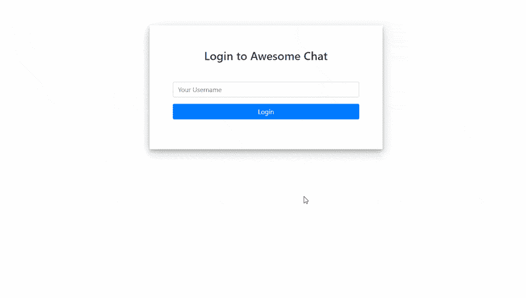
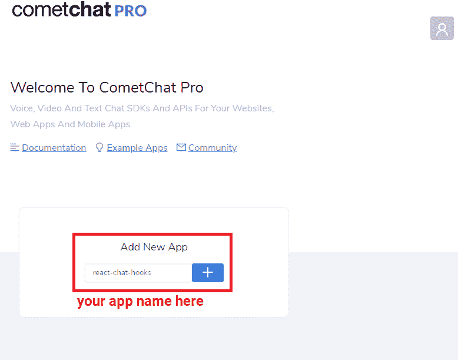
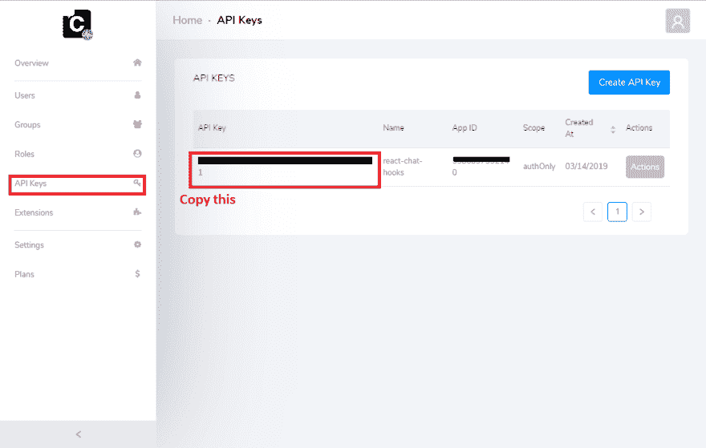
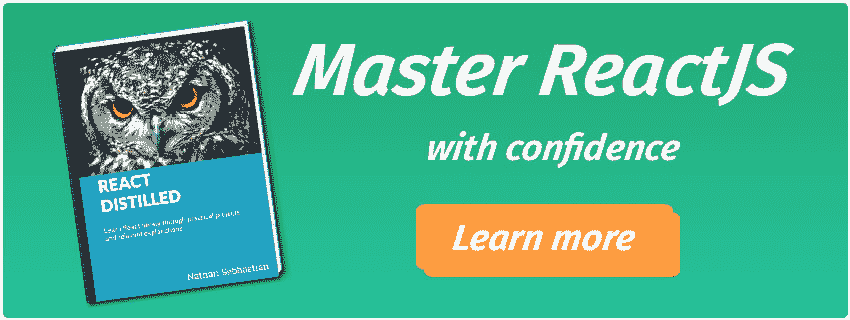

# 用 React Hooks 构建一个聊天应用，一个实用的例子

> 原文：<https://dev.to/nsebhastian/building-a-chat-app-with-react-hooks-a-pragmatic-example-m46>

钩子是 React 16.8 中的一个新特性，它让我们不用写类就可以使用状态和其他 React 特性。

*“我不用类就能构建一个全功能的 app？”*我听到你问了。是的，你可以！在本教程中，我将向您展示如何操作。

虽然有些教程会用“虚构”的例子孤立地关注钩子，但在本教程中，我想向您展示如何构建一个真实的应用程序。

最后，你会得到这样的东西:

[](https://res.cloudinary.com/practicaldev/image/fetch/s--F0N-y0VG--/c_limit%2Cf_auto%2Cfl_progressive%2Cq_auto%2Cw_880/https://cdn.filestackcontent.com/hHgO0GZLSr60UoIPbkXO)

随着您的学习，您将学习如何使用新引入的`useState`和`useEffect`钩子，它们允许我们更干净地管理状态和生命周期功能。

当然，如果你喜欢直接进入代码，你可以在 [GitHub](https://github.com/cometchat-pro-samples/build-chat-app-with-react-hooks) 上看到完整的库。

## CometChat 一览

我们将利用 [CometChat 的沙盒账户](https://app.cometchat.com/#/register)，而不是构建我们自己的聊天后端。

简而言之，CometChat 是一个 API，它使我们能够轻松地构建像实时聊天这样的通信功能。在我们的例子中，我们将利用 npm 模块连接并开始实时传输消息。

如上所述，在连接到 CometChat 之前，我们必须首先创建一个 CometChat 应用程序(请注册一个[永久免费的 CometChat 帐户](https://app.cometchat.com/#/register)以开始创建应用程序)。

现在，在仪表盘上输入一个应用程序名——我把我的名字叫做“react-chat-hooks”。单击+创建您的应用程序:

[ ](https://res.cloudinary.com/practicaldev/image/fetch/s--xE3oQbX7--/c_limit%2Cf_auto%2Cfl_progressive%2Cq_auto%2Cw_880/https://cdn.filestackcontent.com/eyuX4voTvmfOKNHdZyuv) *用 CometChat 创建应用*

创建完成后，进入新创建的应用程序，点击 **API 键**。从这里，复制你自动生成的 **authOnly 密钥**:

[ ](https://res.cloudinary.com/practicaldev/image/fetch/s--jUCFFTXq--/c_limit%2Cf_auto%2Cfl_progressive%2Cq_auto%2Cw_880/https://cdn.filestackcontent.com/QnQdnfSRivLF4Y6VmLrA) *获取 CometChat API*

下一步我们需要这个。

## 设置反应

有了我们的 CometChat 应用程序，打开你的命令行，用`npx`和`create-react-app` :
初始化 React

```
npx create-react-app cometchat-react-hooks 
```

一旦`create-react-app`完成旋转，打开新创建的文件夹并安装以下模块:

```
cd cometchat-react-hooks
npm install @cometchat-pro/chat bootstrap react-md-spinner react-notifications 
```

我们将需要这些依赖来完成我们的应用程序。

当我们在这里时，我们还应该删除所有在 **src** 目录:
中的文件

```
rm src 
```

有时这种样板文件是有用的，但今天我渴望我们从头开始。

因此，本着从头开始的精神，创建一个名为 **src/config.js** file 的新文件，并填写您的 CometChat 凭证:

```
// src/config.js

const config = {
  appID: '{Your CometChat Pro App ID here}',
  apiKey: '{Your CometChat Pro Api Key here}',
};

export default config; 
```

通过这个文件，我们可以方便地在全球范围内访问我们的凭据。

接下来，编写一个新的 **src/index.js** 文件:

```
import React from 'react';
import ReactDOM from 'react-dom';
import {CometChat} from '@cometchat-pro/chat';
import App from './components/App';
import config from './config';

CometChat.init(config.appID);

ReactDOM.render(, document.getElementById('root')); 
```

这是我们 React 应用程序的入口。加载时，我们首先初始化 CometChat，然后呈现我们的`App`组件，稍后我们将定义它。

## 设置我们的组件

我们的应用程序将有三个值得注意的组件，即，`App`、`Login`和`Chat`。

为了存放我们的组件，创建一个名为 **components** 的漂亮文件夹，在这个文件夹中，组件本身:

```
mkdir components && cd components
touch App.js Login.js Chat.js 
```

**app . js:**T2】

```
import React from 'react';

const App = () => {
  return (
    <div> This is the App component</div>
  );
};
export default App; 
```

**Login.js:**

```
import React from 'react';

const Login = () => {
  return (
    <div> This is the Login component</div>
  );
};
export default App; 
```

**Chat.js**

```
import React from 'react';

const Chat = () => {
  return (
    <div> This is the Chat component</div>
  );
};
export default App; 
```

如果你愿意，你可以用`npm start`运行应用程序，并观察文本“*这是应用程序组件*”文本。

当然，这只是一个占位符。构建`App`组件是我们下一节的主题。

## 创建 App 组件

好了，是时候认真对待钩子了。

当我们充实`App`组件时，我们将在传统上依赖类的地方使用功能组件和钩子。

首先，将 App.js 替换为:

```
import React, {useState} from 'react';
import 'bootstrap/dist/css/bootstrap.css';
import 'react-notifications/lib/notifications.css';
import './App.css';
import {NotificationContainer} from 'react-notifications';
import Login from './Login';
import Chat from './Chat';

const App = () => {
  const [user, setUser] = useState(null);
  const renderApp = () => {
    // Render Chat component when user state is not null
    if (user) {
      return <Chat user={user} />;
    } else {
      return <Login setUser={setUser} />;
    }
  };
  return (
    <div className='container'>

      {renderApp()}
    </div>
  );
};
export default App; 
```

我建议您浏览一下代码，看看自己理解了多少。我想如果你能适应 React，它可能看起来很熟悉，但是关于`useState`钩子呢？

如你所见，我们首先导入新引入的`useState`钩子，这是一个函数:

```
import React, {useState} from 'react'; 
```

`useState`可以用来创建状态属性。

为了给你一个思路，在`useState`钩子之前，你可以写如下:

```
this.state = { user: null };

setState({ user: { name: "Joe" }}) 
```

有了钩子，等价的(或多或少)代码看起来像:

```
const [user, setUser] = useState(null);

setUser({ user: { name: "Joe" }}) 
```

这里的一个重要区别是，当使用`this.state`和`setState`时，您使用的是整个状态对象。使用`useState`钩子，你可以处理一个单独的国家财产。这通常会导致代码更干净。

`useState`接受一个参数，即初始状态，并立即返回两个值，即相同的初始状态(在本例中为`user`)和可用于更新状态的函数(在本例中为`setUser`)。这里，我们传递初始状态`null`，但是任何数据类型都可以。

如果这听起来很简单，那也没什么！

没有必要想得太多，因为它只是更新状态的一个不同的接口——一个我确信你熟悉的基本概念。

有了初始状态后，从`renderApp`开始，我们可以根据用户是否登录(换句话说，如果`user`已被设置)来有条件地呈现`Chat`或`Login`:

```
const renderApp = () => {
  // Render Chat component when user state is not null
  if (user) {
    return ;
  } else {
    return ;
  }
}; 
```

`renderApp`是从`render`函数中调用的，在这里我们也呈现了我们的`NotifcationContainer`。

如果你够敏锐，你可能已经注意到我们导入了一个名为 App.css 的 CSS 文件，但实际上还没有创建它。让我们接下来做那件事。

创建一个名为 App.css:
的新文件

```
.container {
  margin-top: 5%;
  margin-bottom: 5%;
}

.login-form {
  padding: 5%;
  box-shadow: 0 5px 8px 0 rgba(0, 0, 0, 0.2), 0 9px 26px 0 rgba(0, 0, 0, 0.19);
}

.login-form h3 {
  text-align: center;
  color: #333;
}

.login-container form {
  padding: 10%;
}

.message {
  overflow: hidden;
}

.balon1 {
  float: right;
  background: #35cce6;
  border-radius: 10px;
}

.balon2 {
  float: left;
  background: #f4f7f9;
  border-radius: 10px;
}

.container {
  margin-top: 5%;
  margin-bottom: 5%;
}

.login-form {
  padding: 5%;
  box-shadow: 0 5px 8px 0 rgba(0, 0, 0, 0.2), 0 9px 26px 0 rgba(0, 0, 0, 0.19);
}

.login-form h3 {
  text-align: center;
  color: #333;
}

.login-container form {
  padding: 10%;
}

.message {
  overflow: hidden;
}

.balon1 {
  float: right;
  background: #35cce6;
  border-radius: 10px;
}

.balon2 {
  float: left;
  background: #f4f7f9;
  border-radius: 10px;
} 
```

## 创建登录组件

提醒一下，我们的登录组件将如下所示:

接下来，将 **Login.js** 替换为:

```
import React, {useState} from 'react';
import {NotificationManager} from 'react-notifications';
import {CometChat} from '@cometchat-pro/chat';
import config from '../config';

const Login = props => {
  const [uidValue, setUidValue] = useState('');
  const [isSubmitting, setIsSubmitting] = useState(false);

  return (
    <div className='row'>
      <div className='col-md-6 login-form mx-auto'>
        <h3>Login to Awesome Chat</h3>
        <form className='mt-5' onSubmit={handleSubmit}>
          <div className='form-group'>
            <input
              type='text'
              name='username'
              className='form-control'
              placeholder='Your Username'
              value={uidValue}
              onChange={event => setUidValue(event.target.value)}
            />
          </div>
          <div className='form-group'>
            <input
              type='submit'
              className='btn btn-primary btn-block'
              value={`${isSubmitting ? 'Loading...' : 'Login'}`}
              disabled={isSubmitting}
            />
          </div>
        </form>
      </div>
    </div>
  );
};

export default Login; 
```

这里，我们利用`useState`来创建两个状态属性:`uidValue`和`isSubmitting`。

在 hooks 之前，我们可能会编写类似于:
的代码

```
this.setState({
  uidValue: '',
  isSubmitting: false
}) 
```

然而，这需要一个类。这里，我们使用了一个功能组件——neat！

在同一个函数中(在`return`语句之前)，创建一个`handleSubmit`函数，在提交表单时调用:

```
const handleSubmit = event => {
  event.preventDefault();
  setIsSubmitting(true);
  CometChat.login(uidValue, config.apiKey).then(
    User => {
      NotificationManager.success('You are now logged in', 'Login Success');
      console.log('Login Successful:', {User});
      props.setUser(User);
    },
    error => {
      NotificationManager.error('Please try again', 'Login Failed');
      console.log('Login failed with exception:', {error});
      setIsSubmitting(false);
    }
  );
}; 
```

这里，我们利用由`useState`返回的`setIsSubmitting`函数。一旦设置，表单将被禁用。

然后我们调用`CometChat.login`来使用我们的密钥认证用户。在生产应用程序中，CometChat 建议您执行自己的验证逻辑。

如果登录成功，我们调用`props.setUser`。

最后，`props.setUser`更新我们的`App`组件中的`user`的值，并且——正如您在 React 中更新状态时所预料的那样——应用程序被重新呈现。这一次，`user`将是真的，因此，我们之前检查的`App.renderApp`函数将呈现`Chat`组件。

## 创建聊天组件

我们的组件责任重大。事实上，它是我们应用程序中最重要的组件！

从`Chat`组件，用户需要:

*   选择一个可以聊天的朋友
*   查看他们最近的消息历史记录
*   发送新消息
*   实时接收响应

可以想象，这将需要我们处理大量的状态。拿我来说，我想不出一个更好的地方来练习我们新发现的关于`useState`钩子的知识！但是正如我在介绍中提到的，`useState`只是我们今天要研究的一个钩子。在这一节中，我们还将探索`useEffect`钩子。

我现在可以告诉你，`useEffect`取代了你可能已经认识的`componentDidMount`、`componentDidUpdate`和`componentWillUnmount`生命周期功能。

考虑到这一点，`useEffect`适合于设置监听器，获取初始数据，同样，在卸载组件之前删除这些监听器。

`useEffect`比`useState`稍微微妙一些，但是当用一个例子完成时，我相信你会理解它。

`useEffect`接受两个参数，即要执行的函数(例如，获取初始数据的函数)和要观察的可选状态属性数组。如果更新了该数组中引用的任何属性，将再次执行函数参数。如果传递的是一个空数组，那么可以肯定函数参数在整个组件生命周期中只运行一次。

让我们从规划出必要的状态开始。该组件将有 6 个状态属性:

*   `friends`保存可供聊天的用户列表
*   `selectedFriend` —保存当前选择的好友进行聊天
*   `chat` —保存朋友之间发送和接收的聊天信息的数组
*   `chatIsLoading` —指示应用程序何时从 CometChat 服务器获取之前的聊天
*   `friendIsLoading` —指示应用程序何时获取所有可以聊天的朋友
*   `message` —用于我们的消息输入控制组件

也许掌握`useEffect`的最好方法是看它的实际操作。记得导入`useEffect`，更新 **Chat.js** :

```
import React, {useState, useEffect} from 'react';
import MDSpinner from 'react-md-spinner';
import {CometChat} from '@cometchat-pro/chat';

const MESSAGE_LISTENER_KEY = 'listener-key';
const limit = 30;

const Chat = ({user}) => {
  const [friends, setFriends] = useState([]);
  const [selectedFriend, setSelectedFriend] = useState(null);
  const [chat, setChat] = useState([]);
  const [chatIsLoading, setChatIsLoading] = useState(false);
  const [friendisLoading, setFriendisLoading] = useState(true);
  const [message, setMessage] = useState('');  
};

export default Chat; 
```

当我们的`Chat`组件已经安装时，我们必须首先[获取可以聊天的用户](https://prodocs.cometchat.com/docs/js-users#section-get-list-of-users)。为此，我们可以利用`useEffect`。

在`Chat`无状态组件中，像这样调用`useEffect`:

```
useEffect(() => {
  // this useEffect will fetch all users available for chat
  // only run on mount

  let usersRequest = new CometChat.UsersRequestBuilder()
    .setLimit(limit)
    .build();
    usersRequest.fetchNext().then(
      userList => {
        console.log('User list received:', userList);
        setFriends(userList);
        setFriendisLoading(false);
      },
      error => {
        console.log('User list fetching failed with error:', error);
      }
    );

    return () => {
      CometChat.removeMessageListener(MESSAGE_LISTENER_KEY);
      CometChat.logout();
    };

}, []); 
```

如前所述，当用空数组调用时，`useEffect`将只在组件初始安装时被调用一次。

我还没有提到的是，当组件被卸载时，您可以从`useEffect`返回一个函数，由 React 自动调用。换句话说，这就是你的`componentWillUnmount`函数。

在我们的`componentWillUnmount`等价函数中，我们称之为`removeMessageListener`和`logout`。

接下来我们来写`Chat`组件的`return`语句:

```
return (
  <div className='container-fluid'>
    <div className='row'>
      <div className='col-md-2' />
      <div className='col-md-8 h-100pr border rounded'>
        <div className='row'>
          <div className='col-lg-4 col-xs-12 bg-light' style={{height: 658}}>
            <div className='row p-3'>
              <h2>Friend List</h2>
            </div>
            <div
              className='row ml-0 mr-0 h-75 bg-white border rounded'
              style={{height: '100%', overflow: 'auto'}}>
              <FriendList
                friends={friends}
                friendisLoading={friendisLoading}
                selectedFriend={selectedFriend}
                selectFriend={selectFriend}
              />
            </div>
          </div>
          <div className='col-lg-8 col-xs-12 bg-light' style={{height: 658}}>
            <div className='row p-3 bg-white'>
              <h2>Who you gonna chat with?</h2>
            </div>
            <div
              className='row pt-5 bg-white'
              style={{height: 530, overflow: 'auto'}}>
              <ChatBox
                chat={chat}
                chatIsLoading={chatIsLoading}
                user={user}
              />
            </div>
            <div className='row bg-light' style={{bottom: 0, width: '100%'}}>
              <form className='row m-0 p-0 w-100' onSubmit={handleSubmit}>
                <div className='col-9 m-0 p-1'>
                  <input
                    id='text'
                    className='mw-100 border rounded form-control'
                    type='text'
                    onChange={event => {
                      setMessage(event.target.value);
                    }}
                    value={message}
                    placeholder='Type a message...'
                  />
                </div>
                <div className='col-3 m-0 p-1'>
                  <button
                    className='btn btn-outline-secondary rounded border w-100'
                    title='Send'
                    style={{paddingRight: 16}}>
                    Send
                  </button>
                </div>
              </form>
            </div>
          </div>
        </div>
      </div>
    </div>
  </div> ); 
```

如果这看起来像很多代码，那么，它就是！但是我们在这里所做的只是渲染我们的好友列表(`FriendsList`)和聊天框(`ChatBox`)，使用 Bootstrap 样式。

我们实际上还没有定义我们的`FriendsList`或`ChatBox`组件，所以现在让我们开始吧。

在同一个文件中，创建名为`ChatBox`和`FriendsList` :
的组件

```
const ChatBox = props => {
  const {chat, chatIsLoading, user} = props;
  if (chatIsLoading) {
    return (
      <div className='col-xl-12 my-auto text-center'>
        <MDSpinner size='72' />
      </div>
    );
  } else {
    return (
      <div className='col-xl-12'>
        {chat.map(chat => (
          <div key={chat.id} className='message'>
            <div
              className={`${
                chat.receiver !== user.uid ? 'balon1' : 'balon2'
              } p-3 m-1`}>
              {chat.text}
            </div>
          </div>
        ))}
        <div id='ccChatBoxEnd' />
      </div>
    );
  }
};

const FriendList = props => {
  const {friends, friendisLoading, selectedFriend} = props;
  if (friendisLoading) {
    return (
      <div className='col-xl-12 my-auto text-center'>
        <MDSpinner size='72' />
      </div>
    );
  } else {
    return (
      <ul className='list-group list-group-flush w-100'>
        {friends.map(friend => (
          <li
            key={friend.uid}
            c;assName={`list-group-item ${
              friend.uid === selectedFriend ? 'active' : ''
            }`}
            onClick={() => props.selectFriend(friend.uid)}>
            {friend.name}
          </li>
        ))}
      </ul>
    );
  }
}; 
```

有了我们的`FriendsList`和`ChatBox`组件，我们的 UI 或多或少是完整的，但是我们仍然需要一种实时发送和接收消息的方法。

## 创建 selectFriend 函数

在上面的`FriendsList`组件中，我们引用了一个名为`selectFriend`的函数，当用户点击列表中的一个名字时，这个函数将被调用，但是我们还没有定义它。

我们可以把这个函数写在`Chat`组件里(在`return`之前)，把`FriendList`作为道具传下去:

```
const selectFriend = uid => {
  setSelectedFriend(uid);
  setChat([]);
  setChatIsLoading(true);
}; 
```

当一个朋友被选中时，我们更新我们的状态:

*   `selectedFriend`用新朋友的 uid 更新。
*   `chat`再次被设置为空，这样以前朋友的信息就不会和新朋友的混淆。
*   `chatIsLoading`设置为 true，这样微调器将替换空的聊天框

## 运行 useEffect on selectedFriend 状态更新

当选择新的转换时，我们需要初始化转换。这意味着实时获取旧消息并订阅新消息。

为此，我们利用了 use `useEffect`。在`Chat`组件中(和往常一样，在`return`之前):

```
useEffect(() => {
  // will run when selectedFriend variable value is updated
  // fetch previous messages, remove listener if any
  // create new listener for incoming message

  if (selectedFriend) {
    let messagesRequest = new CometChat.MessagesRequestBuilder()
      .setUID(selectedFriend)
      .setLimit(limit)
      .build();

    messagesRequest.fetchPrevious().then(
      messages => {
        setChat(messages);
        setChatIsLoading(false);
        scrollToBottom();
      },
      error => {
        console.log('Message fetching failed with error:', error);
      }
    );

    CometChat.removeMessageListener(MESSAGE_LISTENER_KEY);

    CometChat.addMessageListener(
      MESSAGE_LISTENER_KEY,
      new CometChat.MessageListener({
        onTextMessageReceived: message => {
          console.log('Incoming Message Log', {message});
          if (selectedFriend === message.sender.uid) {
            setChat(prevState => [...prevState, message]);
          }
        },
      })
    );
  }
}, [selectedFriend]); 
```

通过将`[selectedFriend]`数组传递给`useEffect`第二个参数，我们确保每次更新`selectedFriend`时都会执行该函数。这很优雅。

因为我们有一个监听器监听传入的消息，并在新消息来自当前的`selectedFriend`时更新聊天状态，所以我们需要添加一个新的消息监听器，它从`selectedFriend`的`if`语句中获取新值。我们还将调用`removeMessageListener`来删除任何未使用的侦听器，以避免内存泄漏。

## 发送新消息处理程序

要发送新消息，我们可以将表单与`CometChat.sendMessage`函数挂钩。在`Chatbox`函数中，创建一个叫做`handleSubmit` :
的函数

```
const handleSubmit = event => {
  event.preventDefault();
  let textMessage = new CometChat.TextMessage(
    selectedFriend,
    message,
    CometChat.MESSAGE_TYPE.TEXT,
    CometChat.RECEIVER_TYPE.USER
  );
  CometChat.sendMessage(textMessage).then(
    message => {
      console.log('Message sent successfully:', message);
      setChat([...chat, message]);
    },
    error => {
      console.log('Message sending failed with error:', error);
    }
  );
  setMessage('');
}; 
```

这已从您之前复制的 JSX 中引用。

当新消息发送成功时，我们调用`setChat`并用最新的消息更新`chat`状态的值。

## 创建 scrollToBottom 函数

我们的`Chat`组件看起来很可爱，除了一点:当`Chatbox`中有一堆消息时，用户必须手动滚动到底部才能看到最新的消息。

为了让用户自动滚动到底部，我们可以通过编程定义一个漂亮的函数来滚动到消息的底部:

```
const scrollToBottom = () => {
  let node = document.getElementById('ccChatBoxEnd');
  node.scrollIntoView();
}; 
```

然后，当前面的消息被设置为状态:
时，运行该功能

```
messagesRequest.fetchPrevious().then(
  messages => {
    setChat(messages);
    setChatIsLoading(false);
    scrollToBottom();
  },
  error => {
    console.log('Message fetching failed with error:', error);
  }
); 
```

## 结论

如果您做到了这一步，那么您已经成功地创建了一个由 CometChat 和 Hooks 支持的聊天应用程序。击掌👋🏻！

有了这个经验，我相信你会开始欣赏钩子的“炒作”。

钩子使我们能够使用功能组件以更优雅的方式构建同样强大的 React 组件。总之，钩子允许我们编写更容易理解和维护的 React 组件。

事实上，我们只是触及了表面。在官方文档的指导下，你甚至可以创建自己的钩子！

如果你正在努力学习 React，你可能会发现 React 是一个很好的帮助。看看这里的！
[T7】](https://sebhastian.com/react-distilled/)

* * *

最初发表于[https://www.cometchat.com](https://www.cometchat.com/tutorials/building-a-chat-app-with-react-hooks-a-pragmatic-example/)