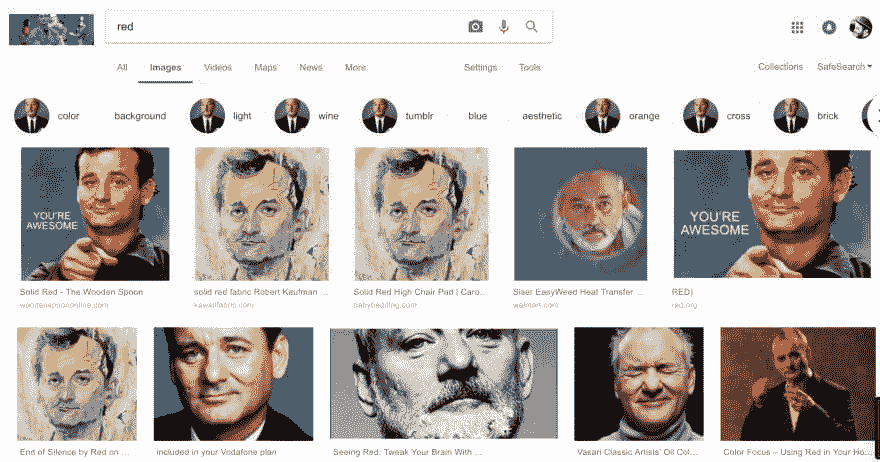
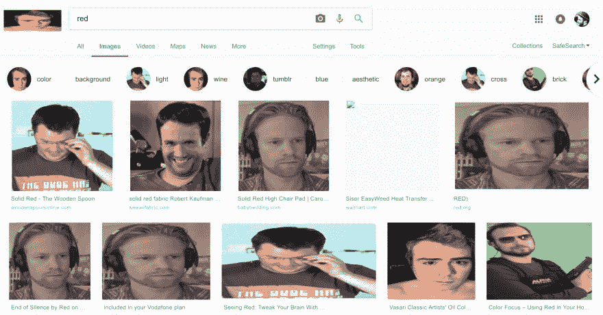

# 建立一个 Chrome 插件-图片交换！

> 原文：<https://dev.to/dan_mcm_/building-a-chrome-plugin---image-swap-it-up-589e>

首先，我想提前为这个 Chrome 扩展的可笑之处道歉，但如果你想构建自己的扩展，希望它可以作为一个有用的参考！

[](https://camo.githubusercontent.com/a4970bb797511ac525ac0fefb16f249d323ef247/68747470733a2f2f7468756d62732e6766796361742e636f6d2f436f6c6f7373616c5175617272656c736f6d6542756e6e792d73697a655f726573747269637465642e676966)

## 出自单纯的意图...

这个项目最初的目的是在我需要构建一个新的 Chrome 扩展时作为一个有用的参考。该项目的基本目标和功能是构建一个 Chrome 扩展，当点击它时，将交换页面上的所有图像。

开始的时候，我从网上选择了一系列巨型炸弹图片/gif 作为起点，这将被证明是一个愚蠢的内部笑话。我希望能够使用基于 web 的图像以及本地图像，以展示构建这样一个应用程序的完整功能。

最近看了你不知道你需要的文章的[API，我情不自禁地更新了这个项目，也能够动态地交换比利·穆雷&尼古拉斯凯奇的相关图像。我想更多的观众会喜欢。](https://dev.to/mkrl/apis-you-didnt-know-you-needed-38c)

## 实现

在设置 Chrome 扩展时，您的起点是 manifest.json。您可以将它视为标准 NPM 项目的 package.json 的类似版本。

```
{  "name":  "GiantBomb-ify",  "version":  "0.1",  "manifest_version"  :  2,  "description":  "Replaces all images with GB Staff",  "icons":  {  "16":  "logo-small.png",  "48":  "logo-small.png",  "128":  "logo-small.png"  },  "background"  :  {  "scripts"  :  ["scripts/background.js"]  },  "browser_action":  {  "default_icon":  "logo-small.png"  },  "web_accessible_resources":  ["images/*.jpg"],  "permissions":  ["activeTab"]  } 
```

名称、图标、版本、描述字段应该让 NPM 或 React devs 感到有些熟悉，它们可以填充非常普通的细节。其他字段值得详细解释一下。

*   *manifest_version* :这是针对 Chrome API 的，版本 2 是当前应该使用的默认版本。

*   *后台*:这决定了一旦 chrome 扩展被启用，什么脚本应该在后台运行。

*   浏览器动作(browser _ action):这决定了当 chrome 扩展被添加到你的浏览器时应该发生的默认动作，在这个例子中，它只是设置了一个默认图标。

*   *web_accessible_resources* :这是允许公众访问存储在扩展代码库中的图像所必需的。如果没有这个，您可能很难访问本地化的图像。

*   *权限*:这个字段将 chrome 扩展的权限限制在你已经打开的活动 Chrome 标签上。

## 脚本

根据 manifest.json，background.js 脚本是在向新选项卡添加扩展时执行的第一个脚本。该脚本仅用于触发另一个文件“imageswap.js”。在一个更通用的设置中，脚本可以用来为更广泛的 Chrome api 添加更多的功能，并处理诸如启动多个脚本或注入全局变量等项目。

```
chrome.browserAction.onClicked.addListener(function(tab) {
   chrome.tabs.executeScript(null, {file: "scripts/imageswap.js"});
}); 
```

imageswap.js 的逻辑包含一些非常基本的 js。

```
var chromeExtensionId = "iaimgpoecjggdpdlmlhhidciphppgfcf"

var images = document.getElementsByTagName('img');

var gb_images = [
  "https://static.giantbomb.com/uploads/scale_medium/18/187968/2743737-yplezwp.jpg", //drew headset
  "https://pbs.twimg.com/media/BpxlFaHCYAIQvvY.jpg", //brad mohawk
  "https://static.giantbomb.com/uploads/original/7/72053/2671808-rorie.png", //rorie glasses
  "http://static.giantbomb.com/uploads/original/13/139155/2536312-2379004-jeff_headshake.gif", //jeff disapproval
  "http://static.giantbomb.com/uploads/original/17/179932/2783337-4310291077-prUNU.png", // dan creep
  "https://static.giantbomb.com/uploads/original/2/23893/2455096-1935536898-10875.jpg", // vinny alpha protocol
  "http://www.deepfreeze.it/img/j_headshots/alex_navarro.jpg", // alex smile
  "https://magnettheater.com/oldImages/headshots/large_abbyrussell_2017.jpg", // abby face
  "https://static.giantbomb.com/uploads/original/23/233047/2986879-2776158-0471975364-o4gps.gif", // jason approval
  "https://78.media.tumblr.com/e0b2ba4e1fd8b1323b4e9c88477db345/tumblr_oshzt0nUPs1u7bbkho1_400.gif", // ben disapproval
  `chrome-extension://${chromeExtensionIimg/ryan.jpg` // local file example - ryan
]

for (var i = 0, l = images.length; i < l; i++) {
  var index = Math.floor(Math.random() * Math.floor(i%gb_images.length+1))

  // GB implementation (default)
  images[i].src = gb_images[index];

  // Nicolas Cage implementation
  // images[i].src = "https://www.placecage.com/" + images[i].width + "/" + images[i].height

  // Bill Murray Implementation
  // images[i].src = "https://fillmurray.com/" + images[i].width + "/" + images[i].height

  var prev = i
} 
```

*   *chromeExtensionId* 变量用于访问本地文件，如果您想要使用本地图像，您必须在遵循项目自述文件中的说明后使用您自己的 chromeExtensionId 更新该值。这用于填充本地图像文件 ryan.jpg。

*   *images* 变量用于获取页面上的所有图像标签。

*   *gb_images* 数组用作我们的一组 10 GiantBomb 五线谱图像进行切换

*   for 循环用于遍历页面上的所有图像，对于每一个图像，它使用从 gb_images 数组中随机选择的索引并显示出来。

*   用于实现比利·穆雷或尼古拉斯·凯奇图像的替代代码遵循类似的模式，除了在它们的场景中使用图像的高度和宽度值并将其传递到相应的 URL 中以生成相关联的图像。

## 样本结果

当然，我不能不展示这个可怕的扩展的结果的一些快速截图...

[](https://res.cloudinary.com/practicaldev/image/fetch/s--nbGfkjQ0--/c_limit%2Cf_auto%2Cfl_progressive%2Cq_auto%2Cw_880/https://thepracticaldev.s3.amazonaws.com/i/dy35pigxsp9af8yvs0l7.png)
[](https://res.cloudinary.com/practicaldev/image/fetch/s--Gm2nGeJD--/c_limit%2Cf_auto%2Cfl_progressive%2Cq_auto%2Cw_880/https://thepracticaldev.s3.amazonaws.com/i/cwounfnyyev2v37zheap.png)
[](https://res.cloudinary.com/practicaldev/image/fetch/s--AeBXfFEw--/c_limit%2Cf_auto%2Cfl_progressive%2Cq_auto%2Cw_880/https://thepracticaldev.s3.amazonaws.com/i/zrxoucx0xp9uxthg3175.png)

从这些截图中你可以注意到一些事情:

*   是的，我只是在谷歌上搜索了红色，然后打开了插件——当在推特/脸书上使用时，它提供了一个更有趣/精神病的效果，但是我没有时间为了截图而审查我自己的个人资料。

*   在比利·穆雷和尼古拉斯凯奇的两个例子中，由于相应 API 的 [Placecage](https://www.placecage.com/) 和 [Fillmurray](https://fillmurray.com/) 的工作方式，你会看到相同大小的图像上有很多重复，因为这些 API 接受宽度和高度参数，这是不可避免的。可以添加一些自定义逻辑来对此进行修改。

*   在 GiantBomb 的情况下，由于图像数量有限，输出有点乏味，不是超级混合，这可以很容易地更新为包含更多的图像，而不是 10 个硬编码。

*   在巨型炸弹的情况下，你可能会注意到一个破碎的图像。这对应于引用的本地文件-我留下这个错误是为了强调如上所述，您需要确保更新 chromeExtensionId 以匹配您的本地版本，以便正确地工作。

## 可能的实现方式

因此，这里的用例是非常基本的，想要交换一个页面上的所有图像的原因有限，但是，如果您想要挖掘迪普并进行更多的实验，您可以进行一些其他修改，以尝试在这个基本基础上改进功能，下面是一些立即浮现在脑海中的内容:

*   添加一个黑名单图片 url 列表——你可以创建自己的审查扩展
*   使用扩展将页面上发现的 URL 写入数据库，这可能是为一些图像学习模型获取训练数据的有用方法

## 关闭思绪

我最近没有花太多时间用 JavaScript 开发，但是我喜欢能够快速开始一些有趣的、相对容易的东西，并且最终有一个实用的输出。这个特定的扩展没有在 Google Chrome 商店上发布，但是他们的[文档](https://developer.chrome.com/webstore/publish)是相对有用的，应该可以帮助你发布你自己的扩展，如果你想走这条路的话！

你可以点击查看项目和带有设置说明[的自述文件。](https://github.com/daniel40392/giantbomb-ify)

一如既往，请务必在下面留下您的反馈和想法。

下次见！