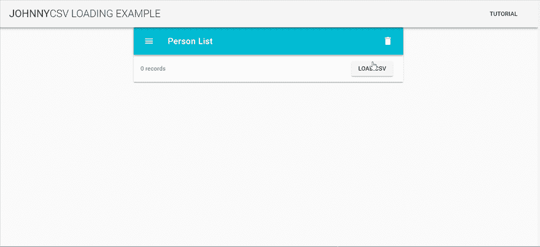
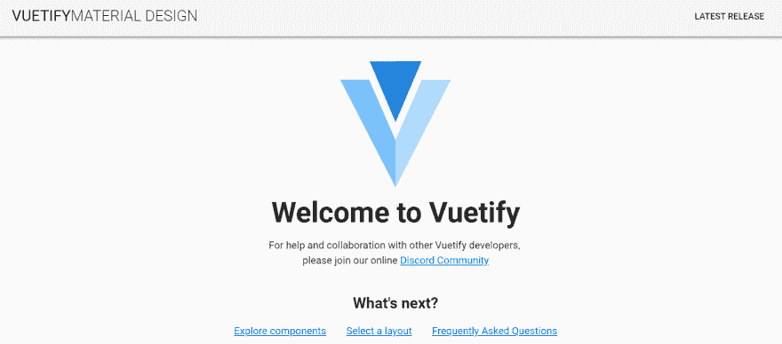
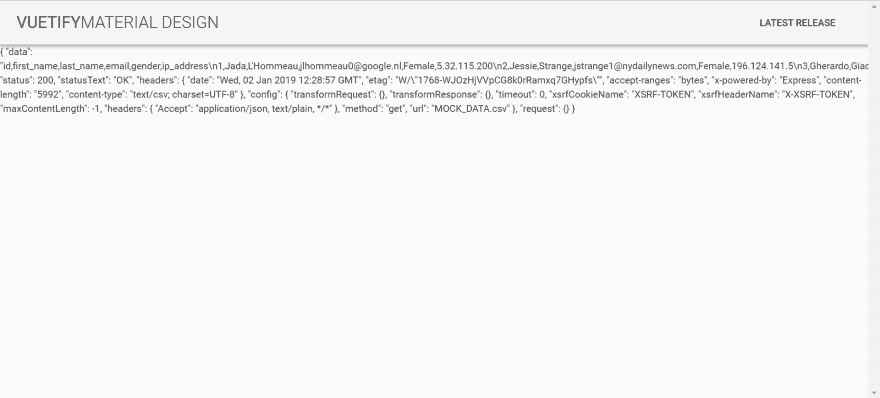

# 使用本地 SQL 数据库构建跨平台 VueJS 应用程序，该应用程序可以从静态 csv 文件加载数据

> 原文：<https://dev.to/johnnymakestuff/building-a-cross-platform-vuejs-app-with-a-local-sql-database-that-can-load-data-from-a-static-csv-file-2fa8>

[](https://res.cloudinary.com/practicaldev/image/fetch/s--DKYnhQn7--/c_limit%2Cf_auto%2Cfl_progressive%2Cq_66%2Cw_880/https://www.learningsomethingnew.com/vue-csv-sample/finished.gif)

## 我们在做什么

在本教程中，我们将快速原型化一个 Vue.js 跨平台应用程序，它使用一个本地 SQL 数据库，该数据库最初是从一个静态 csv 文件导入的。
我们将使用 VVVCNS 堆栈(我刚刚编造的):

*   [Vue.js](https://vuejs.org/) 作为 js 框架
*   用于应用搭建和插件的 Vue CLI 3
*   [验证](https://vuetifyjs.com/en/)材料设计成分
*   [Cordova](https://cordova.apache.org/) 为跨平台 app 发电
*   本地数据库的 [NanoSQL](https://nanosql.io/)

## 为什么会有人需要本地数据库？

当你想让你的应用程序带有数据，并跟踪你的用户在你的应用程序中更改数据，但不想要构建服务器端的麻烦时，它就很方便了。这就是我们在开发语言学习应用程序 [Flamingo](https://play.google.com/store/apps/details?id=com.cognitusapps.flamingo.elvish) 时所做的。
如果你能开发一个没有服务器端的应用，你就节省了 2/3 的开发时间。

## 脚手架

我们将使用`vue create`来搭建我们的应用程序，这是一个 Vue CLI 3 命令。

```
vue create vue-csv-sample 
```

选择默认插件(babel + eslint)。

```
cd vue-csv-sample
vue add vuetify 
```

这里我们添加了 Vue 化插件(一个 Vue CLI 3 插件)
再次选择默认选项。

```
vue add cordova 
```

这是 Vue CLI 的 cordova 插件。您可以选择科尔多瓦信号源的位置，以及应用程序和包的名称。
在 src-cordova 中为 cordova 项目创建另一个 src 文件夹，本地应用平台的配置驻留在该文件夹中。

让我们通过在浏览器平台中服务我们的应用程序来测试所有这些搭建的疯狂之处:

```
npm run cordova-serve-browser 
```

您应该看到您的浏览器在[打开 http://localhost:8080/](http://localhost:8080/) 时显示如下内容:
[](https://res.cloudinary.com/practicaldev/image/fetch/s--Z067jmmm--/c_limit%2Cf_auto%2Cfl_progressive%2Cq_auto%2Cw_880/https://www.learningsomethingnew.com/sanity.png)

> 这是提交 git 的好时机
> 注意，Vue CLI 插件也会改变你的。相应地忽略文件

现在我们将添加 NanoSQL cordova 插件。NanoSQL 为我们提供了一个 SQL 数据库，并为我们的应用程序运行的每个环境选择最佳实现，在 Android 中，它会选择 SQLite，在 web 浏览器中，它会选择 indexedDB 等。

```
npm i nano-sql --save
npm i axios --save
npm i cordova-plugin-nano-sqlite -- save
cd src-cordova
cordova plugin add cordova-plugin-nano-sqlite 
```

> 注意，cordova 插件是从 src-cordova 文件夹中添加的。我们还增加了 axios，这是当前推荐的在 Vue 中执行 HTTP 请求的方式。

## 加载静态 CSV 资源

首先让我们从 [mockaroo](https://mockaroo.com/)
获得一些模拟数据 csv。默认的数据结构是:id，名字，姓氏，电子邮件，性别，ip 地址。
我们将添加一个来自 dummyimage.com 的头像 img 字段，并生成 30 行模拟数据。

> Mockaroo 在 CSV 文件的末尾添加了一个新行。删除它，否则它将在您的数据库中创建一个空记录。您也可以导入 JSON 格式的数据，但是 CSV(和 SQL)更适合表格数据

将您生成的`MOCK_DATA.csv`文件放到`public`文件夹中。
用 PersonList 组件替换默认的 HelloWorld 组件:只需搜索-替换 HelloWorld - > PersonList，将 HelloWorld.vue 文件名改为 person list . vue
我们将添加一个简单的`axios.get`调用来加载 CSV 文件的内容。

这是更新后的人员列表的内容。vue:

```
<template>
  <div>
    {{ response }}
  </div> </template> 
<script>
const axios = require('axios');

export default {
  name: 'PersonList',
  data() {
    return {
      response: ''
    }
  },
  mounted() {
    document.addEventListener(
      typeof cordova !== 'undefined' ? 'deviceready' : 'DOMContentLoaded',
      () => {
        axios.get('MOCK_DATA.csv')
          .then(response => {
            this.response = response;
          })
          .catch(err => {
            this.response = `ERROR! ${err}`;
          });
      }
    );
  }
};
</script> 
```

现在我们只是测试静态 CSV 文件是否正确加载。请注意，CSV 文件位于公共文件夹中，因此路径没有前缀“.”或者“/”或者“~”。它不会通过 webpack 加载器得到解决。点击阅读更多关于静态资产加载的信息[。](https://cli.vuejs.org/guide/html-and-static-assets.html)

现在运行`npm run cordova-serve-browser`应该向我们展示 get 请求的结果:
[](https://res.cloudinary.com/practicaldev/image/fetch/s--cYd7MINZ--/c_limit%2Cf_auto%2Cfl_progressive%2Cq_auto%2Cw_880/https://www.learningsomethingnew.com/csv-loaded.png)

希望您能看到 CSV 文件的内容。现在让我们将它导入数据库。

> 注意那行`typeof cordova !== 'undefined' ? 'deviceready' : 'DOMContentLoaded'`。它根据是 cordova 环境还是普通的 web 环境附加不同的页面加载事件。

我们将使用 NanoSQL 内置的 csv 导入功能来加载文件。
对 PersonList.vue 进行以下更改:

```
<template>
  <div>
    {{ persondb.length }}
  </div> </template> 
<script>
const axios = require('axios');
import { nSQL } from 'nano-sql';
import { getMode } from 'cordova-plugin-nano-sqlite/lib/sqlite-adapter';

export default {
  name: 'PersonList',
  data() {
    return {
      persondb: []
    }
  },
  mounted() {
    nSQL().onConnected(() => {
      axios.get('MOCK_DATA.csv', {}).then(response => {
        nSQL()
          .loadCSV('persondb', response.data)
          .then(() => {
            nSQL('persondb')
              .query('select')
              .exec()
              .then(rows => {
                this.persondb = rows;
              });
          });
      });
    });

    document.addEventListener(
      typeof cordova !== 'undefined' ? 'deviceready' : 'DOMContentLoaded',
      () => {
        let model = [
          { key: 'id', type: 'int', props: ['pk', 'ai'] },
          { key: 'first_name', type: 'string' },
          { key: 'last_name', type: 'string' },
          { key: 'email', type: 'string' },
          { key: 'gender', type: 'string' },
          { key: 'ip_address', type: 'string' },
          { key: 'avatar', type: 'string' }
        ];

        nSQL('persondb')
          .config({
            mode: getMode()
          })
          .model(model)
          .connect();
      }
    );
  },
};
</script> 
```

这里我们已经导入了 nSQL，使用`loadCSV`方法将 CSV 文件加载到`persondb`表中，并用运行`select`查询的结果更新了我们的数据数组`this.persondb`。
最后，我们显示了数组的长度，看到我们有 100 行。
注意，我们正在根据 CSV 文件中的字段定义数据模型。
还要注意，我们用`mode: getMode()`配置数据库来持久化数据，这在浏览器上下文中将解析为 IndexedDB 适配器，在 cordova 环境(Android 或 IOS)中将解析为 SQLite 适配器。

## 添加视觉效果

现在我们已经下载了数据库，让我们制作一些可爱的 UI 来显示我们的数据。

```
<template>
  <v-layout row>
    <v-snackbar v-model="showOperationStatus" left>{{operationStatus}}</v-snackbar>
    <v-flex xs12 sm6 offset-sm3>
      <v-card>
        <v-toolbar color="cyan" dark>
          <v-toolbar-side-icon></v-toolbar-side-icon>

          <v-toolbar-title>Person List</v-toolbar-title>

          <v-spacer></v-spacer>

          <v-btn icon ripple @click="deleteAll()">
            <v-icon color="lighten-1">delete</v-icon>
          </v-btn>
        </v-toolbar>

        <v-list three-line>
          <v-subheader>
            {{persons.length}} records
            <v-spacer></v-spacer>
            <v-btn @click="loadCsv">load csv</v-btn>
          </v-subheader>
          <template v-for="(person, index) in persons">
            <v-divider :inset="true" :key="index"></v-divider>

            <v-list-tile :key="'person'+index" avatar>
              <v-list-tile-avatar>
                
              </v-list-tile-avatar>

              <v-list-tile-content>
                <v-list-tile-title v-html="`${person.first_name} ${person.last_name}`"></v-list-tile-title>
                <v-list-tile-sub-title v-html="`Email: ${person.email}`"></v-list-tile-sub-title>
                <v-list-tile-sub-title v-html="`IP: ${person.ip_address}`"></v-list-tile-sub-title>
              </v-list-tile-content>
              <v-list-tile-action>
                <v-btn icon ripple @click="deletePerson(person)">
                  <v-icon color="grey lighten-1">delete</v-icon>
                </v-btn>
              </v-list-tile-action>
            </v-list-tile>
          </template>
        </v-list>
      </v-card>
    </v-flex>
  </v-layout>
</template> 
```

这里我们使用一个包含一个`<v-flex>`(像一个单元格)的`<v-layout>`，包含一个`<v-card>`，里面有一个工具栏和一个列表。在工具栏中，我们有一个“全部删除”按钮，可以删除表格。在列表中，我们有一个显示行数的副标题，以及一个针对每个人的删除按钮。
我们还添加了一个 snackbar 来显示我们正在进行的操作的状态。

## 一些 DB 操作

现在我们来看看脚本部分:

```
const axios = require('axios');
import { nSQL } from 'nano-sql';
import { getMode } from 'cordova-plugin-nano-sqlite/lib/sqlite-adapter';

export default {
  name: 'PersonList',
  data() {
    return {
      showOperationStatus: false,
      operationStatus: '',
      persons: []
    };
  },
  mounted() {
    document.addEventListener(
      typeof cordova !== 'undefined' ? 'deviceready' : 'DOMContentLoaded',
      () => {
        let model = [
          { key: 'id', type: 'int', props: ['pk', 'ai'] },
          { key: 'first_name', type: 'string' },
          { key: 'last_name', type: 'string' },
          { key: 'email', type: 'string' },
          { key: 'gender', type: 'string' },
          { key: 'ip_address', type: 'string' },
          { key: 'avatar', type: 'string' }
        ];

        nSQL('persondb')
          .config({
            mode: getMode()
          })
          .model(model)
          .connect();

        nSQL().onConnected(() => {
          this.refreshData();
        });
      }
    );
  },
  methods: {
    async refreshData() {
      let rows = await nSQL('persondb')
        .query('select')
        .exec();
      if (rows.length == 0) this.persons = [];
      else this.persons = rows;
    },
    loadCsv() {
      axios.get('MOCK_DATA.csv', {}).then(response => {
        nSQL()
          .loadCSV('persondb', response.data, false)
          .then(() => {
            this.refreshData().then(() => {
              this.showOperationStatus = true;
              this.operationStatus = `CSV loaded`;
            });
          });
      });
    },
    deletePerson(person) {
      nSQL('persondb')
        .query('delete')
        .where(['id', '=', person.id])
        .exec()
        .then(rows => {
          this.showOperationStatus = true;
          this.operationStatus = `${rows.length} rows deleted`;
          this.refreshData();
        });
    },
    deleteAll() {
      nSQL('persondb')
        .query('delete')
        .exec()
        .then(result => {
          if (result[0].msg) {
            this.showOperationStatus = true;
            this.operationStatus = result[0].msg;
          }
          this.refreshData();
        });
    }
  }
}; 
```

让我们回顾一下这些方法:

*   `refreshData` -用数据库的内容更新`persons`数据字段。这是通过在所有行上运行一个`select`来完成的。
*   和以前一样，只是现在我们在操作结束时弹出零食条。
*   `deletePerson` -使用列表人的 id 运行一个`delete` SQL 查询。
*   `deleteAll` -运行不带参数的`delete`将删除表格。

就是这样！
如果您运行它，您可以看到再次加载 CSV 不会添加已经加载的行。这是因为 id 字段在我们的数据模型中被定义为“pk”。
用`yarn serve`运行会给你 web 版本，使用 IndexedDB 作为 SQL 适配器。
刷新页面，观察数据的持久性。

[](https://res.cloudinary.com/practicaldev/image/fetch/s--DKYnhQn7--/c_limit%2Cf_auto%2Cfl_progressive%2Cq_66%2Cw_880/https://www.learningsomethingnew.com/vue-csv-sample/finished.gif)

用`npm run cordova-serve-android/ios`运行会给你本地版本，使用 SQLite 作为适配器。
关闭应用程序，重新加载，看到数据还在。

感谢阅读，代码可以在这里找到[。](https://github.com/syonip/vue-csv-sample)

> 这篇文章是从我的[博客](https://www.learningsomethingnew.com/vue-js-vue-cli-3-vuetify-cordova-nano-sql-building-a-cross-platform-app-with-a-local-sql-database-that-can-load-data-from-a-static-csv-file)交叉发布的