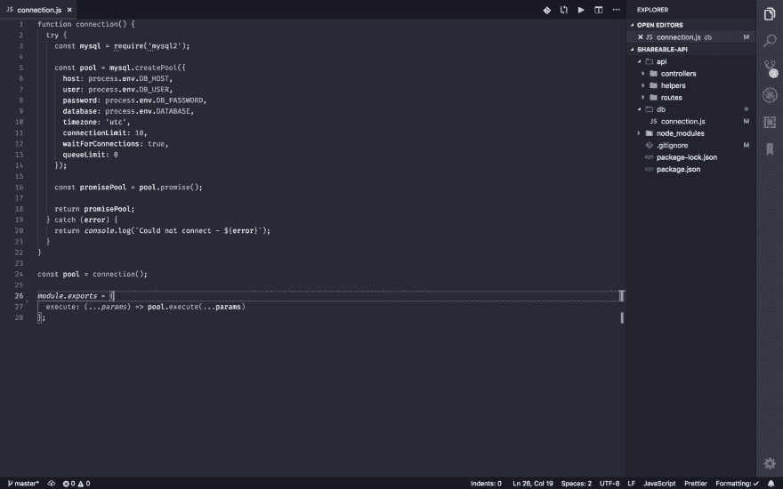
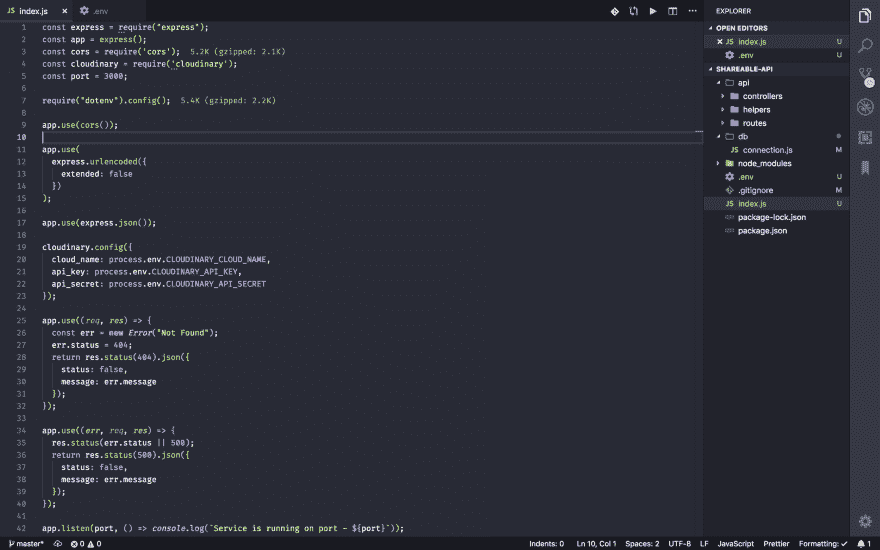
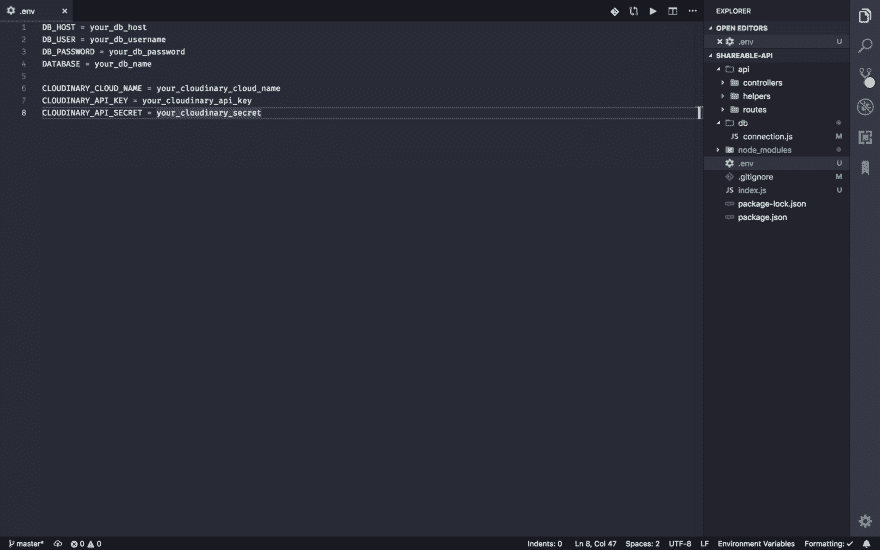
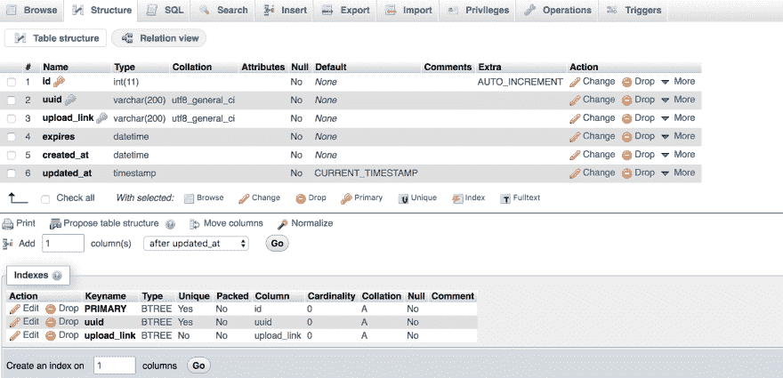

# 用 Node.js、Vue.js、Cloudinary 和 MySQL 构建文件共享应用程序——第 3 部分

> 原文：<https://dev.to/polymathwhiz/building-a-file-sharing-app-with-node-js-vue-js-cloudinary-and-mysql-part-3-1jhk>

在这一部分中，我们将创建我们的数据库，并编写一些支持我们的应用程序的 API。现在，让我们开始吧！

# 要求

1.  要跟随这个系列，你需要以下几个部分:[第一部分](https://dev.to/polymathwhiz/building-a-file-sharing-app-with-nodejs-vuejs-cloudinary-and-mysql-part-1-19l0)，[第二部分](https://dev.to/polymathwhiz/building-a-file-sharing-app-with-nodejs-vuejs-cloudinary-and-mysql---part-2-32nl)

2.  您还需要在 [Cloudinary](https://cloudinary.com) 上创建一个帐户

# 构建我们的应用

在我们的`connection.js`文件中，用以下代码填充它:

上面的代码处理我们的数据库连接参数。

接下来，我们在应用程序项目根目录中创建应用程序入口文件`index.js`和环境变量文件`.env`。然后我们用下面的代码填充我们的`index.js`:

在我们的条目`index.js`文件中，我们导入了`express`、`cors`、`dotenv`和`cloudinary`包。我们还定义了我们的 cloudinary 配置参数(稍后我们将在我们的`.env`变量文件中插入这些参数)。此外，我们定义了我们的`404`和`500` HTTP 响应回退路由，然后，我们在端口`3000`上启动我们的本地服务器。

在我们的`.env`文件中，用您的数据库配置信息和您的 cloudinary secrete(可以在您的 cloudinary 仪表板上找到)填充以下内容。

用正确的数据库和云二进制配置信息替换所有的值位置。

## 创建我们的数据库

我们的 MySQL 数据库模式将如下所示。如果你没有合适的 MySQL 数据库工作台，你可以下载 [MAMP](https://www.mamp.info/en/)

# 结论

在本系列的这一部分中，我们已经创建了数据库，填充了我们的`index.js`,并添加了我们的数据库和云二进制配置信息。

在下一部分中，我们将实现支持我们的应用程序的核心 API。

源代码也可以在 [GitHub](https://github.com/PolymathWhiz/shareable-api) 上获得

下一部分再见！