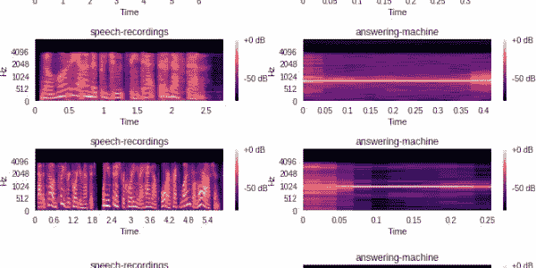
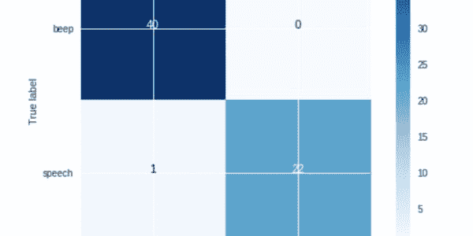

# 为答录机检测建立机器学习模型

> 原文：<https://dev.to/vonagedev/building-a-machine-learning-model-for-answering-machine-detection-5335>

您是否曾经需要一种方法来检测应答机何时正在进行语音呼叫？没有吗？没关系。我做到了。

# 先决条件

这篇文章假设你有基本的 Python 经验，并且对机器学习有非常基本的了解。我们将回顾机器学习的一些基本概念，在这篇文章中我们已经链接了更多的资源。

* * *

几周前，我收到一位销售工程师的请求，要求为一位客户提供电话答录机检测服务。他们需要一种方法，当电话转到语音信箱时，可以向应答机发送消息。

我对此做了一些研究，这似乎是可能的，但我找不到任何关于这是如何做到的。所以我决定把它弄清楚...

第一个想法是建立一个机器学习模型，检测应答机中的`beep`声音何时被听到。在这篇文章中，我们将回顾模型是如何被训练和部署到应用程序中的。

# 训练数据

在我们开始建立机器学习模型之前，我们需要有一些数据。对于这个问题，我们需要有一堆带有应答机`beep`声音的音频文件，像这样:
[哔声 1](https://www.nexmo.com/wp-content/uploads/2019/02/75ea624b-8ab9-4e17-9000-70e96166642a-1.wav)
或者这样:
[哔声 2](https://www.nexmo.com/wp-content/uploads/2019/02/7eaeb600-0202-11e9-bb68-51880c8718e4.wav)

我们还需要包含不包含嘟嘟声的样本:
[非嘟嘟声 1](https://www.nexmo.com/wp-content/uploads/2019/02/26b25bb7-6825-43e7-b8bd-03a3884ed694.wav)
或者这样:
[非嘟嘟声 2](https://www.nexmo.com/wp-content/uploads/2019/02/5c082690-02f2-11e9-aa3d-ad1a095d8d72.wav)

由于互联网上似乎不存在这种数据，我们需要从呼叫中收集尽可能多的蜂鸣声和其他声音样本，以便训练我们的模型。为了做到这一点，我建立了一个[网页](https://amd-recording-capture.herokuapp.com)，允许任何人记录他们的语音邮件问候信息。

当您拨打 Nexmo 号码时，应用程序将创建一个对同一号码的出站呼叫。当接到电话时，你只需将电话直接转到语音信箱。从那里，我们使用 [`record`动作](https://developer.nexmo.com/voice/voice-api/guides/recording)记录通话，并将文件保存到 Google 云存储桶中。收集了很多例子之后，我们就可以开始看数据了。

* * *

在任何机器学习项目中，首先要做的事情之一是查看数据，并确保它是我们可以处理的东西。

因为它是音频，我们不能*直接看*它，但是我们可以使用 mel-spectrogram 可视化音频文件，看起来像这样:

[](https://res.cloudinary.com/practicaldev/image/fetch/s--RGjeQ7qs--/c_limit%2Cf_auto%2Cfl_progressive%2Cq_auto%2Cw_880/https://www.nexmo.com/wp-content/uploads/2019/02/librosa-feature-melspectrogram-1.png)

mel 频谱图显示频率范围(最低在显示屏底部，最高在顶部),并显示不同频率下事件的响度。一般来说，大声的事件会显得明亮，安静的事件会显得黑暗。

我们需要加载两种声音的几个文件，绘制它们，看看它们看起来怎么样。为了显示 mel-spectrogram，我们将使用一个名为 [Librosa](https://librosa.github.io) 的 Python 包来加载音频记录，然后使用另一个用于绘制图表的 Python 包 [matplotlib](http://matplotlib.org) 来绘制 mel-spectrogram。

```
import glob
import librosa
import matplotlib.pyplot as plt
%matplotlib inline

def plot_specgram(file_path):
  y, sr = librosa.load(file_path)
  S = librosa.feature.melspectrogram(y=y, sr=sr, n_mels=128,fmax=8000)
  plt.figure(figsize=(10, 4))
  librosa.display.specshow(librosa.power_to_db(S,ref=np.max),y_axis='mel', fmax=8000,x_axis='time')
  plt.colorbar(format='%+2.0f dB')
  plt.title(file_path.split("/")[-2])
  plt.tight_layout()

sound_file_paths = [
                    "answering-machine/07a3d677-0fdd-4155-a804-37679c039a8e.wav",
                    "answering-machine/26b25bb7-6825-43e7-b8bd-03a3884ed694.wav",
                    "answering-machine/2a685eda-8dd9-4a4d-b00e-4f43715f81a4.wav",
                    "answering-machine/55b654e5-7d9f-4132-bc98-93e576b2d665.wav",
                    "speech-recordings/110ac98e-34fa-42e7-bbc5-450c72851db5.wav",
                    "speech-recordings/3840b850-02e6-11e9-aa3d-ad1a095d8d72.wav",
                    "speech-recordings/55b654e5-7d9f-4132-bc98-93e576b2d665.wav",
                    "speech-recordings/81270a2a-088b-4e3c-9f47-fd927a90b0ab.wav"
                    ]

for file in sound_file_paths:
  plot_specgram(file) 
```

让我们看看每个音频文件是什么样子的。
[T3】](https://www.nexmo.com/wp-content/uploads/2019/02/amd-eda.jpg)

你可以清楚的分辨出哪个音频文件是`beep`，哪个只是`speech`。

* * *

在我们训练我们的模型之前，我们将获取所有关于`beeps`和非嘟嘟声的记录，它们被标记为`speech`，并将每个记录转换为数字向量，因为我们的模型只接受数字，而不接受图像。

为了计算数据，我们将使用每个样本的[梅尔频率倒谱系数(MFCC)](https://en.wikipedia.org/wiki/Mel-frequency_cepstrum)。然后，我们将这个值保存到一个 csv 中，这样我们就不必重新计算 MFCC 了。

对于每个音频样本，csv 将包含音频样本的路径、音频样本的标签(`beep`或`speech`)、MFCC 和音频样本的持续时间(使用 librosa 中的 [`get_duration`函数)。我们还尝试了其他一些音频特性，包括](https://librosa.github.io/librosa/generated/librosa.core.get_duration.html)[色度](https://librosa.github.io/librosa/generated/librosa.feature.chroma_stft.html)、[对比度](https://librosa.github.io/librosa/generated/librosa.feature.spectral_contrast.html)和 [tonnetz](https://librosa.github.io/librosa/generated/librosa.feature.tonnetz.html) 。但是，这些功能在最新版本的模型中没有使用。

现在让我们看看 csv 的前 5 行，看看数据是什么样子的。
[T3】](https://www.nexmo.com/wp-content/uploads/2019/02/amd-df.png)

每行包含每个音频特征的一维向量。这是我们用来训练模型的。

## 训练

现在我们将利用这些数据训练一个模型。我们将使用 Scikit-learn 包进行培训。Scikit-learn 是一个很棒的包，它允许您构建简单的机器学习模型，而不必成为机器学习专家。

对于每个模型，我们采用包含每个音频文件标签(`beep`、`speech`)的数据帧，以及每个样本的 MFCC，将其分成训练和测试数据集，并通过数据运行每个模型。

```
def train(features, model):
  X, y = generateFeaturesLabels(features)
  X_train, X_test, y_train, y_test = train_test_split(X, y, test_size=0.33, random_state=42)

  model.fit(X_train, y_train)
  print("Score:",model.score(X_test, y_test))

  cross_val_scores = cross_val_score(model, X, y, cv=5, scoring='f1_macro')
  print("cross_val_scores:", cross_val_scores)
  print("Accuracy: %0.2f (+/- %0.2f)" % (cross_val_scores.mean(), cross_val_scores.std() * 2))

  predictions = model.predict(X_test)

  cm = metrics.confusion_matrix(y_test, predictions)
  plot_confusion_matrix(cm, class_names)

  return model 
```

函数`train`获取我们想要使用的特征列表，这只是音频样本的 MFCC，以及我们想要训练的模型。然后我们打印我们的分数，这是模型的表现。我们还打印了[交叉验证分数](https://scikit-learn.org/stable/modules/cross_validation.html)。这确保了我们的模型被正确地训练。`plot_confusion_matrix`函数绘制了一个[混淆矩阵](https://www.dataschool.io/simple-guide-to-confusion-matrix-terminology/)，精确显示了模型得到的正确和错误。

[](https://www.nexmo.com/wp-content/uploads/2019/02/amd-confusion-matrix.png)

然后，我们尝试了以下模型，并包括了它们的准确性(0-100%的模型表现评分)。

*   [RandomForestClassifier](http://scikit-learn.org/stable/modules/generated/sklearn.ensemble.RandomForestClassifier.html) 准确率 97%
*   [逻辑回归](https://scikit-learn.org/stable/modules/generated/sklearn.linear_model.LogisticRegression.html) 96%的准确率
*   [支持向量机](https://scikit-learn.org/stable/modules/svm.html) 84%准确率
*   [高斯朴素贝叶斯](https://scikit-learn.org/stable/modules/generated/sklearn.naive_bayes.GaussianNB.html) 98%

除了支持向量机之外，所有这些模型的表现都非常好。最好的是高斯朴素贝叶斯，所以我们将使用该模型。在我们上面的混淆矩阵中，在 67 个例子中，被预测为`beep`的 40 个样本实际上是`beeps`，而被预测为`speech`的 22 个样本实际上是`speech`例子。然而，一个被预测为`beep`的例子实际上是`speech`。

有了模型之后，我们需要将它保存到一个文件中，然后将这个模型导入到我们的 VAPI 应用程序中。

```
import pickle
filename = "model.pkl"
pickle.dump(model, open(filename, 'wb')) 
```

## 构建应用程序

最后一部分是将我们的模型集成到 VAPI 应用程序中。
[来源](https://github.com/nexmo-community/AnsweringMachineDetection/blob/master/websocket-demo.py)

*在构建应用程序时，你必须首先创建一个 [Nexmo 应用程序](https://developer.nexmo.com/concepts/guides/applications)，并购买一个 [Nexmo 编号](https://developer.nexmo.com/numbers/building-blocks/buy-a-number)。*

我们将构建一个让用户拨打 Nexmo 号码的应用程序。然后我们会要求用户输入一个电话号码。输入该号码后，我们会将该呼叫连接到当前对话中，并连接到我们的 websocket。使用 [Nexmo websockets](https://developer.nexmo.com/voice/voice-api/guides/websockets) ，我们能够将音频呼叫传输到我们的应用程序中。

首先，我们需要将模型加载到应用程序中。

```
loaded_model = pickle.load(open("models/model.pkl", "rb")) 
```

当用户第一次拨打 Nexmo 号码时，我们返回一个 [NCCO](https://developer.nexmo.com/voice/voice-api/ncco-reference) 和以下内容:

```
class EnterPhoneNumberHandler(tornado.web.RequestHandler):
    @tornado.web.asynchronous
    def get(self):
        ncco = [
              {
                "action": "talk",
                "text": "Please enter a phone number to dial"
              },
              {
                "action": "input",
                "eventUrl": ["https://3c66cdfa.ngrok.io/ivr"],
                "timeOut":10,
                "maxDigits":12,
                "submitOnHash":True
              }

            ]
        self.write(json.dumps(ncco))
        self.set_header("Content-Type", 'application/json; charset="utf-8"')
        self.finish() 
```

我们首先发送一个[文本到语音转换动作](https://developer.nexmo.com/voice/voice-api/guides/text-to-speech)到呼叫中，要求用户输入一个电话号码。当输入电话号码时，我们从`https://3c66cdfa.ngrok.io/ivr` url 获取这些数字。

```
class AcceptNumberHandler(tornado.web.RequestHandler):
    @tornado.web.asynchronous
    def post(self):
        data = json.loads(self.request.body)
        ncco = [
             {
             "action": "connect",
              "eventUrl": ["https://3c66cdfa.ngrok.io"/event"],
               "from": NEXMO_NUMBER,
               "endpoint": [
                 {
                   "type": "phone",
                   "number": data["dtmf"]
                 }
               ]
             },
              {
                 "action": "connect",
                 "eventUrl": ["https://3c66cdfa.ngrok.io/event"],
                 "from": NEXMO_NUMBER,
                 "endpoint": [
                     {
                        "type": "websocket",
                        "uri" : "ws://3c66cdfa.ngrok.io/socket",
                        "content-type": "audio/l16;rate=16000"

                     }
                 ]
               }
            ]
        self.write(json.dumps(ncco))
        self.set_header("Content-Type", 'application/json; charset="utf-8"')
        self.finish() 
```

输入电话号码后，我们会收到来自`https://3c66cdfa.ngrok.io/ivr` url 的回拨。这里我们获取用户从`data["dtmf"]`输入的电话号码，并对该电话号码执行一个[连接动作](https://developer.nexmo.com/voice/voice-api/ncco-reference#connect)，然后对我们的 websocket 执行另一个连接动作。现在我们的 websocket 能够监听这个调用了。

随着呼叫流入 websocket，我们需要使用语音活动检测来捕获语音块，保存到 wave 文件中，并使用我们训练的模型对 wav 文件进行预测。

```
class AudioProcessor(object):
    def __init__(self, path, rate, clip_min, uuid):
        self.rate = rate
        self.bytes_per_frame = rate/25
        self._path = path
        self.clip_min_frames = clip_min // MS_PER_FRAME
        self.uuid = uuid
    def process(self, count, payload, id):
        if count > self.clip_min_frames:  # If the buffer is less than CLIP_MIN_MS, ignore it
            fn = "{}rec-{}-{}.wav".format('', id, datetime.datetime.now().strftime("%Y%m%dT%H%M%S"))
            output = wave.open(fn, 'wb')
            output.setparams((1, 2, self.rate, 0, 'NONE', 'not compressed'))
            output.writeframes(payload)
            output.close()
            self.process_file(fn)
            self.removeFile(fn)
        else:
            info('Discarding {} frames'.format(str(count)))
    def process_file(self, wav_file):
        if loaded_model != None:
            X, sample_rate = librosa.load(wav_file, res_type='kaiser_fast')
            mfccs = np.mean(librosa.feature.mfcc(y=X, sr=sample_rate, n_mfcc=40).T,axis=0)
            X = [mfccs]
            prediction = loaded_model.predict(X)
            if prediction[0] == 0:
                beep_captured = True
                print("beep detected")
            else:
                beep_captured = False

            for client in clients:
                client.write_message({"uuids":uuids, "beep_detected":beep_captured})

        else:
            print("model not loaded")
    def removeFile(self, wav_file):
         os.remove(wav_file) 
```

一旦我们有了一个 wav 文件，我们使用`librosa.load`加载文件，然后使用`librosa.feature.mfcc`函数生成样本的 MFCC。然后我们打电话给`loaded_model.predict([mfccs])`来做我们的预测。如果该功能的输出为`0`，则检测到一个`beep`。如果它输出`1`，那么它就是`speech`。然后，我们生成一个 JSON 负载，说明是否检测到了一个`beep`，以及会话的 uuids。这样，我们的客户端应用程序可以使用 uuids 将 TTS 发送到呼叫中。

## Websocket 客户端

最后一步是构建一个客户端，它连接到 websocket，观察何时检测到嘟嘟声，并在检测到语音邮件时向呼叫发送 TTS。

[来源](https://github.com/nexmo-community/AnsweringMachineDetection/blob/master/websocket-client.py)

首先，我们需要连接到 websocket。

```
ws = websocket.WebSocketApp("ws://3c66cdfa.ngrok.io/socket",
on_message = on_message,
on_error = on_error,
on_close = on_close)
ws.on_open = on_open

ws.run_forever() 
```

接下来，我们只是监听来自 websocket 的任何传入消息。

```
def on_message(ws, message):
    data = json.loads(message)
    if data["beep_detected"] == True:
        for id in data["uuids"]:
            response = client.send_speech(id, text='Answering Machine Detected')

        time.sleep(4)
        for id in data["uuids"]:
            try:
                client.update_call(id, action='hangup')
            except:
                pass<a href="https://www.nexmo.com/wp-content/uploads/2019/02/amd-confusion-matrix.png"></a>

<a href="https://www.nexmo.com/wp-content/uploads/2019/02/amd-df.png"></a>

<a href="https://www.nexmo.com/wp-content/uploads/2019/02/amd-eda.jpg"></a> 
```

我们将把传入的消息解析为 JSON，然后检查`beep_detected`属性是否为`True`。如果是，那么就检测到了一个`beep`。然后，我们将发送一个 TTS 到呼叫中，说“检测到应答机”，然后执行一个 [`hangup`动作](https://developer.nexmo.com/api/voice#updateCall)到呼叫中。

* * *

## 结论

我们已经展示了如何使用几个`beeps`和`speech`的音频样本来训练我们的模型，从而构建了一个准确率为 96%的应答机检测模型。希望我们已经展示了如何在你的项目中使用机器学习。尽情享受吧！