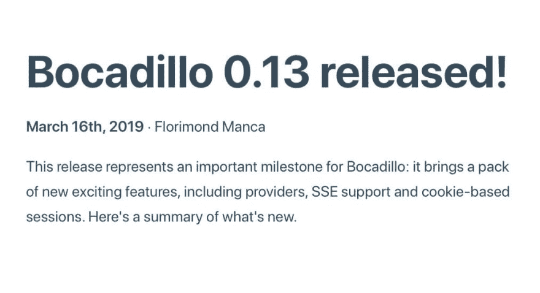

# 用 WebSocket、ChatterBot 和 Bocadillo 用 Python 构建实时聊天机器人服务器

> 原文：<https://dev.to/bocadillo/building-a-real-time-chatbot-server-in-python-with-websocket-chatterbot-and-bocadillo-482g>

*这篇文章改编自[官方博卡迪略教程](https://bocadilloproject.github.io/getting-started/tutorial.html)。*

大家好！今天的帖子会有点特别。你们中的一些人可能还记得我几个月前写的这篇文章:[我是如何构建 Python Web 框架并成为开源维护者的](https://dev.to/florimondmanca/how-i-built-a-python-web-framework-and-became-an-open-source-maintainer-3okd)。

从那以后，我继续在博卡迪略工作，这真是一段美好的时光！事实上，我上周刚刚得知**我将在五月底飞往慕尼黑，在 [PyConWeb 2019](https://pyconweb.com) 上做一个演讲！这将是我第一次参加会议和演讲，所以不用说我非常兴奋！🙌🤩**

另一个好消息是 **Bocadillo v0.13 刚刚发布**:

> 博卡迪略@博卡迪略Psst—博卡迪略 v0.13 刚刚发布！🤩🥳
> 
> 一些最美味的新增功能的新鲜切片:
> 
> -提供者:web 视图中的依赖注入
> -服务器发送的事件支持
> -基于 Cookie 的会话
> 
> 在发行说明中了解更多信息👉[bocadilloproject.github.io/blog/release-0…](https://t.co/RKBr2hGqJ9)2019 年 3 月 21 日 21 点 21 分[](https://twitter.com/intent/retweet?tweet_id=1107029038923743232)[](https://twitter.com/intent/like?tweet_id=1107029038923743232)

带着所有这些良好的氛围，我最终决定出版一个完整的教程。

事不宜迟，情节如下:我们将尝试构建一个聊天机器人服务器！

Bocadillo 有许多内置特性，所以这是一个很好的机会来了解用 Bocadillo 构建 web 服务的一些方面。

在本教程中，您将开始玩聊天机器人，并学习如何:

*   使用 **WebSocket** 实时处理多个连接。
*   创建 REST 端点。
*   使用**提供者**将可重用资源注入视图。
*   **使用 [pytest](https://docs.pytest.org) 测试**一个 Bocadillo 应用程序。

还在想我们如何构建一个看起来像聊天机器人一样复杂的东西？嗯，你可能知道 Python 有一个巨大的数据科学生态系统。我敢打赌，在某个地方会有聊天机器人框架。

原来——有！经过一番研究，我偶然发现了聊天机器人。它看起来非常可靠和受欢迎，所以我们将使用它来构建**迭戈**，一个友好的对话代理。别担心，这不需要*任何数据科学背景，也不需要聊天机器人技术！*

听起来很刺激？好吧，我们开始吧！🙌

## 设置项目

首先，让我们建立我们的项目:

*   打开一个终端，在你电脑的某个地方创建一个空目录，然后`cd`对它:

```
mkdir ~/dev/bocadillo-chatbot
cd ~/dev/bocadillo-chatbot 
```

Enter fullscreen mode Exit fullscreen mode

*   安装 Bocadillo 和 ChatterBot。我们在这里使用 [pipenv](https://pipenv.readthedocs.io) 来安装依赖项，但是你也可以使用普通的 ol' `pip` + `virtualenv`。

```
# Note: pytz is required by chatterbot.
pipenv install bocadillo chatterbot pytz 
```

Enter fullscreen mode Exit fullscreen mode

*   创建一个空的`app.py`脚本。这是我们稍后创建应用程序的地方:

```
touch app.py 
```

Enter fullscreen mode Exit fullscreen mode

我们现在应该有如下的目录结构:

```
$ tree
.
├── Pipfile
├── Pipfile.lock
└── app.py 
```

Enter fullscreen mode Exit fullscreen mode

## 引导应用程序

现在，我们来写一下`app.py`中的 app 骨架。稍等—代码传入的第一个合适的位:

```
# app.py from bocadillo import App

app = App()

if __name__ == "__main__":
    app.run() 
```

Enter fullscreen mode Exit fullscreen mode

如果你曾经使用过 Flask，或者，嗯，几乎任何 Python web 框架，这应该看起来非常熟悉。几乎无聊。谁在乎呢。有用！自己检查:

```
python app.py 
```

Enter fullscreen mode Exit fullscreen mode

如果你去 [http://localhost:8000](http://localhost:8000) 并得到一个`404 Not Found`响应，你一切都好！在你的终端输入`Ctrl+C`来停止服务器。

## 编写 WebSocket 端点

我们现在已经准备好进入正题了！我们首先要构建的是 **WebSocket 端点**。

如果你不熟悉 WebSocket，不要担心——这里有一个 10 个字的总结:它允许服务器和客户端双向交换消息。这是为网络重新发明的老式插座。

由于它们的**双向性质**，它们非常适合我们在这里构建的这种应用程序——客户端和服务器(即我们的聊天机器人)之间的某种*对话*。

如果你有兴趣学习更多关于 Python 中 WebSockets 的知识，我强烈推荐这个演讲:[web sockets 初学者指南](https://www.youtube.com/watch?v=PjiXkJ6P9pQ&frags=pl%2Cwn)。

好吧，所以我们还不会插入聊天机器人。相反，让服务器发送回它收到的任何消息—这种行为也称为“echo”端点。

在`app.py`中的`app`对象声明和`app.run()`块之间添加以下内容:

```
@app.websocket_route("/conversation")
async def converse(ws):
    async for message in ws:
        await ws.send(message) 
```

Enter fullscreen mode Exit fullscreen mode

出于好奇，这里有一些简单的解释:

*   这定义了一个可以在`ws://localhost:8000/conversation`位置访问的 WebSocket 端点。
*   `async for message in ws:`行遍历通过 WebSocket 接收的消息。
*   最后，`await ws.send(message)`将收到的`message`原样发送回客户端。

## 试用 WebSocket 端点

我们通过创建一个 WebSocket 客户端来尝试一下怎么样？不用担心——我们不需要编写任何 JavaScript。我们将坚持使用 Python 并使用 Bocadillo 附带的 [websockets](https://websockets.readthedocs.io) 库。

创建一个`client.py`文件，并将下面的代码粘贴到那里。它所做的是连接到 WebSocket 端点并运行一个简单的 REPL:

```
# client.py import asyncio
from contextlib import suppress
import websockets

async def client(url: str):
    async with websockets.connect(url) as websocket:
        while True:
            message = input("> ")
            await websocket.send(message)
            response = await websocket.recv()
            print(response)

with suppress(KeyboardInterrupt):
    # See asyncio docs for the Python 3.6 equivalent to .run().
    asyncio.run(client("ws://localhost:8000/conversation")) 
```

Enter fullscreen mode Exit fullscreen mode

使用`python app.py`运行服务器端应用程序，并在单独的终端中启动`client.py`脚本。你应该会看到一个`>`提示。如果有，开始聊天吧！

```
$ python client.py
> Hi!
Hi!
> Is there anyone here?
Is there anyone here?
> 
```

Enter fullscreen mode Exit fullscreen mode

很酷，不是吗？🤓

键入`Ctrl+C`退出会话并关闭 WebSocket 连接。

## 您好，迭戈！

既然我们能够让服务器和客户端通信，那么我们用一个实际的、智能的、友好的聊天机器人来代替 echo 实现怎么样？

这就是聊天机器人的用武之地！我们将创建一个聊天机器人，名副其实地命名为**迭戈**——一个说异步萨尔萨舞的聊天机器人。🕺

继续创建一个`chatbot.py`文件，并在其中添加 Diego:

```
# chatbot.py from chatterbot import ChatBot
from chatterbot.trainers import ChatterBotCorpusTrainer

diego = ChatBot("Diego")

trainer = ChatterBotCorpusTrainer(diego)
trainer.train(
    "chatterbot.corpus.english.greetings",
    "chatterbot.corpus.english.conversations"
) 
```

Enter fullscreen mode Exit fullscreen mode

(ChatterBot 的聊天机器人天生就很笨，所以上面的代码在一个英语语料库上训练 Diego，让他变得更聪明一些。)

此时，您可以在 Python 解释器中试用聊天机器人:

```
$ python
>>> from chatbot import diego  # Be patient — this may take a few seconds to load! >>> diego.get_response("Hi, there!")
<Statement text:There should be one-- and preferably only one --obvious way to do it.> 
```

Enter fullscreen mode Exit fullscreen mode

(嗯。有趣的回应！🐍)

现在让我们将 Diego 插入 WebSocket 端点:每次我们收到一个新的`message`，我们将把它交给 Diego 并发送回他的响应。

```
# app.py from chatbot import diego

...

@app.websocket_route("/conversation")
async def converse(ws):
    async for message in ws:
        response = diego.get_response(message)
        await ws.send(str(response)) 
```

Enter fullscreen mode Exit fullscreen mode

如果您运行前面的[服务器/客户端设置](#trying-out-the-websocket-endpoint)，您现在可以看到 Diego 通过 WebSocket 与我们进行对话！

```
$ python client.py
> Hi there!
I am a chat bot. I am the original chat bot. Did you know that I am incapable of error?
> Where are you?
I am on the Internet.
> 
```

Enter fullscreen mode Exit fullscreen mode

看来迭戈是个爱开玩笑的人。😉

## 重构聊天机器人为提供者

客户现在可以通过 WebSocket 连接与 Diego 聊天。太好了！

但是，我们当前的设置存在一些非功能性问题:

*   加载 Diego 相当昂贵:在普通笔记本电脑上大约需要 10 秒钟。
*   由于脚本顶部的`import`，我们每次导入`app`模块时都会加载 Diego。不太好！
*   Diego 作为一个全局依赖项被注入到 WebSocket 端点中:我们不能将它与另一个实现交换(在测试期间尤其有用)，而且乍一看还不清楚端点是否依赖于它。

想想看，Diego 是一个**资源**——理想情况下，它应该只在处理连接请求时对 WebSocket 端点可用。

所以，一定有更好的方法…而且有:[提供者](https://bocadilloproject.github.io/guides/injection/)。✨

提供商是 Bocadillo 的独特之处。他们受到了 pytest fixtures 的启发，并提供了一种优雅、模块化和灵活的方式来管理和注入资源到 web 视图中。

让我们用它们来修复代码，好吗？

首先，让我们将 Diego 移到一个`providerconf.py`脚本:

```
# providerconf.py from chatterbot import ChatBot
from chatterbot.trainers import ChatterBotCorpusTrainer
from bocadillo import provider

@provider(scope="app")
def diego():
    diego = ChatBot("Diego")

    trainer = ChatterBotCorpusTrainer(diego)
    trainer.train(
        "chatterbot.corpus.english.greetings",
        "chatterbot.corpus.english.conversations",
    )

    return diego 
```

Enter fullscreen mode Exit fullscreen mode

上面的代码声明了一个`diego`提供者，我们现在可以将它**注入到 WebSocket 视图中**。我们所要做的就是将它作为一个**参数**声明给视图。

让我们通过更新`app.py`脚本来做到这一点。在这里，你全额领取:

```
from bocadillo import App

app = App()

@app.websocket_route("/conversation")
async def converse(ws, diego):  # <-- 👋, Diego!
    async for message in ws:
        response = diego.get_response(message)
        await ws.send(str(response))

if __name__ == "__main__":
    app.run() 
```

Enter fullscreen mode Exit fullscreen mode

不需要导入——当处理 WebSocket 连接请求时，Diego 将*自动*注入 WebSocket 视图。✨

好了，准备好尝试了吗？

1.  运行`app.py`脚本。您应该会看到与 Bocadillo 在启动时设置 Diego 相对应的附加日志:

```
$ python app.py
INFO: Started server process [29843]
INFO: Waiting for application startup.
[nltk_data] Downloading package averaged_perceptron_tagger to
[nltk_data]     /Users/Florimond/nltk_data...
[nltk_data]   Package averaged_perceptron_tagger is already up-to-
[nltk_data]       date!
[nltk_data] Downloading package punkt to /Users/Florimond/nltk_data...
[nltk_data]   Package punkt is already up-to-date!
[nltk_data] Downloading package stopwords to
[nltk_data]     /Users/Florimond/nltk_data...
[nltk_data]   Package stopwords is already up-to-date!
Training greetings.yml: [####################] 100%
Training conversations.yml: [####################] 100%
INFO: Uvicorn running on http://127.0.0.1:8000 (Press CTRL+C to quit) 
```

Enter fullscreen mode Exit fullscreen mode

1.  运行`client.py`脚本，开始聊天！你应该看不出和以前有什么不同。尤其是，迭戈的反应同样迅速。

```
$ python client.py
> Hello!
Hi
> I would like to order a sandwich
Yes it is.
> 
```

Enter fullscreen mode Exit fullscreen mode

这就对了。漂亮、模块化和灵活的[依赖注入](https://en.wikipedia.org/wiki/Dependency_injection)与 Bocadillo 提供商。

## 跟踪客户

让我们更进一步。的确，我们已经通过 WebSocket 非常优雅地实现了与聊天机器人的对话。现在，我们跟踪一下目前有多少客户在和聊天机器人聊天怎么样？

如果您想知道—是的，我们也可以通过提供商实现这一点！

*   让我们给`providerconf.py`添加一个`clients`提供者:

```
# providerconf.py from bocadillo import provider

...

@provider(scope="app")
def clients():
    return set() 
```

Enter fullscreen mode Exit fullscreen mode

*   现在，让我们添加另一个提供者，它返回一个上下文管理器，负责将`ws`连接注册到一组客户端。仅供参考，这是一个[工厂提供者](https://bocadilloproject.github.io/guides/injection/factory.html)的例子，但是在这一点上你不需要真正理解整个代码。

```
# providerconf.py from contextlib import contextmanager
from bocadillo import provider
...

@provider
def save_client(clients):
    @contextmanager
    def _register(ws):
        clients.add(ws)
        try:
            yield ws
        finally:
            clients.remove(ws)

    return _register 
```

Enter fullscreen mode Exit fullscreen mode

1.  在 WebSocket 视图中，使用新的`save_client`提供者注册 WebSocket 客户端:

```
# app.py 
...

@app.websocket_route("/conversation")
async def converse(ws, diego, save_client):
    with save_client(ws):
        async for message in ws:
            response = diego.get_response(message)
            await ws.send(str(response)) 
```

Enter fullscreen mode Exit fullscreen mode

就是这样！当客户与 Diego 聊天时，它将出现在`clients`的场景中。

我们用这些信息做点什么怎么样？

## 通过 REST 端点公开客户端数量

作为最后一个特性，让我们暂时离开 WebSocket，回到传统的 HTTP 协议。我们将创建一个简单的 REST 端点来查看当前连接的客户端数量。

返回到`app.py`并添加以下代码:

```
# app.py 
...

@app.route("/client-count")
async def client_count(req, res, clients):
    res.media = {"count": len(clients)} 
```

Enter fullscreen mode Exit fullscreen mode

同样，如果您曾经使用过 Flask 或 Falcon，这段代码应该不会让人感到意外。我们在这里所做的就是在 JSON 响应中发送`clients`(从`clients`提供者处获得)的编号。

去吧！运行`python app.py`并运行几个`python client.py`实例。通过在网络浏览器中打开[http://localhost:8000/client-count](http://localhost:8000/client-count)来检查连接了多少个客户端。按下其中一个客户端的`Ctrl+C`，可以看到客户端数量下降！

成功了吗？恭喜你。✨

## 测试

我们已经基本上完成了我们想一起讨论的功能。当然，我有一些想法你可以作为练习来探索，但是在那之前让我们写一些测试。

Bocadillo 的设计原则之一是让编写高质量的应用程序变得容易。因此，Bocadillo 内置了为这个 chatbot 服务器编写测试的所有工具。

你可以用你喜欢的测试框架来写这些。出于本教程的目的，我们将选择 [pytest](https://docs.pytest.org) 。先装吧:

```
pipenv install --dev pytest 
```

Enter fullscreen mode Exit fullscreen mode

现在，让我们设置我们的测试环境。我们将编写一个 [pytest fixture](https://docs.pytest.org/en/latest/fixture.html) 来设置测试客户端。测试客户端公开了一个类似请求的 API 以及测试 WebSocket 端点的助手。此外，我们实际上并不需要在这里测试聊天机器人，所以我们将用一个“echo”模仿来覆盖`diego`提供者——这将带来极大地加快测试速度的好处。

因此，继续创建一个`conftest.py`脚本，并将以下内容放入其中:

```
# conftest.py import pytest
from bocadillo import provider
from bocadillo.testing import create_client

from app import app

@provider
def diego():
    class EchoDiego:
        def get_response(self, query):
            return query

    return EchoDiego()

@pytest.fixture
def client():
    return create_client(app) 
```

Enter fullscreen mode Exit fullscreen mode

现在是写一些测试的时候了！在项目根目录下创建一个`test_app.py`文件:

```
touch test_app.py 
```

Enter fullscreen mode Exit fullscreen mode

首先，让我们测试一下我们是否可以连接到 WebSocket 端点，如果我们发送消息，是否可以从 Diego 得到响应:

```
# test_app.py 
def test_connect_and_converse(client):
    with client.websocket_connect("/conversation") as ws:
        ws.send_text("Hello!")
        assert ws.receive_text() == "Hello!" 
```

Enter fullscreen mode Exit fullscreen mode

现在，让我们测试当客户端连接到 WebSocket 端点时客户端计数器的增量:

```
# test_app.py ...

def test_client_count(client):
    assert client.get("/client-count").json() == {"count": 0}

    with client.websocket_connect("/conversation"):
        assert client.get("/client-count").json() == {"count": 1}

    assert client.get("/client-count").json() == {"count": 0} 
```

Enter fullscreen mode Exit fullscreen mode

使用
运行这些测试

```
pytest 
```

Enter fullscreen mode Exit fullscreen mode

你猜怎么着？

```
==================== test session starts =====================
platform darwin -- Python 3.7.2, pytest-4.3.1, py-1.8.0, pluggy-0.9.0
rootdir: ..., inifile: pytest.ini
collected 2 items

test_app.py ..                                         [100%]

================== 2 passed in 0.08 seconds ================== 
```

Enter fullscreen mode Exit fullscreen mode

通过测试

## 包装完毕

如果你已经做到了——祝贺你！你刚刚构建了一个由 WebSocket、 [ChatterBot](https://github.com/gunthercox/ChatterBot) 和 Bocadillo 支持的**聊天机器人服务器**。

在本文中，我们看到了如何:

*   建立一个博卡迪洛项目。
*   编写一个 WebSocket 端点。
*   编写一个 HTTP 端点。
*   使用提供者来分离资源和它们的消费者。
*   测试 WebSocket 和 HTTP 端点。

本教程的完整代码可以在 GitHub 上的 Bocadillo repo 上找到:[获取代码！](https://github.com/bocadilloproject/bocadillo/blob/release/docs/docs/getting-started/tutorial)总而言之，服务器和`providerconf.py`加起来只有大约 60 行代码——非常划算！

显然，我们只是触及了 Bocadillo 的皮毛。本教程的目标是带你完成构建一个*最小有意义的应用程序*的步骤。

你可以很容易地迭代我们一起构建的聊天机器人服务器。我很有兴趣看看你能想出什么！

想挑战自己？这里有一些想法:

*   添加一个用[模板](https://bocadilloproject.github.io/guides/agnostic/templates.html)呈现的主页。web 浏览器应该通过 JavaScript 程序连接到 chatbot 服务器。你可能还需要服务[静态文件](https://bocadilloproject.github.io/guides/http/static-files.html)来实现这一点。
*   [训练迭戈](https://chatterbot.readthedocs.io/en/stable/training.html)回答诸如“你目前在和多少人通话？”
*   目前，所有客户端都与 Diego 的同一个实例进行对话。然而，如果每个客户都有自己的迭戈，以确保定制的对话，那就太好了。您可能想研究一下[基于 cookie 的会话](https://bocadilloproject.github.io/guides/agnostic/sessions.html)和[工厂提供者](https://bocadilloproject.github.io/guides/injection/factory.html)来实现这种行为。

我希望你喜欢这个教程！如果你想支持这个项目，一定要[启动回购](https://github.com/bocadilloproject/bocadillo)。如果你不想错过新的发布和公告，请随时关注 Twitter 上的 [@bocadillopy](https://twitter.com/bocadillopy) ！