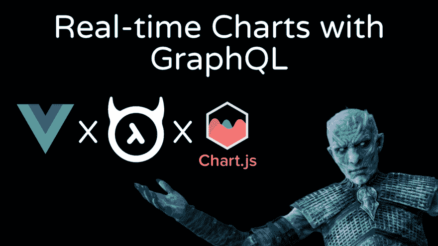
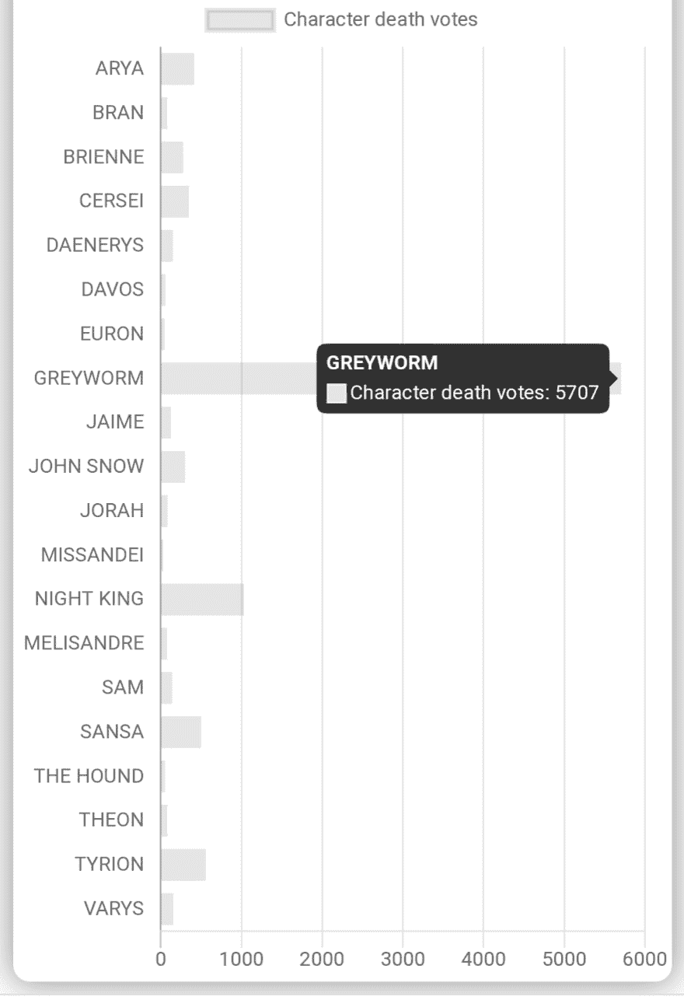
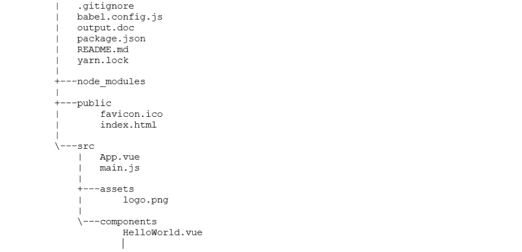
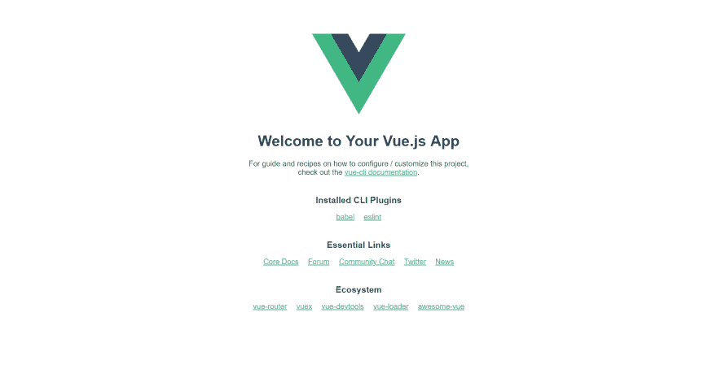

# 用 GraphQL 和 Chart.js 构建实时的《权力的游戏》投票应用程序

> 原文：<https://dev.to/malgamves/building-a-real-time-game-of-thrones-voting-app-with-graphql-and-chart-js-37ma>

# TL；速度三角形定位法(dead reckoning)🕑

> <video loop="" controls=""><source src="https://video.twimg.com/tweet_video/D5GbpGzWwAAnw2X.mp4" type="video/mp4"></video>菲里🚀[@ malgamves](https://dev.to/malgamves)一直想做一个投票 app..所以我就造了一个🤷🏾‍♂️
> 我是如何建造这个项目的:
> 📊前端🖥️
> 上的[@ vue js](https://twitter.com/vuejs)+[@ chart js](https://twitter.com/chartjs)😈[@ hasurahq](https://twitter.com/HasuraHQ)+[@ apollographql](https://twitter.com/apollographql)在后台⚡
> 🚀部署 [@Netlify](https://twitter.com/Netlify) 🔥
> 
> 图表上的实时更新感谢订阅⚡⚡2019 年 4 月 26 日下午 18:50

# 长版😉

我一直想做一个投票应用程序，因为嘿-他们很酷！
我读过一篇[文章](https://blog.hasura.io/graphql2chartjs-realtime-charts-made-easy-with-graphql-and-chartjs/)，讲述了如何使用 [chart.js](https://www.chartjs.org/) 和 GraphQL 用一个叫做 [graphql2chartjs](https://github.com/hasura/graphql-engine/tree/master/community/tools/graphql2chartjs) 的神奇工具用 JavaScript 构建图表。时间安排得太棒了，《权力的游戏》的临冬城之战还有几天就要开始了，所以我决定尝试一下人们认为谁会在这一集的漫漫长夜中迷失。

我在推特上发布了这条消息，然后等待着⏳

液体错误:内部

在这一集播出前，这款应用获得了令人震惊的 10，000 张投票

更不用说，超过 50%的选票投给了灰虫 [#RIPGreyWorm](https://twitter.com/SabiqueAkhan/status/1123229462923890689)

可怕的东西！我重置了投票统计，这样你就可以感受一下这个应用程序及其功能。

## 🚀[试一试吧！](https://valar-viz.netlify.com/)📈📈

# ⚙️我是如何建造它的⚙️

App 有:
📊前端🖥️
上的 [Vue.js](https://vuejs.org/) + [Chartjs](https://www.chartjs.org/) 😈[后台⚡
中的 hasura](https://hasura.io/)+[Apollo graph QL](https://www.apollographql.com/)🚀部署在[网络上](https://www.netlify.com/)🔥

# 🔧后端🔧

我用 Hasura 和它的一键 [Heroku 部署](https://docs.hasura.io/1.0/graphql/manual/getting-started/heroku-simple.html)来设置我的后端。Hasura 为我们提供了基于 PostgreSQL 数据库的实时 GraphQL。接下来我们需要定义一个模式，在 API 控制台的**数据**部分，我们必须创建一个包含以下各列的`characters`表...

- `id`保存整数值，是主键并自动递增
- `name`保存文本值
- `votes`保存整数值，默认值设置为 0

一旦建立了模式，就必须在 API 控制台的**数据**部分手动输入角色名。

我们现在已经完成了后端。

# ✨前端✨

就像我上面说的，我在 Vue.js 中做了前端，我们必须在继续之前安装它，为此我们需要在我们的系统上安装 [Node.js](https://nodejs.org/en/) 。一旦我们安装了节点，输入下面的命令来安装 vue cli `npm i -g @vue/cli`。为了建立一个新的 Vue 项目，我们输入下面的命令`vue create myapp`，用你想给这个应用起的任何时髦的名字替换 *myapp* ，当提示选择一个预置时点击**默认**。初始化完成后，你的文件夹结构应该如下图所示。

当应用程序完成初始化后，`cd <myapp>`并输入`npm run serve`运行您的应用程序。命令行将显示您的应用程序所在的本地地址，打开浏览器并转到该地址。这应该是你看到的。

# 拼凑🤝

在这一点上，我们在前端有一个基本的 Vue 应用程序，我们的后端与 Hasura 初始化。我们的目标是创建一个应用程序来可视化《权力的游戏》角色的死亡投票，所以我们继续使用下面的命令`npm install vue-chartjs chart.js --save`安装我们的可视化工具 chart.js。我们还安装了 graphql2chartjs 工具，帮助我们读取 graphql 数据并在图表中使用这些数据，为此我们运行命令`npm install --save graphql2chartjs`。

我们必须将一些文件导入到我们的 **main.js** 文件中。之后，你的 **main.js** 应该是这样的: