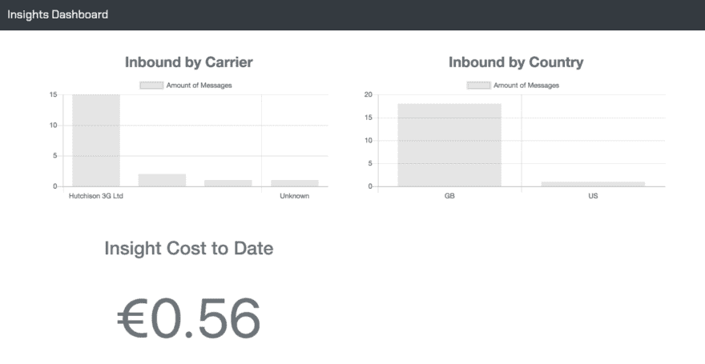
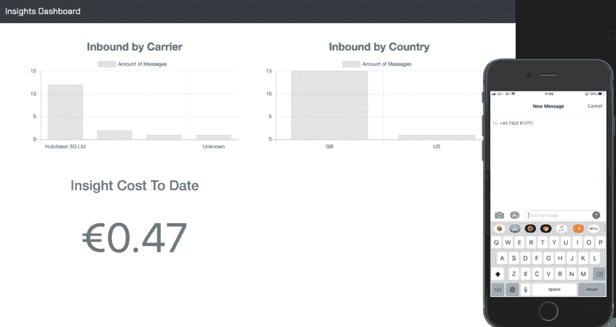

# 使用 Next.js & Nexmo 构建实时洞察仪表板

> 原文：<https://dev.to/vonagedev/building-a-real-time-insight-dashboard-with-nextjs--nexmo-3ioh>

12 月，我使用 [Nexmo](https://www.nexmo.com) ，Next.js & MongoDB 构建了一个[数字洞察仪表盘](https://github.com/nexmo-community/number-insight-dashboard-example)。你可以把它带走，安装它供你自己使用，然后为它创建新的图形和可视化。

此外，您可能有一台备用显示器在办公室里闲晃，正等着成为这个节日的焦点。

完整的代码库可以在 [Nexmo 社区 GitHub](https://github.com/nexmo-community/number-insight-dashboard-example) 账户上找到，还有一个可用的 live 版本供[在 Glitch](https://glitch.com/edit/#!/nexmo-number-insight-dashboard) 上重新混合。

## 仪表盘的作用

该应用程序监控 SMS 流量的入站 webhook。当收到新消息时，使用 [Nexmo Number Insight API](https://developer.nexmo.com/number-insight/overview) 收集关于发送消息的号码的信息或“洞察”。

这些见解随后被存储在托管的 MongoDB 数据库中，并显示在基于浏览器的仪表板中。

它带有 3 个开箱即用的预建可视化功能:

*   按运营商细分的消息总数
*   入站消息的地理分布
*   收集所有这些见解的总运行成本

[](https://res.cloudinary.com/practicaldev/image/fetch/s--cFEG7tDw--/c_limit%2Cf_auto%2Cfl_progressive%2Cq_66%2Cw_880/https://cl.ly/baa10a40fcb3/Screen%2520Recording%25202018-12-12%2520at%252011.07%2520am.gif)

## 数字洞察 API 实际上是做什么的？

[Number Insight API](https://developer.nexmo.com/number-insight/overview) 可用于收集您系统中存储的电话号码的更多信息。例如，它们可能是用户注册时给你的电话号码，作为联系方式的一部分。

API 为一个数字返回三个级别的数据，每个级别的详细程度都在增加——基本、标准和高级。关于你将得到什么数据的更多信息，请看一下我们的[文档](https://developer.nexmo.com/number-insight/overview#basic-standard-and-advanced-apis)中的比较表。

对于这个仪表板，我们使用了[高级级别](https://developer.nexmo.com/number-insight/building-blocks/number-insight-advanced),这样我们可以收集尽可能多的数字信息，并使用它来汇总所显示图表的数据。

## 仪表板是如何构建的

我们的 dashboard 应用程序是使用 [Next.js](https://nextjs.org/) 构建的，这个框架消除了构建 React 应用程序的一些负担。它处理客户端和服务器端的元素。

insight 数据存储在 MongoDB 中。开箱即用，这个应用程序使用 [mLab 的免费沙盒帐户](https://mlab.com/plans/pricing/#plan-sandbox)，但是如果你觉得你很快就会超出他们的免费层容量，你可以用你自己的托管 MongoDB 实例替换它。

客户端，使用优秀的 [Chart.js](https://www.chartjs.org/) 库显示图表和图形。为了让它们在 React 中表现良好，使用了 [react-chartjs-2](https://github.com/jerairrest/react-chartjs-2) 包。

当收到新的洞察数据时，图形和图表会实时更新。使用[推送器](https://www.pusher.com/channels/pricing)将该信息推送到浏览器。同样，免费的沙盒计划被用来提供每天 200，000 条消息！

## 安装

要在本地机器上启动并运行它，首先要克隆存储库:

```
git clone git@github.com:nexmo-community/number-insight-dashboard-example.git 
```

Enter fullscreen mode Exit fullscreen mode

然后，安装依赖项:

```
npm install 
```

Enter fullscreen mode Exit fullscreen mode

所有需要修改的 API 密钥、秘密和其他方便的信息都包含在一个`.env`文件中。您可以使用以下命令复制示例:

```
cp .env.sample > .env 
```

Enter fullscreen mode Exit fullscreen mode

打开`.env`文件，填写所需信息:

```
NEXMO_API_KEY=""
NEXMO_API_SECRET=""
MLAB_USERNAME=""
MLAB_PASSWORD=""
MLAB_URI=""
MLAB_COLLECTION_NAME=""
PUSHER_APP_ID=""
PUSHER_APP_KEY=""
PUSHER_APP_SECRET=""
PUSHER_APP_CLUSTER="" 
```

Enter fullscreen mode Exit fullscreen mode

一旦完成，您就可以运行仪表板了(在开发模式下)。

```
npm run dev 
```

Enter fullscreen mode Exit fullscreen mode

在开发中，您应该使用 ngrok 将应用程序暴露给更广阔的世界，以便它可以接收和处理入站消息。

如果你以前没用过 Ngrok，看看[这篇优秀的文章](https://www.nexmo.com/blog/2017/07/04/local-development-nexmo-ngrok-tunnel-dr/)。它将永远改变你的发展生活！

```
ngrok http 3000 
```

Enter fullscreen mode Exit fullscreen mode

记下你的 Ngrok URL——它看起来会像`http://ghd5dgd.ngrok.io`一样。

## 哦，没有数据

您将需要一些入站 SMS 消息来移动这些图表。您可以通过使用 [Nexmo CLI](https://github.com/Nexmo/nexmo-cli) 购买一个支持 SMS 的号码来开始设置:

如果您还没有 CLI，请从安装它开始。

```
npm install nexmo-cli -g   # Using npm
yarn global add nexmo-cli  # Using yarn 
```

Enter fullscreen mode Exit fullscreen mode

然后添加您的凭证:

```
nexmo setup <api_key> <api_secret> 
```

Enter fullscreen mode Exit fullscreen mode

接下来，搜索一个在您当地购买的号码:

```
nexmo number:search GB --sms 
```

Enter fullscreen mode Exit fullscreen mode

你会看到一个号码列表，挑一个买:

```
nexmo number:buy <the number> 
```

Enter fullscreen mode Exit fullscreen mode

最后，将新号码链接到您之前生成的 Ngrok URL:

```
nexmo link:sms <your new number> http://ghd5dgd.ngrok.io/inbound 
```

Enter fullscreen mode Exit fullscreen mode

确保将`/inbound`路径添加到您的 Ngrok URL 的末尾；这是仪表板应用程序接收和处理消息的地方。

确保以下所有情况属实:

*   您正在端口 3000 上本地运行应用程序
*   您已经通过 Ngrok 向世界公开了端口 3000
*   您已经购买了一个支持 SMS 的号码
*   您已将该号码链接到 Ngrok URL

如果你已经把这些都勾掉了，那么你就可以开始了。向您的新号码发送短信，观看洞察图表飞行！

[](https://res.cloudinary.com/practicaldev/image/fetch/s--QlRoyLF0--/c_limit%2Cf_auto%2Cfl_progressive%2Cq_66%2Cw_880/https://cl.ly/5991b0fbeb16/Screen%2520Recording%25202018-12-11%2520at%252011.01%2520am.gif)

## 脱离发展

你不想让这个应用程序永远在你的本地机器上运行，所以你需要把它部署到一个可以随时访问的服务器上。

最快速、最简单的方法就是在 Glitch 上重新混合应用程序，或者使用 [GitHub 库](https://github.com/nexmo-community/number-insight-dashboard-example)上的按钮部署到 [Heroku](https://heroku.com) 或 [Now.sh](https://now.sh) 。

一旦你在其他地方部署了应用程序，不要忘记返回并更新你的入站号码的 webhook，以便它指向新的 URL。

同样值得注意的是，在生产环境中，你不太可能让你的 SMS webhook 直接指向*这个*。

因此，要将它与一个已经接收到短信的应用程序连接起来，您需要发送一个 POST 请求到`https://<your deployed dashboard>/inbound`，JSON 正文如下:

```
{"number": "<a number to get insight for>"} 
```

Enter fullscreen mode Exit fullscreen mode

## 添加新图表

仪表板中的每个图形都是一个[反应组件](https://reactjs.org/docs/react-component.html)，因此以一种非常独立的方式进行操作。

没有数据，他们做不了多少事情，因此需要几个步骤来使组件变得有用:

*   决定要显示的数据。
*   将 MongoDB 中的数据聚合为一个结果集。
*   在`server.js`文件中添加一个新的端点，图形组件将调用它来检索数据。

为了进一步解释这一点，我将分解`Countries`组件。

对于这个图表，我决定显示来自不同国家的入站消息的总数。

这些数据是使用`db/mongodb.js`文件中的函数从 MongoDB 中提取的，比如:

```
aggregateCountries: async () => {
  try {
    const records = await Insight.aggregate([
      {
        $group: {
          _id: '$country_code',
          count: { $sum: 1 }
        }
      },
      { $sort: { count: -1 } },
      {
        $project: {
          country_code: '$_id',
          country_name: true,
          count: 1,
          _id: 0
        }
      }
    ]);

    return records;
  } catch (err) {
    return err;
  }
}; 
```

Enter fullscreen mode Exit fullscreen mode

该函数返回如下所示的 JSON:

```
[  {  "count":  16,  "country_code":  "GB"  },  {  "count":  1,  "country_code":  "US"  }  ] 
```

Enter fullscreen mode Exit fullscreen mode

接下来，在`server.js`中，需要一个新的端点。你可以[在 GitHub](https://github.com/nexmo-community/number-insight-dashboard-example/blob/master/server.js) 上查看完整的文件，但是用于这个特殊图形的代码片段是:

```
router.get('/countries', routes.getCountryAggregation); 
```

Enter fullscreen mode Exit fullscreen mode

这指定了可以向`/countries`发出一个 GET 请求，该请求触发一个名为`routes.getCountryAggregation` :
的函数

```
const routes = {
  getCountryAggregation: async ctx => {
    const records = await db.aggregateCountries();
    ctx.body = records;
  }
}; 
```

Enter fullscreen mode Exit fullscreen mode

最后是组件本身。调用这个端点的那个可以在 GitHub 上完整地找到

该组件需要执行两个关键操作。

1.  将数据塑造成 Chart.js 所期望的结构
2.  将数据应用于图表并在组件中显示

`updateStateData()`函数处理数据请求，然后为 Chart.js
整形数据

```
updateStateData() {
    axios
      .get('/countries')
      .then(res => {
        const countries = res.data;
        const labels = [];
        const datasetLabel = this.props.label;
        const datasetData = [];

        countries.forEach(country => {
          labels.push(country.country_code);
          datasetData.push(country.count);
        });

        // This is the structure expected by Chart.js
        const chartData = {
          labels, // an array of labels
          datasets: [ //an array of data sets for each label
            {
              label: datasetLabel,
              data: datasetData
            }
          ]
        };

        this.setState({ chartData });
      })
      .catch(err => console.log(err));
  } 
```

Enter fullscreen mode Exit fullscreen mode

一旦数据的结构正确，剩下要做的就是将它应用到组件中的 JSX，这样它就可以正确显示了。

```
render() {
  return (
    <Bar
      data={this.state.chartData} // Our data goes in here
      width={10}
      height={5}
      options={{
        title: { display: true, text: this.props.title, fontSize: 25 },
        animation: {
          duration: 1000,
          easing: 'linear'
        },
        scales: {
          yAxes: [
            {
              ticks: {
                beginAtZero: true
              }
            }
          ]
        },
        maintainAspectRatio: true
      }}
    />
  );
  } 
```

Enter fullscreen mode Exit fullscreen mode

正如你所看到的，这里有很多选项可以让图形以特定的方式运行，但是你可以把这些都去掉，包括如下的内容:

```
render() {
  return (
    <Bar data={this.state.chartData} />
  )
} 
```

Enter fullscreen mode Exit fullscreen mode

熟悉这种模式的最好方法是使用 Chart.js 提供的一些其他组件和图表类型，同时考虑可以显示 Number Insight API 中的哪些数据。

## 欢迎投稿

如果您为这个仪表板创建了一个新的图表，请随意提交一个 pull 请求，我们会将它与默认图表一起包含在主存储库中，人们可以从中选择。